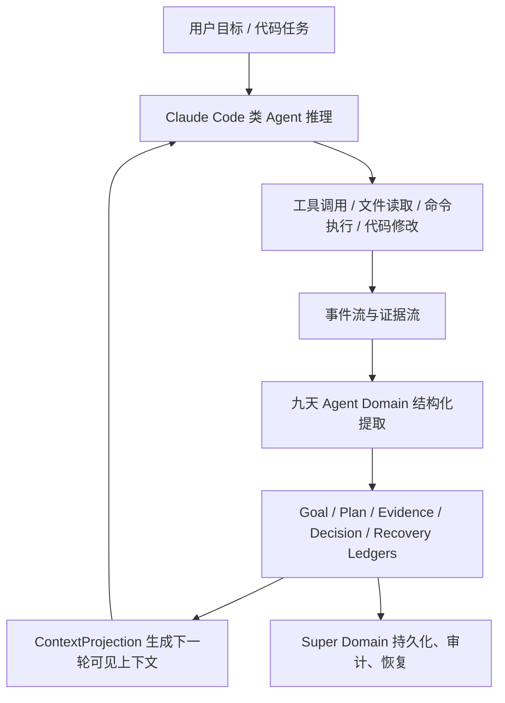

# Agent 为什么会失忆：九天 APU 如何为 Claude Code 类 Agent 构建长期任务记忆

今天大多数 Agent 的短板，不是不会调用工具，也不是不会写代码，而是**任务一长就会失忆**。

一个代码 Agent 可以在前 20 分钟里表现得很聪明：它能读仓库、理解模块、修改文件、跑测试、根据错误继续修。可当任务持续到一两个小时，历史消息、工具输出、diff、测试日志、用户约束不断堆高，模型上下文迟早会到达窗口边界。系统不得不 compact，或者只保留一段摘要。问题也正是在这里出现的：摘要通常保留了“发生过什么”，却丢掉了“现在到底推进到哪里、哪些证据可信、哪些路径已经被否决、下一步为什么是这个”。

于是 Agent 看似还在继续，实际上已经开始重新摸索。它会重复搜索同一批文件，重复验证已经验证过的假设，甚至推翻之前刚刚建立的边界。对用户来说，这种体验就是：任务跑久了，Agent 的记忆断了，工作又得重头来。

九天 APU 要解决的不是简单的“更大上下文窗口”问题，而是一个更底层的问题：**长期任务状态不能只存在于模型上下文里，它必须成为可持久化、可恢复、可审计、可加速处理的系统对象。**

## 失忆的真正原因

Claude Code 这类 Agent 的运行时，本质上不是一段普通聊天，而是一个持续演化的任务状态机。它一边接收用户目标，一边调用工具，一边读取文件、生成补丁、执行命令、分析错误、更新计划。整个过程中会产生大量结构化和半结构化事件：

- 用户目标和后续修正。
- 当前计划、已完成步骤和待完成步骤。
- 文件读取、搜索结果、命令输出和测试结果。
- 工具调用参数、返回值、失败原因和重试记录。
- 代码 diff、生成物、外部文档、截图或大型日志。
- Agent 自己做过的判断，以及被否决的替代路径。

这些东西不应该平等地塞进上下文窗口。上下文窗口是模型的“工作台”，不是系统的“账本”。工作台上的东西会被整理、压缩、替换；账本上的东西必须可追溯。

当前很多 Agent 系统的问题，是把两者混在一起：历史消息既承担推理输入，又承担任务持久化。短任务时这可以工作，长任务时必然失效。因为 compact 会压缩历史，而压缩历史等价于压缩任务状态。

## 九天的判断：上下文不是记忆

九天与 Claude Code 类 Agent 协作时，首先做一个关键切分：

```text
模型上下文：下一步推理需要看到什么
长期任务记忆：这项任务真实发生了什么，以及现在处于什么状态
```

模型上下文可以被压缩，可以被重新组织，可以只保留下一步最有用的信息。长期任务记忆则不能依赖模型自己“记住”。它应该由运行时和硬件协同维护，变成一组有类型、有边界、有版本的任务账本。

在九天设计中，长期任务记忆被拆成六类核心对象：

| 对象 | 作用 |
| :--- | :--- |
| `GoalLedger` | 保存用户目标、成功标准、禁止事项和最新优先级 |
| `PlanLedger` | 保存当前阶段、已完成步骤、待办步骤、依赖关系 |
| `EvidenceLedger` | 保存文件、命令、测试、工具输出等证据引用 |
| `DecisionLedger` | 保存关键判断、采用原因和被拒绝方案 |
| `RecoveryLedger` | 保存最近安全恢复点、脏状态、回滚依据 |
| `ContextProjection` | 为下一轮模型推理生成的可见上下文投影 |

这六类对象的意义在于：Agent 不再把“我记得”建立在模型上下文长度上，而是建立在系统级任务状态上。模型可以忘，账本不能丢。

## 和 Claude Code 类 Agent 如何配合

Claude Code 类 Agent 仍然负责它擅长的部分：理解用户意图、调度工具、编辑代码、解释错误、选择下一步动作。九天并不替代 Agent 的高级推理，而是给它一个更可靠的长期记忆底座。

一次典型长任务可以被分成如下闭环：



在这个闭环里，Claude Code 类 Agent 产生的是运行时事件；九天把事件沉淀成任务状态。

举例来说，当 Agent 读了 30 个文件、改了 5 个文件、跑了 4 次测试，其中两次失败、一次因为环境缺依赖失败、最后一次只剩一个断言失败时，模型上下文里不需要保留所有原始日志。但系统账本里必须知道：

- 哪些文件真正相关。
- 哪些测试结果是有效证据。
- 哪些失败属于环境问题，不应该被当成代码缺陷。
- 哪些方案已经试过并被否决。
- 当前最小恢复点是哪一个。
- 下一步应该看哪个失败断言或哪个模块。

这就是 `EvidenceLedger`、`DecisionLedger` 和 `RecoveryLedger` 的价值。它们保存的是“任务因果链”，不是聊天摘要。

## Super Domain 与 Agent Domain 的分工

九天的双平面架构天然适合做这件事。

**Super Domain** 运行在 8 个 Clawd-Super 超大核上，负责可信、持久、可审计的部分：

- 写入 append-only transcript。
- 持久化大型工具输出和 artifact。
- 提交 ledger 版本。
- 维护权限、capability 和恢复边界。
- 在 compact 或异常中断时生成恢复入口。
- 审计 Agent Domain 生成的摘要和状态更新。

**Agent Domain** 运行在 128 个 Clawd-Agent 原生核上，负责高吞吐、碎片化、可并行的记忆加工：

- 扫描 transcript 头部、manifest 和工具结果预览。
- 对大型输出做去重、切片、摘要和引用化。
- 从工具事件中提取 evidence delta。
- 对计划项做完成度归并。
- 选择最小恢复点。
- 在 token 预算内打包 `ContextProjection`。

这类工作非常适合九天。它们不是大规模矩阵乘法，也不是传统 Web 服务请求，而是大量短生命周期、非规则、结构化程度不稳定的小任务。传统 CPU 会把大量能耗花在通用控制逻辑和缓存一致性上；GPU 又不擅长这种细碎分支和事件处理。九天的 Agent 核、显式 SPM、Cluster SRAM 和 Honeycomb NoC 正是为这类任务准备的。

## Compact 不再等于失忆

在传统 Agent 系统里，compact 是一个危险时刻。它意味着原始上下文太大，必须被压缩。压缩一旦损失关键状态，后续推理就会偏航。

九天把 compact 改造成一个系统事务：

1. Super Domain 先冻结当前 transcript 边界。
2. Agent Domain 扫描最近事件、工具结果、diff 和测试输出。
3. Agent Domain 生成 ledger delta，而不是只生成自然语言摘要。
4. Super Domain 校验并提交 ledger 新版本。
5. 系统生成新的 `ContextProjection`，作为下一轮模型输入。
6. 原始证据仍以 artifact 或 transcript 引用形式存在，可以按需取回。

这样 compact 压缩的是“模型下一步需要看到的视图”，不是“任务真实状态”。任务状态已经进入 ledger，不会因为上下文窗口被清理而消失。

换句话说，compact 从一次有损记忆压缩，变成了一次有审计边界的状态重投影。

## 为什么需要硬件参与

有人可能会问：这些事情不能只靠软件数据库做吗？

短期当然可以。九天 v0.1 也会先用模拟器、运行时和文件格式验证语义。但如果 Agent 真的成为未来软件执行的主体，长期记忆将不是少量日志写入，而是高频、细粒度、持续发生的系统路径。

一个长任务中可能会产生：

- 数万条工具事件。
- 数百个文件片段。
- 多轮测试输出。
- 多个并行子任务。
- 多次 compact。
- 大量 artifact preview 和 hash 去重。
- 频繁的计划更新和证据归并。

这些操作有几个共同特点：数据小而多、结构不稳定、分支多、访存不规则、需要严格权限边界。它们正好落在传统 CPU 和 GPU 之间的空白地带。

九天的硬件参与体现在三层：

| 层级 | 作用 |
| :--- | :--- |
| SPM | 保存当前正在处理的短事件、headers、hash、局部摘要 |
| Cluster SRAM | 保存同一任务阶段的 ledger delta、artifact preview、候选 evidence |
| Host/HBM | 保存完整 transcript、artifact body、长期 ledger 版本 |

Agent Domain 并不直接拥有无限制全局访问权。它通过 capability 读取被授权的事件窗口、artifact 预览和 ledger 分片；生成候选更新后，由 Super Domain 审计提交。这让长期记忆既能被加速，又不会变成失控的隐式全局状态。

## 一个具体场景

假设用户让 Agent 在一个大型仓库中修复一个复杂 bug。任务持续两个小时，期间发生了三次上下文压缩。

没有九天时，Agent 可能经历这样的退化：

1. 第一阶段找到相关模块。
2. 第二阶段修改代码并跑测试。
3. compact 后丢掉“为什么选择这个模块”的细节。
4. 新一轮又重新搜索相似文件。
5. 第二次 compact 后丢掉失败测试的真实含义。
6. 最后开始重复尝试已经被否决的修法。

有九天时，任务状态被分层保存：

```text
GoalLedger:
  修复指定 bug；不做无关重构；保持现有 API。

PlanLedger:
  已完成：定位调用链、复现测试、确认错误输入。
  进行中：修正边界条件。
  待完成：补测试、跑回归、整理说明。

EvidenceLedger:
  相关文件 A/B/C。
  失败测试 T1 的日志引用。
  命令 C1/C2/C3 的返回码和摘要。

DecisionLedger:
  拒绝方案 X：会破坏兼容性。
  采用方案 Y：影响面最小，符合现有模式。

RecoveryLedger:
  最近安全点：补丁 P2 后，测试 T1 仍失败但构建通过。
```

compact 后，模型看到的不是一段松散摘要，而是由这些 ledger 生成的下一步工作视图：

```text
当前目标：修复 bug，禁止无关重构。
当前阶段：边界条件修正后需补测试。
关键证据：T1 失败来自输入为空时的状态未初始化。
已拒绝路径：不要修改公共 API。
下一步：打开文件 A 的函数 f，补最小条件分支并运行 T1。
```

这就是 Agent 长任务不断点的关键。

## 对九天 APU-IR 的要求

为了让长期记忆成为可执行对象，而不是文档概念，APU-IR 需要表达几类新任务：

- `memory_header_scan`：扫描 transcript、artifact、ledger 的头部和 manifest。
- `artifact_preview_pack`：把大型工具输出转成引用、hash、短 preview。
- `ledger_delta_extract`：从事件流中提取目标、计划、证据、决策和恢复点的增量。
- `recovery_anchor_select`：选择下一次恢复应依赖的最小证据集。
- `context_budget_pack`：在 token 预算内生成下一轮模型上下文。

这些任务的输出不是最终自然语言，而是可校验的结构化状态更新。自然语言摘要可以存在，但它只是 `ContextProjection` 的一部分，不是长期记忆本身。

## 这对 Agent 生态意味着什么

如果未来 90% 的代码由 Agent 生成，那么 Agent 的瓶颈不会只在 token 生成速度，也会在任务连续性。一个不能长期保持任务状态的 Agent，只适合做短命令助手；一个能跨小时、跨天、跨 compact 保持任务因果链的 Agent，才有资格成为真正的软件工程协作者。

九天 APU 的长期记忆设计，给 Agent 系统提供了一个新的分工：

- 模型负责推理。
- 运行时负责工具和权限。
- 九天负责把任务过程固化为可恢复的硬件友好状态。

这也是九天与传统 CPU、GPU、NPU 的差异所在。传统加速器关心的是一次计算如何更快；九天关心的是一个 Agent 任务如何在漫长执行中不丢失自己。

## 结语

Agent 的长期记忆不应该只是“把历史总结一下”。总结会丢信息，窗口会到边界，模型会遗忘。真正可靠的长期记忆，必须有账本、有证据、有恢复点、有投影机制，并且能在高频工具事件中持续更新。

九天 APU 的目标，是把这种能力从软件补丁提升为 Agent 原生计算的一部分。Claude Code 类 Agent 负责思考和行动，九天负责让行动留下可恢复、可审计、可继续的轨迹。

当上下文不再等于记忆，Agent 才能真正执行长任务。
