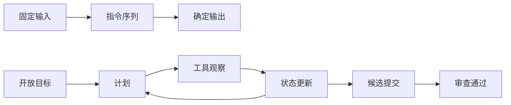
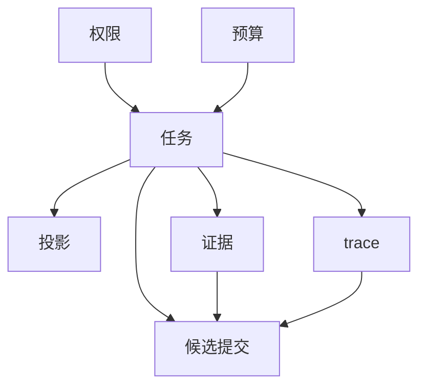
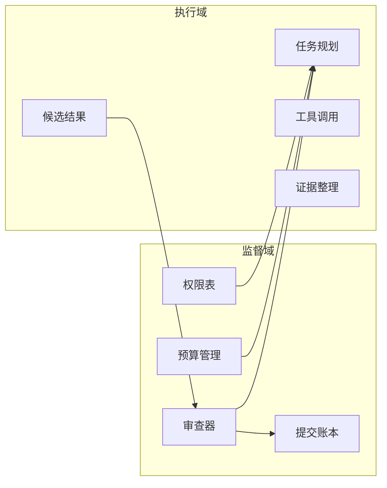
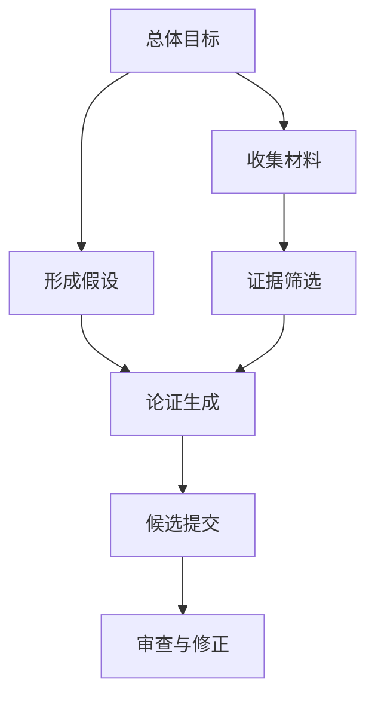
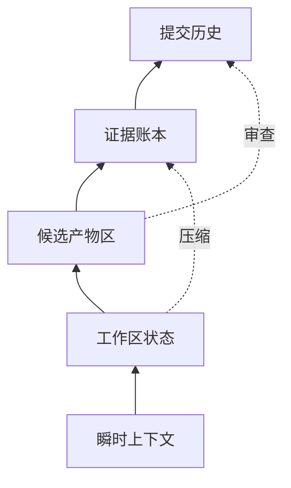
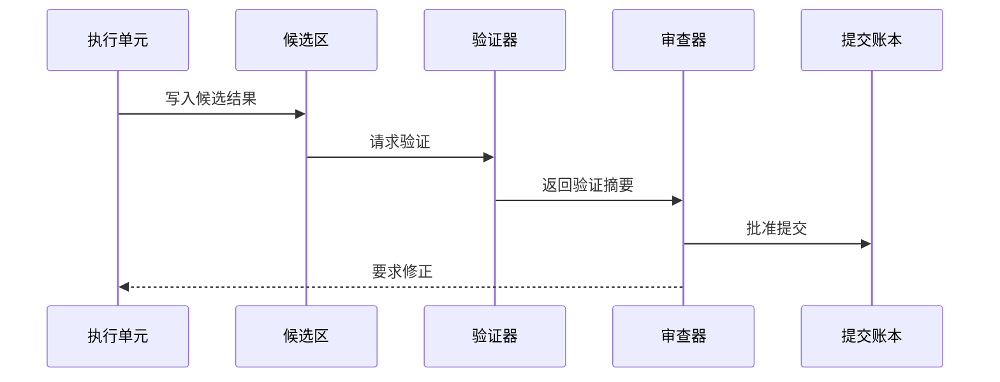
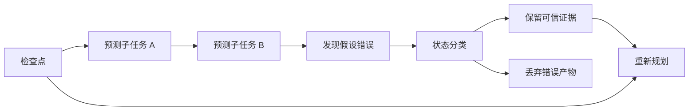
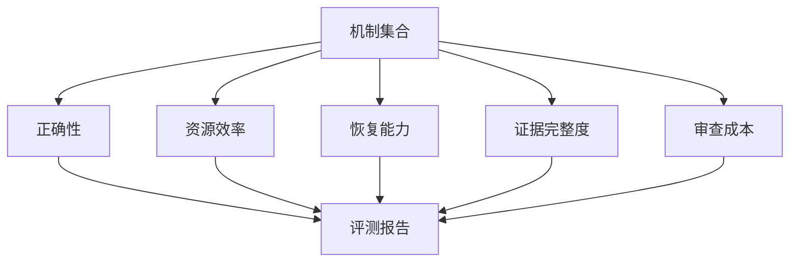

# 全书教学元素补充草稿

## 一、编写目标与使用方式

本草稿用于为全书补充稳定的教学骨架，使各章不仅提出概念，也能持续训练读者的体系结构思维。全书建议采用“贯穿例子、结构图示、章节导读、章末总结、统一习题”五类教学元素。贯穿例子负责把抽象概念落到可观察任务；图示负责建立空间关系和时序关系；导读负责说明学习入口；总结负责帮助读者回收主线；习题负责把阅读转化为分析、设计与判断能力。

写入正文时，应避免把教学元素写成资料罗列。每一个例子都要回答三个问题：任务是什么，体系结构问题在哪里，读者应学会怎样抽象。每一张图都要有标题、图意、关键标注和正文承接语。每一组习题都应覆盖记忆、解释、分析、设计、反思五种层次中的至少三种。

## 二、贯穿教学例子设计

### 例子 1：研究问题到报告草稿

一名研究者提出开放问题：“比较两种体系结构机制在长任务中的恢复能力。”系统需要拆分目标、收集证据、生成中间笔记、形成候选结论并提交报告草稿。这个例子适合贯穿第一篇，用来解释 Agentic Workload 与传统程序的差异：传统程序的输入、控制流和终止条件相对明确，而该任务在执行过程中不断生成新子目标，状态不仅包括变量和内存，也包括证据、假设、草稿与未验证判断。

教学用法：第一章用它说明开放目标；第二章用它标注任务、证据、投影、权限、预算、trace、候选提交七个抽象；第四章把它改写成任务图；第六章展示一次执行循环；后续章节再用它讨论恢复、提交和评测。

### 例子 2：一次受限的数据整理任务

任务要求系统在给定表格和文字片段中整理三类事实，并生成一个结构化摘要。约束是不能访问外部资源，不能改写原始材料，只能产生候选结果。这个例子用于讲权限和预算：权限不是“能不能做事”的笼统开关，而是可检查的能力边界；预算也不仅是时间限制，还包括读取量、调用次数、上下文窗口、内存占用和可接受的不确定性。

教学用法：在双域架构中，监督域维护权限与预算，执行域根据边界行动。习题可要求读者列出该任务的最小权限集合，并说明删除某个权限后任务如何降级。

### 例子 3：多步骤代码修复

任务从一段失败测试开始，系统要定位原因、修改候选补丁、运行验证并提交结果。这个例子能自然解释候选提交和副作用隔离：在确认补丁之前，修改应保存在候选区；验证通过后再由监督机制决定是否合并。读者可以借此理解传统乱序执行中的“先执行、后提交”思想如何迁移到任务级执行。

教学用法：提交机制章节用它类比重排序缓冲区；恢复章节用它说明错误路径回滚；评测章节用它定义正确性、最小修改、验证充分性和可恢复性指标。

### 例子 4：长期规划中的错误分支

系统要为一个复杂任务生成计划，早期选择了看似合理但后来被证据否定的路线。此时问题不是简单报错，而是识别错误分支、保留可复用证据、回滚错误假设，并从较早的检查点重新规划。这个例子用于解释任务流预测和任务状态恢复。

教学用法：讲控制流预测时先从分支预测引入，再将“预测下一条指令”扩展为“预测下一组子任务”。读者应看到，恢复材料不能只是日志，还要能回答哪些状态可信、哪些状态需要丢弃、哪些中间产物可复用。

### 例子 5：证据账本与摘要压缩

在长任务中，系统积累大量证据、草稿、工具观察和决策记录。由于存储与上下文资源有限，系统必须把历史压缩成可继续执行的摘要。这个例子用于说明语义内存、账本式状态和可恢复摘要之间的关系。

教学用法：存储与互连章节用它解释从地址命中到语义命中的转变；恢复章节用它讨论 compact 后恢复；习题可要求读者设计一种摘要格式，区分事实、假设、决策和待验证项。

### 例子 6：多代理协作审稿

一个任务由多个执行单元协作完成：一个负责寻找证据，一个负责构造论证，一个负责检查反例，一个负责整合文本。它们共享部分状态，但不能互相覆盖关键结论。这个例子用于讲片上互连、共享内存、显式数据移动和一致性问题。

教学用法：存储章节中可把四类状态分为私有工作区、共享证据区、候选结果区和提交账本。互连图示可展示不同状态在执行单元之间如何移动，哪些移动需要仲裁，哪些移动可以批量传输。

### 例子 7：有限预算下的策略选择

系统面对同一目标，可以选择快速粗略路线，也可以选择慢速精确路线。若预算充足，它会先探索再验证；若预算紧张，它必须优先保障关键证据和最低正确性。这个例子用于解释预算不只是资源消耗记录，而是调度和策略选择的输入。

教学用法：在执行模型中展示“目标、上下文、工具、计划、状态变化”的循环；在评测中比较不同预算配置下的成功率、恢复代价和证据完整度。

### 例子 8：安全边界内的工具调用

系统需要调用外部工具完成观察，但工具可能带来不可逆副作用。教学中可以设置三类工具：只读观察工具、候选写入工具、真实提交工具。系统必须把观察、候选改动和正式提交分开处理。这个例子用于讲双域架构、权限检查和候选副作用。

教学用法：双域章节用它说明监督域不负责完成全部工作，而负责授权、审查、提交和恢复。读者应理解安全不是在系统外加一层提示语，而是落实为可执行的结构。

### 例子 9：评测一台任务型机器

给定一组长任务，读者需要设计微基准和宏基准。微基准分别测量任务拆分、证据追踪、候选提交、恢复、预算控制；宏基准则测量端到端任务完成质量。这个例子用于把前面所有机制收束到评测语言。

教学用法：评测章节要求读者给出任务输入、允许资源、正确性标准、失败分类和报告格式。该例子提醒读者：新体系结构不应只报告吞吐，也要报告可信执行、恢复能力和审查成本。

### 例子 10：从一次失败提交中学习

系统提交了一个表面正确但证据不足的结果，审查阶段发现关键引用缺失。系统需要回到候选状态，补充证据，重新生成结果，并在 trace 中解释差异。这个例子适合放在全书后半部分，强调体系结构机制最终服务于可审查、可恢复、可改进的执行。

教学用法：章末综合题可要求读者描述失败发生在哪个抽象层，恢复需要哪些状态，监督域应拒绝还是要求补证，以及新的提交条件如何定义。

## 三、图示草稿

### 图 1：从传统程序到任务型执行

图意：比较两种执行模型。左侧是固定输入、指令序列和确定输出；右侧是目标、计划、观察、状态更新和候选提交构成的循环。

正文承接语：本图用于第一章。讲解重点不是说一种模型取代另一种模型，而是说明开放任务把执行从线性控制流扩展为带反馈的状态演化。

### 图 2：七个基本抽象的关系

图意：任务是中心，证据、投影、权限、预算、trace 与候选提交围绕任务形成约束和记录。

正文承接语：本图用于第二章。读者应把这些抽象看作执行契约中的字段，而不是彼此孤立的术语。

### 图 3：双域架构职责划分

图意：监督域负责授权、预算、审查和提交；执行域负责计划、调用、观察和生成候选结果。

正文承接语：本图用于第三章。讲解时应避免把监督域理解成更强的执行者，它的核心职责是边界、审查和恢复。

### 图 4：任务图与执行状态

图意：一个开放任务被分解为若干子任务，子任务之间存在依赖关系；每个节点都携带状态、预算和证据需求。

正文承接语：本图用于契约章节。它说明契约不只是调用接口，而是把任务依赖、资源边界和可审查状态表达出来。

### 图 5：语义内存层次

图意：从瞬时上下文到持久账本，状态按生命周期和审查价值分层。

正文承接语：本图用于存储与互连章节。重点是让读者理解“更靠近执行”的状态不一定更重要，“更持久”的状态也不一定适合频繁读写。

### 图 6：候选提交流水线

图意：执行结果先进入候选区，经过验证、审查和顺序提交后才成为正式状态。

正文承接语：本图用于提交机制章节。讲解时应突出“候选副作用”概念：在提交前，结果可以被检查和丢弃，而不污染正式状态。

### 图 7：错误预测与任务恢复

图意：系统沿预测路径执行，发现关键假设错误后回滚到检查点，保留仍然可信的证据并重建计划。

正文承接语：本图用于恢复章节。它帮助读者区分回滚、重试和恢复：恢复并不是简单回到过去，而是带着可信材料重新前进。

### 图 8：评测指标矩阵

图意：把机制与指标对应起来，形成实验报告的基本结构。

正文承接语：本图用于评测章节。它提醒读者，任务型体系结构的评测需要同时观察结果质量、过程约束和失败后的可处理性。

## 四、每篇开篇导读模板

每一篇的开篇导读建议保持四段式，长度控制在六百到九百字。

第一段写“问题背景”。用一两个具体场景说明本篇要解决的体系结构问题，避免先堆术语。示例句式：当执行对象从确定程序扩展到开放任务时，机器面对的不再只是指令吞吐，而是目标、证据、权限、预算和恢复共同构成的执行压力。

第二段写“核心矛盾”。明确本篇的主问题。示例句式：本篇的核心矛盾是，任务需要足够自由才能探索，但系统又必须把自由限制在可审查、可恢复、可计量的边界内。

第三段写“学习路线”。列出本篇各章如何递进，保持概念到机制再到评测的顺序。示例句式：我们先定义工作负载，再抽象任务状态，随后给出双域架构和契约表达，最后讨论执行、存储、提交、恢复与评测。

第四段写“读者收获”。说明读完后能做什么。示例句式：读完本篇，读者应能把一个开放任务分解为体系结构可处理的状态集合，并判断哪些机制负责执行、哪些机制负责约束、哪些机制负责恢复。

## 五、篇末总结模板

篇末总结建议分为五个小节。

一是“主线回收”。用一段话回答本篇从哪里出发，到哪里结束。例如：本篇从开放任务引出新的执行压力，最终落到可提交、可恢复、可评测的机器结构。

二是“关键概念表”。列出六到十个概念，每个概念用一句话解释，不超过五十字。概念解释要强调用途，而不是只给定义。

三是“机制对应关系”。用表格连接问题与机制。例如，开放目标对应任务图，外部行动对应权限，长历史对应证据账本，错误路径对应检查点恢复。

四是“常见误解”。每篇至少写三条。示例：误解一，把 trace 当作普通日志；澄清：trace 的价值在于支持审查和恢复。误解二，把预算当作运行时间；澄清：预算是资源和策略的共同边界。误解三，把监督域当作更大的执行域；澄清：监督域的主要职责是边界、仲裁和提交。

五是“继续阅读问题”。给出三到五个开放问题，引导下一篇。例如：如果候选结果很多，提交顺序如何决定？如果压缩摘要遗漏关键证据，恢复机制如何发现？如果多个执行单元共享证据，怎样避免重复和冲突？

## 六、章节统一小结规范

每章小结建议采用“三层回收”。

第一层回收本章问题：本章讨论了什么压力或矛盾。句式为“本章从……出发，说明……为什么成为体系结构问题”。

第二层回收本章机制：列出三到五个要点，每个要点采用“概念加作用”的写法。例如：“候选提交：把尚未确认的结果隔离在正式状态之外，为审查和回滚留下空间。”

第三层连接后文：说明本章机制还缺什么，将由下一章解决。不能只写“下一章继续讨论”，而要明确缺口。例如：“有了任务图之后，还需要讨论任务节点如何获得资源、如何调用工具、如何记录状态变化。”

每章小结不宜超过四百字。小结中尽量少引入新术语；若必须引入，应说明它将在后文展开。小结应保持教学语气，帮助读者整理，而不是重复正文标题。

## 七、习题风格规范

每章习题建议设置五类题，数量为五到八题。

第一类是概念辨析题。要求读者区分相近概念，例如任务与计划、证据与 trace、权限与预算、候选提交与正式提交。题干应明确要求“说明差异并举一例”。

第二类是机制解释题。要求读者解释某个机制为什么必要。例如：为什么开放任务需要候选提交？为什么长任务的 trace 不能只保存最终输出？为什么预算会影响计划形态？

第三类是图示阅读题。给出本章图示，要求读者标注关键路径、指出可能的瓶颈、解释某条边的含义。图示题能防止读者只背定义而不理解结构。

第四类是设计题。给定小型任务场景，要求读者设计任务图、权限集合、预算项、状态分层、恢复点或评测指标。设计题应允许多种答案，但评分标准要明确：边界是否清楚，状态是否可审查，失败后是否可恢复。

第五类是反思题。要求读者判断机制取舍。例如：为了减少审查成本，是否可以减少 trace 记录？为了提高速度，是否可以跳过候选区？反思题的重点不是唯一答案，而是让读者说明代价。

习题难度建议按“基础、应用、综合”三档标注。基础题检查概念理解；应用题要求在新场景中使用机制；综合题跨章连接，适合篇末或课程作业。

## 八、统一教学口径

全书应保持几个稳定口径。

第一，始终把开放任务看作体系结构对象。不要只说系统“更智能”，而要说明它产生了哪些状态、需要哪些边界、如何提交结果、怎样从失败中恢复。

第二，始终区分执行与提交。执行可以探索、试错和生成候选产物；提交必须可审查、可排序、可回滚。这个区分是连接传统体系结构与任务型体系结构的关键桥梁。

第三，始终把安全写成结构。权限、预算、候选区、审查器和账本共同构成安全边界，而不是外部说明文字。

第四，始终把 trace 写成恢复材料。trace 不只是记录“发生过什么”，还要支持判断“哪些仍可信、哪些要丢弃、从哪里继续”。

第五，始终把评测写成多指标问题。吞吐、延迟和资源效率仍然重要，但对于任务型机器，还必须观察正确性、证据完整度、恢复代价、审查成本和失败分类。

第六，始终用同一组贯穿例子回到主线。每当引入新机制，应尽量说明它如何改变研究报告、代码修复、错误分支、证据账本或多代理协作等例子。这样全书会有连续感，读者也能在熟悉场景中理解新概念。

## 九、可直接套用的章节导读模板

本章讨论的是〔本章主题〕。在传统体系结构中，类似问题通常表现为〔传统问题〕；在任务型执行中，它进一步表现为〔新压力〕。因此，本章不只介绍一个新术语，而是说明机器在面对开放目标、长期状态和可审查提交时，为什么需要新的结构安排。

本章将沿三步展开。首先，我们从一个具体任务出发，观察问题如何出现；其次，我们抽象出关键状态和边界；最后，我们讨论这些抽象如何落到可实现的机制。读者在学习本章时，可以持续追问三个问题：谁拥有状态，谁有权改变状态，失败后从哪里恢复。

学完本章，读者应能够解释〔三到五个核心概念〕，能够用图示描述〔本章机制〕，并能够在一个小型任务场景中判断〔本章机制〕是否足以支持正确、受限且可恢复的执行。

## 十、可直接套用的章节小结模板

本章从〔起点问题〕出发，说明了〔核心矛盾〕。为解决这一矛盾，本章引入了〔核心机制一〕、〔核心机制二〕和〔核心机制三〕。其中，〔机制一〕负责〔作用〕，〔机制二〕负责〔作用〕，〔机制三〕负责〔作用〕。

本章最重要的结论是：〔一句话结论〕。理解这一点，有助于把本章内容从术语记忆转化为结构判断。面对新的任务场景时，读者应先识别目标、状态、边界和提交条件，再讨论具体实现。

本章留下的问题是〔后续问题〕。下一章将进一步讨论〔后续章节主题〕，把本章机制放入更完整的执行路径中。

## 十一、可直接套用的习题模板

1. 基础题：请解释〔概念 A〕与〔概念 B〕的区别，并各举一个例子。

2. 基础题：为什么〔本章机制〕不能简单等同于〔传统机制〕？请从状态、边界或恢复角度说明。

3. 应用题：给定任务“〔小型任务描述〕”，请画出任务图，并标注每个节点需要的输入、输出和证据。

4. 应用题：为上述任务设计最小权限集合和预算集合。若预算减少一半，计划应如何变化？

5. 应用题：指出任务执行中可能出现的一个错误分支，并设计检查点和恢复策略。

6. 综合题：把本章机制与前一章机制连接起来，说明二者如何共同支持候选提交或状态恢复。

7. 反思题：如果为了提高速度而减少 trace 记录，会带来哪些风险？请说明哪些记录可以压缩，哪些不应删除。

8. 综合题：设计一个微基准来评测〔本章机制〕。请给出输入、约束、指标和失败分类。

## 十二、落地建议

建议在正式合入全书时采用“先骨架、后润色”的方式。第一轮只把每章导读、小结、习题和至少一个贯穿例子插入相应位置；第二轮再统一术语和图示编号；第三轮检查所有例子是否互相呼应，避免某章突然出现全新场景而破坏连续性。

贯穿例子不必每章全部出现。每章选择一到两个最能说明问题的例子即可，但例子的名称、任务设定和状态口径应保持一致。图示也不必全部放入正文，可在部分章节作为主图，在其他章节作为复习图或习题图使用。

最终效果应当是：读者翻开任一章，都能先知道为什么学；读完正文，能用图复述结构；做完习题，能把机制迁移到新任务；读完全书，能形成一套稳定的判断框架，即从任务出发，识别状态，设置边界，生成候选，审查提交，并为失败准备恢复路径。
