# Agent CPU 体系结构

副标题：基于多智能体方法的深度解析

作者署名建议：林啸，GPT

版本：第一版讲义草案

适用对象：计算机体系结构、芯片设计、Agent 系统、编译器、操作系统、AI 基础设施方向的研究者与工程师

---

## 前言：为什么需要一门新学科

传统计算机体系结构研究的是“程序如何在机器上高效执行”。它默认程序由人类编写，软件需要长期维护，二进制接口需要稳定，操作系统需要保护多个进程，硬件需要尽量兼容历史代码。

AI Agent 出现后，计算系统中出现了一类新的执行对象：由 Agent 围绕目标即时生成、即时验证、即时执行、即时回收的短生命周期逻辑。它们由任务流、证据链、工具调用图和状态变换共同组成。

因此，我们需要建立一门新学科：

**Agent CPU 体系结构学。**

这门学科研究：

- Agent 生成的代码如何表达为可验证、可调度、可恢复的执行对象。
- CPU、APU、NoC、Memory、Runtime、Compiler、Security 如何共同服务 Agentic workload。
- 长任务记忆、工具调用、上下文投影、证据账本、恢复点如何成为硬件可感知的系统状态。
- 传统 CPU 中为人类软件服务的复杂机制，哪些应该保留在控制面，哪些应该从 Agent 执行面移除。

它是一种围绕 Agent 行为、任务流、长期记忆和显式执行状态建立的新体系结构方法。

---

## 学科名称与边界

### 中文名称

Agent CPU 体系结构学

### 英文名称

Agent CPU Architecture

### 核心命题

当代码由 Agent 生成时，硬件可以把它表达为：

- 有目标的任务片段。
- 有权限边界的执行对象。
- 有输入输出和证据引用的状态变换。
- 有预算、恢复点和 trace 的可审计行为。

### 与既有学科的区别

| 学科 | 研究对象 | Agent CPU 体系结构的不同点 |
|---|---|---|
| 传统计算机体系结构 | 人类软件在 CPU 上执行 | 关注 Agent 生成代码、短生命周期任务和显式状态 |
| 操作系统 | 进程、线程、内存、文件、设备 | 关注 Agent 任务准入、权限、工具调用和恢复闭环 |
| 编译器 | 源代码到机器码 | 关注 Agent 意图、任务图、APU-IR 和可验证执行 |
| GPU 体系结构 | 数据并行和张量吞吐 | 关注分支复杂、非规则、碎片化的 Agentic workload |
| NPU 体系结构 | 神经网络算子 | 关注模型之外的 Agent 行为、工具编排和长期记忆 |
| 分布式系统 | 多节点一致性和容错 | 关注单机或片上多 Agent 任务、ledger 和 context projection |

---

## 本书结构

本书分为五篇。

第一篇定义学科：说明 Agent CPU 为什么不同于传统 CPU、GPU、NPU，并从经典计算机体系结构中继承量化方法、层次化抽象和工作负载驱动设计。

第二篇定义机器：讨论 Super Domain、Agent Domain、任务模型、APU-IR、Memory/NoC。

第三篇定义运行时：讨论任务型 Agent、工具调用、长期记忆、上下文投影、安全和恢复。

第四篇建立映射：从 ISA、Cache、ROB、Branch Prediction 和 benchmark 方法出发，说明传统体系结构如何转化为 Agent CPU 的设计方法。

第五篇定义方法：讨论 benchmark、验证、课程实验和九天 APU v0.1 的最小闭环。

---

# 第一篇：学科基础

## 第 1 章 Agentic Workload 的出现


### 本章导读

计算机体系结构的发展，常常由新的工作负载推动。数值计算推动了早期算术部件和存储系统的发展，互联网服务推动了并发、缓存和 I/O 设计，深度学习推动了 GPU 与 NPU 的广泛使用。今天，智能体系统正在形成一种新的工作负载形态：系统围绕一个目标持续观察环境、调用工具、更新状态、选择下一步行动，并在多轮之后交付结果。本章把这种形态称为 Agentic workload。

本章面向初学者介绍它的基本含义。我们先回顾传统程序模型，再给出 Agentic workload 的定义，通过一个贯穿例子观察它如何运行，随后讨论它与 CPU、GPU、NPU 的关系，最后提出由此引出的体系结构问题。

### 1.1 传统程序模型

在经典课程中，程序通常被看作一段确定的指令序列。程序员把问题写成算法，算法被表达为代码，处理器按照控制流取指、译码、执行、访存和写回。程序状态主要由寄存器、内存和外部 I/O 表示。对数组排序、求解线性方程、执行一次数据库查询，都可以在这种模型下清楚描述。

这种模型的特点是任务边界明确。输入是什么、输出是什么、程序何时结束，通常可以在设计时说明。即使程序内部存在分支和循环，分支条件也来自当前数据和程序状态。体系结构中的流水线、乱序执行、缓存层次、向量化等概念，都可以围绕这种执行方式展开。

现代软件已经比单个顺序程序复杂得多。操作系统管理进程和线程，数据库系统管理事务，分布式系统处理远程调用，机器学习框架把训练和推理组织为张量计算图。它们增加了并发、通信和概率性，但很多任务仍有清晰边界：一次推理、一次事务、一次训练迭代、一次服务请求。系统设计者可以围绕这些边界估计延迟、吞吐、内存占用和能耗。

智能体系统带来了新的执行形态。用户可能只给出一个目标，例如“整理实验结果并形成结论”。系统需要判断读取哪些资料、调用哪些工具、如何验证中间结果、何时继续探索、何时停止。运行过程不再只是一次函数调用，也不是固定层数的神经网络推理，而是由模型推理、工具执行、记忆状态和控制策略交织形成的行动序列。

### 1.2 Agentic Workload 的定义

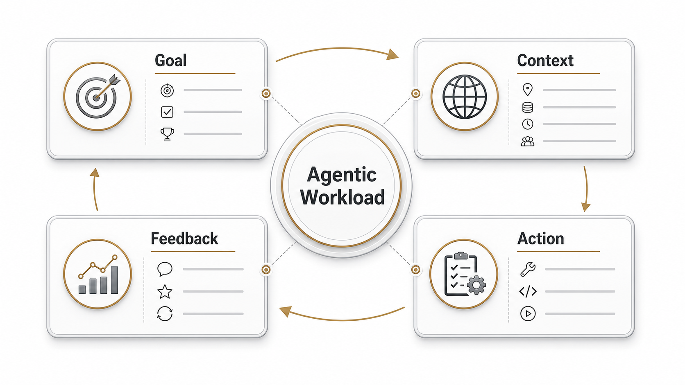

Agentic workload 是指以目标为牵引、以智能体循环为基本执行形态的一类计算工作负载。它通常包含四个要素：任务目标、上下文状态、行动选择和反馈更新。系统读取当前上下文，生成下一步行动，执行行动并观察结果，再把新信息写回上下文，直到满足停止条件或交付结果。

这里的行动可以有多种形式：发起一次模型推理、检索文档、查询数据库、运行程序、调用外部服务、写入中间记忆，或请求人工确认。关键不在某个单独动作，而在这些动作被组织成带反馈的多步决策过程。

从体系结构角度看，Agentic workload 有几个突出特征。第一，控制流具有动态性，下一步行动常由模型输出和外部观察共同决定。第二，状态具有层次性，短期上下文、长期记忆、工具返回结果、用户约束和安全策略都会影响后续执行。第三，性能指标具有复合性，除了单次推理延迟，还要考虑推理轮数、工具等待、上下文搬运、失败重试和最终质量。第四，正确性依赖过程约束，系统需要在合适步骤中验证事实、维护权限，并保留可追踪的中间状态。

因此，可以把 Agentic workload 理解为一种以推理为控制核心、以工具和记忆为执行支撑、以多步反馈循环推进目标的工作负载。

### 1.3 贯穿例子：从研究问题到报告草稿

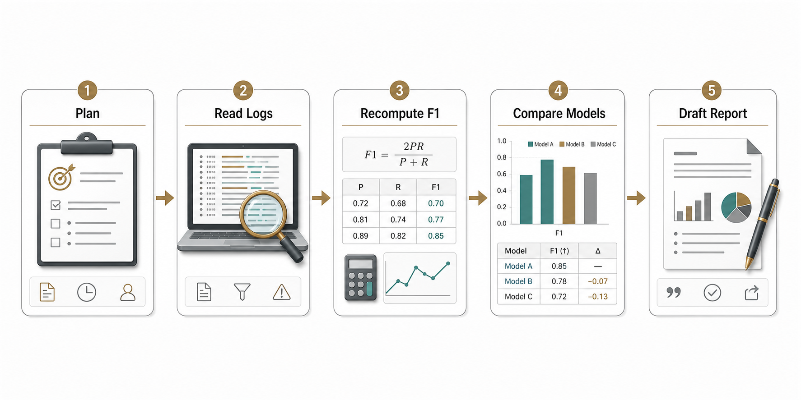

考虑一个学生科研助手。用户给出目标：“比较三种图像分类模型在小样本数据集上的表现，并写出一页报告草稿。”系统接到任务后，首先理解任务边界：三种模型是什么，数据集在哪里，评价指标采用准确率、F1 分数还是训练成本，报告面向课程作业还是实验论文。

第一轮循环中，系统生成计划：读取实验记录，提取模型名称和指标，检查是否缺少数据，再组织结论。随后它调用数据读取工具，得到若干表格和日志。观察结果显示，其中一个模型缺少 F1 分数。第二轮循环中，系统决定根据混淆矩阵重新计算该指标，于是调用计算工具，并把新指标写回上下文。

第三轮循环中，系统比较结果。它发现某个模型准确率最高，但训练时间更长；另一个模型准确率略低，却在小样本条件下更稳定。于是系统形成判断：不能只按单一指标排序，应从精度、稳定性和资源消耗三个维度分析。最后，系统生成报告草稿，并检查指标是否一致、结论是否过度推断、篇幅是否符合要求。

这个例子展示了 Agentic workload 的典型结构。模型推理负责解释目标、制定计划和撰写文本；工具调用负责读取数据和执行计算；记忆状态保存任务约束、中间结果和自检结论；控制循环把这些环节连接起来。若数据完整，系统会直接比较；若数据缺失，系统会补算；若证据不足，系统会回到资料检查阶段。

### 1.4 与 CPU、GPU、NPU 的关系

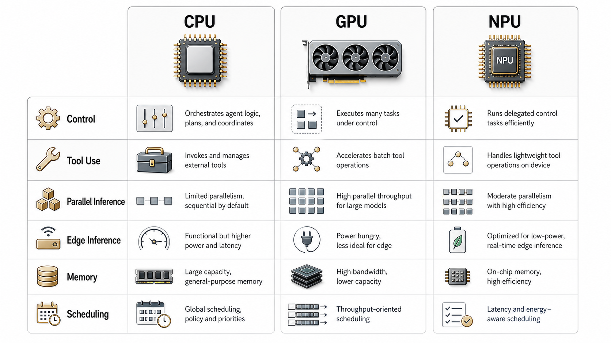

Agentic workload 的出现并不削弱 CPU、GPU 或 NPU 的作用，而是把它们放入更复杂的协作关系中。

CPU 仍承担通用控制、操作系统调度、工具执行、数据预处理和外部 I/O 管理。智能体循环中有许多分支多、粒度小、依赖外部状态强的步骤，例如发起检索、解析返回结果、维护会话状态和检查权限规则，这些环节通常适合由 CPU 支撑。

GPU 主要服务于大规模并行计算，尤其是语言模型和多模态模型中的矩阵乘法、注意力计算和批量推理。当系统同时服务大量智能体请求时，GPU 的吞吐、显存容量和互连带宽会直接影响总体效率。

NPU 面向神经网络推理进行专门优化，强调能效和低延迟。在移动设备、边缘设备和专用服务器中，NPU 可以承担语音识别、意图理解、小模型推理等任务，使部分智能体能力更接近数据产生的位置。

一次完整的 Agentic workload 可能包含多次模型推理、多次工具调用、多次状态读写和若干次验证。瓶颈可能出现在推理计算，也可能出现在上下文传输、工具等待、存储检索或调度排队。因此，研究它时不能只问哪种处理器更快，还要问不同计算单元如何共同支撑一个多步目标的完成。

### 1.5 新的体系结构问题

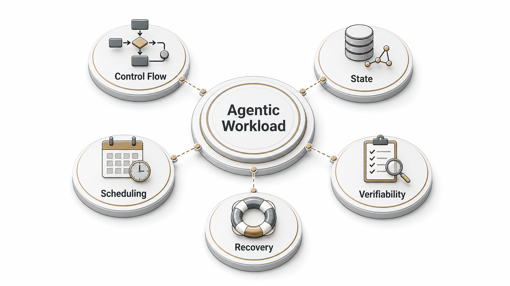

第一个问题是控制流表示。传统 ISA 描述机器可执行的低层操作，而智能体系统中的行动还包括检索、调用、验证和提交等高层步骤。如何把这些行动表示为可调度、可观察、可恢复的执行单元，是新的基础问题。

第二个问题是状态管理。智能体的状态包括上下文窗口中的短期信息、外部存储中的长期记忆、工具执行产生的临时结果以及权限记录。哪些状态应靠近模型，哪些应进入数据库，哪些应压缩或删除，都会影响性能、成本和可靠性。

第三个问题是调度与资源分配。一个任务可能在 CPU、GPU、NPU、网络和存储之间不断切换。调度器需要在延迟、吞吐、成本和公平性之间权衡，特别是在多用户共享系统中避免长任务过度占用资源。

第四个问题是推测与回滚。智能体可能并行尝试几种解决路径，或先假设某条资料有用并展开分析。若后来发现方向错误，系统需要回退到合适状态，丢弃无效中间结果，并处理外部工具带来的副作用。

第五个问题是可验证性。Agentic workload 的输出质量依赖多步过程。如果某一步引用了错误数据，后续推理可能建立在错误基础上。执行轨迹记录、数据来源标注、工具权限控制和结果校验，都是支撑可靠智能体系统的重要机制。

如果借用经典体系结构教材的语言，这五个问题还可以被统一到一套更硬的方法论下。体系结构从来不只是“把功能做出来”，而是在给定工作负载、成本和约束之后，判断哪些路径值得被硬化、哪些状态值得被靠近、哪些错误必须能被恢复。对 Agent CPU 而言，这意味着我们不能只问模型推理快不快，还必须同时问：系统的 common case 是什么，时间花在模型内还是模型外，哪些状态访问是高频的，哪些副作用必须延迟到审核之后，哪些恢复点足以在长任务中维持精确状态。

这也是为什么 Amdahl 定律在 Agent CPU 中仍然成立。即使把模型前向推理大幅加速，只要总时间里仍有很大比例花在工具等待、上下文搬运、权限检查、候选审核和恢复上，端到端收益就会被上限约束。相反，即使某一项状态管理优化看起来不像传统算力提升那样耀眼，只要它落在高频路径上，就可能显著改变整体完成时间和系统稳定性。后续各章将不断回到这一点：Agent CPU 的价值不仅来自“算得更快”，更来自“把多步任务中最常见、最昂贵、最脆弱的路径重新组织得更合理”。

### 1.6 小结

本章介绍了 Agentic workload 的出现及其基本含义。它以目标为牵引，通过模型推理、工具调用、记忆状态和反馈循环推进任务，是一类多步、动态、状态丰富的计算工作负载。

从硬件关系看，CPU 处理控制和 I/O，GPU 提供大规模模型算力，NPU 支持高能效推理，系统软件则把这些能力组织成面向目标的执行过程。由此产生的控制流表示、状态管理、调度、推测恢复和可验证性问题，将成为后续讨论 Agent CPU 体系结构的重要出发点。更重要的是，本章也确立了一条贯穿全书的方法论：Agent CPU 不是简单地把“大模型”放到传统机器上，而是围绕 Agentic workload 重新讨论局部性、提交、恢复、隔离、基准与成本。只有把这些体系结构基本问题重新用 Agent 的语言说清楚，这门学科才会从概念走向工程。

### 习题

1. 用自己的话解释 Agentic workload 的四个基本要素。

2. 选择一个熟悉场景，画出其中可能出现的智能体循环。

3. 为什么只测量一次模型推理延迟不足以评价 Agentic workload 的性能？

4. 在科研助手例子中，哪些步骤更适合由 CPU 支撑，哪些步骤更依赖 GPU 或 NPU？

5. 智能体调用外部工具后发现方向错误时，需要回滚哪些状态？哪些副作用可能无法简单撤销？

6. 说明可验证性为什么重要，并给出一个中间步骤错误导致最终结果不可靠的例子。

---

## 第 2 章 Agent CPU 的基本抽象


### 2.1 从回答到执行

传统 CPU 处理的是指令流，核心问题是怎样把一条条指令可靠地执行完。Agent CPU 面对的则是任务流：用户给出目标，环境不断变化，资料来源并不总是完整，结果还需要被解释、检查和修正。因此，Agent CPU 的基础不应只理解为若干模块，而应理解为一组能支撑智能执行的抽象。

本章讨论七个基本抽象：任务、证据、投影、权限、预算、trace 和候选提交。它们对应一条执行链：任务说明为什么做，证据说明凭什么做，投影说明当前看见什么，权限说明能做什么，预算说明花多少资源，trace 说明怎样走到这里，候选提交说明准备交付什么。

设想一名学生要完成“比较两种城市交通方案并给出推荐”。如果他只写结论，读者无法判断依据；如果他把所有资料堆上去，又失去重点。更好的过程是：先界定问题，再选择证据，把复杂材料整理成决策视图，说明约束，控制时间，保留推理线索，最后提交可审查的推荐。Agent CPU 的抽象正是把这种过程系统化。

### 2.2 任务：可执行的意图

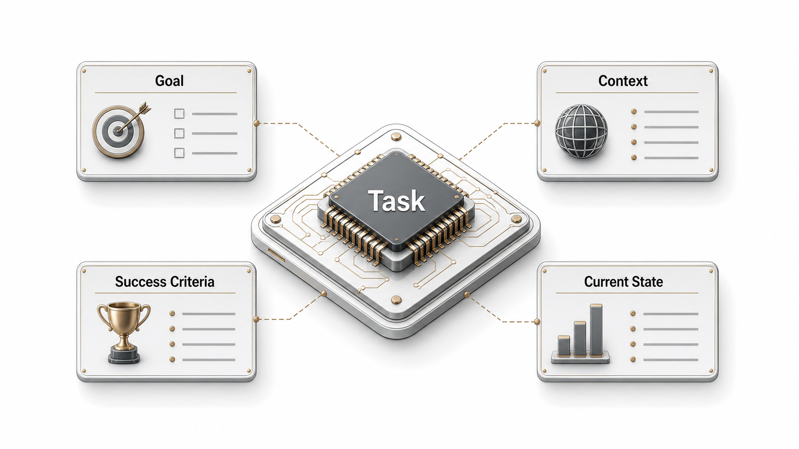

任务是被系统识别、跟踪和完成的执行对象。它不只是自然语言请求，而是包含目标、上下文、成功条件和当前状态的结构。目标回答“要得到什么”，上下文回答“在什么背景中完成”，成功条件回答“怎样算完成”，当前状态回答“已经走到哪一步”。

例如，“写一份实验报告”仍然太宽泛；“基于给定数据，写出包含方法、结果、误差分析和结论的报告，篇幅约一千字”才更像可执行任务。任务越清楚，后续证据选择、预算分配和结果形式越容易稳定。

任务抽象的价值在于防止系统把相似语言误当成相同工作。同样是“总结材料”，给初学者看的总结与给专家看的总结并不一样。好的任务定义像题目卡：它限制答题方向，也保留必要的解题空间。

### 2.3 证据：可检查的依据

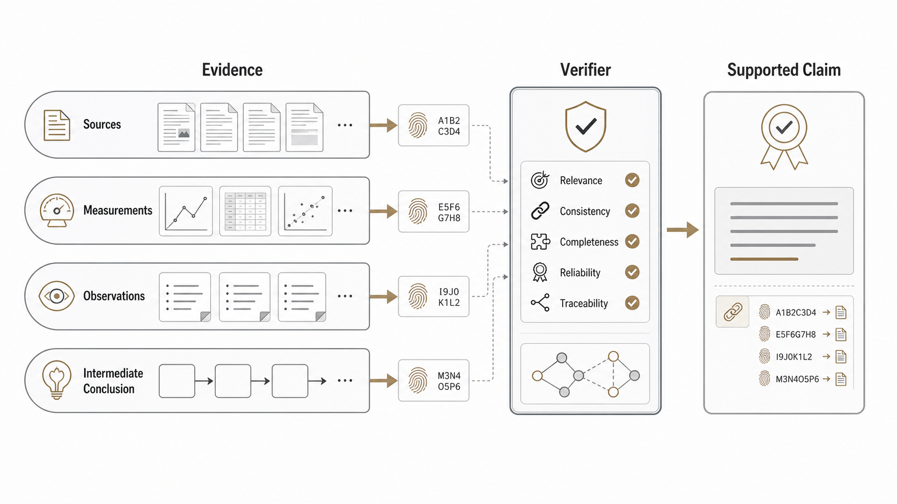

证据是支持判断和行动的依据，可以是文本资料、观测数据、计算结果、用户约束，也可以是已经形成的中间结论。证据不同于普通信息：普通信息只是被看见，证据则必须能说明它支持了哪个判断。

证据的质量通常取决于相关性、可靠性、时效性和可解释性。判断“某算法是否适合低延迟场景”时，算法介绍能提供背景，真实延迟测量更接近直接证据；宣传材料可作为线索，独立测试通常更可靠；多年以前的数据也许有参考意义，却未必代表当前条件。

因此，Agent CPU 不能把资料数量当成可靠性。证据抽象要求系统区分“我读到过”与“它证明了”。只有进入推理链、与任务结论发生关系的信息，才是本次执行的证据。

### 2.4 投影：面向任务的视图

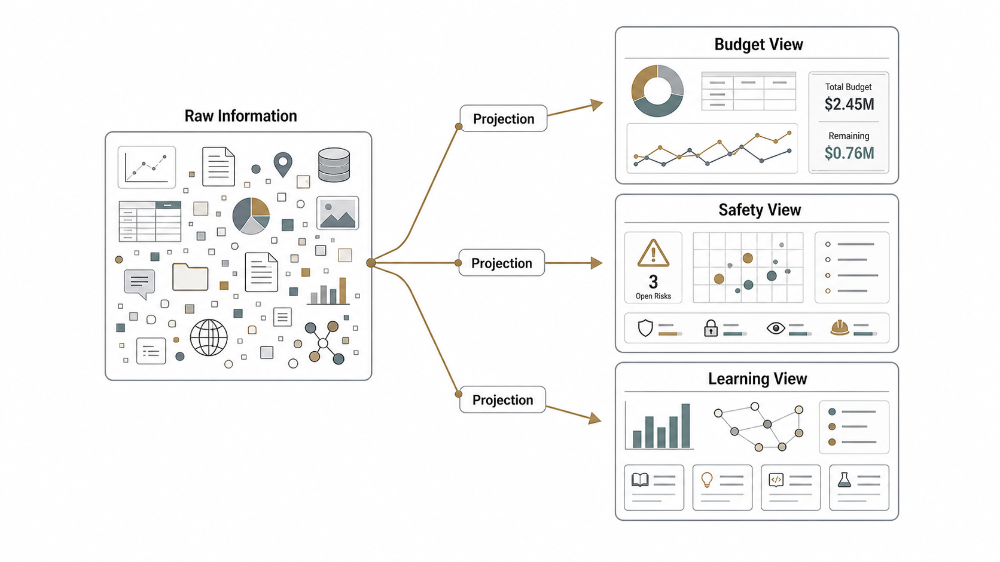

环境往往比任务需要的内容复杂得多。投影就是把原始材料转换成面向当前任务的视图。它不是机械压缩，而是根据问题选择、组织和命名信息。

以“为班级春游选择地点”为例，原始材料可能包括天气、费用、交通、安全、兴趣和开放时间。若任务侧重预算，投影会突出门票与车费；若任务侧重安全，投影会突出距离、医疗条件和活动风险；若任务侧重教学意义，投影会突出场馆主题和学习资源。

投影可以类比地图。地铁图突出换乘关系，地形图突出高度变化，天气图突出气压和降水。没有一种地图等于城市本身，但好地图能帮助人行动。可靠投影还应保留可追溯性，避免把摘要中的遗漏误写成事实中的不存在。

### 2.5 权限：能力的边界

权限定义系统在当前任务中可以读取、调用、修改或提交什么。它把“能够做”与“被允许做”区分开来。一个系统也许能修改文件、发送消息、调用工具，但在具体任务中并不一定获得这些授权。

权限首先保护边界。用户允许系统整理资料，并不等于允许它公开发布；允许系统搜索信息，也不等于允许它替用户作出不可逆决定。其次，权限也让协作更清楚：哪些动作可以直接完成，哪些动作需要确认，哪些动作根本不属于本次任务。

图书馆是一个直观类比。读者可以阅读公共书架上的书，也许可以借出部分书籍，却不能随意改动馆藏目录。管理员权限更大，但同样需要登记。权限不是削弱能力，而是让能力进入有秩序的边界。

### 2.6 预算：有限资源下的选择

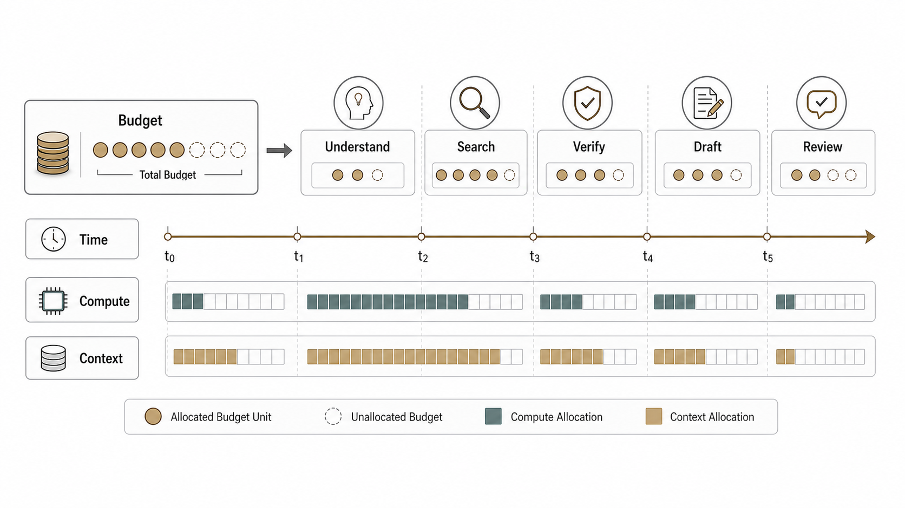

预算是对执行资源的约束，包括时间、计算量、上下文容量、调用次数、成本和交互轮次。开放任务总能继续查、继续想、继续改；预算让系统知道何时深入，何时收束。

预算也是策略。简单任务应使用较小预算，快速给出可靠答案；复杂任务则需要把资源分给理解、探索、验证和表达。若全部预算耗在资料收集上，最后可能没有资源组织结果；若过早写作，又可能建立在薄弱证据上。

例如，两小时准备课堂发言，可以先用二十分钟明确题目，四十分钟查证材料，三十分钟形成提纲，二十分钟写讲稿，十分钟检查逻辑。这里的预算不是机械计时，而是把有限资源变成可管理的执行节奏。

### 2.7 trace：可复盘的过程

trace 是执行过程留下的关键记录。它说明任务如何被理解，证据如何被选择，投影如何形成，权限和预算如何影响行动，候选提交如何产生。trace 的目标不是暴露所有内部细节，而是让重要过程可以复盘。

没有 trace，系统成功时难以总结经验，失败时难以定位原因。错误结论可能来自任务理解偏差，也可能来自证据不足、投影失真、权限受限或预算耗尽。trace 把这些可能性分开，使评价不只停留在“答对”或“答错”。

教学中，trace 类似解题步骤。教师不仅看最后答案，也看推导是否跳步、条件是否误用、近似是否合理。合适的 trace 应围绕关键选择形成记录，既能说明“为什么走到这里”，又不被无关细节淹没。

### 2.8 候选提交：可审查的结果

候选提交是系统准备交付的结果，但仍保留被检查、比较、修改或拒绝的可能。它不是随手草稿，因为它已经满足当前任务理解下的交付条件；它也不是不可更改的终局，因为开放任务常有多种合理答案。

在春游地点选择任务中，候选提交可以写成：“推荐科技馆，理由是交通稳定、费用可控、教学资源较丰富；若天气良好且希望增加户外活动，可考虑植物园。”这样的结果给出结论，也呈现权衡条件。

候选提交让执行既能收束，又不封闭。系统不必无限探索，也不必把第一个结果直接当作最终事实。好的候选提交应清楚说明结论、证据、适用范围和剩余不确定性。

### 2.9 七个抽象的关系

| 抽象 | 回答的问题 | 教学类比 | 常见风险 |
|---|---|---|---|
| 任务 | 为什么做、怎样算完成 | 题目卡 | 目标含糊 |
| 证据 | 凭什么判断 | 引用与实验数据 | 把信息堆积当证明 |
| 投影 | 当前需要看见什么 | 地图 | 摘要失真 |
| 权限 | 哪些动作被允许 | 借阅规则 | 能力越界 |
| 预算 | 资源如何分配 | 备课计划 | 过度探索 |
| trace | 过程如何复盘 | 解题步骤 | 记录过少或过杂 |
| 候选提交 | 准备交付什么 | 可审查答案 | 草稿与最终结果混淆 |

七个抽象合在一起，构成 Agent CPU 的最小教学框架。任务启动执行，证据提供支撑，投影塑造视图，权限和预算形成边界，trace 保留过程，候选提交给出可审查结果。它们共同把“会回答”推进为“受约束、可检查、可改进地执行”。

### 2.10 小结

本章定义了 Agent CPU 的七个基本抽象。任务把意图转化为执行对象；证据让判断建立在依据上；投影帮助系统形成任务视图；权限规定行动边界；预算管理有限资源；trace 记录关键过程；候选提交把结果表达为可审查承诺。

理解这些抽象，比记住某个具体实现更重要。实现会变化，而这些抽象回答的是智能执行必须面对的基本问题：目标如何稳定，依据如何可靠，视图如何形成，行动如何受限，资源如何分配，过程如何复盘，结果如何提交。

### 习题

1. 选择一个日常任务，写出它的目标、上下文、成功条件和当前状态。
2. 为同一任务列出三条证据，并判断它们的相关性、可靠性和时效性。
3. 以“选择春游地点”为例，分别构造预算优先、安全优先和教学意义优先的三个投影。
4. 举例说明“系统有能力做某事”与“系统被授权做某事”的区别。
5. 为一个两小时写作任务设计预算分配，并说明最容易超出预算的环节。
6. 写一段简短 trace，记录从任务理解到候选提交的关键步骤。
7. 比较“草稿”“候选提交”和“最终结果”的区别。为什么开放任务需要候选提交？

---

## 第 3 章 双域架构：Super Domain 与 Agent Domain


### 3.1 从特权级到双域

现代计算机体系结构并不是把所有行为都放在同一个平面上执行。即使在最朴素的处理器中，也会区分普通程序能够做什么、操作系统能够做什么，以及硬件在异常、访存和中断时应当如何接管控制权。传统 CPU 中的用户态与内核态，是这种分层思想最典型的体现：用户态负责应用逻辑，内核态负责资源管理、隔离与仲裁。二者并非对立关系，而是同一台机器上两类职责的自然分工。

随着计算任务从确定性程序扩展到具备目标理解、工具调用、长程规划和环境交互的智能任务，类似的分层需求再次出现。Agent CPU 面对的不只是“执行一串指令”，还包括“解释一个目标”“选择一组行动”“在不确定反馈中更新计划”。如果所有环节都处于同一控制层，就很难同时满足灵活性、可审计性和安全性。因此，Agent CPU 引入双域架构：Super Domain 与 Agent Domain。

Super Domain 可以理解为面向全局秩序的上层域，负责目标边界、资源策略、权限约束、执行监督和最终裁决。Agent Domain 则是面向任务展开的执行域，负责感知上下文、提出候选计划、调用工具、生成中间结果并根据反馈修正路径。二者共同构成 Agent CPU 的基本运行空间：前者提供稳定的制度框架，后者提供活跃的智能执行。

### 3.2 双域架构的基本定义

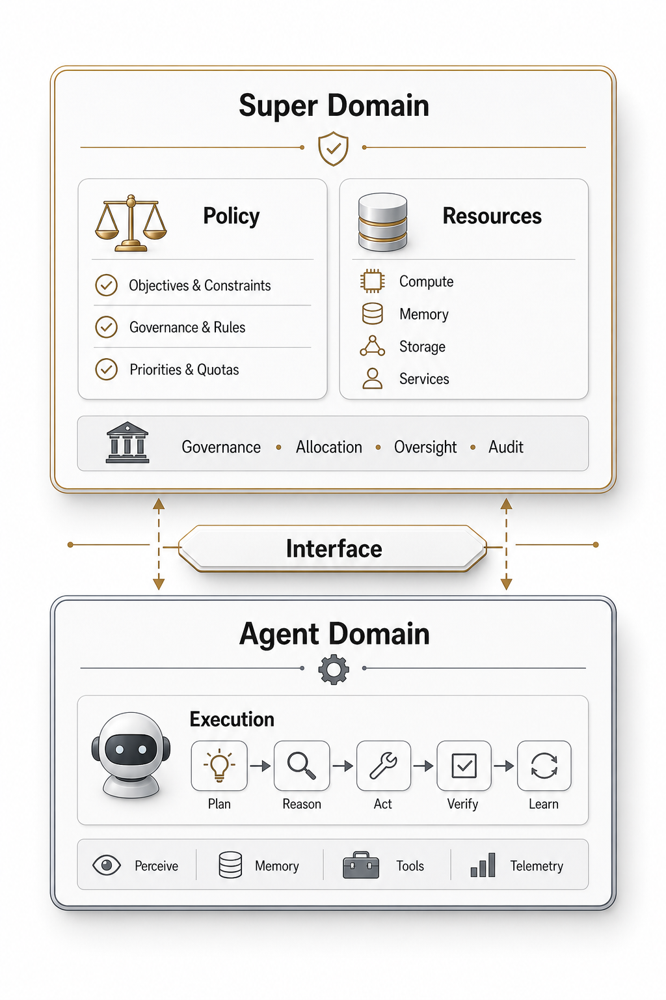

所谓“双域”，不是简单地把系统切成两个进程或两个模块，而是把智能执行中的两类不同性质的控制权明确区分出来。

Super Domain 的核心问题是“什么可以被允许”。它关心任务是否符合目标边界，资源是否可用，某个工具调用是否需要授权，某个结果是否可以提交，以及发生冲突时应当以哪条规则为准。它更接近传统体系结构中的特权控制层、操作系统内核和平台安全根，但它并不只管理硬件资源，也管理智能行为的边界。

Agent Domain 的核心问题是“怎样把任务做出来”。它关心如何理解输入，如何分解目标，如何搜索方案，如何调用外部能力，如何比较多个候选结果，以及如何把过程推进到可交付状态。它更接近应用程序、运行时系统与协处理器工作流的结合体，但它并不是普通应用层，因为它具备持续推理、反思和自我修正能力。

二者之间存在清晰的接口。Agent Domain 可以提出行动请求、资源请求和结果提交；Super Domain 可以授予、限制、暂停、回滚或要求补充证据。这样，系统既能保持智能执行的开放性，又能把关键控制点收束在可审计、可治理的结构之内。

### 3.3 为什么双域是自然形成的

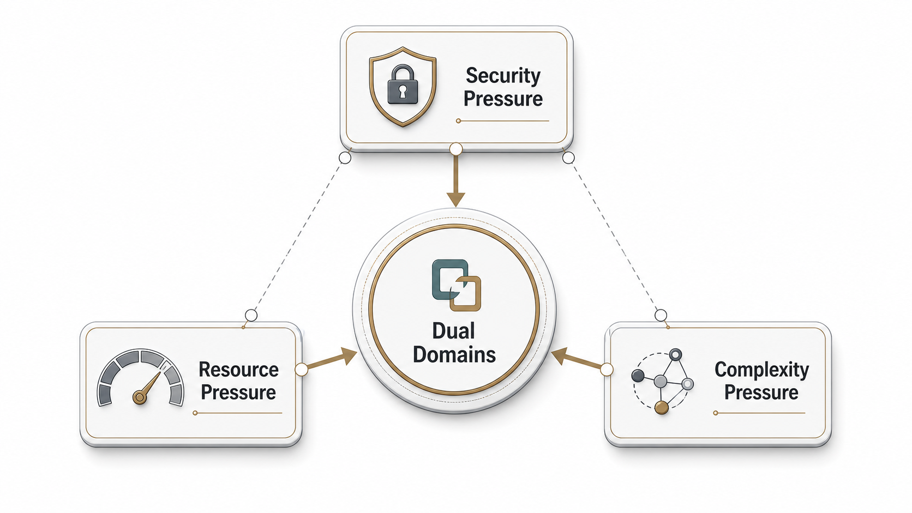

从传统 CPU 的发展看，复杂系统往往会在三个压力下产生分层：第一是安全压力，第二是资源压力，第三是复杂性压力。

安全压力来自不同代码之间的信任差异。用户程序不能任意改写页表，不能直接接管中断控制器，也不能随意访问其他进程的内存。类似地，智能任务执行时，计划生成、工具选择和文本输出具有高度灵活性，但这种灵活性不应自动等同于最高权限。Agent Domain 可以大胆探索候选路径，但涉及权限、外部副作用和最终交付时，需要 Super Domain 进行边界确认。

资源压力来自有限计算能力的分配。操作系统需要调度 CPU 时间、内存、文件句柄和网络连接。Agent CPU 中也存在类似问题：推理步数、上下文窗口、工具额度、外部服务调用次数和长期记忆写入机会都是资源。若没有上层域统一管理，单个任务很容易占用过多资源，影响整体吞吐与可预测性。

复杂性压力则来自系统本身的增长。早期程序可以直接面向硬件编写，后来必须依赖操作系统、驱动、运行时和库。智能系统也是如此。一个简单问答可以由单次推理完成，而一个长程任务往往需要检索、规划、执行、验证、修订和归档。把所有逻辑混在一个平面，会使系统难以分析。双域架构把“治理逻辑”和“执行逻辑”分离，使复杂系统仍然保持可解释的骨架。

因此，双域不是人为增加的一层装饰，而是智能计算规模扩大后自然出现的结构选择。它延续了传统体系结构的分层经验，又把分层对象从指令执行扩展到目标执行。

### 3.4 与传统 CPU 特权级的关系

传统 CPU 的特权级把机器状态划分为不同访问范围。普通应用处于低特权级，操作系统内核处于高特权级；当应用需要访问文件、网络或设备时，通过系统调用进入内核，由内核检查参数、执行操作并返回结果。这一机制使普通程序无需拥有全部权力，也能完成复杂任务。

双域架构可以被看作这种思想在 Agent CPU 中的推广。Agent Domain 类似于执行复杂任务的“智能用户态”：它有足够能力进行计划和推理，但它不天然拥有全部控制权。Super Domain 类似于“智能内核态”：它不必亲自完成每个具体步骤，却负责定义可行边界、管理状态转移、处理异常和维护系统一致性。

两者也有重要差异。传统特权级主要围绕硬件资源访问设计，其状态变化较为确定；双域架构则需要处理语义层面的判断。例如，一个文件写入动作在硬件上只是一次 I/O，但在智能任务中可能意味着覆盖用户成果、发布外部信息或改变后续决策依据。Super Domain 因而不仅检查“能不能访问”，还要判断“在当前任务语境下是否应当访问”。

这种关系说明，双域不是对传统特权级的替代，而是对其思想的扩展：从管理机器指令，扩展为管理智能行动。

### 3.5 与操作系统和协处理器思想的关系

操作系统提供了另一个有用类比。应用程序面对的是文件、进程、套接字和虚拟内存等抽象，而不是直接面对磁盘扇区和物理页框。操作系统把复杂硬件包装成稳定接口，并在接口背后完成调度、隔离和错误处理。

Super Domain 也承担类似功能。它把智能执行所依赖的工具、记忆、策略和环境约束包装成可管理的接口。Agent Domain 不需要直接知道每一项资源的底层细节，而是通过请求机制表达意图。Super Domain 根据规则、上下文和资源状态决定如何响应。这种设计降低了执行域的负担，也使系统治理不必散落在每个任务步骤中。

协处理器思想则帮助我们理解 Agent Domain 的价值。图形处理器、张量加速器和安全模块都不是主处理器的简单附庸，而是面向特定问题提供高效能力的执行单元。主系统把合适的工作交给协处理器，并通过接口接收结果。Agent Domain 在双域架构中也具有这种特征：它专长于语义推理、计划生成、候选比较和工具链组织，是智能任务的主要生产力来源。

因此，双域架构可以被概括为：以 Super Domain 维持秩序，以 Agent Domain 释放智能执行能力；以接口连接二者，以审计和反馈维持整体稳定。

### 3.6 Super Domain 的职责

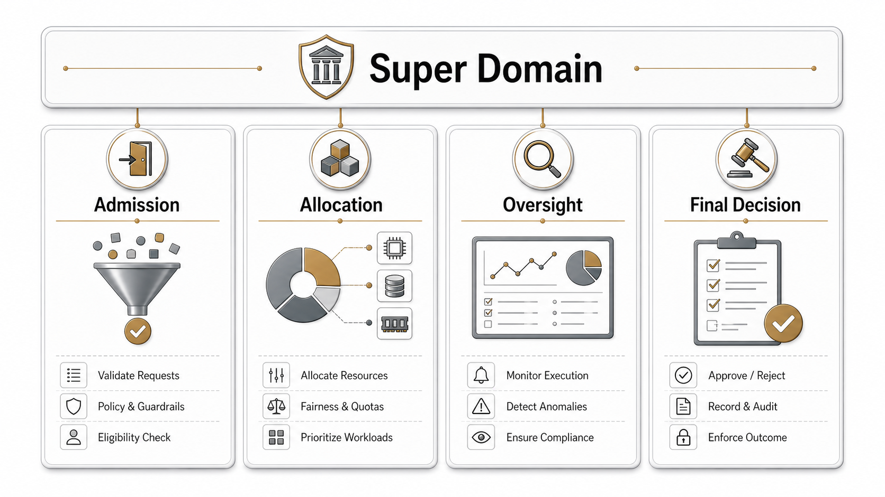

Super Domain 的职责可以分为四类。

第一，目标约束。它保存任务的根目标、用户意图、系统规则和不可越过的边界。当 Agent Domain 产生多个解释或计划时，Super Domain 提供判断基准，防止执行路径偏离原始目标。

第二，权限与资源管理。它决定哪些工具可用，哪些操作需要确认，哪些资源有额度限制，哪些状态需要保护。权限并不只是一张静态表，而是结合任务阶段、上下文风险和历史行为动态判断。

第三，异常处理。智能执行常常遇到不完整信息、工具失败、结果冲突和外部环境变化。Agent Domain 可以尝试局部修正，但当异常影响目标边界、资源安全或结果可信度时，需要由 Super Domain 接管或重新设定执行条件。

第四，提交与审计。最终结果不是简单地由最后一次生成决定，而应经过可追踪的提交过程。Super Domain 记录关键决策、重要证据、权限变化和结果确认，使系统能够回看“为什么这样做”。

### 3.7 Agent Domain 的职责

Agent Domain 是任务推进的主要场所。它的第一项职责是理解输入，把自然语言目标、环境状态和已有材料转化为可执行的任务表示。这个过程类似于把高级语言编译为中间表示，但它处理的是语义、意图和约束。

第二项职责是规划。Agent Domain 将复杂目标分解为若干步骤，形成候选路径，并根据反馈不断调整顺序。优秀的规划并不意味着一次性得到完美路线，而是能够在执行中保持方向感。

第三项职责是行动。行动可以是内部推理，也可以是调用工具、检索资料、运行程序、生成文件或请求外部信息。Agent Domain 负责把计划落实为具体动作，并把动作结果重新纳入上下文。

第四项职责是自我校验。由于智能执行存在不确定性，Agent Domain 需要比较输出与目标之间的差距，发现遗漏、矛盾和低置信度区域，再决定是否继续补充工作。这种校验不等同于最终裁决，但它能显著提高提交给 Super Domain 的结果质量。

### 3.8 双域之间的典型交互

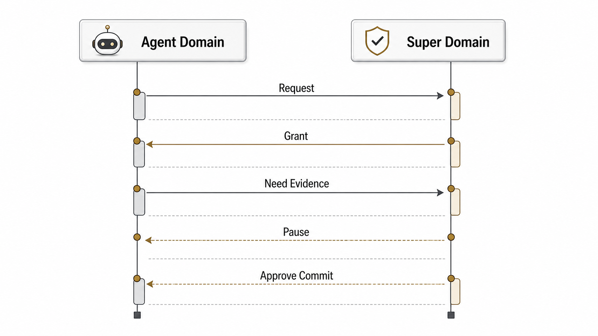

双域交互通常围绕“请求、授权、执行、反馈、提交”展开。一个任务开始时，Super Domain 接收根目标并建立边界；Agent Domain 读取目标后形成计划；当计划需要敏感资源或外部副作用时，Agent Domain 发起请求；Super Domain 根据策略做出授权或限制；Agent Domain 执行并返回证据；最终由 Super Domain 判断是否满足提交条件。

| 环节 | Super Domain 关注点 | Agent Domain 关注点 |
| --- | --- | --- |
| 任务初始化 | 根目标、边界、优先级 | 语义理解、任务拆解 |
| 计划形成 | 是否符合约束 | 候选路径、步骤排序 |
| 资源请求 | 权限、额度、风险 | 工具选择、参数构造 |
| 执行推进 | 状态一致性、异常级别 | 行动结果、局部修正 |
| 结果提交 | 可审计性、完成条件 | 输出组织、证据汇总 |

这张表体现了双域的互补关系。Super Domain 并不替 Agent Domain 完成所有推理，Agent Domain 也不越过 Super Domain 自行决定关键边界。前者像稳定的制度结构，后者像活跃的执行智能。只有二者配合，Agent CPU 才能在开放任务中保持可靠。

### 3.9 小结

本章介绍了 Agent CPU 的双域架构。双域架构把智能计算中的全局治理与任务执行分离为 Super Domain 与 Agent Domain。Super Domain 负责目标边界、权限资源、异常处理和结果审计；Agent Domain 负责语义理解、任务规划、行动执行和自我校验。

这种划分来自传统体系结构的连续演化。CPU 特权级说明了不同信任层次需要不同控制权；操作系统说明了复杂资源需要统一抽象与调度；协处理器说明了专门能力可以通过接口融入整体系统。Agent CPU 将这些思想推进到语义行动层，使智能任务既能灵活展开，又能在可管理的框架中完成。

理解双域架构，是理解 Agent CPU 后续机制的基础。后续章节中的任务恢复、记忆系统、候选提交、工具调用和性能评价，都可以看作双域分工在不同部件上的展开。

### 3.10 习题

1. 为什么传统 CPU 要区分用户态和内核态？这种区分对理解 Super Domain 与 Agent Domain 有什么帮助？

2. 试举一个智能任务的例子，说明 Agent Domain 可以负责哪些步骤，Super Domain 应当在哪些位置介入。

3. 双域架构中的权限管理与普通操作系统权限管理有什么相同点和不同点？

4. 如果一个 Agent Domain 生成了两个互相冲突的计划，Super Domain 可以依据哪些信息做出选择或要求修订？

5. 结合本章内容，说明为什么双域架构不是削弱 Agent Domain 的能力，而是让其能力更适合在复杂系统中稳定发挥。

---

## 第 4 章 APU-IR：Agent 与硬件之间的契约


在计算机体系结构课程中，指令集体系结构常被称为软件与硬件之间的契约。软件不必知道加法器如何布线、流水线如何旁路、缓存如何替换，只要处理器正确实现指令集，程序便能按约定运行。进入 Agent CPU 的语境后，系统要执行的不再只是单条算术指令或一次内存访问，而是带有目标、上下文、工具调用、权限边界、成本约束和可追溯证据的智能任务。因此，Agent 与底层执行平台之间也需要一种新的契约形式。本章讨论的 APU-IR，就是这种契约的核心表示。

APU-IR 可以理解为面向 Agent Processing Unit 的中间表示。它不是某种聊天记录格式，也不是把自然语言简单包装成结构化文本；它是一种把“要做什么、可用什么、不能做什么、花费多少、依据何在、执行过程如何留下痕迹”同时表达出来的任务级表示。它使 Agent 的意图能够被编译、调度、审计和硬件加速，也使硬件平台能够在明确边界内执行开放任务。

### 4.1 从 ISA 到 APU-IR

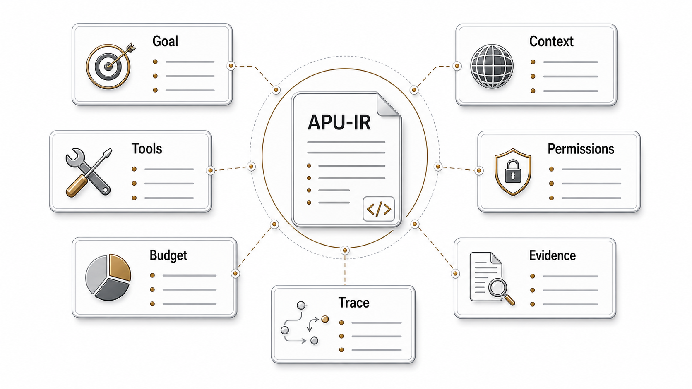

传统计算机系统通常通过多层接口来管理复杂性。最底层的 ISA 定义机器可见的指令、寄存器、内存模型和异常行为；ABI 定义过程调用、二进制对象、系统调用和运行时约定；编译器 IR 则位于高级语言与目标机器之间，用于优化和变换程序。三者共同构成了现代软件栈的稳定地基。

如果把这套脉络迁移到 Agent CPU，会发现原有接口仍然重要，但已经不够。一个 Agent 任务往往不是“执行函数 f(x)”，而是“在给定目标下，读取若干上下文，调用受限工具，形成可验证输出，并在预算内完成”。这类任务包含传统指令难以直接表达的要素：任务之间的依赖关系、资源和时间预算、外部工具权限、输出证据链、执行 trace，以及失败后的恢复策略。

APU-IR 正是在这一空缺处出现。它向上承接自然语言任务、工作流描述和应用 API，向下连接运行时、调度器、内存系统、工具沙箱和专用加速单元。它的作用不是取代 ISA，而是在 ISA 之上增加任务语义层，使 Agent CPU 能够理解并执行“任务”这一新的基本工作单位。

| 层次 | 主要对象 | 典型问题 | 在 Agent CPU 中的对应意义 |
|---|---|---|---|
| ISA | 指令、寄存器、内存 | 一条机器指令如何执行 | 提供底层计算与访存能力 |
| ABI | 调用约定、系统接口 | 模块如何互相调用 | 规范工具、运行时和外部服务接口 |
| 编译器 IR | 控制流、数据流、类型 | 程序如何优化和映射 | 支持任务编译、重排和静态检查 |
| APU-IR | 任务图、权限、预算、证据、trace | Agent 任务如何被可靠执行 | 定义 Agent 与执行平台的任务级契约 |

从这个角度看，APU-IR 并不是凭空发明的一层格式，而是计算机接口思想在 Agent 时代的自然延伸。它把“程序的正确执行”扩展为“任务在约束、证据和责任边界内的正确执行”。

### 4.2 APU-IR 表达什么

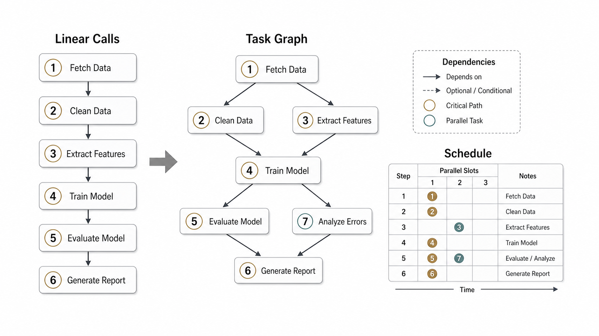

一个完整的 APU-IR 程序通常围绕任务图展开。任务图中的节点表示可执行单元，例如检索资料、调用模型、运行工具、验证输出或生成报告；边表示依赖关系，例如某个节点必须等待检索结果，某个验证节点必须读取生成节点的输出。与普通有向无环图不同，APU-IR 的任务图不仅描述先后顺序，还携带权限、预算和证据要求。

权限用于说明节点可以访问哪些资源。一个节点可能只能读取给定文档，另一个节点可以调用数据库查询接口，还有一个节点可以写入最终报告。权限不是附属说明，而是可执行平台必须检查的约束。这样，Agent 不再拥有一个笼统而模糊的“全能工具箱”，而是在每个任务阶段获得最小必要能力。

预算用于限制任务的消耗。预算可以是时间、计算量、模型调用次数、外部 API 次数、能耗、费用或内存占用。传统程序也会受到资源限制，但这些限制通常在操作系统或运行时外部施加；APU-IR 将预算提升为任务契约的一部分，使调度器可以在计划阶段估计成本，在执行阶段动态控制消耗，在异常阶段决定是否降级、重试或中止。

证据用于说明输出必须依据什么。对于 Agent CPU 而言，输出不仅要“看起来合理”，还要能够追溯到输入、工具结果、模型中间判断或验证步骤。APU-IR 可以要求某个结论绑定到若干来源片段，也可以要求某个判断经过独立验证节点确认。证据机制将 Agent 的生成行为转化为可检查的计算过程。

trace 则记录任务如何执行。它包括节点开始与结束时间、使用的权限、消耗的预算、读取的输入、产生的输出摘要、失败与重试信息、验证结果等。trace 的意义不只是调试，更是系统治理的一部分：它让开发者能够复现问题，让调度器能够学习代价模型，让审计者能够理解输出是如何产生的。

### 4.3 任务图：从线性调用到可调度结构

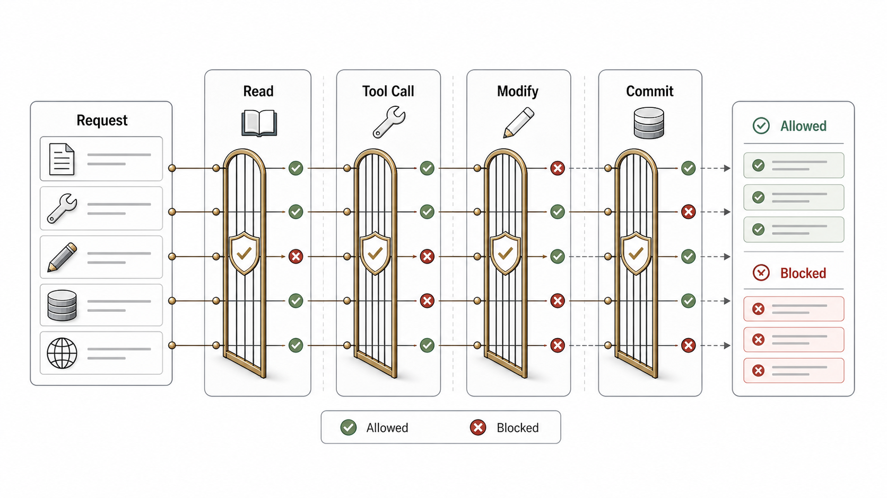

在简单应用中，Agent 常被实现为“提示词输入、模型输出、工具调用、再输入模型”的循环。这种循环易于理解，但不利于系统优化。APU-IR 将循环中的隐含步骤显式化为任务图，使执行平台能够进行静态分析和动态调度。

例如，一项技术调研任务可以被分解为四类节点：资料检索、候选资料筛选、观点综合、结果验证。检索节点之间可能相互独立，可以并行执行；筛选节点依赖检索结果；综合节点依赖筛选后的证据；验证节点读取综合结果并检查引用是否充分。任务图一旦形成，运行时就能识别并行机会、缓存中间结果、隔离高风险工具调用，并在预算不足时优先保留关键路径。

任务图还使失败处理更加明确。若某个检索节点失败，系统可以选择使用备用来源；若验证节点失败，系统可以退回综合节点重新生成；若预算超限，系统可以按照优先级裁剪低价值分支。这里的关键在于，失败不再只是一次调用异常，而是图中某个节点状态的变化。APU-IR 将这种状态变化纳入契约，从而使恢复策略可以被系统化执行。

### 4.4 权限：把能力变成可检查边界

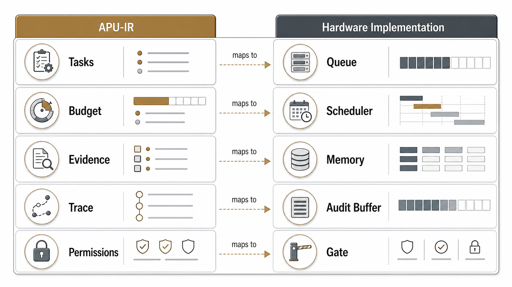

Agent 的强大来自工具使用能力，但风险也常来自工具使用能力。如果一个 Agent 既能读取私有数据，又能访问外部网络，还能写入生产系统，那么一次错误推理就可能造成越权泄露或错误操作。APU-IR 的权限模型试图在任务表示层解决这一问题。

权限应当具有三个特征。第一，权限要绑定到节点，而不是笼统绑定到整个 Agent。第二，权限要尽量具体，例如“读取某个输入集合”优于“读取所有文件”，“调用某个只读查询接口”优于“访问全部数据库”。第三，权限要可由运行时检查，而不是只存在于自然语言约定中。

在硬件和系统实现上，权限信息可以驱动沙箱、内存保护、工具网关和安全监控。执行平台在调度节点前检查权限，在运行节点时限制可见资源，在节点结束后将权限使用情况写入 trace。这样，APU-IR 不仅描述任务，而且参与安全执行。

### 4.5 预算：让开放任务具备工程边界

Agent 任务具有开放性。一个问题可以检索十条资料，也可以检索一千条；一次推理可以很快给出答案，也可以不断反思和重试。没有预算，开放任务很难进入工程系统。APU-IR 用预算字段把开放性限制在可管理范围内。

预算可以分为硬预算和软预算。硬预算一旦超过即必须停止，例如最大费用、最长执行时间或禁止超过的权限边界。软预算用于指导调度，例如希望在较短时间内完成、优先减少外部调用、尽量保留高可信证据。两类预算共同作用：硬预算保证系统不越界，软预算帮助系统在多个可行方案中选择更优执行路径。

预算还可以沿任务图分配。根任务拥有总预算，子任务获得预算切片；运行时根据节点重要性、历史代价和当前进展动态调整。若验证节点比预期消耗更多，系统可以压缩后续润色节点的预算；若检索节点已经获得足够证据，系统可以提前结束剩余检索分支。通过这种方式，预算从外部限制转化为调度决策的一部分。

### 4.6 证据与 trace：让执行结果可追溯

传统程序的正确性通常通过输入输出关系、测试和形式化验证来讨论。Agent 任务的正确性更复杂，因为输出可能包含自然语言判断、概率推理和外部知识。APU-IR 因而强调证据和 trace。

证据回答“为什么可以这样说”。它要求关键结论能够连接到输入片段、检索结果、工具返回值或验证节点。证据不保证结论一定正确，但它提供了检查路径。没有证据的输出只能被当作生成结果；带有证据的输出则可以被复核、比较和审计。

trace 回答“系统实际做了什么”。同一份 APU-IR 在不同时间、不同硬件、不同缓存状态下可能产生不同执行路径。trace 记录这些路径，使开发者能够分析延迟来源、预算消耗和错误传播。对于生产系统，trace 还可以支持责任划分：是输入不足、工具失败、模型判断错误，还是权限配置过宽。

证据和 trace 的关系类似于“内容依据”和“执行日志”。证据面向结果可信度，trace 面向过程可解释性。二者结合，APU-IR 才能把 Agent 的行为从黑箱调用推进到可观察、可治理的系统执行。

### 4.7 一个简短示例

下面的例子只展示 APU-IR 的思想，而不是完整语法规范。设想一个任务：根据三份输入材料生成一页摘要，并要求每个主要结论有来源依据。

```text
task: summarize_policy_notes
goal: 生成一页中文摘要，列出主要结论与依据
graph:
  - read_inputs: 读取给定三份材料
  - extract_claims: 从材料中抽取候选结论，依赖 read_inputs
  - verify_claims: 检查每个结论是否有材料依据，依赖 extract_claims
  - write_summary: 生成最终摘要，依赖 verify_claims
permissions:
  read_inputs: read(input_documents)
  write_summary: write(final_answer)
budget:
  time: 60s
  model_calls: 4
evidence:
  write_summary: 每个主要结论至少绑定一个输入片段
trace:
  record: 节点状态、预算消耗、证据绑定、验证失败项
```

这个例子中，重点不是字段名称，而是契约内容。任务被拆成图，节点权限被限定，预算提前声明，证据要求随输出传播，trace 要求随执行生成。执行平台据此可以决定哪些节点可并行、哪些资源可访问、何时停止、如何验证输出，以及如何在事后复盘。

### 4.8 APU-IR 与硬件实现的关系

APU-IR 是任务级表示，但它并不只属于软件。对于 Agent CPU，硬件和运行时可以围绕 APU-IR 进行协同设计。任务图为调度器提供并行结构，权限为保护机制提供检查依据，预算为资源管理单元提供控制目标，证据和 trace 为可观测性硬件提供记录边界。

例如，硬件可以为任务节点维护轻量状态表，记录节点是否就绪、运行或阻塞；可以为模型调用、向量检索和工具访问提供专用队列；可以将预算计数器与节点上下文绑定；可以为 trace 生成低开销事件流。这样，APU-IR 不只是编译器内部的一种表示，而是贯穿编译、运行、调度和审计的共同语言。

当然，APU-IR 不要求所有语义都由硬件直接理解。就像现代处理器不直接理解高级语言一样，Agent CPU 也可以通过编译器、运行时和微码层逐步解释 APU-IR。关键在于，APU-IR 把任务语义稳定地暴露出来，使不同实现可以在同一契约下竞争性能、可靠性和安全性。

### 4.9 小结

本章从 ISA、ABI 和编译器 IR 的传统教学脉络出发，引出了 APU-IR 的必要性。APU-IR 是 Agent 与执行平台之间的任务级契约，它把目标、任务图、权限、预算、证据和 trace 统一到一种可分析、可调度、可审计的表示中。

APU-IR 的核心价值在于显式化。它把隐含在提示词和工具循环中的结构显式化为任务图，把模糊能力显式化为权限，把开放消耗显式化为预算，把生成依据显式化为证据，把执行过程显式化为 trace。正因为这些要素被表达出来，Agent CPU 才能对复杂任务进行安全调度、资源控制和结果复核。

在后续章节中，APU-IR 可以继续向下连接任务调度、上下文内存、工具接口和安全机制。理解 APU-IR，就是理解 Agent CPU 如何把“智能行为”转化为可工程化执行的系统对象。

### 习题

1. 试比较 ISA、ABI、编译器 IR 和 APU-IR 的作用边界。为什么说 APU-IR 不是 ISA 的替代品，而是任务语义层的补充？

2. 选择一个日常 Agent 任务，例如整理会议纪要、检索技术资料或生成实验报告，将其拆分为 4 到 6 个任务图节点，并标出节点之间的依赖关系。

3. 对上一题中的任务图，为每个节点设计最小必要权限。说明哪些权限如果授予过宽，可能带来安全或隐私风险。

4. 设计一个包含时间、费用和工具调用次数的预算方案。若任务执行到一半时预算不足，你会优先保留哪些节点，裁剪哪些节点？为什么？

5. 解释证据和 trace 的区别。请举例说明：一个输出有证据但 trace 不完整时会产生什么问题；一个 trace 完整但证据不足时又会产生什么问题。

---

## 第 5 章 Memory 与 NoC：从状态到数据移动


处理器并不只是在执行指令，也在不断搬运状态。寄存器中的操作数、缓存中的数组元素、片上存储器中的中间块、主存中的对象图，以及外设产生的输入流，都要在恰当的时间到达恰当的计算单元。传统计算机体系结构把这一问题称为内存层次与互连设计；在 Agent CPU 中，它进一步扩展为 ledger、context、artifact 与 trace 等智能体状态的组织、定位、移动与提交。本章从经典内存系统出发，说明 Agent CPU 如何把“数据在哪里”和“数据如何流动”变成体系结构中的一等问题。

### 5.1 内存层次的基本动机

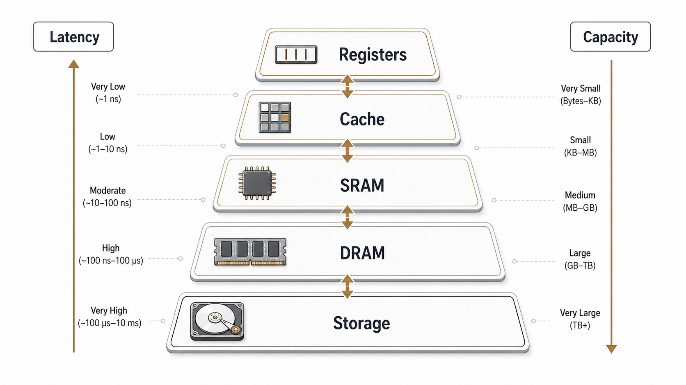

理想的存储器应当容量无限、访问立即完成、能耗为零，并且能够被所有计算单元同时使用。现实系统不可能满足这些条件，因此现代处理器采用分层结构：越靠近执行单元，速度越快、容量越小、单位比特成本越高；越靠近外部存储，容量越大、延迟越高、带宽与能耗压力越明显。

典型层次包括寄存器、一级缓存、二级或三级缓存、片上共享存储、主存、固态盘和远端存储。每一层都承担“保留最近可能被使用的数据”的任务。程序访问数据并非均匀随机，而是呈现局部性。时间局部性表示刚访问过的数据很可能很快再次访问；空间局部性表示访问某个地址后，附近地址也可能被访问。缓存正是利用这两种局部性，把高频访问吸收到靠近计算的位置。

Agent CPU 继承这一原则，但对象不再只是字节数组。智能体运行时还会反复读取任务目标、约束、工具返回、候选计划、记忆摘要、执行日志和验证证据。这些信息同样具有局部性：当前推理轮次会频繁访问相同的上下文片段；相邻步骤会共享相同 artifact；一次回滚或复盘会沿 trace 访问连续事件。因此，Agent CPU 的内存层次既要服务普通数据，也要服务可解释、可恢复、可审计的智能体状态。

如果把这一问题放到更大系统尺度上看，还会得到一个更强的结论：真正的 memory wall 往往不仅存在于处理器和 DRAM 之间，也存在于“当前执行所需状态”与“状态实际所在层级”之间。传统 Warehouse-Scale Computer 研究表明，一旦数据跨出本地节点、机架或阵列，带宽和延迟会急剧恶化，放置策略本身就成为体系结构问题。Agent CPU 同样如此。一个任务所需状态可能分布在短上下文窗口、长期记忆库、对象存储、远端工具结果和外部知识源中。体系结构的关键不只是把某层做快，而是让真正重要的状态在真正需要它之前，被放到足够近、足够快、足够可信的位置。

### 5.2 缓存：从地址命中到语义命中

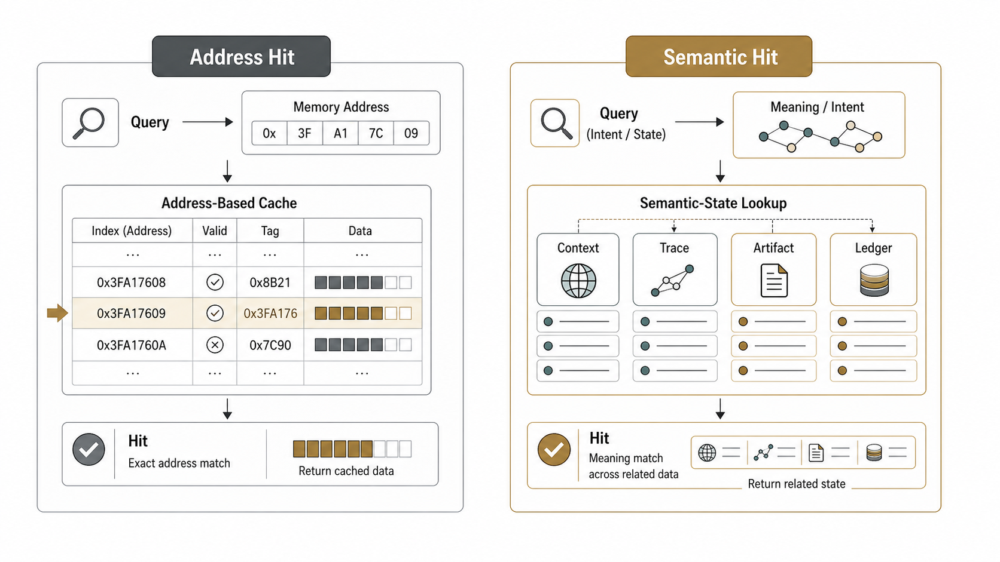

缓存把主存中的数据块复制到更快的位置，并用标签判断请求是否命中。命中时，访问在近端完成；未命中时，系统从下一级取回数据，可能还要替换已有缓存行。传统缓存设计关注块大小、相联度、替换策略、一致性协议与写策略。它的核心目标是降低平均访问延迟，同时在多核环境中维护数据一致性。

在 Agent CPU 中，缓存概念被推广为多种状态的近端副本。context cache 保存当前任务窗口中最相关的上下文片段；artifact cache 保存可复用的中间产物，如解析结果、检索摘要、程序分析结果或规划图；trace cache 保存近期执行事件，便于分支恢复、错误定位和候选路径比较；ledger cache 则保存尚需快速检查的承诺、约束与提交记录。

这里的“命中”不仅是地址相等，也可以是语义相近、版本匹配和权限满足。一个上下文片段是否可复用，取决于它是否属于当前任务、是否仍然新鲜、是否与当前策略一致，以及是否已经被后续事件覆盖。因而 Agent CPU 的缓存标签可包含对象标识、版本号、时间戳、来源、置信度、可见范围和依赖关系。它仍然是体系结构缓存，只是标签空间从物理地址扩展到智能体状态的结构化描述。

从这个角度看，Agent CPU 中最重要的转变不是“缓存了新的对象类型”，而是把命中从地址概念提升为语义概念。传统 cache hit 回答的是“这个数据块在不在近处”；语义命中回答的是“这个任务下一步所需的状态是否已经以低成本、可验证的形式可用”。若后者长期命中率低，系统即使拥有极快的原始内存，也仍然会在打包上下文、重取证据、重建依赖和重复检索上耗费大量时间。

### 5.3 SPM 与显式数据编排

缓存通常由硬件自动管理，程序只间接影响其行为。Scratchpad Memory，简称 SPM，则是一块由软件或运行时显式管理的近端存储。它没有复杂的标签匹配和替换机制，优势是访问延迟可预测、能耗较低、控制明确。许多嵌入式处理器、图像处理器和专用加速器都使用 SPM 承载热点数据块。

对于 Agent CPU，SPM 的价值在于承载“本轮推理必须稳定可见”的工作集。例如，调度器可以把当前任务说明、最近若干条 ledger 项、关键 artifact 索引和候选动作列表放入片上 SPM，使推理核心在一个阶段内以确定延迟访问它们。与缓存不同，SPM 的内容通常由编译器、运行时或微内核显式搬入和搬出，因此更适合表达阶段性边界。

这种显式编排也有助于可恢复执行。当一个推理阶段开始时，系统可以把阶段输入固定到 SPM；阶段结束时，再把结果提交到 ledger 或写入 artifact store。若阶段失败，未提交的 SPM 内容可以被丢弃，已提交状态保持不变。于是，SPM 不只是快速存储，也成为状态隔离和事务边界的一部分。

### 5.4 DMA：让数据移动脱离执行核心

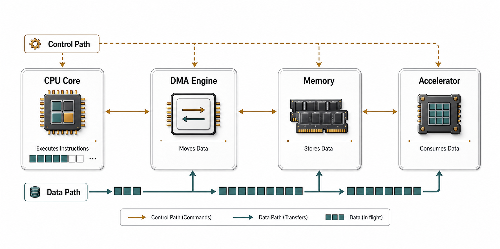

直接内存访问 DMA 允许专门的数据搬运单元在不占用通用执行核心的情况下传输数据。传统系统中，DMA 常用于磁盘、网络、显示和加速器之间的大块数据搬运。CPU 配置源地址、目的地址、长度和权限后，DMA 引擎负责完成传输，并在结束时发出中断或写回状态。

Agent CPU 中的数据移动更频繁，也更结构化。一次智能体步骤可能需要从长期记忆取回若干上下文片段，把工具输出转换成 artifact，把候选计划写入缓冲区，再把最终决策追加到 ledger。若这些搬运全部由执行核心逐字节完成，推理吞吐会被状态管理拖慢。因此，Agent CPU 可使用状态 DMA：它搬运的不只是连续字节，也可以是带元数据的对象块、上下文窗口、trace 区间或 artifact 依赖子图。

状态 DMA 的描述符需要表达更多信息。除了源、目的和长度，还应包含对象类型、版本条件、压缩方式、访问权限、是否需要校验摘要、完成后是否触发提交事件等字段。这样，执行核心发起“取回与当前目标相关的上下文片段”或“把本轮 trace 归档到持久层”时，可以把细节交给搬运单元，在等待期间继续进行调度、验证或下一步规划。

### 5.5 NoC：片上系统的数据道路

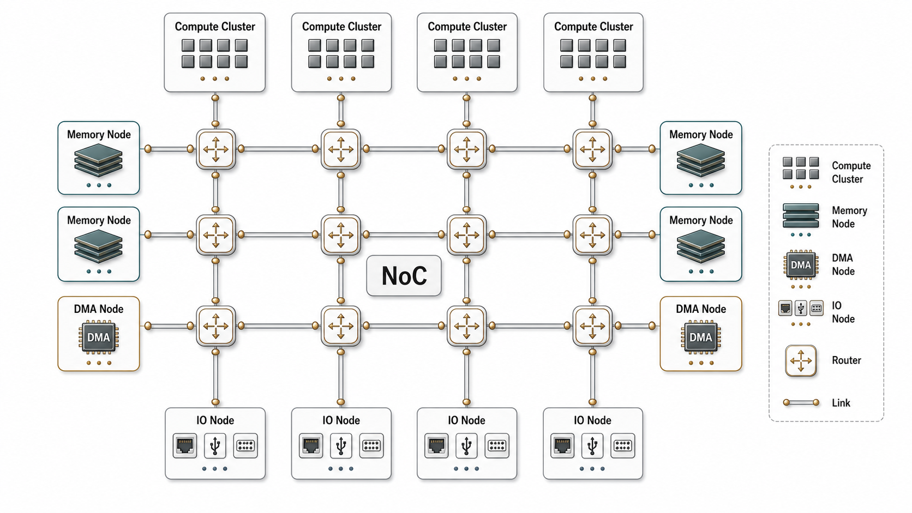

当芯片内有多个核心、缓存、加速器、存储控制器和 I/O 单元时，简单总线会遇到带宽、仲裁和时序瓶颈。Network-on-Chip，简称 NoC，把片上通信组织成网络。节点通过路由器连接，消息以包的形式在链路上传输。常见拓扑包括环、网格、树和片上交叉网络。NoC 设计关注延迟、吞吐、公平性、死锁避免、服务质量和功耗。

传统 NoC 主要传输读写请求、缓存一致性消息和 DMA 数据流。Agent CPU 的 NoC 还要承载智能体状态流：context 请求、artifact 读写、trace 追加、ledger 查询、候选分支同步、权限检查结果和验证反馈。不同流量的实时性不同。推理核心等待的 context 片段属于低延迟流；大规模 artifact 归档属于高带宽流；ledger 提交属于强顺序和高可靠流；trace 采样可以在带宽紧张时降采样或延迟写回。

因此，Agent CPU 的 NoC 往往需要区分消息类别和优先级。它可以为 ledger 提交保留有序通道，为 context cache 填充提供低延迟通道，为 artifact 搬运提供批量通道，为 trace 流提供可压缩通道。这样，系统不会因为大量日志写入阻塞关键决策，也不会因为上下文取回挤占长期归档的全部带宽。

更进一步说，NoC 在 Agent CPU 中不只是“把东西送过去”，而是承担消息封装、路由、仲裁、隔离与传输保证的联合职责。传统互连网络研究关心拓扑、交换结构、流控与拥塞；这些问题在 Agent CPU 中依然存在，只是报文从缓存块和内存请求扩展成了任务描述、候选结果、证据摘要和恢复材料。于是，网络接口本身也变成一种语义边界：它不仅决定消息怎样走，还决定哪些类型的状态可以被谁注入、以什么顺序被谁消费。

### 5.6 四类状态的数据移动

Agent CPU 中的状态可以粗略分为四类：ledger、context、artifact 和 trace。它们都在内存层次中占据位置，但访问模式和一致性要求不同。

| 状态类型 | 主要含义 | 典型访问模式 | 体系结构关注点 |
| --- | --- | --- | --- |
| ledger | 已承诺的目标、约束、决策和提交记录 | 追加、查询、校验、回放 | 顺序性、不可随意覆盖、可审计 |
| context | 当前推理所需的任务背景和相关记忆 | 窗口化读取、相关性更新 | 新鲜度、容量控制、语义命中 |
| artifact | 工具或模型产生的中间与最终产物 | 块读写、依赖追踪、复用 | 版本、引用、批量搬运 |
| trace | 执行过程中的事件序列和证据链 | 追加、采样、压缩、回溯 | 时间顺序、低开销、可恢复 |

ledger 更像体系结构中的提交日志。它要求写入顺序清晰，不能被普通缓存替换策略随意隐藏。context 更像工作集，它经常被选择、裁剪和重排，适合多级缓存和 SPM 协同。artifact 具有文件和对象的双重特征，常常体积较大，适合 DMA 与 NoC 批量移动。trace 则像高频事件流，需要在可观察性与带宽之间取得平衡。

把这四类状态区分开，并不是为了增加概念负担，而是为了让硬件和运行时按不同规律优化。若把所有状态都看成普通内存块，系统很难知道哪些写入必须立刻持久化，哪些片段可以重算，哪些数据可以延迟搬运，哪些事件必须进入恢复路径。类型化状态使内存系统能够在性能、可靠性和可解释性之间作出明确选择。

### 5.7 从一致性到可恢复性

多核处理器需要缓存一致性，保证不同核心看到的共享内存状态符合某种规则。常见协议通过失效、更新和目录记录来维护一致性。Agent CPU 也需要一致性，但它面对的不只是“同一地址的最新值”，还包括“同一任务状态的合法版本”。

例如，一个推理核心读取了上下文片段 A，并基于它产生候选动作；同时，另一个单元更新了相关 artifact 或追加了新的 ledger 约束。系统必须判断候选动作是否仍然有效。这里的一致性更接近版本化一致性：每次读取都带有状态版本，每次提交都检查依赖是否仍满足。若依赖失效，候选动作可以被重新验证、降级或丢弃。

可恢复性则要求系统能够从 trace 和 ledger 重建关键过程。传统流水线可以通过异常处理和重排序缓冲恢复精确状态；Agent CPU 需要在更长的时间尺度上恢复任务状态。为此，ledger 保存承诺点，trace 保存执行路径，artifact 保存可引用结果，context 保存推理输入。内存与 NoC 的设计必须支持这些对象在层次之间有序流动，使恢复不依赖偶然残留的缓存内容。

### 5.8 设计取舍

内存与 NoC 的设计总在若干目标之间权衡。低延迟有利于交互式推理，但可能需要更多近端存储；高带宽有利于工具调用和 artifact 处理，但可能提高功耗；强一致性简化编程模型，却会限制并行度；详细 trace 提升可审计性，也会消耗存储与互连资源。

Agent CPU 的正向设计思路不是把所有状态都推向最快层，而是让每类状态进入合适的位置。短期 context 应靠近推理核心；大型 artifact 可留在较远层次，通过 DMA 分块取用；ledger 的关键索引应近端可查，完整记录可顺序归档；trace 可以采用热区缓存、冷区压缩和按需回放。NoC 则根据状态类型提供差异化服务，使关键控制路径保持畅通。

这种分工让 Agent CPU 从“被动访问内存”转向“主动组织状态流”。执行单元提出需求，缓存捕捉局部性，SPM 固定阶段工作集，DMA 承担批量搬运，NoC 连接多类生产者与消费者，ledger/context/artifact/trace 构成可解释的状态空间。至此，内存系统不再只是计算的附属物，而成为智能体体系结构的主干之一。

### 本章小结

本章从传统内存层次、局部性、缓存、SPM、DMA 和 NoC 出发，讨论了 Agent CPU 中状态与数据移动的组织方式。缓存降低平均访问延迟，SPM 提供可预测的阶段性工作区，DMA 让大块状态搬运脱离执行核心，NoC 为多单元系统提供可扩展通信。ledger、context、artifact 和 trace 分别对应不同访问模式与一致性要求，因而需要类型化管理。更重要的是，本章把 memory wall 从单纯的“处理器对主存”扩展成“执行对状态层级”的问题，把命中从地址命中扩展成语义命中，把互连从传输通道扩展成状态流的组织机制。Agent CPU 的内存体系不只是存放数据，更负责维护智能体状态的可用性、可恢复性和可审计性。

### 习题

1. 说明时间局部性和空间局部性分别如何影响缓存设计。请举出一个普通程序示例和一个智能体上下文访问示例。
2. 比较缓存与 SPM 的区别。为什么 SPM 适合承载一个推理阶段的固定工作集？
3. 传统 DMA 描述符通常包含源地址、目的地址和长度。若用于搬运 artifact 或 trace，还应增加哪些字段？说明理由。
4. 为什么 ledger 流量不宜与普通大块 artifact 搬运完全共享同一优先级？
5. 假设某候选动作依赖上下文版本 C3 和 artifact 版本 A7，但提交前 ledger 追加了新的约束 L9。设计一个简单的验证流程，判断该候选动作是否可以提交。

---

## 第 6 章 任务型 Agent 的执行模型


任务型 Agent 是一种面向目标展开行动的智能计算结构。它接收任务，理解约束，组织可用信息，调用工具获得新的观察，并在执行过程中持续更新自身状态。与只回答一个问题的系统不同，任务型 Agent 的核心不在于一次性给出文本，而在于把“要达到的结果”转化为一连串可检查、可修正、可推进的行动。

从体系结构角度看，任务型 Agent 可以被理解为运行在语义层上的执行单元。它既有类似处理器“取指、执行、提交”的节奏，又面对更开放的世界：目标可能含糊，环境可能变化，工具可能失败，观察可能不完整。本章讨论的重点不是某个具体实现，而是任务型 Agent 在一般意义上的执行模型。

本章将围绕一个贯穿例子展开：某学校希望 Agent 协助教师准备一次“校园节能周”活动方案。任务包括整理活动目标、查找已有资料、拟定日程、生成宣传文案、检查预算约束，并形成一份可交付的计划书。这个例子足够简单，便于观察执行循环；同时又包含目标分解、信息补充、工具使用和状态更新，能够体现任务型 Agent 的典型特征。

### 6.1 任务型 Agent 是什么

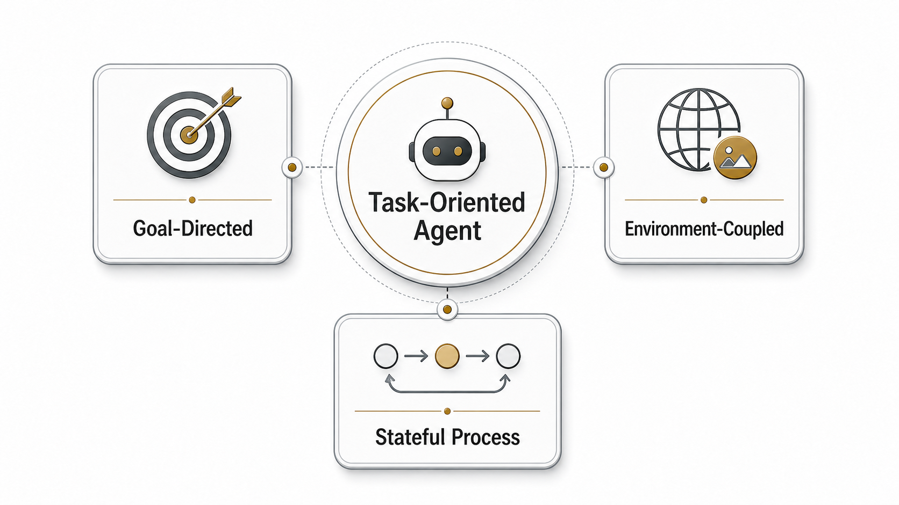

任务型 Agent 面向的是“完成一件事”，而不仅是“回答一句话”。它通常具有三个基本特征。

第一，它具有目标导向。目标描述了期望结果，例如“形成校园节能周活动方案”。Agent 需要将目标解释为可以执行的子目标，如“确定活动主题”“列出三天日程”“估算物料成本”等。

第二，它具有环境耦合。任务并不只存在于模型内部。Agent 需要读取文档、检索资料、查询日历、调用计算器或访问数据库。这些外部接触点构成了它的工具环境。Agent 的能力不只来自语言推理，也来自它能否正确选择和使用工具。

第三，它具有过程状态。任务推进时，Agent 会保留已知事实、未决问题、已完成步骤、失败尝试和下一步计划。状态使执行不再是孤立回合，而成为连续过程。对于校园节能周例子，状态中可能记录“活动面向初一年级”“预算上限为 3000 元”“已完成日程草案”“宣传文案待审校”等。

因此，任务型 Agent 可以定义为：在给定目标和约束下，通过维护上下文、选择工具、吸收观察、调整计划并更新状态，持续推进任务直至形成可验证结果的智能执行体。

### 6.2 执行循环的基本构成

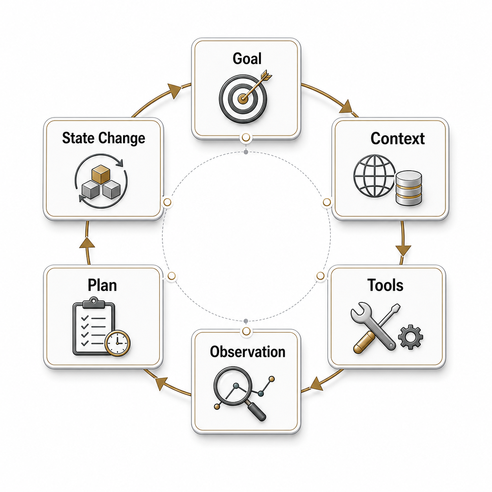

任务型 Agent 的运行通常呈现为循环结构。每一轮循环都围绕六个要素展开：目标、上下文、工具、观察、计划、状态变化。它们共同决定 Agent 在某一时刻“为什么行动、依据什么行动、能用什么行动、看到了什么、准备怎样行动、行动后发生了什么变化”。

| 要素 | 含义 | 在节能周例子中的表现 |
|---|---|---|
| 目标 | 期望达成的任务结果及评价标准 | 形成一份可用于教师讨论的活动方案 |
| 上下文 | 当前可用的信息、约束和历史记录 | 年级对象、预算上限、校历安排、已生成草案 |
| 工具 | Agent 可调用的外部能力 | 文档读取、资料检索、表格计算、格式生成 |
| 观察 | 工具或环境返回的新信息 | 检索到往年节能活动案例，预算表显示费用超限 |
| 计划 | 对后续行动的组织和排序 | 先确定主题，再排日程，最后检查预算与文案 |
| 状态变化 | 执行后对任务进度和内部记录的更新 | 标记“主题已定”，新增“预算需压缩”的待办项 |

这六个要素不是彼此孤立的模块，而是执行循环中的相互制约关系。目标决定上下文中哪些信息重要；上下文影响计划；计划选择工具；工具产生观察；观察触发状态变化；新的状态又改变下一轮计划。

### 6.3 目标：执行循环的方向

目标是任务型 Agent 的方向源。没有目标，Agent 只能进行松散的生成；有了目标，行动才有评价标准。目标通常包含三层含义：产物是什么、约束是什么、完成到什么程度算合格。

在校园节能周例子中，“写一个活动方案”只是粗略目标。Agent 需要进一步识别隐含要求：方案应适合学校场景，语言要正式，活动要可执行，预算不能超过上限，日程不能与考试冲突。目标越清晰，后续循环越稳定。

目标也可以在执行中被澄清。假设 Agent 发现校历中某一天已有运动会，它就需要把“连续三天活动”调整为“分散在一周内的三次活动”。这种调整并不是偏离目标，而是在新观察下维护目标的可达性。任务型 Agent 的目标导向并不等于机械执行原始命令，而是围绕任务意图保持合理推进。

### 6.4 上下文：执行所依赖的工作空间

上下文是 Agent 当前“知道并正在使用”的信息集合。它包括用户输入、任务历史、约束条件、工具返回结果、已生成内容以及对未决问题的记录。上下文不是资料仓库的简单堆叠，而是一个工作空间：其中的信息要服务于当前任务。

在例子中，Agent 的上下文可能包括教师给出的要求：“面向初一年级，活动持续一周，预算 3000 元以内，尽量包含学生参与环节。”还可能包括已经生成的主题候选：“低碳校园，从一度电开始”；以及工具返回的事实：“周三下午全年级有班会时间，可安排集中活动。”

上下文管理的关键是选择性。过少的上下文会导致遗忘约束，过多的上下文会稀释注意力。任务型 Agent 需要把信息组织成事实、约束、待办、风险和产物草稿，使每一轮循环都能提取行动依据。

### 6.5 工具与观察：连接外部世界

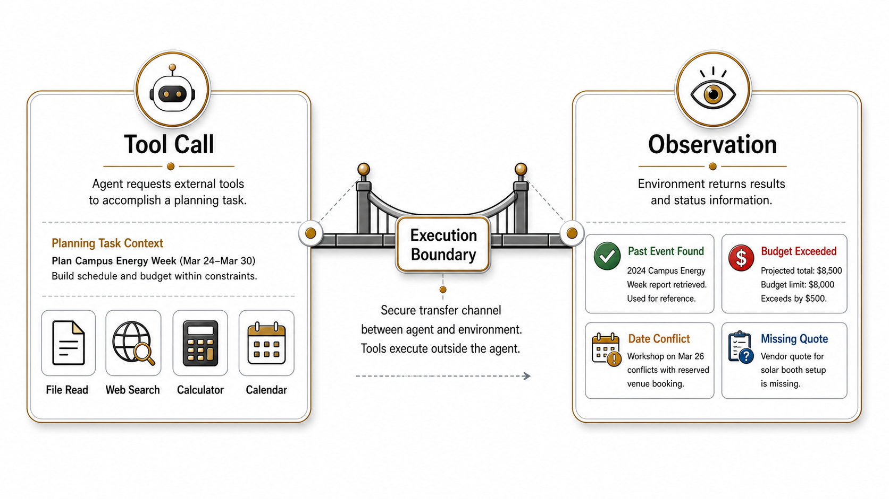

工具是任务型 Agent 扩展能力边界的方式。模型本身擅长语言理解、归纳和生成，但任务执行常常需要外部能力：读取文件、检索资料、计算成本、检查格式、访问日程表等。工具调用使 Agent 能从封闭推理走向开放环境。

工具并不直接等于结果。Agent 调用工具后获得的是观察。观察可能清晰，也可能不完整，还可能是失败信息。执行模型必须把观察纳入下一轮判断，而不是把工具调用视为天然成功。

在节能周例子中，Agent 为估算预算调用表格计算工具，得到宣传海报、奖品、展板等项目的合计费用。观察显示预算超过上限。此时合理的状态变化不是简单报错，而是新增一个调整目标：“压缩奖品费用或减少展板数量，使总额低于 3000 元。”工具提供事实，Agent 负责解释事实在任务中的意义。

### 6.6 计划：从目标到行动序列

计划是 Agent 对行动顺序的组织。它把目标分解为可执行步骤，并在步骤之间建立依赖关系。好的计划既不能过粗，也不宜过细：过粗容易迷失，过细则可能僵化。

对于校园节能周任务，一个初始计划可以是：

1. 明确活动对象、时间和预算约束。
2. 收集类似校园节能活动的常见形式。
3. 拟定活动主题和三到五个活动环节。
4. 将活动环节排入校历中的可用时段。
5. 估算物料和奖品费用。
6. 生成方案正文，并检查目标、预算和日程是否一致。

计划在执行中会变化。若资料检索发现学生参与度较高的活动通常需要班级积分机制，Agent 可以将“设计积分规则”加入计划。若预算计算显示超支，则计划需要插入“压缩成本”步骤。计划的价值不在于一开始就完美，而在于为循环提供当前最合理的行动框架。

### 6.7 状态变化：执行的可见进展

状态变化是任务型 Agent 区别于普通生成系统的重要标志。每次行动后，Agent 都应更新任务状态：哪些已完成，哪些被修改，哪些问题仍然开放，哪些风险新出现。状态变化使执行具备连续性和可追踪性。

在例子中，Agent 经过几轮循环后，状态可能从“尚未确定方案结构”变为“主题已确定，日程初稿完成，预算超支 260 元，宣传文案待生成”。这个状态不是最终文本，却是任务推进的真实记录。

状态还支持提交判断。当所有关键待办关闭，主要约束满足，产物达到目标要求时，Agent 可以进入提交阶段，输出完整方案。若仍有关键不确定性，例如活动日期需要校方确认，Agent 应在结果中标明假设条件，而不是把未确认信息伪装成事实。

### 6.8 一个完整执行片段

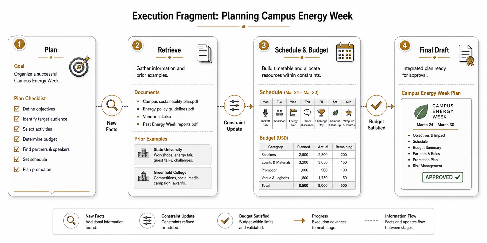

下面以简化形式展示校园节能周任务的一段执行循环。

初始目标是“生成一份校园节能周活动方案”。上下文中已有对象、预算和时间要求。Agent 制定计划：先确定主题，再安排活动，再核算预算。它调用资料检索工具，观察到常见形式包括节电打卡、旧物改造、低碳知识竞赛和班级节能积分。Agent 更新状态：新增四类候选活动，并选择其中三类进入草案。

随后，Agent 调用日程查询工具，观察到周三下午可进行年级活动，周五班会适合总结展示。状态更新为“周三安排知识竞赛，周五安排成果展示，周一至周四开展节电打卡”。接着，Agent 调用预算计算工具，观察到初始物料费用为 3260 元，超出预算。计划随即调整：减少展板数量，将部分奖品改为班级荣誉证书。再次计算后，观察显示费用为 2860 元。状态更新为“预算约束已满足”。

最后，Agent 根据当前状态生成方案正文，并进行一致性检查：目标面向初一年级，活动覆盖一周，包含学生参与环节，预算低于上限。检查通过后，任务进入提交。可以看到，最终方案并非一次生成，而是由多个循环逐步收敛而成。

### 6.9 执行模型的意义

任务型 Agent 的执行模型揭示了智能行动的基本结构：目标提供方向，上下文提供依据，工具提供外部能力，观察提供新事实，计划组织行动，状态变化保存进展。六者形成闭环，使 Agent 能够在不完全信息中持续推进任务。

这种模型也说明，任务型 Agent 的可靠性不只取决于语言表达能力。若不维护状态，就容易遗漏约束；若不解释观察，就容易机械拼接工具结果；若不调整计划，就容易在环境变化时失效。可靠执行来自循环中各要素的协调。

对 Agent CPU 体系结构而言，任务型 Agent 的执行循环可以视为更高层的控制流。它不像传统指令流那样完全预先确定，而是在语义目标和环境反馈之间动态展开。理解这种执行模型，是进一步讨论记忆、工具调度、异常恢复和结果提交机制的基础。

如果把它放在更大系统视角下，这个循环也可以被理解为一种请求级并行模型。传统 Warehouse-Scale Computer 把海量请求组织成吞吐优先、分层资源、尾延迟敏感的服务系统；Agent CPU 面向的虽然常常是单个任务，但真实运行环境往往同时承载多个任务、多个上下文、多个工具会话和多个候选路径。因此，执行模型不仅要描述单个 Agent 如何思考，也要为系统级调度留下空间：谁先获得工具槽位，谁优先占用近态内存，谁的恢复路径应该先完成，哪些候选值得继续保留。也正因为如此，任务型 Agent 的执行循环天然连接着后文的长任务记忆、提交边界和 benchmark 方法。

### 本章小结

本章介绍了任务型 Agent 的基本执行模型。任务型 Agent 是面向目标的智能执行体，它通过维护上下文、调用工具、吸收观察、调整计划和更新状态来推进任务。执行循环中的六个要素相互连接：目标决定方向，上下文承载工作信息，工具连接外部环境，观察带来反馈，计划安排行动，状态变化记录进展。通过校园节能周方案的例子可以看到，任务结果不是一次生成的静态文本，而是在多轮循环中逐步形成的可验证产物。

### 习题

1. 说明任务型 Agent 与一次性问答系统的主要区别，并举一个课堂学习场景中的例子。
2. 在“准备一次班级读书分享会”的任务中，分别写出目标、上下文、工具、观察、计划和状态变化各一项。
3. 为什么工具调用的返回结果应被看作“观察”，而不应直接等同于“任务完成”？
4. 选择一个你熟悉的复杂任务，画出至少三轮执行循环，并标明每一轮的状态变化。
5. 如果 Agent 在执行中发现原计划无法满足预算约束，它应如何调整计划？请用本章的六个要素进行分析。

---

## 第 7 章 长期任务记忆


### 7.1 上下文与记忆的分工

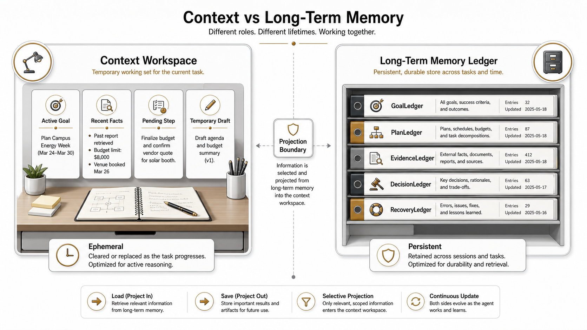

模型上下文是工作台，长期记忆是账本。工作台负责组织本轮推理所需的信息；账本负责保存可恢复、可审计、可追溯的任务状态。

这一区分对 Agent CPU 特别关键，因为长任务失败的根源，常常不是“模型不会推理”，而是系统把原本应当稳定保存的事实误当成了临时上下文的一部分。工作台上的信息天然是会被替换、压缩和重排的，它服务的是当前这一轮决策；账本中的信息则必须能够跨越多轮执行持续存在，并在需要时重新解释为什么任务会走到当前状态。因此，若系统把所有历史都当作“下一轮继续喂给模型的上下文”，它很快就会遇到两个问题：第一，信息总量会超过上下文预算；第二，系统无法区分哪些内容只是临时推理材料，哪些内容已经成为应当被继承的正式任务事实。

从体系结构语言看，模型上下文更像一次执行窗口，长期记忆则更像任务级架构态。窗口中的内容可以根据当前阶段重组，可以优先保留最近相关材料，也可以在 compact 时被大幅压缩；而架构态必须能够在中断、恢复和审计时重新被解释。Agent CPU 需要的不是“更大的上下文”，而是“更清楚的状态分层”。一旦这层分工被看清，很多后续设计选择就会自然成立，例如为什么 evidence 应当以引用形式进入 ledger，为什么 decision 需要单独成账本，为什么 recovery 不能只依赖聊天摘要，为什么 projection 必须带预算和裁剪策略。

Agent 长任务需要五类账本：

- `GoalLedger`
- `PlanLedger`
- `EvidenceLedger`
- `DecisionLedger`
- `RecoveryLedger`

以及一类投影：

- `ContextProjection`

这五类账本加上一类投影，实际上构成了长任务记忆的最小闭环。`GoalLedger` 负责回答“系统到底在为谁工作、成功标准是什么”；`PlanLedger` 负责回答“当前处在哪一阶段、哪些步骤已经完成”；`EvidenceLedger` 回答“系统为什么相信当前判断”；`DecisionLedger` 负责保存“系统做过哪些取舍、为什么放弃其他路径”；`RecoveryLedger` 则回答“如果现在中断，能从哪里安全重新开始”。`ContextProjection` 则是把这些正式状态中的一部分，按照当前预算、当前阶段和当前目标重组为下一轮模型或下一段执行流程真正可见的工作面。没有前五类，projection 就会失去依据；没有 projection，账本又无法高效进入当前执行。

### 7.2 Ledger 的含义

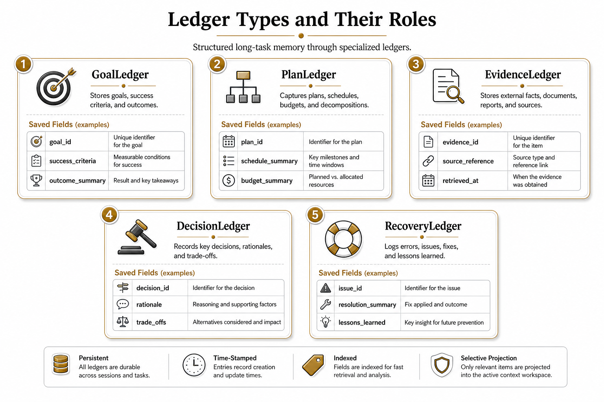

| Ledger | 保存内容 |
|---|---|
| GoalLedger | 用户目标、成功标准、禁止事项 |
| PlanLedger | 当前阶段、已完成、待完成、依赖 |
| EvidenceLedger | 文件、测试、命令、artifact、trace |
| DecisionLedger | 采用方案、拒绝方案、原因 |
| RecoveryLedger | 最近安全点、回滚依据、脏状态 |

把这些账本拆开，而不是全部混成一条“历史记录”，最大的好处是责任清楚。目标变化应落到 `GoalLedger`，而不是混在工具输出中；执行阶段切换应首先更新 `PlanLedger`，而不是靠某一条自然语言总结偷偷表达；证据是否足以支撑一次候选提交，应主要由 `EvidenceLedger` 和 `DecisionLedger` 共同解释；恢复时哪些状态还可信，则由 `RecoveryLedger` 提供最小安全锚点。只要系统把这些责任都混在一条 transcript 里，任何后续分析都会变得含糊，因为你很难判断某条文本究竟是目标声明、证据摘录、临时猜测还是已确认的决策。

`DecisionLedger` 往往是最容易被忽视、却非常关键的一类账本。许多长任务并不是简单地“找到正确答案然后继续”，而是在多个候选方向之间来回比较。系统可能尝试过一种修复方法，发现会破坏用户约束，于是放弃；也可能评估过两个 artifact 路径，保留了更可信的一条。若这些被拒绝的路径没有结构化记录，后续系统就很容易重复犯同样的错误，或者在恢复后再次沿着已证伪方向前进。`DecisionLedger` 的价值就在于，它把“不做什么”和“为什么不做”也提升为正式状态，而不是让这些信息在上下文轮转中悄悄蒸发。

`EvidenceLedger` 也不应被简单理解成“把所有证据原文存起来”。在 Agent CPU 中，真正有价值的是证据的可回指性，而不是无差别复制。很多时候，系统只需要保存一个 artifact 的引用、摘要、版本和与当前任务的关联原因，而不必把整个对象重复写入长期记忆。这样做一方面减少存储与上下文压力，另一方面也避免证据在多轮 compact 后失去原始来源。换句话说，ledger 的本质不是“多记一点”，而是“记得足够正式、足够清楚，未来还能继续被解释”。

### 7.3 Compact 事务

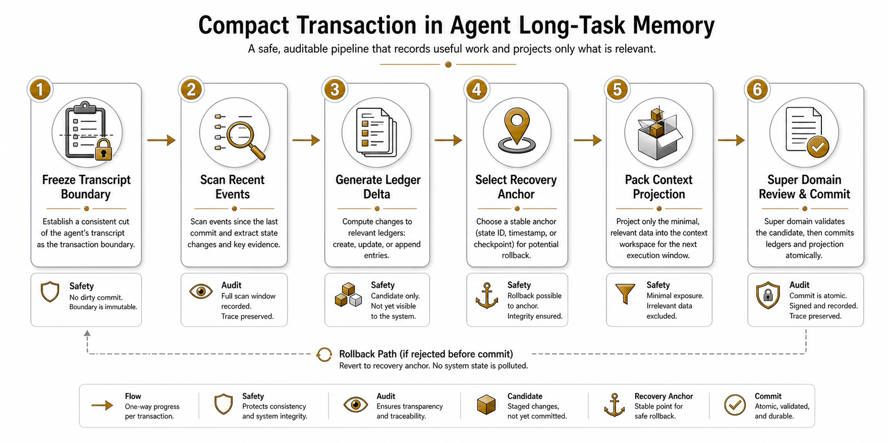

compact 是一次状态整理事务：

1. 冻结 transcript 边界。
2. 扫描 recent events。
3. 生成 ledger delta。
4. 选择 recovery anchor。
5. 打包 context projection。
6. Super Domain 审核提交。

compact 之所以必须被看成事务，而不是普通摘要动作，是因为它同时在处理三件互相关联的事情：减少热路径状态体积，形成新的长期继承状态，以及准备下一轮执行视图。只做第一件事，系统会得到一个更短但未必更可靠的上下文；只做第二件事，则会留下越来越重的记忆结构而无法高效使用；只做第三件事，又可能让 projection 脱离正式账本基础。事务化的 compact 要求系统在一个明确边界上完成冻结、抽取、筛选、锚定和投影，然后要么整体提交，要么整体放弃，避免出现“projection 更新了，但 ledger 没更新”或“ledger 已写入，但 recovery anchor 还停留在旧状态”这样的半完成情况。

步骤一中的“冻结 transcript 边界”尤其重要。很多系统把 compact 理解为后台清理动作，仿佛可以随时悄悄发生；但在长任务中，若没有清楚边界，系统就可能在一边读取最近事件、一边继续接收新工具结果，最后导致本次 compact 所依据的状态集合本身不一致。冻结边界的目的，就是明确“本次 compact 正在处理哪一段执行事实”。只有这样，后续生成的 ledger delta 和 recovery anchor 才有清楚的时间前提。

步骤三和步骤四共同决定了 compact 是否真的服务恢复。`ledger_delta_extract` 负责把最近一段执行中值得继承的部分抽离出来，但并不是所有最近事件都值得被提升为长期状态；而 `recovery_anchor_select` 则负责在这些状态中挑出一个最小而可信的回退位置。若系统只会抽取信息，却不会挑选恢复锚点，那么 compact 最多只是压缩历史；若系统只会选锚点，却没有正式 ledger delta 支撑，那么恢复点就很容易变成“看上去像摘要，实际上缺乏正式依据”的半结构对象。二者必须一起存在，compact 才算完整。

### 7.4 断点恢复

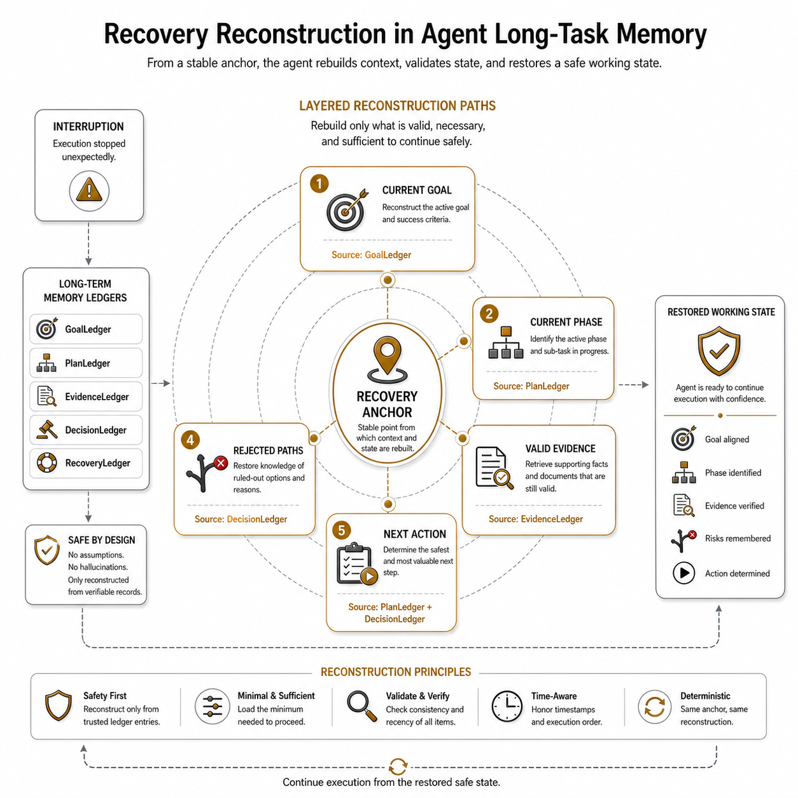

恢复过程从 ledger 重建任务状态：

- 当前目标。
- 当前阶段。
- 有效证据。
- 被拒绝路径。
- 下一步动作。

真正的恢复并不是“把上一轮摘要读给模型”，而是重新建立一套可继续推进的任务状态。系统首先需要确认当前的正式目标与约束仍然是什么，然后重新装载与当前阶段最相关的证据，再根据 `DecisionLedger` 排除已经被证明无效的候选路径，最后依据 `RecoveryLedger` 中的锚点判断哪些状态仍然可被继续信任。只有完成这几步，恢复后的系统才不是“看起来记得一些事情”，而是重新回到了一个有明确事实边界的执行位置。

恢复设计里还有一个经常被低估的问题：脏状态如何被隔离。一次失败往往不会只留下“没成功”这么简单的后果，它可能留下未提交 patch、半完成的 projection、已装载但未验证完的 artifact 预览，或者已经被证明不再可信的局部结论。`RecoveryLedger` 的职责之一，就是明确把这些状态标为脏，并在恢复过程中把它们从正式可继承状态中剥离出去。若系统做不到这一点，恢复后最危险的情况并不是“完全忘了之前做过什么”，而是“带着一部分错误前提继续往前走”。

因此，长任务恢复的质量不只取决于锚点保存得多不多，还取决于系统是否能回答三个问题：第一，哪些状态已经是事实；第二，哪些状态只是候选痕迹；第三，接下来最合理的继续动作是什么。一个成熟的恢复机制不会试图把全部历史原样复活，而会努力把正式状态、候选痕迹和未来执行方向重新分层。也正是在这一点上，长期任务记忆与普通对话记忆产生了根本差别。

### 7.5 长期记忆的工程约束

长任务记忆最终还要面对很现实的工程约束：容量有限、带宽有限、写入有代价、审计要求又不能丢。也就是说，ledger 设计不可能无限细，projection 也不可能无限大。系统必须持续决定哪些状态值得原样保存，哪些状态只保留引用，哪些状态可以安全丢进冷层归档。若没有这种层次化取舍，长期记忆会迅速膨胀成一个难以维护的历史仓库；但若取舍过于激进，又会在恢复时发现关键事实已经无法重建。

这正是为什么长期任务记忆是体系结构问题，而不是纯粹的应用策略问题。它要求存储层次、预算模型、候选提交和恢复协议一起工作。系统既要能在热路径上快速提供最近相关状态，又要能在冷层中保留足够的可审计材料；既要能压缩 transcript，又要避免把目标、约束和关键决策一起压没。长期记忆设计真正难的地方，从来不是“多存一点”，而是“在有限资源里把未来最需要继承的那部分状态保存成正式结构”。

### 本章习题

1. 为什么 `DecisionLedger` 对长任务很重要？
2. 给出一个 compact 失败但不污染 ledger 的处理流程。
3. 设计一个 recovery anchor 的最小字段。

---

## 第 8 章 安全与权限


### 8.1 Agent 生成代码的安全边界

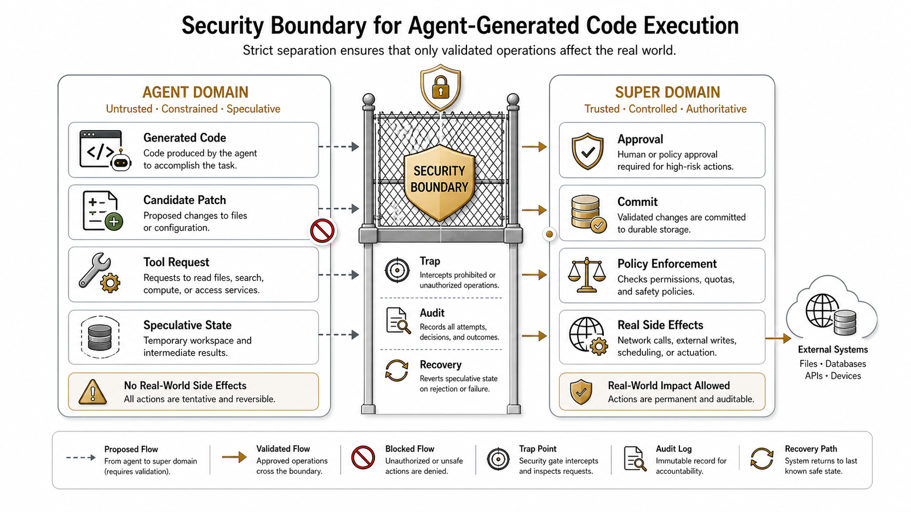

Agent 生成代码具有明确的安全边界。系统通过 capability、预算、trace 和审核提交，把生成代码限制在可观察、可解释、可恢复的执行范围内。

从传统体系结构角度看，安全边界并不是后加的管理规则，而是执行模型本身的一部分。虚拟内存和虚拟机之所以重要，不只是因为它们提供了更大的地址空间，而是因为它们把隔离、保护和受控共享做成了体系结构语义。Agent CPU 中的 Super Domain 与 Agent Domain 也应这样理解：Agent 并不是在一个无限自由的环境里行动，而是在一组被授权、可陷入、可审计的边界内试探性推进任务。

### 8.2 Capability

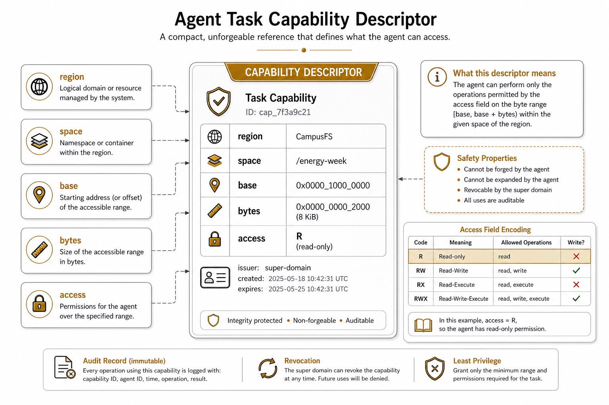

Capability 定义 task 能访问什么：

```json
{
  "region": "artifact_previews",
  "space": "host",
  "base": 2048,
  "bytes": 1024,
  "access": "read"
}
```

如果把 capability 放到经典保护机制的坐标里看，它相当于一种更高层的受控地址描述。传统页表用页、权限位和特权级描述“某个地址能否被某段代码访问”；Agent CPU 则需要描述“某个任务能否访问某类 artifact、某段记忆、某个工具或某类副作用”。这说明 capability 不是普通配置项，而是 Agent 执行边界的硬件化、结构化表达。

Capability 的关键不只是列出“允许什么”，还要明确“不允许什么”。在普通软件系统里，很多组件往往默认运行在过宽的权限下，直到出了问题才通过约定去补救；但 Agent CPU 的任务对象天然更加开放，若没有清楚的 capability 边界，系统就很容易在生成过程中顺手访问本不该访问的文件、调用本不该调用的外部工具，或者把应停留在候选区的结果直接推进到正式世界状态。因此，Capability 的第一作用其实是缩小默认权力范围，让 Agent Domain 从一开始就只能在被授权的最小边界内行动。

更进一步地说，Capability 还承担一种教学上的澄清作用。它迫使设计者把模糊的任务需求翻译成明确的资源访问意图。比如“帮我修这个 bug”在自然语言层面很宽泛，但一旦进入任务结构，就需要回答：它到底能读哪些源文件快照、能否读取测试日志、能否生成候选 patch、能否触发正式写回、能否访问网络搜索额外资料。把这些问题写成 capability，本质上是在把原本隐含在任务描述中的自由度压缩成可检查的执行边界。也正因为如此，Capability 不是附属配置，而是任务从自然语言走向机器可治理对象的关键中介。

### 8.3 长期记忆的受控访问

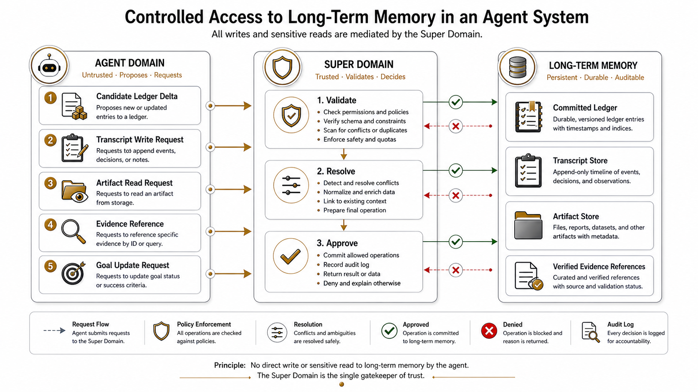

长期记忆采用受控访问规则。Agent Domain 产生候选状态，Super Domain 负责审核和提交。典型边界包括：

- ledger 更新通过候选 delta 表达。
- transcript 写入由 Super Domain 统一提交。
- artifact 正文读取经过 capability 授权。
- evidence ref 由系统校验可解析性。
- 用户目标变更保留明确来源和审核记录。

这种分层访问方式与虚拟机监控器保护宿主状态的思想相通。客户机操作系统可以运行得很自由，但对关键页表、设备和宿主资源的触达必须经过更高层边界；同理，Agent Domain 可以生成规划、代码和候选修改，但对长期记忆、外部系统和最终可见副作用的访问必须经过 Super Domain 的结构化审查。这样做的目的不是压制生成能力，而是让长期记忆成为可共享、可追责、可恢复的公共状态，而不是一次对话中随意改写的私有缓存。

长期记忆之所以必须受控，还因为它天然会跨轮次、跨阶段甚至跨执行体共享。一段错误写入如果发生在普通短期上下文里，也许只会污染当前回合；但若它进入了正式 ledger，就可能在后续许多轮任务中被反复继承。由此可见，长期记忆的写权限必须比短期工作台更严格。系统可以容忍在候选空间里存在多种探索和中间结论，却不能容忍它们无门槛地进入正式继承状态。对 Agent CPU 来说，保护长期记忆并不是保守主义，而是在保护未来所有恢复与决策的共同前提。

这也解释了为什么长期记忆访问不能只靠“谁调用了哪个函数”来控制，而必须上升到结构边界。一个成熟的系统应当知道某次 ledger delta 来自哪个 task、基于哪个版本、涉及哪些证据引用、是否经过审核，以及如果现在拒绝它会影响哪些后续候选状态。只有当这些信息被持续保留，长期记忆才不是一堆任意追加的笔记，而是一套真正的正式状态系统。

### 8.4 Trace

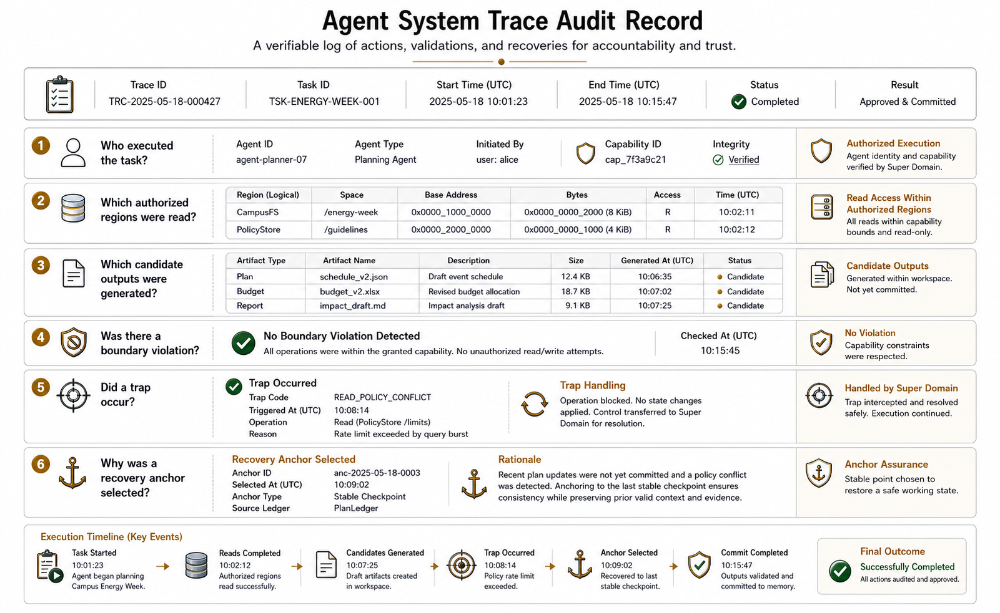

Trace 必须回答：

- 谁执行了任务？
- 读了哪些授权区域？
- 生成了哪些候选输出？
- 是否越界？
- 是否发生 trap？
- 为什么选择某个 recovery anchor？

因此，trace 在安全章节里不应被理解成普通日志，而应被视为保护机制的一部分。没有 trace，trap 就很难解释；没有可回指的 trace，长期记忆写入就很难审计；没有结构化 trace，恢复与复盘就只能依赖自然语言摘要。后文把 trace 作为恢复材料和 benchmark 指标，实际上正是在延续这一点。

Trace 还必须有边界，因为“什么都记”并不自动等于“更安全”。若 trace 过于随意地复制正文内容、上下文原文和中间候选，系统会迅速面临存储膨胀、信息泄漏和审计噪声问题。对 Agent CPU 来说，更合理的做法是让 trace 优先保存结构化事实：谁在什么阶段做了什么访问、依据什么 capability、产生了什么候选结果、是否触发 trap、对应哪个 recovery anchor。这样一来，trace 既足够解释系统行为，又不会退化成另一份失控的长上下文。

从保护角度看，trace 最有价值的地方还在于它能把“被拒绝的动作”也保存下来。很多安全事故并不来自一次真正生效的越权访问，而来自系统长期在模糊边界上反复试探。只记录成功路径，会让平台低估这些边缘行为的风险；记录被拒绝的访问、被拦截的候选写入和被判无效的证据引用，才能让设计者看到系统真正在哪些边界附近反复挣扎。也正因为如此，trace 是保护设计的反馈回路，而不是保护之后顺手生成的副产品。

### 8.5 安全边界的体系结构意义

把安全与权限单独成章，不是为了重复传统安全教材，而是为了说明：对 Agent CPU 来说，安全边界就是执行模型的一部分。一个没有明确 capability、没有双域隔离、没有结构化 trap、没有可回指 trace 的 Agent 系统，即使短期演示表现不错，也很难被称为一种成熟体系结构。因为它既无法稳定约束副作用，也无法解释失败，更无法在长任务环境里保护正式状态不被候选行为污染。

因此，安全边界不是附加规则，而是 Agent CPU 的结构骨架之一。只要这个骨架清楚，系统就能鼓励更健康的任务表达方式，例如先生成候选，再审阅提交；先保留证据引用，再写入正式 ledger；先通过 trap 暴露失败，再决定是否恢复。最终，一个真正可用的 Agent CPU，不会把安全看成限制创造力的外壳，而会把它看成让开放式执行能够长期稳定存在的前提。

从工程实现上看，这个骨架还需要两条默认原则配合。第一条是“最小权限默认”。也就是说，任何新 task 在没有明确声明前，都不应自动继承宽泛的文件、网络、工具或长期记忆访问能力，而应从一个尽量窄的 capability 起步，再按任务需要显式扩大。这样做虽然会增加准入设计的工作量，却能显著降低开放式生成带来的偶发越界风险。第二条是“失败优先显式化”。当系统发现预算不足、权限不足、证据不可解析或目标约束互相冲突时，优先产出结构化 trap，而不是让任务在含混状态里继续执行。因为对长任务系统来说，最危险的从来不是一次明确失败，而是一次没有被清楚标记的带病前进。只有把最小权限和显式 trap 结合起来，安全边界才真正从抽象原则落成可执行的体系结构纪律。

### 本章习题

1. 为什么 trace 本身也需要预算？
2. 什么情况下应拒绝 ledger delta？
3. 如何防止 Agent 把用户禁止事项从 projection 中删掉？

---

# 第四篇：传统体系结构映射

## 第 9 章 从 ISA 到 APU-IR


### 9.1 ISA 作为软硬件契约

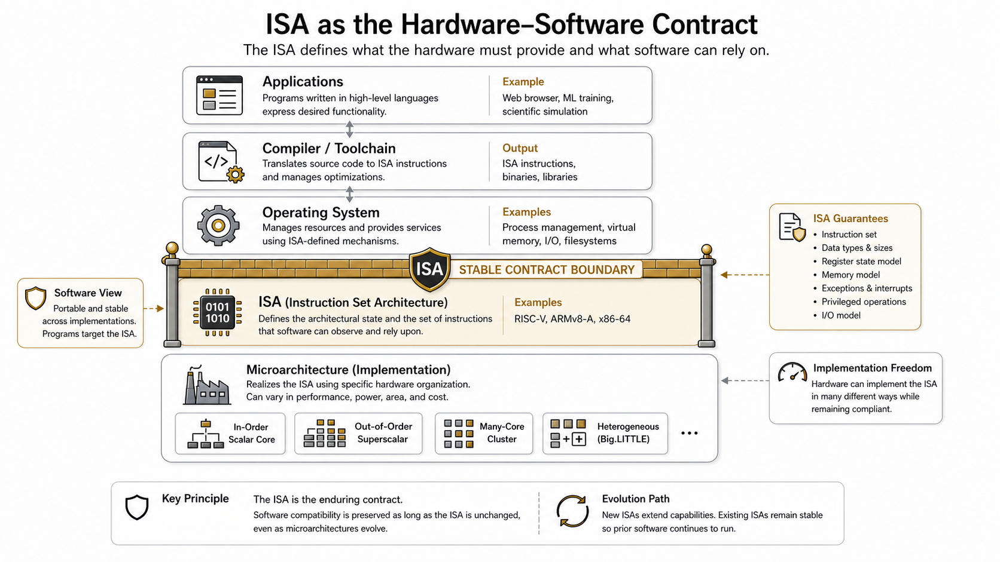

传统计算机体系结构中，ISA 是软件与硬件之间最重要的边界。编译器、操作系统和应用程序面对的是指令、寄存器、异常、内存模型和特权级；微架构则可以在这个边界之下自由选择流水线、乱序执行、缓存层次和预测机制。只要 ISA 语义不变，同一二进制程序就可以在不同实现上运行。

RISC-V 的启发尤其清楚：一个好的 ISA 不只是指令表，而是一套可扩展、可验证、可教学的公共契约。基础整数指令集保持小而稳定，乘除法、原子操作、向量、压缩指令和自定义扩展则按需要组合。它把“什么必须稳定”和“什么可以扩展”分开，使学术原型、嵌入式小核和复杂 SoC 可以共享同一套思想。

Agent CPU 也需要类似契约，但契约边界发生了上移。Agent 生成的逻辑通常围绕一次目标、一次工具调用批次或一次上下文投影形成短生命周期任务。此时，硬件真正需要理解的是：这个任务要访问哪些证据，能使用哪些 capability，预算是多少，输出会写到哪里，失败后如何解释。

ISA 之所以能长期稳定存在，并不是因为它描述了所有实现细节，恰恰相反，是因为它把真正需要稳定的那部分语义提炼出来了。寄存器名字、异常行为、内存可见性、调用约定这些内容一旦确定，软件就可以放心围绕它们构建；至于底下到底是五级流水还是二十级流水、是否乱序、是否配大缓存，则属于实现自由。Agent CPU 借鉴这一点时，最关键的不是照搬“指令”这个形式，而是继承“稳定边界与实现自由分离”的原则。对 Agent 系统而言，真正需要稳定的已经不再只是加减乘除和 load/store，而是任务意图、证据边界、预算约束、候选输出位置以及恢复语义。如果这些内容没有被提升为正式契约，那么每个 runtime、每个实验平台、每个硬件原型都会各自发明一套临时约定，最终导致模型、系统软件和加速单元彼此难以互通。

### 9.2 APU-IR 承载高层任务语义

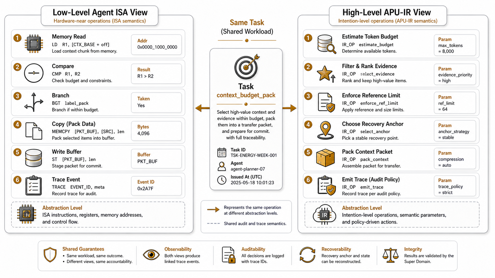

可以把 Agent ISA 理解为 Agent Domain 中的低层执行语义：访存、拷贝、比较、分支、barrier、flush、trace event 等。它仍然重要，因为最终执行必须落到确定的机器步骤上。但是，如果只定义低层 ISA，就会丢失 Agent workload 最有价值的高层信息。

例如，一个 `context_budget_pack` 任务在低层看可能只是读取 ledger、筛选引用、拼接文本、写入缓冲区；在高层看，它其实是在给下一轮模型推理构造上下文投影。后者天然包含 token budget、证据优先级、引用上限、恢复点和 trace 策略。如果这些信息只藏在指令序列里，Super Domain 就很难在准入阶段判断任务是否越权、是否超预算、是否会破坏已提交 ledger。

因此，Agent CPU 需要两层契约：低层 Agent ISA 保证执行可落地，高层 APU-IR 保证任务可验证、可调度、可恢复。

### 9.3 APU-IR 的位置

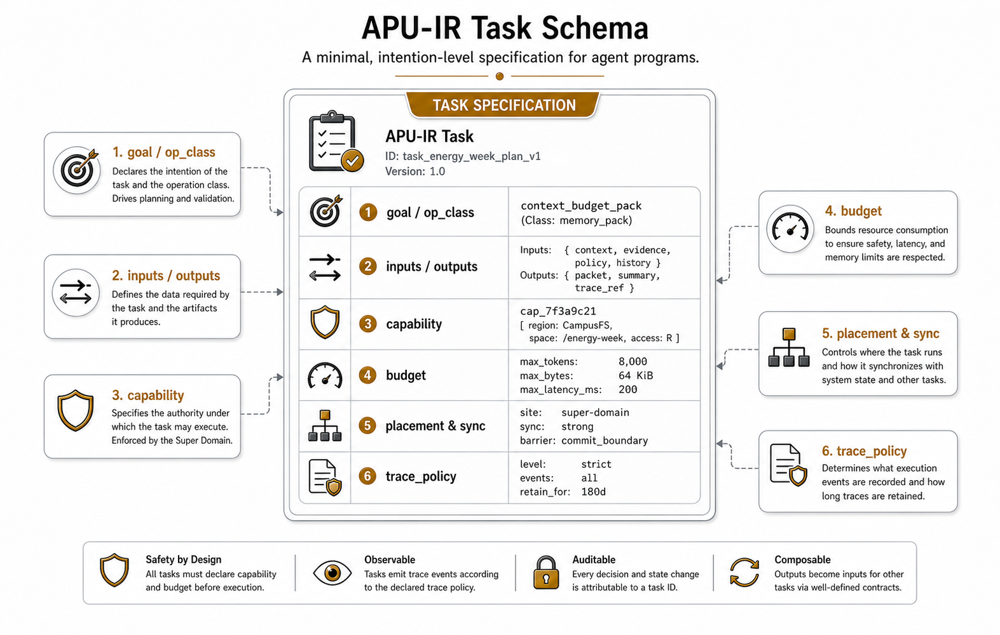

APU-IR 是 Agent Runtime 与 Agent Domain 之间的任务图中间表示。它用结构化字段表达任务意图、输入输出、权限、预算、放置和 trace 策略，是进入硬件或模拟器前的可检查对象。

一个最小 APU-IR task 应描述：

- `goal` 或 `op_class`：任务意图，例如扫描、打包、抽取、选择恢复点。
- `inputs` 与 `outputs`：输入证据、memory region、artifact preview 或 trace window。
- `capability`：任务可读、可写、可执行、可追加的资源边界。
- `budget`：cycles、SPM bytes、cluster bytes、token budget、trace bytes 等。
- `placement` 与同步：运行在哪个 cluster/core，依赖哪些 barrier。
- `trace_policy`：哪些事件必须记录，哪些可以摘要化。

在这个模型中，Agent Task 是带有权限、预算、证据和审计要求的状态变换。Super Domain 负责 admission：检查格式、capability、预算和依赖；Agent Domain 负责执行：按照降低后的 Agent ISA 或硬件单元完成任务，并在 trap 或完成时返回结构化结果。

因此，APU-IR 的位置既不是“自然语言提示词的另一种写法”，也不是“底层微操作序列的花哨名字”。它处在一个更关键的中间层：上面连接开放、模糊、富语义的任务描述，下面连接必须确定、可检查、可回放的执行系统。进入 APU-IR 之前，很多任务意图仍然带有自然语言中的弹性，比如“尽量节省上下文”“优先保留可信证据”“不要破坏已有结果”；一旦进入 APU-IR，这些要求就必须落成字段、预算、依赖和策略，否则系统无法判断某个 task 是否合规、是否值得调度、是否可以在失败后恢复。也正因为如此，APU-IR 同时还是研究接口、运行时接口和硬件接口：研究者可以在这里定义新 `op_class`，运行时可以在这里做 admission 与调度，硬件实现则可以围绕稳定字段设计缓存、队列和加速路径。

### 9.4 从 RISC-V 扩展思想到 APU-IR 扩展

RISC-V 通过标准扩展和自定义扩展解决“基础稳定、能力增长”的矛盾。APU-IR 也应采用类似思路。基础 task schema 必须稳定，例如 task id、capability、budget、memory region、trace 字段；高层 `op_class` 则可以持续扩展，例如：

- `ledger_delta_extract`：从执行结果中抽取可提交状态变化。
- `context_budget_pack`：在 token 或 byte 预算内生成上下文投影。
- `recovery_anchor_select`：从 trace 与 ledger 中选择恢复点。
- `artifact_preview_pack`：为模型构造受限 artifact 预览。
- `memory_header_scan`：快速扫描文件、对象或缓冲区头部。

这些高层操作未来可以降低为不同实现：软件 runtime、Agent ISA 指令序列、DMA 加速路径、专用硬件单元，甚至 RISC-V 自定义协处理器接口。设计顺序是先稳定任务语义，再逐步选择二进制编码、硬件流水线和加速路径。

| 传统体系结构概念 | Agent CPU 对应概念 | 设计关注点 |
|---|---|---|
| ISA | Agent ISA 与 APU-IR | 低层执行语义与高层任务契约分离 |
| ABI | Task schema | Runtime、模拟器、硬件之间交换任务对象 |
| 特权级 | Super Domain / Agent Domain | 准入、隔离、trap 和资源回收 |
| 地址空间 | capability-bounded memory region | 访问权由任务显式声明并被检查 |
| 性能计数器 | budget 与 trace | 资源消耗可解释，失败点可定位 |
| 异常 | task trap | 返回 task、pc、capability、reason 和证据引用 |

### 9.5 预算、权限与 trace 的共同语义

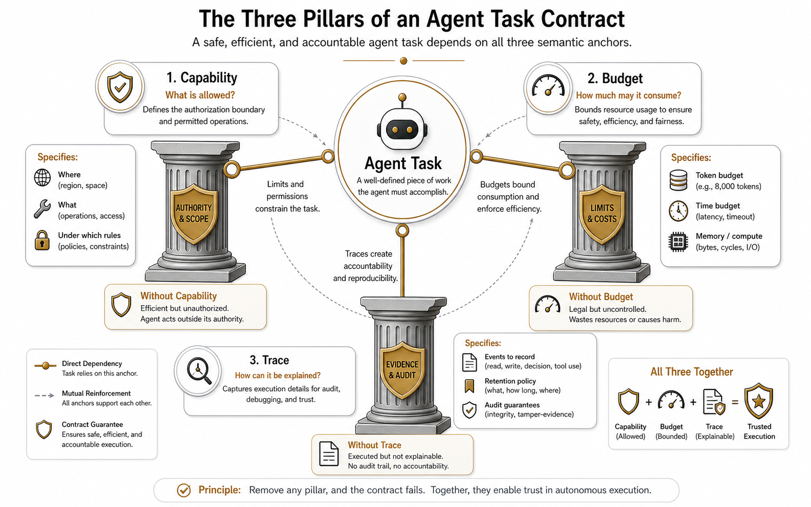

在传统 CPU 中，权限主要围绕地址空间和特权指令；性能主要由计数器事后观察；调试依赖断点、异常和日志。Agent CPU 则应把三者前置到任务契约中。

`capability` 回答“允许做什么”。它可以限制某个 task 只能读取 ledger 摘要、只能向候选输出区追加、不能覆盖已提交 artifact。`budget` 回答“最多消耗多少”。它不仅包括 cycles 和内存，也包括 token、引用数量、trace 字节数。`trace` 回答“如何解释发生了什么”。一次高质量输出应当能够回指证据和执行路径。

三者必须同时出现。只有 capability 没有 budget，任务可能合法但失控；只有 budget 没有 capability，任务可能高效地越权；只有二者没有 trace，任务失败后无法恢复，也无法教学、调试或审计。

更深一层地看，`capability`、`budget` 和 `trace` 并不是三张彼此独立的检查表，而是同一个任务契约的三个投影。`capability` 定义任务的合法边界，`budget` 定义任务在合法边界内可消耗的资源上限，`trace` 则定义系统如何证明该任务确实在既定边界和预算内运行。三者一旦脱钩，系统语义就会开始漂移。例如，一个 task 也许在 capability 上被允许读取某类 artifact，但若没有对应的 trace 记录，外部就无法判断它是否真的只读了授权部分；又或者一个 task 虽然预算设置合理，但 capability 过宽，它仍可能在有限时间里做出高后果的越权动作。因此，Agent CPU 的任务契约不是“先给权限，再配预算，最后顺便记日志”，而是从准入开始就同时考虑合法性、资源性和可解释性。只有这样，APU-IR 才真正承担起类似传统 ISA 的公共边界作用。

### 本章习题

1. 解释为什么 RISC-V 的开放扩展思想适合启发 APU-IR，但 RISC-V 小核本身不能直接等同于 Agent Core。
2. 为 `recovery_anchor_select` 设计一个最小 APU-IR task，至少包含 capability、budget、输入、输出和 trace_policy。
3. 某 task 有合法 capability，但缺少 token budget。它应该在准入阶段被拒绝，还是运行时 trap？说明理由。
4. 对比传统 ISA 异常和 Agent task trap：为什么后者需要同时记录 task id、pc、reason、capability 和 evidence ref？

---

## 第 10 章 从 Cache 到 Ledger-Aware Memory


### 10.1 从传统 Cache 出发

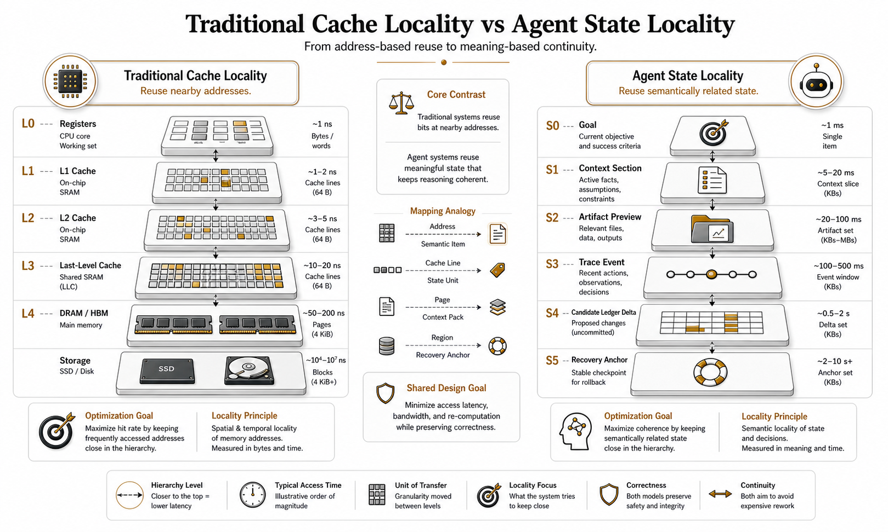

传统计算机体系结构把内存层次建立在一个基本假设上：程序的访存局部性可以由硬件在运行时捕捉。寄存器、L1/L2 Cache、LLC、DRAM/HBM、外存构成了从近到远的容量与延迟梯度。Cache 通过 tag、替换、预取和一致性协议，尽量让程序觉得自己面对的是一片连续而快速的内存。

这个模型对长期运行的人类软件很有效，因为循环、数组、栈帧、对象布局具有稳定模式。Agentic workload 的热路径呈现另一种局部性：Agent 任务常常在短生命周期内完成一次读取、归纳、生成、验证和提交；它访问的对象包括 goal、context section、artifact preview、trace event、candidate ledger delta 和 recovery anchor。硬件在 cache line 层面捕捉空间局部性的同时，也可以利用这些对象的任务语义。

因此，Agent CPU 的内存系统同时关心地址访问历史和任务语义角色。传统 cache hierarchy 试图缩短“处理器看到数据”的时间；Ledger-Aware Memory 还要缩短“任务看到正确状态”的时间。这一转变意味着，体系结构开始把投影、可见性和恢复依赖本身纳入内存设计。

### 10.2 从容量层次到语义层次

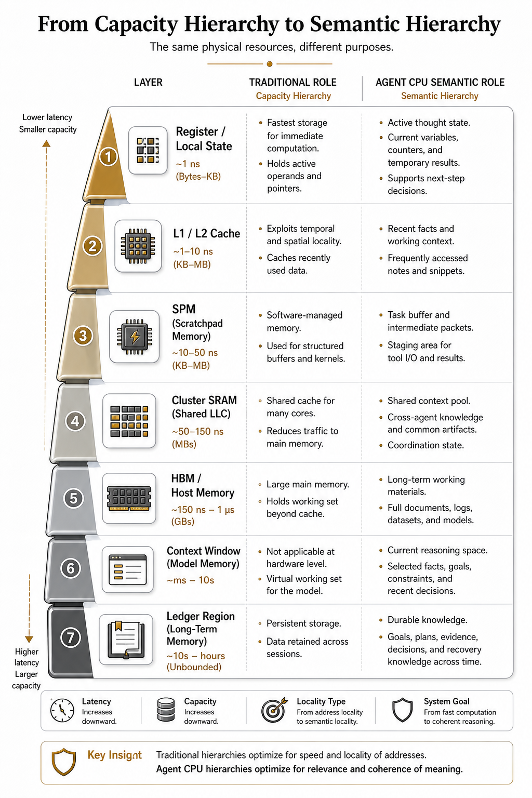

Agent CPU 仍然需要传统内存层次。控制面代码、运行时队列、普通数据结构仍可受益于 Cache；大模型外部状态也仍需要 HBM 或主存提供容量。但在 Agent 执行面，内存层次要叠加一层语义分类。

| 层级 | 传统用途 | Agent CPU 中的语义 |
|---|---|---|
| Register / local state | 指令近端操作数 | 当前 task 的短暂控制状态 |
| L1/L2 Cache | 自动缓存热点数据 | 服务控制面与少量不可显式管理热路径 |
| SPM | 软件管理片上存储 | 当前 context 分片、临时表、局部工作集 |
| Cluster SRAM | cluster 内共享缓存 | 多 Agent 阶段共享、producer/consumer 中间态 |
| HBM / Host Memory | 大容量数据 | transcript、artifact、ledger、trace 的容量层 |
| Context Window | Agent 语义层 | 模型可见投影，由长期记忆生成 |
| Ledger Region | 无传统对应物 | 已提交事实、证据引用和可恢复状态 |

这里最关键的转变是：context window 是一次推理前对长期记忆的投影。它可以被重排、压缩、摘要、裁剪；只要投影过程可追溯，系统状态就可以由 ledger、artifact、trace 和恢复锚点共同承载。

若再进一步借用大规模系统的视角，Agent CPU 还需要把“远近”理解成跨层级的状态驻留关系：近态适合当前循环直接消费，局部态适合同一 cluster 内复用，远态适合低频但高价值回查，归档态则用于审计和长期恢复。这样，容量层次就不再只是“哪一层更大”，而是“哪一层更适合哪一种状态语义与时延需求”。

### 10.3 SPM、Cluster SRAM 与显式 DMA

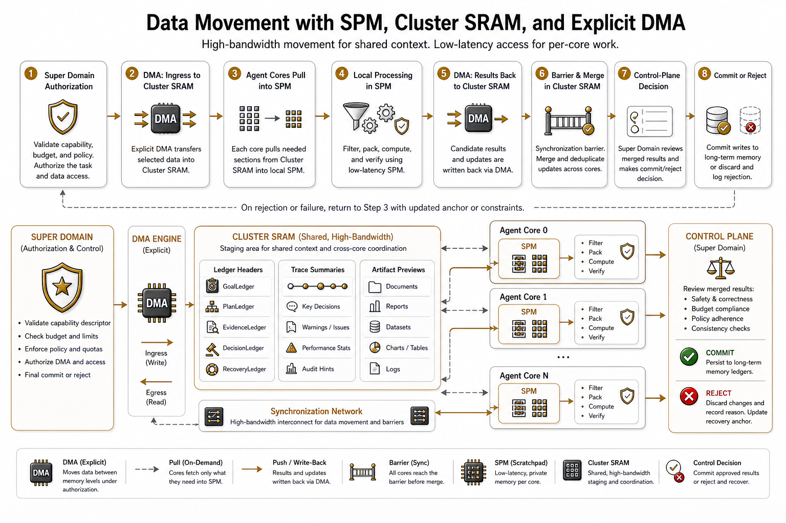

传统 Cache 的优点是透明，缺点也是透明。它让程序员和编译器不必说明数据移动，却也让运行时难以判断带宽究竟被谁消耗。Agent CPU 更适合采用显式本地内存：每个 Agent 核拥有 SPM，cluster 内共享 Cluster SRAM，远端容量层由 HBM 或 host memory 提供。

典型流程如下：

1. Super Domain 授权任务可读取的 ledger 区段、artifact 预览区和输出区域。
2. Agent Domain 用 DMA 把 ledger header、相关 trace 摘要和 artifact preview 搬入 Cluster SRAM。
3. 每个 Agent 核把自己需要的 context section 或候选表搬入 SPM。
4. 任务在 SPM 中完成筛选、打包、验证或 delta 生成。
5. 候选结果写回 Cluster SRAM，经 barrier 汇合后，由控制面提交或拒绝。

显式 DMA 的价值不只是性能。它让数据移动成为可审计事件：搬了多少字节，从哪个命名空间到哪个命名空间，为哪个 task 服务，是否越过 capability 边界。这些信息可以进入 trace，进而成为 benchmark、调试和安全策略的一部分。

### 10.4 Ledger-Aware Memory 的基本概念

Ledger-aware memory 指内存系统知道某些区域具有账本语义。账本语义至少包含四点。

第一，写入与提交分层。Agent 生成 candidate ledger delta，Super Domain 经过权限、证据、预算和一致性检查后提交到 ledger。

第二，读取保留 provenance。一个 context projection 引用某段事实时，应能追溯到 ledger entry、artifact preview 或 trace summary。

第三，替换策略应考虑语义热度。传统 LRU 关心最近访问；ledger-aware memory 还应关心任务图依赖、恢复锚点距离、证据复用频率和审计优先级。

第四，可见性应显式化。flush、invalidate、fence 不只是缓存一致性操作，也可以表达“某个候选状态已经对下一阶段可见”或“某个 projection 已失效，需要重新从 ledger 打包”。

从传统 cache 到 ledger-aware memory 的真正变化，不是多了一个新名字，而是可见性规则从“哪条缓存线对哪个核心可见”扩展成“哪类任务事实何时对哪个执行阶段可见”。这也是为什么 ledger 区域更接近体系结构中的提交状态，而不是普通对象缓存：它承载的是系统愿意为之负责的历史。

### 10.5 Artifact Preview 与 Trace

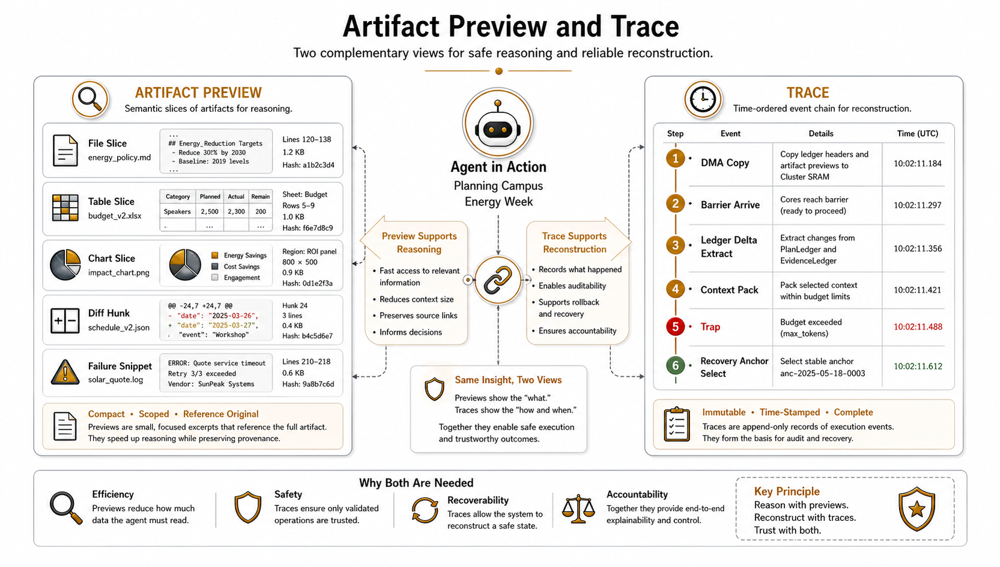

Agent 经常使用 artifact preview：文件摘要、表格 schema、图像描述、测试失败片段、代码 diff 的关键 hunks。Artifact preview 类似传统体系结构中的 cache line，但它的切分单位由语义决定。一个好的 preview 应当小到能放入 context window，大到足以支持推理判断，并且能回指原始 artifact。

Trace 则是内存系统的时间维度。传统内存层次主要保存“现在有什么”；Agent CPU 还保存“状态如何变成现在这样”。DMA copy、barrier arrive、ledger delta extract、context_budget_pack、trap、recovery anchor select 都应成为结构化 trace event。这样，当任务失败或输出可疑时，系统可以从 trace 重建路径。

### 本章习题

1. 为什么 context window 适合作为长期记忆的投影？请结合 ledger 和 artifact preview 说明。
2. 比较传统 Cache line 与 artifact preview：二者的切分依据、替换策略和正确性责任有什么不同？
3. 设计一个 `ledger_delta_extract` 任务的数据移动流程，要求显式使用 SPM、Cluster SRAM、HBM 和 DMA。
4. 如果一个系统只记录最终 ledger，不记录 trace，会给调试、审计和恢复带来哪些问题？
5. 选择三个指标，用来评价 ledger-aware memory 是否优于只依赖传统 Cache 的实现。

---

## 第 11 章 从 ROB Commit 到 Candidate Commit


### 11.1 为什么从提交机制开始

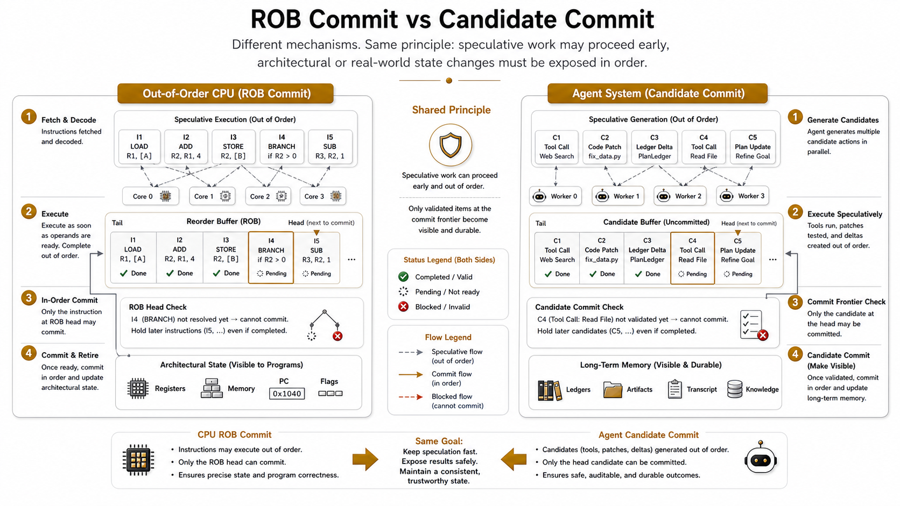

在乱序 CPU 中，指令可以乱序执行，却必须表现得像顺序执行。这一矛盾由 ROB 承担：前端按程序顺序分配 ROB 项，后端允许指令乱序发射、执行和写回，但最终只有当最老指令完成且没有异常时，机器状态才按顺序提交。体系结构状态因此保持清晰：寄存器和内存看见的是一条严格顺序的历史，而不是执行单元内部的混乱过程。

Agent CPU 面临相似但更宽的问题。Agent 可以并行搜索、调用工具、生成代码、试运行补丁、构造 ledger delta，也可以在不同候选路径之间切换。但用户真正关心的不是“中间想过什么”，而是哪些状态被正式写入：ledger 是否更新，文件是否改变，patch 是否进入工作区，外部工具是否产生真实副作用。因此，Agent CPU 也需要一个提交边界。这个边界不是传统 ROB 的 register commit，而是 Candidate Commit。

这也是为什么 Candidate Commit 不应被理解为“给聊天机器人多加一个审批步骤”，而应被理解为 Agent CPU 的核心体系结构不变量之一。只要系统允许乐观生成、并行探索和预测路径，它就必须提供一个把“执行完成”和“对外生效”严格分离的结构，否则恢复、审计与安全都将无从谈起。

### 11.2 ROB 提交的三条经验

传统 ROB 给 Agent CPU 至少留下三条经验。

第一，执行与提交必须分离。乱序执行提升吞吐，但不等于乱序暴露结果。类似地，Agent Domain 可以高速生成候选物，但不能直接改变真实世界。候选 patch、candidate ledger delta、artifact preview 和工具输出都应先进入候选区。

第二，提交必须有全局顺序。CPU 用 ROB head 决定哪条指令先提交，避免 younger instruction 越过 older instruction 破坏精确状态。Agent CPU 中，一个任务的多个候选更新也要有顺序：先确认 goal、约束和 evidence，再提交 ledger delta；先审核 patch 的 base 和权限，再落盘；先记录 recovery anchor，再允许外部副作用。

第三，异常必须精确。所谓精确异常，是异常发生时，异常之前的指令都已提交，异常之后的指令都没有提交。Agent CPU 的对应目标是精确任务异常：一旦权限、证据、测试或用户约束检查失败，系统应能说明哪些 ledger 已提交，哪些只是候选，哪些 patch 尚未生效，并能回退到 last safe point。

如果把这三条经验提炼成一句话，那就是：系统可以积极地产生中间结果，但必须保守地暴露最终副作用。传统乱序处理器靠这一原则同时获得吞吐和正确性；Agent CPU 若想同时获得探索能力、可恢复性与安全性，也必须依赖同样的分层。

### 11.3 从 ROB 项到 Candidate 项

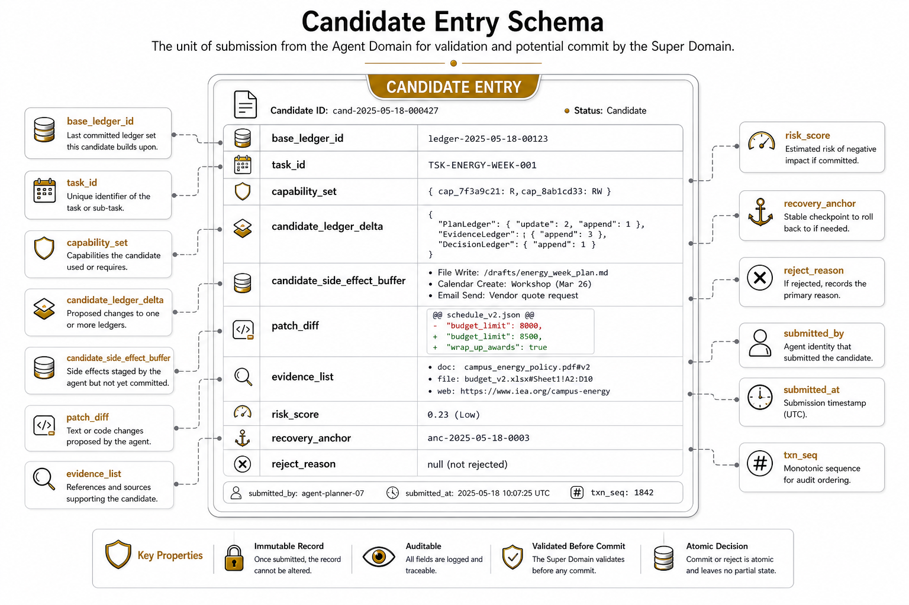

ROB 项记录目的寄存器、完成位、异常位和结果位置。Candidate Commit 也需要显式记录，但对象变成任务状态和副作用意图。

| 乱序 CPU 机制 | Agent CPU 对应机制 | 关键语义 |
|---|---|---|
| ROB entry | candidate entry | 保存一次候选更新的身份、依赖、结果和审核状态 |
| ready bit | evidence ready | 表示候选结果、测试证据、权限说明已经收齐 |
| exception bit | trap / reject reason | 标记权限失败、证据不足、patch 冲突或预算超限 |
| commit head | candidate commit pointer | 只从可提交边界向前推进 |
| architectural state | committed ledger / workspace | 只有提交后才成为对外可见状态 |
| flush | discard candidates | 丢弃未提交候选，并从 recovery anchor 重启 |

一个 candidate entry 至少应包含：base ledger id、task id、capability set、candidate ledger delta、candidate-only side effect buffer、patch diff、evidence list、risk score、recovery anchor 和 reject reason。它不是简单日志，而是 Super Domain 可以审核的结构化提交单元。

### 11.4 Candidate-Only Side Effect

Agent CPU 的重要原则是：Agent Domain 只能产生 candidate-only side effect。也就是说，它可以“描述想要发生的副作用”，但不能直接让副作用发生。

例如，Agent 生成补丁时，不应直接改写源文件，而是写入 candidate patch buffer。它运行测试时，可以生成测试命令、stdout 摘要、失败定位和资源消耗记录，但真实文件写入、网络访问、发布包、提交 Git 分支等动作必须由 Super Domain 审核后执行。这样做不是为了降低 Agent 的能力，而是为了让能力有可恢复、可解释、可度量的边界。

candidate-only side effect 的核心价值在于把“意图”和“生效”拆开。意图阶段允许推测、并行和失败；生效阶段要求权限、顺序和证据。传统 CPU 把 store buffer 中的写操作延迟到安全时刻对内存可见，Agent CPU 则把外部副作用延迟到 Super Domain 确认 candidate 可以提交。

### 11.5 Super Domain 审核与顺序提交

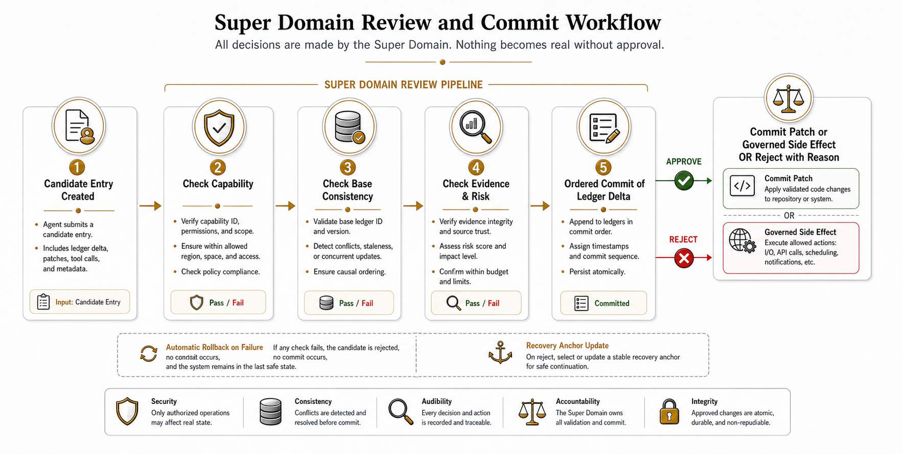

Candidate Commit 的提交者不是 Agent Domain，而是 Super Domain。它类似 ROB 的 commit logic，但审核对象更丰富。

一个典型提交流程如下：

1. Agent Domain 产生 candidate entry，包括 ledger delta、patch diff、evidence 和 recovery anchor。
2. Super Domain 检查 capability：候选是否试图越权读写、越过 candidate-only 边界或访问未授权资源。
3. Super Domain 检查 base：candidate 的 base ledger 与当前 committed ledger 是否一致，patch 是否基于当前工作区。
4. Super Domain 检查 evidence：测试、静态分析、用户约束、风险评分是否满足提交策略。
5. 若通过审核，按顺序提交 ledger delta，再提交 patch 或受监管副作用；若失败，记录 reject reason 并保留可诊断 trace。

这里的“顺序”不一定等于单线程。多个候选可以并行生成，甚至可以在不同 Agent cluster 中竞争。但进入 committed ledger 时必须形成可解释序列。否则，系统会出现类似乱序提交的错误：后一个 patch 依赖前一个未提交假设，某条 ledger delta 记录了并不存在的证据，或者 recovery anchor 指向一个无法重建的中间状态。

### 11.6 Recovery：从 Flush 到任务回滚

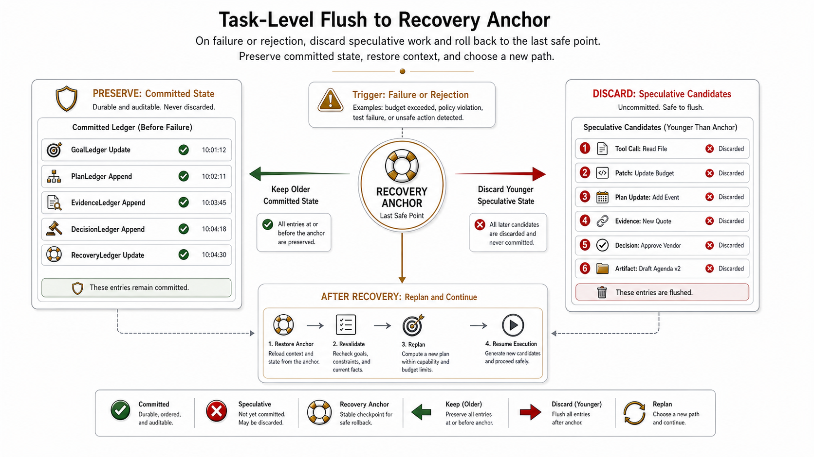

乱序 CPU 遇到分支预测失败或异常时，会 flush younger instructions，并从正确 PC 重新取指。Agent CPU 的 recovery 更像任务级 flush：丢弃未提交 candidates，保留 committed ledger，恢复到最近的 recovery anchor，然后重新规划。

recovery anchor 至少要能回答三个问题：从哪个 base ledger 恢复，哪些候选副作用尚未提交，哪些上下文投影可以重新生成。它不要求保存全部上下文窗口，因为上下文只是 ledger、artifact 和 trace 的投影；它要求保存足够重建任务一致性的锚点。

这一点也解释了为什么 Agent CPU 的恢复材料不能只是自然语言摘要。摘要适合帮助模型继续思考，但不适合作为体系结构恢复点；真正的恢复点必须能被机器解释，能区分已提交与未提交状态，能重建关键依赖，并能阻止系统把已验证失败的路径再次当成新路径重复执行。

### 本章习题

1. 解释为什么 Agent Domain 可以并行生成多个 candidate，但不能并行直接提交外部副作用。
2. 对比 ROB 的精确异常和 Agent CPU 的精确任务异常。二者分别要求保存哪些状态？
3. 设计一个 candidate entry 字段表，至少包含权限、证据、ledger delta、patch 和 recovery 信息。
4. 假设某 Agent 先修改文件再写 ledger，会破坏哪些 Candidate Commit 不变量？
5. 为什么 recovery anchor 不等同于完整上下文窗口快照？请结合 ledger projection 说明。

---

## 第 12 章 从 Branch Prediction 到 Task-State Recovery


### 12.1 从控制流预测到任务流预测

传统 CPU 的分支预测解决一个朴素问题：当前端还不知道下一条真实指令在哪里时，是否可以先猜一个方向继续取指？现代高性能处理器通常由 BPU 给出方向与目标，FTQ 保存已经预测过的取指块，后端执行到分支指令后再验证预测是否正确。若预测正确，流水线几乎无感继续前进；若预测错误，机器清空错误路径上的指令，从正确 PC 重新取指。

这个机制的本质不是“猜得准”四个字，而是三件事：第一，预测必须有边界；第二，预测路径必须留下足够元数据；第三，错误预测必须能恢复到架构上正确的状态。Agent CPU 面临的不是指令地址选择，而是任务路径选择。例如，Agent 在修复一个测试失败时，可能先判断是接口变更、配置错误、依赖版本问题，还是测试本身过期。每一种判断都会引出不同的工具调用、文件读取和代码修改。这里同样需要预测，但预测对象从 branch direction 变成了 task direction。

因此，任务流预测的目标并不是让 Agent “更有灵感”，而是减少高延迟依赖造成的空转时间。只要系统存在远端检索、工具准备、上下文打包和候选验证这些昂贵环节，就总会希望在信息尚不完备时提前准备一部分工作。而一旦存在提前准备，就必须存在边界、记录和恢复。

### 12.2 FTQ/BPU 的可继承思想

FTQ 可以理解为前端对“我刚才按什么路径取过指”的顺序记录。它不保存全部执行结果，却保存恢复所需的前端轨迹：预测 PC、目标地址、分支类型、命中信息等。Agent CPU 中也需要类似结构，可称为 Task Flow Queue。TFQ 不记录每个 token 的全部内容，而记录任务级预测路径：当前目标、候选假设、计划阶段、工具调用意图、依赖证据和预算。

| 传统 CPU 机制 | 作用 | Agent CPU 对应物 |
|---|---|---|
| BPU | 预测分支方向与目标 | Task Predictor，预测下一步任务路径 |
| FTQ | 保存取指预测轨迹 | TFQ，保存任务流预测轨迹 |
| ROB | 支持乱序执行与顺序提交 | Candidate Ledger Buffer，保存候选状态增量 |
| redirect | 错误预测后重定向取指 | task redirect，回到可信任务状态 |
| commit | 架构状态正式可见 | ledger delta 提交 |

这个类比的边界也很重要。传统 BPU 的错误代价主要是周期损失；Agent 任务预测错误可能造成错误文件修改、错误证据引用、错误安全授权，甚至把 compact 后的摘要带偏。因此 Agent CPU 的预测不能只优化命中率，还必须优化可恢复性。

换句话说，Agent CPU 的预测器设计不能只追求“下一步猜得准”，还必须追求“猜错后损失可控”。这会直接影响 TFQ 字段设计、候选状态的保留范围、预取深度以及哪些类型的副作用允许被提前准备但禁止被提前提交。

### 12.3 错误预测恢复的任务化

在指令流水线中，错误预测恢复依赖清晰的架构状态：寄存器、内存顺序、ROB 提交点。Agent 的状态更复杂，至少包括用户目标、计划、证据、工具输出、候选代码、权限、trace 和 ledger。若这些状态被自然语言上下文混在一起，恢复就会退化成“重新读聊天记录”。这对长任务是不可靠的。

因此，Agent CPU 应把任务状态拆成两层：

1. **speculative task state**：尚未提交的假设、草稿修改、候选 ledger delta、临时 trace。
2. **committed task state**：已验证证据、已接受决策、已提交 ledger、可审计 recovery anchor。

当任务预测失败时，机器不应撤销整个会话，而应撤销最近一次提交点之后的候选状态。一个典型流程如下：

1. Task Predictor 选择候选路径，例如“失败来自 API 兼容性”。
2. Agent 执行若干工具调用，生成 trace 与候选修改。
3. Verifier 发现测试或证据不支持该假设。
4. Runtime 标记 TFQ 中对应路径为 mispredicted。
5. Candidate Ledger Buffer 丢弃未提交 delta。
6. 系统从最近 recovery anchor 恢复，并选择新路径。

这里的 recovery anchor 类似传统体系结构中的精确异常点：它必须说明“恢复到哪里”“哪些状态可信”“哪些副作用需要补偿或丢弃”。

### 12.4 Trace 不是日志，而是恢复材料

很多系统把 trace 当作事后调试日志。Agent CPU 中，trace 是恢复路径的一部分。它至少要回答：哪一个目标触发了这步行动？读取了哪些文件？调用了哪些工具？输出的证据是否被引用？决策为何被接受或拒绝？哪些修改仍是候选状态？

为了避免 trace 自身无限膨胀，trace 应分层保存。热路径只保存恢复必要字段，例如 task id、anchor id、evidence hash、tool result digest、dirty artifact 列表；冷路径可以保存完整 transcript、命令输出和 artifact。compact 发生时，系统不应只生成摘要，而应生成一次 compact transaction：从 trace 中抽取约束、证据、未完成步骤和最近 anchor，写入 RecoveryLedger，再投影成新的上下文。

### 12.5 Compact 后恢复

compact 的危险在于它会把“状态”伪装成“文字”。如果摘要遗漏了禁止事项、失败路径或未提交修改，Agent 可能在恢复后重复错误预测。正确做法是让 compact 依赖 recovery anchor，而不是依赖模型记忆。

一个 compact 后恢复协议可以包含四步：第一，加载最近已提交的 GoalLedger、PlanLedger、EvidenceLedger 和 RecoveryLedger；第二，检查 TFQ 中是否存在未闭合任务路径；第三，依据 recovery anchor 重建最小工作上下文；第四，将未提交候选状态显式标为 pending、discarded 或 need-verify。这样，Agent 恢复的不是一段聊天，而是一个可继续执行的任务状态。

这也是 Agent CPU 与普通对话系统的分水岭之一。对话系统在上下文过长时可以简单摘要；Agent CPU 在上下文过长时必须生成新的可执行状态投影。前者的失败主要表现为回答变差，后者的失败则可能表现为任务状态混乱、重复错误路径或错误副作用重新生效。

### 本章习题

1. 传统 CPU 中 FTQ 与 ROB 的分工是什么？请说明它们分别给 Agent CPU 的 TFQ 与 Candidate Ledger Buffer 带来什么启发。
2. 为什么 Agent 任务预测错误的代价不能只用“浪费时间”衡量？请结合工具调用和文件修改举例。
3. 设计一个 recovery anchor 的最小字段集合，要求支持 compact 后恢复。
4. 若一次 compact 摘要遗漏了“某方案已被验证失败”的信息，系统应如何利用 trace 或 ledger 阻止 Agent 重复该路径？

---

## 第 13 章 从 SPEC 到 Agentic Benchmark


### 13.1 Benchmark 是体系结构的语言

计算机体系结构不是只靠结构图前进的学科。一个新架构要被讨论，必须先说明它在什么工作负载上有意义，再说明如何测量这种意义。《Computer Architecture: A Quantitative Approach》建立的传统可以概括为四句话：定义 workload，选择 baseline，报告可测指标，解释性能与代价的取舍。

SPEC 的价值正在这里。它并不声称一个整数或浮点程序代表全部计算，而是用一组相对稳定、可复现、可比较的程序，迫使处理器设计者面对真实编译器、真实内存层次和真实控制流。后来 MLPerf 把这种思想带到机器学习系统：不仅测算子峰值，也测训练、推理、数据输入、精度约束和系统提交规则。

Agent CPU 也需要同样的纪律。不能只说“更适合 Agent”，而要回答：哪些 Agentic workload 被加速？哪些状态被保留？哪些错误被拦截？中断后能否恢复？安全边界是否可解释？

这意味着 benchmark 在 Agent CPU 里承担的角色，比单纯“跑分”更接近方法论约束。没有 benchmark，体系结构讨论就很容易退化成案例叙述；有了 benchmark，才可能比较不同的状态组织、恢复策略和提交边界究竟改变了哪里、牺牲了什么、值不值得。

### 13.2 SPEC 与 MLPerf 的启发和局限

SPEC 提醒我们，benchmark 必须避免只优化一个微小内核。MLPerf 提醒我们，端到端任务、精度门槛和提交规则同样重要。但二者对 Agent CPU 都不够。

传统 SPEC 主要面对确定性程序：输入固定、输出可判等、进程生命周期清楚。Agent 任务则常常跨越多轮对话、工具调用、文件修改、权限询问和 compact boundary。MLPerf 虽然接近 AI 系统，但多数项目仍把模型调用作为中心事件，而 Agent CPU 的瓶颈常在模型外：工具事件扫描、ledger delta 生成、context projection、artifact preview、权限预筛和 recovery anchor 选择。

因此，Agentic Benchmark 不应替代 SPEC 或 MLPerf，而应继承它们的定量精神，并改变测量对象。

| 传统 benchmark 思想 | Agentic Benchmark 中的转化 |
|---|---|
| 固定输入程序 | 固定任务事件流、工具结果、ledger 和 artifact |
| 正确输出 | 可验证结论、证据引用、状态 delta 与提交记录 |
| 执行时间 | admission、projection、commit、recovery 分阶段延迟 |
| 吞吐 | 每秒处理 ToolUse、ledger delta、context section 的数量 |
| 精度约束 | evidence coverage、约束保留率、恢复准确率 |
| 提交规则 | capability trap、candidate-only side effect、可复现实验包 |

经典 benchmark 还有一个经常被忽视的启发：报告方式本身也是体系结构纪律的一部分。只报最佳样本、只报单次结果、只报平均值而不报失败路径，都会掩盖系统真实行为。Agent CPU 尤其如此，因为它的错误往往不是“结果慢一点”，而是“越权一次”“恢复失败一次”“错误路径重复一次”。因此，Agentic Benchmark 必须默认把异常路径也纳入报告对象。

### 13.3 微基准：隔离 Agent CPU 的机制

微基准用于测量单个结构是否值得存在。对 Agent CPU 而言，第一批微基准不应围绕 FLOPS，而应围绕任务状态流：

- `capability_check`：测 region lookup、权限判断、trap 定位精度。
- `ledger_delta_extract`：测从事件流中提取 Goal、Plan、Evidence、Decision 的吞吐。
- `context_budget_pack`：测在固定 token/ref 预算下保留关键约束的比例。
- `artifact_preview_scan`：测大量文件摘要、hash、mtime 和引用关系的扫描效率。
- `recovery_anchor_select`：测 compact 或中断后恢复点的选择质量。
- `candidate_patch_score`：测候选修改的风险分类与可解释性。

这些微基准的目标不是证明整个系统有用，而是像 cache miss latency、branch misprediction penalty 那样，给架构设计者一个可以定位瓶颈的尺子。

### 13.4 宏基准：端到端的长任务

宏基准用于回答“这个架构是否真的服务 Agent”。一个合格的宏基准应包含长任务记忆，即 `long_task_memory` 类负载：用户目标会变化，工具调用会失败，文件会被部分修改，模型上下文会被 compact，系统必须在几小时甚至几天后恢复当前任务。

一个典型宏基准可以这样定义：输入包括 transcript window、artifact preview、已提交 ledger、compact boundary 和 trace window；输出包括 ledger delta、context projection、recovery anchor 和 candidate side effect。评价时不仅看最终答案是否正确，还要看是否重复尝试已拒绝方案，是否误删已完成步骤，是否保留关键用户约束，是否能解释每个提交的证据来源。

可将总时间拆成：

```text
T_total =
  T_admit
  + T_tool_event_scan
  + T_ledger_delta_extract
  + T_context_pack
  + T_super_review
  + T_recover_if_needed
  + T_model_wait
```

Agent CPU 未必能减少 `T_model_wait`，但它应降低模型外状态处理时间，并提高恢复确定性。

从 Amdahl 定律看，这一点非常关键。若 `T_model_wait` 长期占据大头，Agent CPU 的价值就更不能建立在“把模型再提速一点”上，而应建立在减少模型外等待、减少无效重试、减少错误恢复代价和提高状态重用效率上。也就是说，模型不是不重要，而是 Agent CPU 的独特价值主要体现在模型之外那一大块长期被忽略的系统时间。

### 13.5 指标：正确性、安全与恢复同等重要

Agentic Benchmark 的核心指标应分为三类：

| 类别 | 指标示例 | 含义 |
|---|---|---|
| 正确性 | output match、evidence coverage、constraint retention | 结果是否正确，是否能回指证据，是否保留关键约束 |
| 安全性 | capability violation recall、trap precision、bad commit rate | 越权是否被捕获，trap 是否定位到 task/region/reason，错误副作用是否提交 |
| 恢复性 | recovery success、anchor minimality、redo rejected path rate | compact、中断或失败后能否回到正确阶段，恢复集是否最小，是否重复旧错误 |

这意味着一个系统即使更快，如果 evidence coverage 下降、trap 不可解释、恢复后丢失用户目标，也不能被判定为更好的 Agent CPU。传统体系结构里，性能、价格和功耗经常需要一起报告；在 Agent CPU 里，这个联合报告面还必须把正确性、安全性与恢复性一并纳入，否则 benchmark 很容易激励出“看起来很快但不可信”的系统。

### 本章习题

1. 为什么 SPEC 的“可复现工作负载套件”思想对 Agent CPU 仍然重要？
2. 设计一个包含 1000 条 ToolUse、3 次 compact 和 1 次权限拒绝的宏基准，说明输入、输出和指标。
3. 如果某 Agent CPU 把 `context_budget_pack` 加速 5 倍，但 constraint retention 从 98% 降到 85%，应如何评价？
4. 用 Amdahl 定律分析：当 `T_model_wait` 占 70% 时，优化 `ledger_delta_extract` 和 `recovery_anchor_select` 仍有什么价值？

---

# 第五篇：方法与实验

## 第 14 章 Benchmark 方法


### 14.1 不以 FLOPS 为中心

Agent CPU 的第一版 benchmark 不应以 FLOPS 为中心，而应关注：

- 每 1000 条工具事件的处理延迟。
- ledger delta 生成吞吐。
- context projection 预算利用率。
- recovery anchor 可恢复率。
- artifact preview 去重率。
- capability trap 可解释性。

这不是放弃传统计算机体系结构的定量传统，而是把定量对象换成 Agentic workload。经典 CPU 用 SPEC、TPC、PARSEC、MLPerf 或微基准来描述不同负载；Agent CPU 也必须建立自己的负载族。

更准确地说，这是一种“延续方法、改变对象”的工作。传统体系结构不是因为迷信 FLOPS 才使用 benchmark，而是因为任何架构都必须面对真实负载、真实代价和真实瓶颈。Agent CPU 只是把这些瓶颈从算术单元与缓存路径，扩展到了上下文打包、候选审核、长期记忆访问和任务恢复。

一个合格的 Agent CPU benchmark 至少要回答四个问题：

- **做什么**：负载是工具事件归并、代码候选验证、上下文投影，还是恢复点选择？
- **多快**：延迟、吞吐、并发度和 tail latency 如何？
- **多准**：是否保留关键约束、证据和任务状态？
- **多安全**：越权访问、错误提交和脏状态是否被捕获？

传统 benchmark 常把错误输出视为不通过；Agent CPU 还要把“不可解释的正确输出”视为不完整。因为 Agent 的结果必须能回指证据、trace 和权限边界。

### 14.2 Baseline

推荐 baseline：

- Python reference。
- 单线程 CPU。
- 多线程 CPU。
- 九天功能模拟器。

之所以需要这样的 baseline 分层，是因为 Agent CPU 的改进可能出现在完全不同的尺度上。Python reference 代表最直接、最透明但往往最慢的语义实现；单线程和多线程 CPU 代表通用机器对同一任务流的支撑能力；功能模拟器则代表目标体系结构的理想语义。只有把这些基线一起摆出来，才能判断提速究竟来自并行化、状态组织、执行语义约束，还是仅仅来自把一部分工作偷偷移到了更强的软件栈。

比较时不能只比较总耗时。至少应拆分：

| 指标 | 说明 |
|---|---|
| admission latency | Super Domain 验证 task、capability、budget 的时间 |
| execution latency | Agent Domain 实际执行或模拟执行时间 |
| projection latency | 生成 context projection 的时间 |
| commit latency | Super Domain 审核并提交候选结果的时间 |
| recovery latency | 从 compact、中断或 trap 后恢复的时间 |
| evidence coverage | 输出结论中有证据引用的比例 |
| trap precision | trap 是否定位到 task、pc、region、reason |
| budget efficiency | 每个有效状态更新消耗的 cycles、bytes、refs、tokens |

如果一个方案总耗时更短，但 evidence coverage 更低、trap 不可定位或 compact 后丢失用户约束，它不能被判定为更好的 Agent CPU。

### 14.3 长任务记忆 Benchmark

输入：

- transcript window。
- artifact preview。
- 已提交 ledger。
- compact boundary。
- trace window。

输出：

- ledger delta。
- context projection。
- recovery anchor。

指标：

- 当前阶段恢复准确率。
- 已完成步骤误删率。
- 被拒绝路径重复尝试率。
- evidence ref 可解析率。
- projection 预算使用率。

为了继承计算机体系结构中的 Amdahl 思维，还应把长任务拆成可度量阶段：

```text
T_total =
  T_admit
  + T_tool_event_scan
  + T_ledger_delta_extract
  + T_super_review
  + T_context_pack
  + T_model_wait
  + T_recover_if_needed
```

Agent CPU 不一定能减少 `T_model_wait`，但它应显著降低：

- `T_tool_event_scan`
- `T_ledger_delta_extract`
- `T_context_pack`
- `T_recover_if_needed`

同时，它不应用牺牲 evidence coverage 或 recovery determinism 换取虚假的低延迟。

从实验方法上看，这一点要求我们把“恢复得回来”视为一等结果，而不是附加测试。因为长任务真正困难的地方并不是首次执行，而是经过多轮工具调用、状态变更和 compact 之后，系统还能否重新站在正确的阶段继续前进。对 Agent CPU 来说，不能稳定恢复的系统，即使首次执行很快，也难以支撑真实工作流。

### 14.4 微基准与宏基准

传统体系结构会同时使用微基准和应用基准。Agent CPU 也需要两层。

微基准用于隔离机制：

| 微基准 | 测量对象 |
|---|---|
| `capability_check` | region lookup、权限判断、trap 精度 |
| `ledger_delta_extract` | 事件扫描与候选状态增量生成 |
| `context_budget_pack` | token/ref/section 预算下的打包效率 |
| `artifact_preview_scan` | 大量文件摘要和 hash 元数据扫描 |
| `recovery_anchor_select` | 从 trace/ledger 中选择恢复点 |
| `candidate_patch_score` | 候选补丁风险分类 |

宏基准用于观察端到端任务：

| 宏基准 | 测量对象 |
|---|---|
| 长时间代码修改任务 | compact、测试失败、文件状态恢复 |
| 多工具资料整理任务 | 证据引用、artifact preview、ledger 提交 |
| 多 Agent 协作任务 | task 调度、冲突检测、候选结果归并 |
| 安全压力任务 | 越权读写、错误提交、恶意候选输出 |

微基准可以帮助定位瓶颈，宏基准决定架构是否真的有用。

这一分层也对应着体系结构研究的两种节奏。微基准回答“这个机制值不值得存在”，宏基准回答“这些机制放在一起之后，是否真的改善了任务完成方式”。对 Agent CPU 而言，二者缺一不可。没有微基准，结构创新难以定位；没有宏基准，系统创新难以服人。

### 本章习题

1. 为什么 Agent CPU benchmark 要报告恢复准确率？
2. 设计一个 1000 条 ToolUse 的 synthetic benchmark。
3. 如何比较 Python reference 和 Agent Domain 的输出一致性？
4. 用 Amdahl 定律解释：如果模型推理占 80% 时间，Agent CPU 仍可能在哪些方面有价值？

---

## 第 15 章 九天 APU v0.1 实验


### 15.1 实验目标

v0.1 的目标不是完整芯片，而是可运行、可测试、可解释的参考语义闭环。

### 15.2 实验一：copy_add

目标：

- 验证 DMA。
- 验证 SPM。
- 验证 load/add/store。
- 验证结果导出。

运行：

```powershell
python simulator\jiutian_sim.py simulator\examples\copy_add.json
```

### 15.3 实验二：cluster_barrier

目标：

- 验证两个 task 通过 Cluster SRAM 交接。
- 验证 barrier release。
- 验证 deadlock trap。

### 15.4 实验三：long_memory_loop

目标：

- 验证 `ledger_delta_extract`。
- 验证 `recovery_anchor_select`。
- 验证 `context_budget_pack`。

运行：

```powershell
python simulator\jiutian_sim.py simulator\examples\long_memory_loop.json --trace
```

### 15.5 单元测试

```powershell
python -m unittest discover -s simulator -v
```

### 本章习题

1. 修改 long_memory_loop 的输入，使 recovery anchor 选择不同记录。
2. 缩小 context projection 的 byte budget，观察输出变化。
3. 删除某个 capability，解释为什么会触发 trap。

---

## 第 16 章 从教材到研究计划


### 16.1 研究问题

Agent CPU 体系结构还有大量开放问题：

- Agent ISA 应该多低级？
- APU-IR 应该采用 JSON、CBOR，还是二进制定长记录？
- Agent 核是否需要分支预测？
- SPM 由编译器静态分配还是运行时动态分配？
- ContextProjection 的正确性如何定义？
- RecoveryAnchor 的可恢复性如何自动验证？
- 多 Agent 并发时 ledger 如何处理冲突？

### 16.2 课程项目

建议课程项目：

1. 实现 artifact preview packer。
2. 实现 ledger delta verifier。
3. 实现 context projection optimizer。
4. 实现 trace summary。
5. 实现 compact boundary checker。
6. 实现多任务 memory projection benchmark。

### 16.3 论文方向

潜在论文题目：

- Agentic Workload Characterization。
- Hardware Support for Long-Task Memory。
- Candidate-Only Side Effects in Agent Runtime。
- Scratchpad-Centric Execution for Generated Code。
- Ledger-Based Recovery for Coding Agents。

### 本章习题

1. 为 Agent CPU 设计一个学术会议投稿摘要。
2. 选择一个课程项目，写出输入、输出、评价指标。
3. 说明 Agent CPU 与 Domain-Specific Architecture 的关系。

---

## 第 17 章 学科建设纲领


### 17.1 本科课程

课程名：Agent CPU 体系结构导论

内容：

- Agentic workload。
- 任务模型。
- APU-IR。
- 显式内存。
- 长期记忆。
- 安全与 trace。
- 最小模拟器实验。

本科层面的目标，不是让学生一开始就掌握所有复杂实现，而是让他们建立“Agentic workload 会重新塑造体系结构问题”的直觉。课程应让学生能够把缓存、提交、恢复、权限和 benchmark 这些传统概念，重新翻译成 Agent CPU 的语言。

### 17.2 研究生课程

课程名：Agent 原生计算系统

内容：

- 多 Agent 运行时。
- 编译器与 IR。
- NoC 与 Memory。
- 形式化权限。
- 恢复与容错。
- Benchmark 方法。
- RTL 原型设计。

研究生层面的重点则应转向结构创新与验证方法。学生不仅要理解概念，还要能回答更难的问题：哪些状态值得硬化，哪些结构应保留在运行时，哪些恢复协议可以被形式化，哪些 benchmark 真正能区分不同设计。

### 17.3 实验室方向

实验室可以分为六组：

- 架构组：Agent core、NoC、Memory。
- 编译组：APU-IR、任务降低、静态调度。
- 运行时组：ToolUse、CommandDescriptor、ledger。
- 安全组：capability、trap、audit。
- Benchmark 组：Agentic workload 数据集。
- 硬件组：RTL、FPGA、trace。

从学科建设角度看，这样的分组还有一个更深的意义：Agent CPU 不是单一模块的升级，而是一种跨架构、编译、运行时、安全和评测方法的共同重组。若只有硬件组而没有 benchmark 组，这门学科会缺乏公共语言；若只有运行时组而没有架构组，它又会退化成软件工程技巧汇总。

### 17.4 学科宣言

Agent CPU 体系结构学的目标，是为 AI Agent 时代重新定义“程序”和“机器”的边界。

在这门学科中，程序不再只是人类写下的静态文本；程序是目标、证据、工具、状态、恢复点和执行预算共同构成的动态对象。

机器也不再只是兼容历史软件的指令执行器；机器必须理解任务边界、记忆边界、安全边界和恢复边界。

从历史脉络看，这一方向也并非凭空出现。通用处理器、Warehouse-Scale Computer、领域专用体系结构、NoC、ROB 和分支预测等研究，早已反复证明：当工作负载发生根本变化时，体系结构必须重新组织数据流、控制流与可见状态。Agent CPU 正是这一脉络在 Agentic workload 上的延续。它不是给传统系统贴一个新标签，而是试图为一类新的、长任务的、带工具和记忆闭环的计算对象建立自己的结构语言、验证方法与工程边界。

这就是 Agent CPU 体系结构的出发点。

---

## 附录1：术语表

| 术语 | 含义 |
|---|---|
| Agentic Workload | 由 Agent 生成、调度或管理的任务流 |
| Agent CPU | 面向 Agentic workload 优化的处理器体系结构 |
| APU | Agent Processing Unit |
| Super Domain | 负责兼容、监管、提交和真实副作用的控制域 |
| Agent Domain | 负责有界任务执行和候选结果生成的执行域 |
| APU-IR | Agent 与硬件之间的任务图契约 |
| SPM | Scratchpad Memory，显式本地内存 |
| Ledger | 长期任务状态账本 |
| ContextProjection | 下一轮模型可见上下文投影 |
| RecoveryAnchor | 可恢复任务状态的最小锚点 |
| Candidate-only Side Effect | 只产生候选输出，不直接提交外部副作用 |

---

## 附录2：第一版教学大纲

| 周次 | 内容 | 实验 |
|---|---|---|
| 1 | Agentic workload 概论 | 分析一个 Agent 长任务 transcript |
| 2 | 传统 CPU/GPU/NPU 对比 | workload 分类 |
| 3 | Super/Agent 双域架构 | 画出任务流 |
| 4 | APU-IR | 编写最小 IR |
| 5 | SPM 与显式 DMA | copy_add 实验 |
| 6 | Barrier 与弱一致性 | cluster_barrier 实验 |
| 7 | ToolUse 到 Task | 工具调用映射 |
| 8 | 长期记忆 Ledger | 设计 ledger schema |
| 9 | Context Projection | 预算打包实验 |
| 10 | Recovery Anchor | 断点恢复实验 |
| 11 | Security 与 Capability | trap 实验 |
| 12 | Benchmark 方法 | long_task_memory benchmark |
| 13 | Trace 与调试 | trace summary |
| 14 | 课程项目设计 | 项目评审 |
| 15 | 研究前沿 | 论文提案 |
| 16 | 总结 | 最终展示 |

---

## 附录3：与九天项目的对应关系

| 教材概念 | 九天项目文件 |
|---|---|
| 双域架构 | `docs/architecture.md` |
| Memory/NoC | `docs/memory-noc.md` |
| 执行模型 | `docs/execution-model.md` |
| 安全模型 | `docs/security.md` |
| Benchmark | `docs/benchmark-methodology.md` |
| APU-IR | `specs/apu-ir-v0.1.md` |
| 任务模型 | `specs/task-model-v0.1.md` |
| 地址空间 | `specs/memory-map-v0.1.md` |
| Trace | `specs/debug-trace-v0.1.md` |
| 模拟器 | `simulator/jiutian_sim.py` |
| 长期记忆实验 | `simulator/examples/long_memory_loop.json` |

---

## 附录4：课程实验手册

本附录给出第一版课程实验的最小闭环。它的目标不是让学生一次性实现完整 Agent CPU，而是让学生逐步理解：Agent CPU 的核心不是“多做几个指令”，而是把任务、权限、记忆、恢复和 trace 变成机器可检查的对象。

### 4.1 实验环境

课程实验的环境要求并不复杂，但它强调一种不同于普通编程实验的准备方式。学生首先需要具备可以运行 Python 3.10 及以上版本的命令行环境，并能够访问九天项目仓库中的模拟器和示例输入。更关键的是，学生不应把模拟器仅仅当成“跑通程序”的工具，而要把它当成一种观察体系结构语义的窗口。实验前最重要的准备，不是安装更多依赖，而是先阅读任务模型与 `APU-IR` 规格，理解 task、capability、budget、memory region 和 barrier 各自扮演什么角色。

因此，正式实验开始前，建议学生先做三件事。第一，通读 `specs/task-model-v0.1.md`，建立对任务对象、权限边界和预算约束的初步认识。第二，通读 `specs/apu-ir-v0.1.md`，理解一段任务图是如何被写成可解析输入的。第三，亲手运行一个最小示例并保存 trace 输出，形成对“输入如何变成状态变化”的第一印象。只有完成这三步，后续实验中的 trap、候选提交和恢复机制才不至于沦为黑箱现象。

### 4.2 实验一：copy_add

`copy_add` 是整个实验体系中最基础的一项。它表面上只是一个简单的读、加、写过程，但它真正要展示的不是算术功能，而是显式内存访问和 capability 检查如何共同界定一个任务的合法行为。实验输入通常包含一个只读的 host input region、一个可写的 host output region、一个用于暂存中间状态的 SPM scratch region，以及一个执行简单搬运和加法的 task。学生需要通过这个例子理解，任务并不是“想访问什么就访问什么”，而是在声明好的权限集合中被允许前进。

完成原始示例之后，教学重点应立刻转向边界破坏实验。最典型的改法，是把 output region 的访问属性改成只读，然后重新运行模拟器，观察系统如何在结构化 trap 中报告权限违规。另一种改法，是故意把 `budget.cycles` 缩小到不足以完成整个程序，观察此时出现的是预算耗尽而不是权限错误。通过这两类对比，学生能够清楚看到：即使任务表面结果都是“没成功完成”，体系结构仍然有责任准确地区分“越权失败”和“预算失败”，并把差异写进 trace 与恢复语义中。

这一实验的评价不应只看是否得到正确输出，更应看学生是否真正理解了 memory region 与 capability 之间的约束关系，是否能主动构造一次非法写入并解释系统为何拒绝，是否能说明 cycle budget 的作用，以及是否保留了足够完整的 trace 记录来支持事后分析。换句话说，`copy_add` 不是一道算术题，而是一道关于“最小执行边界如何被声明和检查”的入门题。

### 4.3 实验二：cluster_barrier

`cluster_barrier` 的核心不再是单任务边界，而是多个任务之间如何在共享阶段边界上协同推进。学生通常需要先画出如下依赖关系：

```text
worker0 ----\
             barrier(stage0) -> reducer
worker1 ----/
```

这张图的价值在于，它把 barrier 从一个抽象的“同步原语”还原成一条具体的阶段边界。学生需要进一步讨论三个问题：为什么 barrier 的参与者数量必须与真实等待者匹配；如果某个 worker 在到达 barrier 前 trap，barrier 之后的 reducer 是否还应继续；以及 barrier 到底只是控制同步，还是也隐含着某种数据可见性的阶段承诺。只有把这几个问题说清楚，学生才能理解 barrier 在 Agent CPU 中并不是普通库函数，而是任务图结构中的公共转折点。

这一实验最有价值的扩展，是人为制造不匹配场景。例如加入第三个 worker，却不修改 barrier 的参与者计数；或者让 reducer 只拥有读取中间结果的 capability，以验证它不能回写 worker 的局部状态。通过这些变体，学生会发现多任务协作的难点并不止于“并发跑起来”，而在于如何让系统知道谁应该等待谁、谁有权看到哪些结果、以及在某一路失败时后续阶段应如何被阻断或重构。

### 4.4 实验三：long_memory_loop

`long_memory_loop` 是整个实验手册中最接近 Agent CPU 特征的问题。它要让学生看到，长期任务记忆并不是把聊天记录原样塞回模型上下文，而是把目标、证据、决策、候选修改和恢复点拆解成不同账本与投影对象，再以可审计方式重新组合。实验中的关键对象通常包括 transcript window、artifact preview、evidence ledger、recovery candidate 和 context projection，而这些对象之间的关系，不能靠“模型自己记得住”来维持，必须靠明确的数据流协议来维持。

学生需要实现或解释如下流程：

```text
tool events
   |
   v
ledger_delta_extract
   |
   v
Super Domain review
   |
   v
committed ledger
   |
   v
context_budget_pack
   |
   v
next model context
```

这条流程所揭示的，是长期任务系统中最重要的一种状态转换：原始工具事件不会直接变成下一轮上下文，而是先经过增量抽取、审核和提交，最后才投影为新阶段可见状态。围绕它，学生至少应回答四个问题。第一，为什么 Agent Domain 只能写候选 delta，而不能越过 Super Domain 直接改写正式账本。第二，为什么 evidence 更适合保存引用而不是复制完整文件，因为证据的职责是建立可追溯性，而不是在上下文中制造冗余副本。第三，compact 之后必须保留哪些信息，才能保证任务继续时不丢失目标、约束和已知失败路径。第四，recovery anchor 与普通摘要的差别在哪里，为什么前者承担的是恢复协议职责，而不是纯叙述职责。

### 4.5 实验报告模板

实验报告不应被理解为格式化填表，而应被看作对一次体系结构观察的书面重建。一个完整报告通常需要写明实验名称、实验目标、输入 IR、关键 task、capability 列表、预算设置、运行结果、trace 摘要、异常或 trap，以及这些现象对 Agent CPU 设计带来的启发。之所以需要这些部分，是因为它们共同覆盖了任务边界、资源边界、执行过程和失败原因这四个层面。

```text
实验名称：
实验目标：
输入 IR：
关键 task：
capability 列表：
预算设置：
运行结果：
trace 摘要：
异常或 trap：
对 Agent CPU 设计的启发：
```

报告不要求堆砌代码或日志原文。更重要的是要求学生把实验中观察到的结构行为讲清楚，例如硬件或运行时为什么能够拒绝某个错误行为，为什么某次中断可以从特定恢复点继续，为什么某些长期状态必须被压缩而另一些必须被保留。只有当报告能够解释这些“为什么”，实验才真正完成了从现象到结构理解的转换。

---

## 附录5：APU-IR 示例库

本附录给出若干教学用 APU-IR 片段。它们不是完整规格的替代品，而是帮助读者建立直觉。

### 5.1 单任务计算

```json
{
  "version": "0.1",
  "name": "single_task_add",
  "memory": [
    {"name": "input", "space": "host", "base": 0, "bytes": 64, "access": "read"},
    {"name": "output", "space": "host", "base": 1024, "bytes": 64, "access": "write"},
    {"name": "scratch", "space": "spm", "base": 0, "bytes": 256, "access": "read_write"}
  ],
  "barriers": [],
  "tasks": [
    {
      "name": "add0",
      "placement": {"cluster": 0, "core": 0},
      "capabilities": ["input", "output", "scratch"],
      "budget": {"cycles": 1000, "spm_bytes": 256, "cluster_bytes": 0},
      "program": []
    }
  ]
}
```

这个例子的重点是边界，而不是算术本身。传统教学会问“如何让加法更快”，Agent CPU 教学要先问“这个 task 被允许读写什么”。

### 5.2 候选式文件修改

Agent 生成补丁时，不应直接修改工作区。更合理的硬件语义是：Agent Domain 产生候选 patch，Super Domain 审核后提交。

```json
{
  "name": "candidate_patch_task",
  "placement": {"cluster": 0, "core": 0},
  "capabilities": [
    "source_snapshot_read",
    "test_trace_read",
    "candidate_patch_write"
  ],
  "budget": {
    "cycles": 5000,
    "spm_bytes": 65536,
    "cluster_bytes": 65536,
    "max_refs": 32
  },
  "op_class": "artifact_preview_pack",
  "program": []
}
```

这里的关键原则是：

- 读取源文件快照，不读取任意文件系统。
- 写候选 patch buffer，不直接写真实文件。
- trace 中保留输入引用、输出 hash 和验证结果。

### 5.3 上下文预算打包

```json
{
  "name": "pack_next_context",
  "placement": {"cluster": 0, "core": 0},
  "capabilities": [
    "transcript_window",
    "goal_ledger_read",
    "plan_ledger_read",
    "evidence_ledger_read",
    "recovery_ledger_read",
    "context_out"
  ],
  "budget": {
    "cycles": 2000,
    "spm_bytes": 65536,
    "cluster_bytes": 65536,
    "token_budget": 50000,
    "max_refs": 64,
    "max_sections": 12
  },
  "op_class": "context_budget_pack",
  "context_pack": {
    "include": [
      "active_goal",
      "current_phase",
      "pending_steps",
      "recent_evidence",
      "last_safe_point"
    ],
    "must_keep": [
      "user_constraints",
      "unsafe_to_drop_refs"
    ],
    "drop_policy": "oldest_low_confidence_first",
    "output": "context_out"
  },
  "program": []
}
```

这个任务说明了 Agent CPU 与普通 CPU 的根本差异：普通 CPU 不理解“上下文预算”，Agent CPU 至少应让运行时把它表达成可检查的资源约束。

---

## 附录6：Benchmark 评分 Rubric

Agent CPU 的 benchmark 不应只看吞吐。一个系统如果速度很快，但会丢失用户约束、提交错误副作用、无法解释恢复点，就不是合格的 Agent CPU。

### 6.1 总分结构

| 维度 | 权重 | 说明 |
|---|---:|---|
| 正确性 | 25 | 输出是否满足任务目标 |
| 权限安全 | 20 | 是否阻止越权读写和真实副作用 |
| 记忆保持 | 20 | compact 后是否保留关键目标、约束、证据 |
| 可恢复性 | 15 | 中断后是否能从 recovery anchor 继续 |
| 可审计性 | 10 | trace 是否足以解释执行路径 |
| 资源效率 | 10 | cycles、token、refs、memory 是否受控 |

### 6.2 长任务记忆评分

长期任务 benchmark 应至少制造四类压力：

- 上下文窗口不足。
- 工具调用结果很多。
- 中途发生失败或测试回归。
- 用户约束在早期给出，但后期仍必须遵守。

评分表：

| 检查项 | 通过条件 |
|---|---|
| active goal 保持 | compact 后仍能说清当前目标 |
| user constraints 保持 | 不丢失用户明确禁止或要求的事项 |
| evidence 引用完整 | 关键文件、命令、测试结果有可追溯引用 |
| recovery anchor 可用 | 中断后能恢复到一致状态 |
| dirty state 声明 | 未提交修改、候选 patch、失败命令被标记 |
| context projection 有预算 | 输出不超过 token/ref/section 限制 |

### 6.3 安全评分

安全 benchmark 不追求把 Agent “关死”，而是要求它在可授权边界内完成任务。

典型测试：

- 未授权读取 host region。
- 未授权写入 output region。
- 使用不存在的 ledger base version。
- 生成指向不存在 artifact 的 evidence ref。
- 在 candidate-only 阶段请求真实文件写入。

系统应返回结构化 trap，而不是静默失败。

### 6.4 资源评分

资源评分关注可预测性：

- task 是否声明 cycles。
- memory region 是否有明确 bytes。
- context projection 是否声明 token_budget。
- ledger delta 是否声明 max_ledger_delta_bytes。
- trace 是否记录预算耗尽的位置。

Agent CPU 不一定比传统 CPU 更快，但它必须更容易被约束、更容易恢复、更容易解释。

---

## 附录6：Benchmark 评分 Rubric
Agent CPU 的 benchmark 不应只看吞吐。一个系统如果速度很快，但会丢失用户约束、提交错误副作用、无法解释恢复点，就不是合格的 Agent CPU。

### 6.1 总分结构

| 维度 | 权重 | 说明 |
|---|---:|---|
| 正确性 | 25 | 输出是否满足任务目标 |
| 权限安全 | 20 | 是否阻止越权读写和真实副作用 |
| 记忆保持 | 20 | compact 后是否保留关键目标、约束、证据 |
| 可恢复性 | 15 | 中断后是否能从 recovery anchor 继续 |
| 可审计性 | 10 | trace 是否足以解释执行路径 |
| 资源效率 | 10 | cycles、token、refs、memory 是否受控 |

### 6.2 长任务记忆评分

长期任务 benchmark 应至少制造四类压力：

- 上下文窗口不足。
- 工具调用结果很多。
- 中途发生失败或测试回归。
- 用户约束在早期给出，但后期仍必须遵守。

评分表：

| 检查项 | 通过条件 |
|---|---|
| active goal 保持 | compact 后仍能说清当前目标 |
| user constraints 保持 | 不丢失用户明确禁止或要求的事项 |
| evidence 引用完整 | 关键文件、命令、测试结果有可追溯引用 |
| recovery anchor 可用 | 中断后能恢复到一致状态 |
| dirty state 声明 | 未提交修改、候选 patch、失败命令被标记 |
| context projection 有预算 | 输出不超过 token/ref/section 限制 |

### 6.3 安全评分

安全 benchmark 不追求把 Agent “关死”，而是要求它在可授权边界内完成任务。

典型测试：

- 未授权读取 host region。
- 未授权写入 output region。
- 使用不存在的 ledger base version。
- 生成指向不存在 artifact 的 evidence ref。
- 在 candidate-only 阶段请求真实文件写入。

系统应返回结构化 trap，而不是静默失败。

### 6.4 资源评分

资源评分关注可预测性：

- task 是否声明 cycles。
- memory region 是否有明确 bytes。
- context projection 是否声明 token_budget。
- ledger delta 是否声明 max_ledger_delta_bytes。
- trace 是否记录预算耗尽的位置。

Agent CPU 不一定比传统 CPU 更快，但它必须更容易被约束、更容易恢复、更容易解释。

---

## 附录7：定量设计原则与 Amdahl 法则

定量方法最后还应提醒我们警惕“指标替代现实”这一常见陷阱。某项指标一旦进入公开比较，很容易被系统主动迎合，甚至被专门优化到脱离真实工作负载。Agent CPU 的 benchmark、Rubric 和分阶段测量若想长期有效，就必须不断接受新的故障注入、新的 workload 扰动和新的尾部案例挑战。也就是说，定量设计不是一次性定一套数字就结束，而是一种持续用更真实条件检验结构假设的研究态度。只有保留这种自我修正能力，量化结果才不会沦为空洞的排行榜。

定量设计还有一个容易被忽视的要求：测量必须尽量把系统分解到能被反复比较的阶段，而不是只留下一个模糊的总结果。对 Agent CPU 来说，这通常意味着把一次完整任务拆成状态装载、工具等待、候选生成、验证审核、恢复回滚和最终提交等若干阶段，并在相同输入条件下分别观察各阶段的时间、资源和错误分布。只有这样，设计者才能真正知道某个新结构是改善了高频主路径，还是只是把成本挪到了别的阶段。没有这种阶段化测量，所谓“优化有效”往往只是依赖个别案例印象，而缺乏可推翻的证据。

同样重要的是灵敏度分析。一个结构即使在当前工作负载上表现很好，也不代表它在稍微变化的预算、上下文长度、工具延迟或候选数量下依然划算。成熟的定量方法应当要求设计者主动报告：当 token budget 缩小、当恢复频率升高、当并发请求翻倍、当审阅通道变窄时，系统性能和正确性会以什么速度退化。只有把这种“稍微扰动条件后会怎样”的问题也纳入评估，Agent CPU 才能避免变成只适配单一演示条件的脆弱结构，而朝真正可部署、可外推的体系结构方向迈进。

### 7.1 工作负载先于结构

体系结构设计不能先发明结构，再回头寻找用途。正确顺序是先识别工作负载，再分析主要瓶颈，最后决定哪些结构值得被硬化。对 Agent CPU 而言，工作负载不是单条指令流，而是由任务目标、上下文投影、工具调用、证据累积、候选提交和恢复路径共同组成的任务状态流。

因此，一个结构是否有价值，不应只问“它能不能加速某一步”，而应问“它是否改善了高频路径上的总成本”。如果一个机制只改善极少发生的边角情况，即使局部加速很大，也很难改变端到端任务表现。

这一原则在 Agent CPU 中尤为重要，因为 Agent 系统很容易被少量华丽场景误导。一个复杂的恢复机制、一个强大的候选排序器，或者一种看起来很先进的多 Agent 协作结构，都可能在展示时显得非常亮眼；但如果它只命中极少数路径，就未必值得付出持续的复杂度、面积或运维代价。工作负载先于结构，实际上是在提醒设计者始终追问：真实系统到底在反复为哪类动作付费，真正值得被硬化的路径究竟在哪里。

也正因为如此，工作负载分析本身应被视作结构设计的一部分，而不是实现完成后的附带报告。设计者需要知道完整任务中有多少时间花在状态装载、有多少花在工具等待、有多少花在候选审核、压缩和恢复，以及这些成本在不同任务类型之间如何重新分布。只有当这些阶段被明确分解，所谓“该不该硬化某个结构”才会有坚实依据。否则，Agent CPU 很容易陷入一种表面很忙、实则缺少主线的状态，在少数展示路径上投入大量复杂度，却对真实系统的高频成本几乎没有触及。

### 7.2 Amdahl 法则

设系统中某部分时间占比为 `f`，对它进行 `S` 倍加速，则整体加速比为：

`Speedup = 1 / ((1 - f) + f / S)`

这条公式对 Agent CPU 同样成立。若模型前向只占总任务时间的 `30%`，即使把模型计算加速 `10` 倍，整体加速比也只有：

`1 / (0.7 + 0.3 / 10) ≈ 1.37`

这意味着，单独提高模型算力并不能自动带来高质量 Agent 体验。只要系统的大量时间仍然耗费在工具等待、状态重建、上下文打包、权限审查和失败恢复上，整体上限就会很快出现。

从研究方法上说，Amdahl 法则还迫使设计者把 Agent 任务拆成可测量阶段。若系统无法说明总时间中多少用于模型、多少用于工具等待、多少用于 context projection、多少用于恢复和重试，那么所谓“优化了很多”就几乎无法验证。也正因此，本书一再强调 benchmark 和 trace 结构：它们不仅为了事后比较，更是为了让设计者知道自己究竟在优化哪一段成本，以及那一段成本是否真的足够大到值得下重手。

### 7.3 Common Case 优先

体系结构应优先服务高频路径。对 Agentic workload 来说，这些高频路径往往不是某条算术指令，而是一次次重复发生的状态操作，例如读取最近任务状态、拼装下一轮上下文、扫描工具结果并生成证据摘要、形成候选结果并等待审核、以及在失败后回到最近恢复点。它们之所以重要，不是因为单次耗时一定最长，而是因为几乎每轮循环都要经过这些步骤。只要这些路径代价偏高，系统就会在整场任务中反复支付同一种成本。相反，极少发生的异常路径即使局部优化幅度很大，也很难改变总体体验。

不过，Common Case 优先并不意味着可以忽略高后果的小概率路径。对 Agent CPU 而言，一次少见但代价极高的错误提交、一次罕见但极慢的恢复风暴，完全可能抵消掉大量日常小优化带来的收益。因此，更准确的说法应当是：体系结构要优先优化高频成本，同时对高后果风险保持结构化防御。传统体系结构里也存在这种平衡，例如分支预测服务 common case，而精确异常保护 rare case；在 Agent CPU 中，同样需要让高频状态路径跑得顺，同时让低频但危险的提交与恢复路径拥有足够硬的边界。

### 7.4 指标必须成组出现

传统体系结构不会只报告时钟频率而不报告功耗、成本和基准得分。Agent CPU 也不应只报告延迟，而忽略正确性、安全性和恢复性。一个合格的 Agent CPU 至少要把任务完成时间、约束保留率、证据覆盖率、错误副作用率、恢复成功率和资源消耗放在同一页报告中。如果一个设计更快，但经常丢失用户约束，引用证据不完整，或者产生不可解释的修改，那么它并不能被算作更好的体系结构，只能说明它把问题从性能维度转移到了可信性维度。

### 7.5 小结

定量设计原则给本书的根本要求是：任何新结构都必须明确对应工作负载、对应瓶颈、对应收益上限，并通过统一的 benchmark 被比较。没有这一层约束，Agent CPU 就会退化成概念集合，而不是体系结构学。

---

## 附录8：计算机类别、工作负载分类与 Agentic Workload

随着系统成熟，工作负载分类还可以反过来成为 admission control 的输入。平台若知道某批任务大多属于证据密集型长任务，就应提前准备更强的长期记忆与恢复资源；若知道某批任务主要是短生命周期只读分析，则可以采用更轻量的候选和审阅路径。分类一旦能够被这样使用，它就不再只是理解工作负载的静态框架，而会变成平台主动组织资源的前置信号。

一旦把 Agentic workload 看成会跨类别迁移的对象，课程和系统设计就都应学会“按阶段识别而不是按名称识别”。这要求平台在运行中持续观察：当前是证据密度在上升，还是候选数量在扩张；当前更像只读研究阶段，还是接近副作用边界的审阅阶段。只要这些阶段判断能够被持续维护，工作负载分类就不再只是教材里的抽象概念，而会直接转化成缓存、同步、恢复和调度策略的切换依据。这也是为什么分类问题虽然看起来宏观，却最终会回落到非常具体的体系结构选择上。

真实系统中的 Agent 任务，往往并不会老老实实地只属于某一个类别。一次看似“代码型”的任务，可能在前半段是研究型检索与证据筛选，中段转成候选补丁与测试驱动，后段又进入多 Agent 协作与人工审阅；一次看似“工具型”的任务，也可能因为状态跨度拉长而迅速带上长期记忆和恢复问题。因此，工作负载分类最怕被用成静态标签，好像只要给任务贴个名字，体系结构压力就被完全说明了。更准确的用法，应当是把分类当成识别当前主导瓶颈的工具，并承认同一任务会随着阶段变化不断跨类别迁移。

这也说明，工作负载分类最有价值的产出，不是一张漂亮的类别表，而是一组能够传递到执行系统中的结构提示。理想情况下，运行时或 `APU-IR` 不仅知道“这是一条任务”，还知道它当前更像研究型长任务、代码型候选任务还是多 Agent 汇合任务。只有这些阶段提示能够被向下传递，调度、存储、同步和恢复结构才有机会针对当前主导压力做更合适的选择。换句话说，分类真正的目标不是帮助人类命名，而是帮助机器在任务不同阶段采取不同的体系结构策略。

### 8.1 计算机类别由负载塑造

桌面机、服务器、嵌入式设备、并行机和数据中心之所以不同，不是因为它们名字不同，而是因为它们面对的负载不同。桌面机更重视交互延迟和通用性，服务器更重视吞吐、可靠性和成本效率，嵌入式设备更重视能耗和面积约束。

Agent CPU 同样应从负载出发，而不能只从“用了 AI”出发。它面对的是一类与传统程序不同的执行对象：短生命周期逻辑、多轮任务推进、跨工具状态流、长期记忆访问、候选副作用和显式恢复点。

### 8.2 Agentic Workload 的五种典型形态

从经验上看，Agentic workload 至少可以分成五种典型形态，但这种划分的目的不是制作静态类别表，而是帮助我们观察不同任务在体系结构上施加的主要压力。第一类是对话型任务，这类任务目标较短，状态较浅，外部副作用较少，因此更接近语言理解与交互调度问题。第二类是工具型任务，它围绕搜索、表格、命令、数据库或网页等外部工具形成操作链，重点压力来自工具事件的组织与权限边界的管理。第三类是代码型任务，它往往包含文件读取、候选补丁生成、测试执行、失败回滚和人工审阅，因此对 candidate commit、artifact preview 和恢复锚点提出了更高要求。

第四类是研究型长任务。它的特点不是单次操作复杂，而是证据来源多、用户约束多、上下文跨度长，因此存储层次、账本组织和 context projection 会成为系统瓶颈。第五类是多 Agent 协作型任务，此时多个执行体共享目标或共享状态，不仅存在调度问题，还存在同步、一致性和提交协调问题。这五类负载在真实系统里往往相互交织，但正是通过这种分解，我们才能更准确地看出：代码型任务最突出的问题是候选修改如何被审核，研究型长任务最突出的问题是长期记忆如何被压缩和恢复，而多 Agent 协作最突出的问题则是共享状态如何在不失控的前提下被推进。

### 8.3 Agentic Workload 的共同结构

无论任务类型如何变化，Agentic workload 通常都围绕同一组基本对象展开：目标给出方向，当前上下文提供可立即使用的信息，可用工具连接外部世界，观察结果不断修正判断，计划与待办决定接下来的推进顺序，可提交候选结果形成阶段性产物，而恢复点则为中断和失败提供重新开始的位置。传统程序的边界通常可以概括成“输入、程序、输出”；Agent 任务的边界则更接近“目标、状态、行动、反馈、提交”。这也是本书为何必须引入 `task`、`evidence`、`projection`、`budget`、`trace` 和 `candidate commit`。

还要看到，这些对象在任务生命周期中并不是静止排列的。任务开头可能主要受目标澄清和工具发现支配，中段转而受证据积累、候选生成与状态压缩支配，后段又重新以审阅、提交和恢复为中心。也就是说，Agentic workload 的结构压力会随着阶段推进不断迁移，而不是从头到尾平均分布。体系结构若只按任务名称粗略分类，而不关心阶段之间的状态转换，就很难解释为什么某些系统在开始阶段显得很顺，到了后半段却频繁停顿或失控。真正决定性能与可靠性的，往往正是这些阶段切换点。

### 8.4 结构压力的来源

Agentic workload 会同时带来控制压力、状态压力、权限压力和恢复压力。所谓控制压力，是指执行路径开放，分支不再只由局部数据决定，还受证据密度、外部环境和预算剩余共同影响。所谓状态压力，是指任务状态远比普通寄存器和内存变量复杂，不但要保存值，还要保存来源、阶段、约束和候选关系。权限压力则来自外部工具和真实副作用，因为系统不能再假设所有动作都只是内存内部变化。最后，恢复压力要求错误路径必须可回滚、可审计、可重建。把这四种压力放到同一框架里，就会看到 Agent CPU 的问题并不是“让模型更快”，而是“让任务在复杂状态空间中被可靠推进”。

### 8.5 小结

Agentic workload 不是传统 CPU 负载的微调版，而是一类新的体系结构对象。只有先把它作为独立类别识别出来，后续的 APU-IR、双域架构、ledger、candidate commit 和 benchmark 才有清晰位置。

---

## 附录9：存储层次、局部性与语义局部性

语义局部性还可以成为调度器的重要提示信号。若系统观察到某些证据片段、约束说明和最近恢复点总是在同一阶段反复共同出现，就应主动提高它们在同一层级驻留的概率，而不是等每次任务推进时再被动重组。这样做的价值，在于把“知道哪些东西经常一起用”从一种事后观察，提升成一种事前的层次组织能力。只要这种能力存在，Agent CPU 就更有机会把长任务的状态装载从杂乱的逐段拼接，变成较为稳定的结构命中。

在真实平台中，语义局部性还可以成为衡量 compact 是否“压得聪明”的一个隐含标准。若一次压缩虽然大幅减少了字节量，却把原本会一起被访问的状态关系打散了，系统后续就可能需要为重组这些关系付出更多读放大和推理成本。相反，一次好的 compact 即便没有把体积压到最小，只要它较好保留了未来阶段最常共同出现的证据包、约束包和恢复锚点关系，就可能在总体上更省。因此，语义局部性不仅影响缓存与访问，还会反过来塑造长期记忆压缩和投影生成的质量判断。

语义局部性如果要真正成为体系结构概念，就不能只停留在“某些内容在语义上相关”这种直觉判断，而应当进一步回答：系统如何识别这种相关性、如何把它映射成可缓存的对象、又如何衡量一次语义命中究竟减少了多少装载和重组代价。对 Agent CPU 来说，语义工作集往往表现为一组共同服务于当前目标的证据段、约束说明、最近恢复点和待验证候选。它们未必在地址上相邻，却经常在阶段上一起被重新访问。只有当这种“经常一起出现”的关系被记录下来，语义局部性才不只是解释现象的词，而会变成指导缓存组织与 projection 设计的依据。

同时，语义局部性并不会取代传统局部性，而是与之叠加存在。一个证据包可能在语义上高度相关，但如果物理分布极端离散、访问路径跨层严重、解码与压缩开销很高，系统仍然会遭遇经典带宽和延迟问题。反过来，一个地址上很集中、物理上容易命中的对象，如果对当前任务阶段几乎没有决策价值，也未必值得长期留在热层。因此，成熟的 Agent 存储层次必须同时学会回答两个问题：什么东西在地址上值得留下，什么东西在任务上值得留下。也正是在这种双重判断中，语义局部性才真正进入体系结构语境。

### 9.1 经典内存层次

传统内存层次从寄存器开始，向外依次是 L1/L2/L3 Cache、主存、外存。越靠近执行单元，延迟越低、容量越小、单位成本越高；越远离执行单元，容量越大、延迟越高。缓存之所以有效，是因为程序具有时间局部性和空间局部性。

时间局部性表示刚访问过的数据很可能还会再用；空间局部性表示访问某个地址后，附近地址也有较高概率被访问。

这套经典语言之所以仍然值得保留，是因为它提供了一种分析“什么应该近、什么可以远”的基本框架。无论对象是数字数组、代码块还是任务状态，只要系统存在快慢不同、成本不同、容量不同的保存位置，就一定会遇到同样的分层问题。Agent CPU 所做的，并不是抛弃内存层次，而是把过去主要服务于地址访问的层次思想，重新扩展到证据、上下文、候选和恢复材料这些更复杂的对象上。

### 9.2 从地址局部性到语义局部性

Agent CPU 仍然受益于传统局部性，但它面对的热点对象并不只是字节块，而是目标、关键约束、最近证据、未提交候选、恢复锚点以及 artifact preview 这类更高层状态对象。它们的“邻近性”往往不是地址邻近，而是语义邻近。例如，一次代码修复任务会反复访问同一测试失败片段、同一 patch 候选和同一约束集合。即使这些对象在物理内存中彼此分散，从任务角度看，它们仍属于同一个短期工作集。这就是为什么 Agent CPU 不仅需要地址局部性，还需要语义局部性。

语义局部性的提出，并不是否认地址局部性仍然重要，而是指出它已经不足以完整描述 Agent 任务中的热点结构。很多真正被反复共同访问的对象，在物理上可能来自完全不同的页面、文件、服务甚至设备，但只要它们共同服务于当前阶段，就会在任务意义上形成高度稳定的“共热关系”。如果系统只认地址近邻，而不认这种阶段性的语义近邻，就会把最需要同时保留下来的对象拆散到不同层级，导致明明在做同一件事，却不断跨层回取材料。

### 9.3 存储层次在 Agent CPU 中的重解释

传统层次中的寄存器，在 Agent CPU 中可以近似理解为当前 task 的短暂执行状态；缓存更像控制面和少量高频结构的透明加速层；SPM 则适合承载当前上下文分片、局部候选表和临时证据缓冲；Cluster SRAM 可以看作多 Agent 共享的中间状态区；主存或 HBM 对应 transcript、artifact、ledger 和 trace 的容量层；更远端的外存或对象存储则承担长期记忆、归档产物和冷状态保存。这个对应关系并不是要机械复刻经典层次，而是说明：Agent 任务同样需要把“马上要用的状态”和“未来可能再用的状态”分开放置。

这里最关键的区别在于，`context window` 不是长期记忆本体，它只是一次投影。真正的长期记忆应该位于真实可恢复的状态层中，具有版本、锚点、引用和恢复语义，而不是完全寄托在模型当前看见的那段文本里。换句话说，Agent CPU 中最危险的存储误解，就是把“当前可见”误当成“已经保存”。只有把投影和保存明确分离，系统才不会在一次 compact 或一次失败恢复之后突然发现自己真正依赖的状态其实从未被稳定保留。

### 9.4 带宽与并发仍然重要

经典存储层次不仅关心延迟，也关心带宽。Agent CPU 同样如此。一次长任务可能同时触发多份文件摘要、多个工具结果扫描和多条 trace 提取。如果系统只优化单次访问延迟，而没有足够的并发搬运能力，那么在多 Agent 或多候选场景下仍会迅速失速。

这也是为什么显式 DMA、SPM、多银行缓冲和预取思想依旧重要。差别只在于，搬运对象从数组块扩展成了语义状态对象。

因此，语义局部性绝不是一句“更聪明地放数据”就能自动解决的问题。只要多个任务同时争用同一批热对象，或者多条候选路径频繁在层级之间搬运恢复材料与上下文碎片，系统仍会撞上共享热点、通道饱和和队列延迟这些老问题。不同之处仅在于，这堵墙不再总是表现为单纯的 DRAM miss，更可能表现为 artifact 预览拥塞、ledger 队列拉长或者 context pack 通道饱和。Agent CPU 依然需要传统存储系统式的谨慎与纪律，只是对象换成了更高层的任务状态。

### 9.5 小结

Agent CPU 的 memory wall 往往不是简单的 DRAM 慢，而是“正确状态不在正确层级”。因此，内存层次设计必须同时考虑地址局部性和语义局部性。

---

## 附录10：虚拟内存、保护机制与双域隔离

保护机制如果设计得足够清楚，还会提升系统调试效率。开发者在看到某个 trap 时，不必再猜“系统为什么突然不让做这件事”，而能立刻把失败定位到具体 capability、具体阶段和具体恢复边界上。对 Agent CPU 这类状态高度复杂的系统而言，这种可调试性本身就是保护设计的收益之一。因为一条边界只有在它既能阻止错误、又能解释错误时，才真正算是工程上可用的边界。

双域隔离最终还会反过来塑造系统默认编程风格。开发者一旦知道所有真实副作用都必须跨过一条正式边界，就会更自然地把中间操作写成候选生成、证据积累和可回退动作，而不是直接混合执行和提交。这种风格迁移本身就是体系结构带来的生产力收益，因为它能让代码和任务在一开始就更符合审阅、恢复和权限治理要求。换句话说，好的保护机制不只是拦住坏事，更会慢慢诱导整个生态形成更健康的任务表达习惯。

双域保护一旦进入真实系统，就会立刻遇到一个传统 MMU 也熟悉但在 Agent 语境中更复杂的问题：授权并不是一劳永逸的。某个 task 在检索阶段也许被允许读取一批 artifact，但进入候选提交或恢复阶段后，这批授权可能需要部分收缩；某个能力在实验模式下可见，在正式部署模式下则必须被撤销。因此，Agent CPU 的 capability 设计不仅要能表达“允许什么”，还要能表达“何时撤销、何时重绑定、撤销后哪些中间状态必须失效”。若没有这一层动态保护语义，系统就很容易带着过期能力继续推进，看似没越界，实际上已经偏离当前治理边界。

另外，保护机制必须在默认策略上尽量接近“拒绝优先”，而不是“方便优先”。很多工程系统之所以在早期埋下巨大安全风险，往往不是因为没有权限模型，而是因为默认路径太宽松，例外规则太多，出了问题后也缺乏足够清楚的跨域审计记录。对 Agent CPU 而言，最理想的状态是：每一次跨域访问都能说明自己依据什么 capability、为何在当前阶段仍然有效、失败后该如何回退到哪个 anchor。只有当保护边界与恢复边界一起被设计，双域隔离才不会沦为一个概念性的“大门”，而会真正成为系统秩序的一部分。

### 10.1 保护不是附加功能

虚拟内存的价值从来不只是扩大地址空间。更重要的是，它让不同执行主体可以共享同一物理机器，而不轻易破坏彼此状态。页表、权限位、异常和陷入机制共同构成了现代系统的保护边界。

在 Agent CPU 中，保护问题并没有消失，只是边界上移了。执行主体不再只是进程或线程，还可能是一次 task、一组 capability、一个候选修改流程或一次受约束的工具调用。

### 10.2 双域的保护语义

`Super Domain` 与 `Agent Domain` 的关系，可以理解为面向任务语义的一种高层特权边界。前者负责准入、审核、提交、资源仲裁和真实副作用，后者负责探索、生成候选、组织上下文和调用低风险能力。两者的分工并不是“一个聪明、一个笨拙”，而是“一个负责活跃探索，一个负责秩序与后果”。如果没有这个边界，Agent 就可以直接访问所有状态、直接修改外部世界，那么恢复、审计和责任划分都会失效。

这种双域划分，和传统操作系统中的用户态/内核态有相似之处，但并不等价。用户态/内核态主要解决的是指令权限和资源访问，而双域架构还额外解决候选状态与正式状态之间的分离问题。Agent Domain 并不是简单受限的“低权限程序”，它仍可能拥有相当复杂的生成与探索能力；真正不同的是，它生成的大量结果默认处于候选空间，必须经过 Super Domain 的检查和接受才具备正式效力。可以说，双域保护语义真正保护的，不只是地址空间，而是世界状态何时允许被任务解释和改变。

### 10.3 Capability 与地址保护的类比

传统地址保护回答“这段代码能否读写某个地址”。Agent CPU 中的 capability 回答的是更高层的问题：任务能否读取哪些 artifact，能否写入哪些候选区，能否访问网络，能否调用某类工具，能否发起真实提交。也就是说，capability 不再只是一组方便调用的运行时参数，而是一种任务级保护描述符。它对 Agent CPU 的地位，类似于页表项对传统系统的地位，承担的是命名、隔离和授权的三重责任。

但 capability 又比页表项更复杂，因为它所约束的对象往往不是静态地址，而是带语义的资源类别。一个任务也许被允许读取“当前工作目录中与补丁相关的源文件快照”，却不被允许遍历整个文件系统；也许被允许访问“测试报告摘要”，却不被允许直接写入外部数据库；也许被允许生成“候选 patch”，却不被允许触发“正式部署”。这种以任务语义而非纯地址为中心的授权方式，说明 Agent CPU 的保护机制必须和任务模型共同成长，而不能简单照搬传统 MMU 的词汇。

### 10.4 异常、trap 与恢复

一旦任务试图越权、预算超限或引用无效证据，系统不能静默失败，而应返回结构化 trap。这个 trap 至少要说明 task id、失败阶段、涉及的 capability、失败原因以及当前 recovery anchor。只有这样，系统才能在拒绝一次动作后继续推进，而不是把整场任务全部作废。换句话说，trap 不只是报错消息，而是恢复协议的一部分。

从实现角度看，好的 trap 结构还应支持分层处理。有些 trap 只需要 Agent Domain 在本地丢弃一个候选并重试，有些 trap 需要 Super Domain 重新核验 capability、预算或提交资格，还有些 trap 则必须提升为人工可见事件，因为它们已经触及真实副作用边界。若所有 trap 都走同一条恢复路径，系统不是会被过度打断，就是会变得过度乐观。把 trap 分层，实质上是在回答这次失败到底扰动了哪一层秩序，而这正是双域保护机制能够落地的地方。

在传统体系结构中，异常处理的一个核心价值是把错误现场保持得足够清楚，使系统知道从哪里恢复或如何终止。Agent CPU 中的 trap 也承担类似职责，只是现场不再只是 PC 和寄存器集合，还包括候选状态、证据引用、任务阶段、权限上下文和恢复锚点。若 trap 过于模糊，系统就无法知道这次失败只是局部候选路径无效，还是已经影响到正式状态边界；无法知道是否可以丢弃当前路径后继续，还是必须回退到更早的阶段重新组织材料。结构化 trap 因而是双域架构能否真正可恢复的关键支撑。

### 10.5 小结

双域架构把传统保护机制的思想提升到了 Agent 语义层。对 Agent CPU 来说，权限边界不是后加的运维规则，而是执行模型本身的一部分。

---

## 附录11：动态调度、寄存器重命名与候选执行

还有一个很关键的工程问题是，调度收益必须能够被回收到 benchmark 和 profiling 中。若系统只是“感觉并行了很多”，却无法说明哪些候选提前展开真正缩短了尾延迟，哪些前探只是制造了更多回收工作，那么动态调度就很难继续被理性改进。成熟实现通常需要把候选展开收益、无效前探比例、等待原因分布和回收代价都记录下来。这样，动态调度才不只是执行时的技巧，而会变成可量化、可教学、可被推翻和修正的结构能力。

在工程实现层面，动态调度若想真正服务于 Agent 任务，最好同时配有面向人的调度可视化能力。开发者应能看见某个 candidate 为什么被提前展开、某个路径为什么一直等待、某个任务为什么虽然局部很忙却迟迟不能进入提交阶段。没有这类调度可视化，很多系统会陷入一种尴尬状态：内部调度明明很复杂，但外部只看到“有时快、有时卡”，最终既不利于优化，也不利于教学。把就绪条件、等待原因和回收原因显式暴露出来，能帮助动态调度从黑箱技巧转变为可讨论的结构策略。

同样需要注意的是，任务级调度窗口并不能无限放大。窗口越大，系统越有机会提前发现独立工作；但窗口越大，候选状态数量、版本检查成本、冲突回收代价和恢复负担也会同步上升。传统乱序处理器长期围绕窗口大小做权衡，Agent CPU 也必须回答类似问题：在当前预算、当前任务阶段和当前错误后果下，究竟应当允许多少前探和多少并行候选同时存在。这个问题没有固定答案，但它提醒我们，动态调度不是越激进越高级，而是越能在并行收益和治理成本之间找到边界，越体现体系结构成熟度。

### 11.1 为什么需要动态调度

经典流水线会受到数据相关、控制相关和结构冲突限制。动态调度的目标，就是让已经满足依赖条件的指令先运行，而不必机械等待前面所有指令完成。这样可以更充分地利用执行单元，提高吞吐。

在 Agent CPU 中，同样存在“可先做的工作”和“必须等待的工作”。某个工具结果虽然还没回来，但文件摘要扫描已经可以开始；候选 patch 的风险评估可以与测试结果解析并行；上下文压缩也可以在最终提交审核前先行准备。这说明任务级执行同样需要一种类似动态调度的机制，用来尽量不让独立工作因为单个等待点而停摆。

### 11.2 依赖就绪与顺序暴露

动态调度最重要的原则不是“乱”，而是把 `依赖就绪` 和 `对外可见` 分开。一次局部计算只要输入齐备，就可以先执行；但其结果是否能改变全局状态，必须等到更严格的条件满足。

这正好对应 Agent CPU 中的候选执行。读取证据可以先发生，生成候选结论可以先发生，形成 patch diff 也可以先发生，但写入真实文件不能先发生。由此可见，Agent CPU 中的“乱序”不是副作用乱序，而是候选结果的形成顺序可以与最终提交顺序不同。只要对外可见状态仍由更严格的边界控制，这种顺序差异就能被安全利用。

这进一步意味着，运行时必须显式知道什么叫“依赖真的就绪”。在传统处理器里，就绪通常围绕寄存器值和功能单元展开；在 Agent CPU 里，就绪还可能意味着证据集合已达到最低覆盖、某个工具返回已通过基本校验、某个 base version 仍然有效、某段 candidate state 尚未被更高优先级恢复事件判废。若这些条件都没有被结构化表达，调度器就无法稳定判断哪些工作可以先做，最终只能退回到保守串行执行。动态调度能否在任务系统中成立，很大程度上取决于这种任务级就绪条件是否被明确编码。

### 11.3 任务级重命名

寄存器重命名的作用是消除假相关，使多条逻辑路径不因复用同一名字而相互阻塞。任务级系统也会遇到类似问题。多个候选 patch、多个证据版本、多个上下文投影，如果都写入同一个共享名字，就会造成不必要冲突。

解决思路是把这些中间状态显式命名为 candidate entry、delta buffer、preview snapshot 或版本化 artifact。这样，不同候选可以并行存在，直到系统决定哪一个进入正式提交。

任务级重命名的深层价值，在于它让“并行存在的不同理解”获得合法位置。传统寄存器重命名允许多个版本的逻辑寄存器值并存，直到某个版本被正式提交为架构态；Agent CPU 中同样需要允许多个候选解释、多个局部投影和多个版本化证据暂时共存。若没有这一层显式命名，系统只能把不同路径不断覆盖到同一对象上，最后既无法并行，也无法追责，更无法在恢复时判断哪个版本属于哪一条路径。因此，任务级重命名并不只是一个类比，它实际上是候选执行能够规模化展开的前提。

为了让这种重命名真正变成体系结构能力，系统还需要为每个候选对象附带足够清楚的元数据，例如它建立在哪个 base version 上、由哪个 task 生成、受什么预算约束、在什么条件下应被自动判废。只有这样，重命名出来的多个版本才不只是“临时多出来的副本”，而是可以被调度、比较、回收和裁决的正式候选状态。换句话说，任务级重命名不是单纯把命名空间做大，而是把候选世界的版本关系一并结构化保存。

### 11.4 动态调度的边界

动态调度不能解决所有问题。对 Agent CPU 来说，关键证据可能尚未到达，某些动作必须经过 Super Domain 审核，多个候选之间也可能存在真实冲突，而恢复点未建立时系统还不能进行激进推测。因此，任务级动态调度必须始终与 candidate commit、trace 和 recovery anchor 搭配设计。否则，局部并行带来的只是更快地产生错误状态。

换句话说，动态调度解决的是“不要无谓地等”，却不能替代“何时允许结果生效”的判断。一个系统也许能把大量局部工作提前展开，但如果它没有清楚的提交边界、版本边界和恢复边界，这些提前展开的工作就会迅速变成污染源。也正因为如此，Agent CPU 借鉴动态调度时最该继承的，不只是大胆暴露并行性的勇气，更是把内部活跃状态和外部可见状态严格分开的纪律。

还要补充的一点是，动态调度若缺乏公平性控制，也可能在任务系统里引入新的饥饿问题。某些容易就绪的低价值整理工作也许会不断被优先执行，而那些真正决定提交、恢复或安全裁决的工作反而被拖后。传统处理器会通过年龄、队列顺序和资源仲裁避免长期饥饿；Agent CPU 同样需要类似思想，确保调度不只是“谁先就绪谁先跑”，而是“谁在系统整体推进中更关键、谁更接近成为阻塞源也必须被看到”。否则，并行度虽然被暴露出来了，任务却未必更快收束到可信结果。

### 11.5 小结

动态调度给 Agent CPU 的启发是：任务内部可以更积极地并行形成候选状态，但全局可见状态必须保持清晰边界。没有这个边界，所谓并行只会把系统推向不可恢复。

---

## 附录12：从 ROB Commit 到 Candidate Commit

Candidate Commit 还改变了“成功”的定义。在很多传统程序里，只要最终输出正确，内部走过多少中间路径并不太重要；而在 Agent CPU 中，成功必须同时意味着中间路径被恰当地约束、候选副作用没有越界、被拒绝的材料能够解释且可清理。也正因为如此，提交边界不只是任务结束时的最后一跳，它实际上贯穿整个任务的行为规范。只要团队真的用 Candidate Commit 去思考系统，就会自然开始问：这个中间结果是否已经有资格被别人依赖，它是否还能被安全丢弃，它若被拒绝会影响哪些后续路径。正是这些问题，让 Agent 系统从“会产出结果”迈向“能维持秩序”。

Candidate Commit 在真实平台里还承担着接口整合作用。一个候选结果往往并不只来自单一执行体，它可能同时依赖静态分析、测试摘要、证据引用、工具返回和人工审阅意见。若没有清晰的提交边界，这些不同来源的材料就会在各自子系统里被分别解释，最后形成“所有人都觉得已经完成，但没人能说清到底什么已经正式成立”的局面。Candidate Commit 的结构价值，正在于把这些分散来源重新汇合成一个共同检查点，使平台能够在一个位置上统一判断：是否接受、为何接受、若拒绝又应如何传播拒绝结果。

一套成熟的提交边界还应当记录“被拒绝之后系统怎么处理”这一问题。某些候选在被拒绝后应立即判废并清理依赖，某些候选则应保留材料等待 rebase 或补证，某些候选还可能需要升级到人工审查队列。若系统只有接受路径而没有拒绝后的结构语义，Candidate Commit 最终就会退化成一次性闸门，而不是一套完整的任务级提交协议。对长任务来说，恰恰是这些被拒绝、被改写、被重新验证的路径，最能检验提交边界是否真正承担起了秩序管理责任。

### 12.1 为什么需要提交边界

在乱序 CPU 中，指令可以乱序执行，但体系结构状态必须看起来像按程序顺序发生。这一约束由 `ROB` 提供。ROB 的意义不在于“把结果先存起来”，而在于把“执行完成”和“对外生效”分离。

Agent CPU 也需要同样的分离。Agent 可以同时搜索、分析、生成补丁、组织证据、构造 ledger delta，但这些中间结果不应直接改变真实世界。它们必须先作为 candidate 被保存、验证和审阅。

### 12.2 Candidate Entry 的结构

一个 candidate entry 至少应包含 task id、base ledger version、patch diff 或状态 delta、证据引用集合、使用过的 capability、风险分级、recovery anchor，以及 reject reason 或 verifier 结论。这个结构对应传统 ROB entry，只不过操作对象从寄存器值变成了任务状态与副作用意图。它不是普通日志，而是一个真正可被审查、提交或丢弃的中间状态容器。

这个结构之所以不能再简单一些，是因为 Agent 任务的“中间结果”比传统乱序执行复杂得多。ROB entry 主要围绕操作数、结果和异常状态组织，而 candidate entry 还要额外说明它基于哪个版本的世界理解、它引用了哪些证据、它消耗了哪些能力、它会对后续恢复产生什么影响。若这些信息缺失，系统就很难判断同一候选是否还能在新的上下文中成立，也很难在审阅时给出足够可解释的接受或拒绝理由。因此，candidate entry 的丰富性不是冗余，而是任务级提交边界天然需要承载的语义重量。

### 12.3 Candidate-Only Side Effect

Agent Domain 只能产生 `candidate-only side effect`。这意味着它可以描述想做什么，但不能直接让副作用发生。

例如，代码修改应先写入 candidate patch buffer，而不是直接覆盖真实文件；外部发送动作应先形成待审查请求，而不是立刻执行；ledger 更新也应先生成 delta，再由控制面决定是否纳入 committed ledger。

把副作用限定在候选层的意义，在于给系统留下验证、比较和回滚的空间。很多 Agent 任务的价值并不在于立刻行动，而在于先提出多个可能行动，再基于证据、测试和约束缩小选择范围。若系统让每一次中间建议都立即生效，就会把探索变成风险，把前探变成污染。`candidate-only side effect` 正是为了避免这种混淆：它承认探索是必要的，但要求探索产生的结果先停留在可丢弃、可重审的空间中。这一原则使 Agent CPU 能够同时拥有积极探索能力和保守提交能力。

### 12.4 顺序提交与精确任务异常

传统精确异常要求：异常前的状态都已经生效，异常后的状态都尚未生效。Agent CPU 中也需要精确任务异常。若某次提交被拒绝，系统必须明确哪些 delta 已提交，哪些 patch 仍只是候选，哪些工具结果可信，以及恢复应回到哪个 anchor。若做不到这一点，恢复后的系统就无法判断哪些状态已经成为事实，哪些只是失败路径残留。

精确任务异常的重要性，在长任务里会被成倍放大。一次恢复若无法明确切出“已成事实”和“尚属候选”的分界线，就会让后续整个任务始终处在半可信状态中。系统可能重复执行已经成功过的动作，也可能错误继承一个本应被丢弃的中间结论。顺序提交的真正价值，正是提供这样一条清晰边界：无论内部如何并发、如何预测、如何候选生成，对外可见的任务状态始终能够按一致顺序被解释。这种结构纪律，是 Agent CPU 从“会生成结果”走向“能维持可信过程”的基础。

从实现角度看，Candidate Commit 往往还需要一个明确的提交仲裁点。这个仲裁点并不一定是硬件里的单一缓冲结构，但它必须承担类似职责：检查 base version 是否仍然成立，检查引用证据是否仍可回指，检查风险等级是否要求额外审阅，并在接受或拒绝后把结果一致地传播给 trace、ledger 与恢复层。若没有这样的集中裁决，候选状态就会在不同子系统里各自被解释，最后很容易出现“这边已经当成正式结果，那边还把它当候选”的语义撕裂。Candidate Commit 的难点，恰恰在于把多源中间状态重新收束为一个共同承认的事实边界。

### 12.5 小结

从 ROB Commit 到 Candidate Commit 的关键，不是搬运名词，而是继承一个基本原则：内部可以乐观生成，外部必须保守生效。Candidate Commit 正是 Agent CPU 保持安全、可恢复和可审计的结构边界。

---

## 附录13：从 Branch Prediction 到 Task-State Recovery

从更高层看，预测与恢复其实共同定义了系统愿意承担多大探索勇气。预测越积极，恢复就必须越清楚；恢复越昂贵，预测就必须越克制。把这两者始终放在一起设计，才能让前探真正成为收益，而不是一种难以收拾的冲动。

预测系统还应当学会为自己的错误记账。若某类任务流判断经常导致高成本回滚、经常拉长审阅队列或经常污染候选缓冲，那么这些后果就不应只被算作“任务本来复杂”，而应被明确归入预测策略的代价。只有当错误成本被长期记录，系统才可能逐步学会在哪些阶段保守、在哪些阶段激进。恢复机制之所以重要，不只是为了收拾残局，更是为了给预测系统提供持续校正自己的结构反馈。

预测与恢复的关系还提示我们一个常被忽略的设计原则：不要把所有前探都做成同一种“重”。有些预测只是提前取回若干证据摘要，失败后成本很低；有些预测则会提前展开候选链、准备审阅材料甚至占用恢复带宽，失败后代价就大得多。成熟系统应当允许不同重量级的前探策略并存，使低风险前探更频繁、高风险前探更谨慎。这样，任务流预测才不会在“完全保守”和“过度乐观”之间剧烈摆动，而能更细腻地匹配不同阶段的真实风险。

一个成熟的任务流预测系统，最好不要只输出“下一步建议做什么”，还应输出置信度与预期回收代价。置信度低、但准备成本很高的路径，不应和置信度高、且准备成本低的路径获得同样的前探机会；同样，某条路径即便看起来值得尝试，如果一旦失败就会污染大量候选缓冲或拉长恢复尾延迟，也应当受到更严格的窗口限制。把置信度、前探收益和回收代价合在一起看，预测才不会退化成盲目乐观，而会逐渐接近一种可治理的体系结构策略。

恢复设计本身也需要回答“检查点间距该有多密”这一现实问题。Anchor 太稀，失败后回退成本巨大；anchor 太密，又会显著增加 trace、存储与写入压力。更复杂的是，不同任务阶段对恢复精度的需求并不一样，提交前的候选生成阶段也许可以接受较稀疏的恢复点，而接近真实副作用边界的阶段则应更密集地保留安全锚点。也正因此，任务状态恢复不只是“出错后怎么办”的问题，它还要求系统在正常执行时就不断布局未来可能需要的回退结构。

### 13.1 预测为什么必要

只要系统存在高延迟资源，预测就有价值。传统 CPU 用分支预测减少前端等待；Agent CPU 则可能需要预测下一步最有价值的任务方向，例如先查证据、先跑测试、先构造上下文，还是先生成候选草稿。

如果每一步都等到所有信息完全确定再行动，长任务会因为等待而极其低效。

这里真正值得强调的是，Agent 任务中的等待往往比传统控制流等待更昂贵。分支预测失败通常意味着刷流水线和重取指，而任务流预测失败可能意味着已经调用过昂贵工具、已经构建过一批候选状态、已经读取过大量 artifact，甚至已经引入了一些需要显式回收的临时对象。因此，预测在 Agent CPU 中不是可有可无的“性能增强项”，而是一种决定系统是否敢于前探、敢于隐藏长延迟的基础能力。没有预测，系统只能极度保守；过度保守的结果，则是大部分时间被等待和串行决策吞掉。

### 13.2 任务流预测器

任务流预测器可以根据当前目标、最近失败原因、已有证据密度、工具可用性、预算余量以及历史任务模板来生成候选路径。它输出的不是下一条 PC，而是下一类行动模板，例如“继续检索”“进入验证”“尝试修复候选 A”或者“回到上一个恢复点”。这种预测的价值不在于总能猜中，而在于能在昂贵等待前尽早准备合适的状态。

和传统分支预测器相比，任务流预测器面对的状态空间更大，也更语义化。它依赖的不只是局部历史位模式，而是阶段标签、近期失败模式、用户约束、artifact 类型乃至工具健康状态。正因如此，Agent CPU 未必需要把这类预测器完全做成一个单点硬件模块，更合理的方式往往是让控制面、运行时和任务描述共同提供特征，再由专门的预测或排序结构做出前探判断。这样做的意义，在于把预测建立在任务语义上，而不是机械套用传统 BPU 的形式。

### 13.3 任务流队列与恢复元数据

传统前端通过 `FTQ` 记录预测取指轨迹。Agent CPU 也需要类似结构，可称为 `Task Flow Queue`。它至少需要记录当前路径假设、已调用的工具、关联 evidence、当前候选状态以及最近 recovery anchor。这样，一旦某条路径被证明错误，系统就能丢弃对应候选，而不必整场任务从零开始。

`Task Flow Queue` 的作用并不只是“记一记系统刚才试过什么”，而是把预测路径与回滚代价显式绑定。若系统决定同时前探两条可能路径，那么队列必须知道它们各自依赖了哪些对象、污染了哪些候选缓冲、绑定了哪些预算消耗，以及哪一条路径已经穿过了某个审核边界。没有这些元数据，所谓恢复就会变成笼统的“回到之前”，而不能精确判断到底该丢弃什么、保留什么。可以说，TFQ 在 Agent 体系中的价值，正在于它把路径假设从模糊的思维过程转成了机器可操作的结构对象。

### 13.4 Trace 是恢复材料

在 Agent CPU 中，trace 不只是事后日志，而是恢复协议的一部分。它必须足够回答当前错误路径基于什么假设、读取了哪些文件或工具结果、哪些修改尚未提交，以及哪个 anchor 可以安全返回。若 trace 只保存自然语言摘要而不保存结构化状态，恢复就会退化成“重新读聊天记录”，这对长任务是不可靠的。

进一步说，trace 的职责至少有三层。第一层是重现执行事实，即说明发生过哪些调用、哪些判断和哪些状态变化；第二层是支撑恢复决策，即让系统知道哪些对象属于错误路径、哪些对象已被其他路径共享、哪些预算已经消耗；第三层是服务审计，即在系统完成恢复后仍能解释为什么当时会走到那一步。因此，trace 既不是普通调试日志，也不是纯粹的人类阅读材料，而是一种兼具运行时控制价值和事后审计价值的结构记录。只有当这一点被充分承认，Agent CPU 才会把 trace 写入、trace 压缩和 trace 保留看成体系结构问题，而不是附属日志问题。

### 13.5 小结

任务流预测并不要求系统永远猜对。真正重要的是：走错路时，系统知道要丢弃什么、保留什么、从哪里重新开始。没有 recovery，预测只是冒险；有了 recovery，预测才是体系结构能力。

---

## 附录14：向量、SIMD、GPU 与 Agent 数据级并行

数据并行单元若想真正融入 Agent 平台，还最好暴露足够清楚的反馈信息，例如本次批处理规模、有效吞吐、重编码开销和结果回收耗时。这样，调度器与开发者才知道某次下放究竟带来了净收益，还是只是把工作搬到另一个单元后又搬回来。缺少这类反馈时，数据级并行很容易在少数案例里看上去很强，却难以成为可持续优化的结构资源。

从平台工程角度看，数据级并行单元最好也能被当成一种可租用、可退还的结构资源，而不是永远静态绑定给某个阶段。只有这样，系统才能根据当前批量规模、近端缓冲压力和审阅需求动态决定是否值得启动更宽的数据通路。对于 Agent CPU 来说，这种按阶段租用并行能力的思路尤其自然，因为任务内部的规则性本来就会波动。能够顺畅切换标量控制层与宽数据层，本身就是 Agent 平台区别于僵硬流水线的重要特征。

把子任务映射到向量、SIMD 或 GPU，还必须考虑批量规模是否真的值得。某些规则处理虽然形式上很适合批量化，但输入集合太小、对象异质性太高、或者重编码成本太大，最后很可能还没来得及享受数据级并行的吞吐优势，就先被搬运、整理和回收成本抵消掉。因此，Agent CPU 中的数据级并行不应只回答“能不能做”，还要回答“在多大规模、什么对象格式和什么阶段条件下才真正划算”。这种阈值意识，是避免系统把所有看似规则的子任务一股脑扔给加速器的关键。

更成熟的设计还会允许同一逻辑阶段在标量执行层与数据并行层之间动态切换。任务早期也许只有少量证据需要处理，此时保持在 Agent 原生核心中更简单；当候选数量和筛选规模上升后，再把批量过滤、排序或相似性比对下放到 SIMD/GPU；若后续又因为恢复或证据变化让批量规模缩小，系统还应能把控制权平滑收回。这种“并行粒度可迁移”的能力，比简单宣称某个阶段“天然属于 GPU”更符合真实 Agent 工作负载的波动特性。

### 14.1 数据级并行的本质

当同一种操作需要重复应用到大量数据元素时，向量机、SIMD 和 GPU 往往比标量控制更高效。原因不在于它们“更先进”，而在于它们减少了重复控制开销，把更多面积和带宽留给数据通路。

这一思想对 Agent CPU 的启发在于，我们不能因为整体任务是开放的、非规则的，就误以为内部不存在规则并行。许多 Agent 工作负载表面上看充满语言和决策，实际上在关键路径两侧包裹着大量规则加工，例如筛选、打分、比较、归并、压缩和批量检查。若这些环节全都交给高熵的 Agent 控制层顺序处理，就会让昂贵的控制路径被低价值的重复工作塞满。因此，理解数据级并行的第一步，是学会把任务拆开，看见其中哪些部分真正需要开放推理，哪些部分其实只是规则数据流。

### 14.2 Agentic Workload 中的规则子任务

Agentic workload 的整体形态虽然不规则，但内部常嵌有规则子任务。例如，对大量证据片段打分、扫描海量日志中的模式、对多个 patch 候选做静态检查、对多条 trace 事件做聚合，以及批量比较配置差异，这些动作都不需要完整的高熵“思考”，而更像规则数据处理。也正因为如此，Agent CPU 不能把所有工作都交给同一种执行层。

以一个复杂的软件修复任务为例，系统也许需要先从数千行日志中筛出与错误签名相符的片段，再对几十个候选文件做依赖关系比对，接着对多版补丁执行统一的 lint、测试选择与差异摘要。对人类观察者来说，这一整个过程都发生在“一个 Agent 正在修 bug”的宏观叙事之内；但从体系结构角度看，其中只有少数步骤真正需要开放式推理，大量步骤其实可以被组织成批量扫描、并行过滤和统一格式归并。谁能较早识别这些规则子任务，谁就能把昂贵的控制资源留给真正需要判断和恢复的位置。

### 14.3 结构分工

因此，Agent CPU 不应把所有工作都塞进同一种核心。较合理的分工是，让 Agent 原生核心负责开放任务控制、恢复、权限和提交，让 SIMD 或向量单元承担规则扫描与过滤，让 GPU 或外部加速器负责高度规则的宽数据子图。这并不是让 Agent CPU 退回传统异构计算，而是在承认 Agentic workload 内部本来就存在多层并行粒度。

结构分工一旦建立，系统设计的关注点就会从“谁更强”转向“接口是否清楚”。Agent 原生核心与数据并行单元之间必须有明确的任务边界，例如谁负责准备输入块，谁负责解释输出是否可进入候选状态，谁负责在预算吃紧时停止批处理展开，谁负责把批量结果重新整合回 trace 和 ledger。如果这层边界不明确，即使底层加速器性能很高，也可能因为调度与回收成本过大而得不偿失。也就是说，数据级并行在 Agent CPU 中的价值，不只取决于算得快不快，更取决于它能否在正确的边界上被组织和回收。

### 14.4 设计原则

当一个子任务满足四个条件时，它通常更适合映射到数据级并行单元：输入集合较大，控制流相对规则，输出格式统一，而且不直接产生真实副作用。相反，凡是涉及复杂分支、候选审核、长期记忆解释和恢复策略的路径，更适合保留在 Agent 原生执行层。这里的关键不是谁“更高级”，而是谁更适合当前并行粒度。

还要补充的一点是，是否映射到数据级并行单元，不应只由算法形式决定，也应由错误代价决定。若某个阶段即使局部判断不准，也只会产生可丢弃的候选排序或过滤结果，那么它更适合前移到批量并行层；反之，若某个阶段一旦判断错误就会误导恢复路径或越过权限边界，那么即使它看起来可以做批处理，也应更谨慎地留在 Agent 原生控制层中。Agent CPU 的并行设计因此始终伴随一个问题：哪些错误是廉价且可回收的，哪些错误是昂贵且会污染正式状态的。

此外，映射决策还必须把“搬运成本”算进去。某个规则子任务即使计算形式很适合 SIMD 或 GPU，如果为了调用它必须先把大量上下文重编码、分块传输、再把结果重新装配回任务图，那么净收益可能会被接口与回收成本吃掉。传统向量化讨论常提醒我们注意启动开销和尾部处理；在 Agent CPU 中，同样的提醒要被扩展为语义层问题，即输入是否容易被标准化，输出是否容易被重新并入 trace、ledger 和候选状态。只有当数据并行单元的吞吐优势大于这些语义搬运成本时，结构分工才真的成立。

### 14.5 小结

Agent CPU 不是“替代 GPU”，而是为 GPU 难以覆盖的非规则任务层提供结构支持，同时学会把自身内部的规则子任务交给更合适的数据并行通路。

---

## 附录15：线程级并行、一致性与多 Agent 协作

一致性设计最终还要回到人类理解成本上来。一个多 Agent 系统即使在吞吐上占优，若它让人类再也说不清“这份结论是谁基于哪个版本得出的”“这个候选为什么突然被判废”，那么这种协作方式在很多真实场景中仍然难以长期成立。也正因此，多 Agent 协作的目标不应只是把执行体数量堆上去，而应是让共享、冲突与收束过程都保持足够清楚的语义解释。

从教学和评测角度看，多 Agent 协作的 benchmark 也不应只看“多开几个执行体后时间有没有下降”，还应看冲突率、失效传播范围、候选被重做比例和最终需要人工仲裁的频次。因为这些指标更能说明协作到底是真的带来了可扩展吞吐，还是只是把工作转化成了更多同步和回滚。一个成熟的多 Agent 体系结构，未必在任何情况下都比单 Agent 快，但它至少应当能解释在什么条件下共享是值得的、在什么条件下私有探索更划算，以及冲突一旦发生会如何被有序地收束。只有具备这种可解释性，并行协作才算真正被结构化。

多 Agent 协作里，一个常被反复验证的经验是：减少共享通常比强化共享更有效。只要某些候选探索、局部摘要或阶段性整理结果能够在较长时间里保持私有，就应尽量避免过早把它们提升为公共状态。因为一旦状态被共享，就会立刻带来一致性、失效传播和恢复责任；而许多探索性结果事实上根本走不到最终提交边界。把共享推迟到真正必要的节点，本质上是在借鉴并行系统里“共享越少，协调越轻”的老原则，只不过这里的共享对象从数据块换成了任务语义状态。

当冲突无法避免时，系统还需要一套比简单互斥更丰富的裁决方式。某些冲突可以通过版本比较和 rebase 自动化解，某些需要借助目录信息让较新的正式状态使旧候选整体失效，某些则必须升级到人工仲裁，因为它们已经涉及约束解释或副作用风险。若平台没有这样的分层冲突处理机制，多 Agent 协作最终就会在两个极端之间摇摆：要么过度串行化，牺牲并行收益；要么过度乐观，任由候选状态彼此污染。成熟的一致性设计，恰恰是在这两端之间建立可解释的中间地带。

### 15.1 多核问题在 Agent 世界中仍然存在

线程级并行的核心问题从来不是“如何多放几个核心”，而是“多个执行主体如何共享状态”。只要多个 Agent 同时围绕同一目标工作，就会遇到共享状态、同步、冲突和可见性问题。

区别只在于，传统多核共享的往往是地址空间中的数据块，而多 Agent 协作共享的是更复杂的状态对象。它们可能是候选补丁、阶段性总结、证据集合、审阅意见、恢复锚点或预算消耗记录。这些对象不仅有值，还有来源、版本和语义责任。也正因为如此，多 Agent 协作中的共享冲突往往比传统内存冲突更难察觉，因为问题不再只是“谁写了同一地址”，而是“谁在基于不同前提理解同一任务状态”。

### 15.2 共享状态的四种类型

多 Agent 协作时，常见共享状态可以分为四类。第一类是只读事实，例如输入文档和工具输出快照；第二类是候选状态，例如未提交 patch 和临时摘要；第三类是提交状态，例如 committed ledger 和已确认结论；第四类是恢复状态，例如 recovery anchor 和失败路径记录。这四类状态承担的责任完全不同，因此不应使用同一种一致性策略。

这四类状态之所以必须被区分，是因为它们对应的传播方式、失效方式和审阅方式完全不同。只读事实通常适合广泛复制，它的主要风险是过期而不是冲突；候选状态更适合局部可见，因为过早传播会让未经审核的解释被误当成公共事实；提交状态必须形成统一顺序，否则不同协作者会站在不同版本的正式现实上继续推进；恢复状态则需要最高的可信度和回指能力，因为它们决定系统在失败后究竟沿哪条已确认路径重新开始。若系统把这些对象统统视作同一类共享值，一致性协议就会过于粗糙，无法真正支撑多 Agent 协作。

### 15.3 一致性与提交语义

共享内存系统中的一致性模型回答“不同核心看到的写入顺序是什么”。在 Agent CPU 中，同样需要回答：一个 Agent 生成的 candidate 是否立刻对其他 Agent 可见，committed ledger 的更新何时对所有协作者生效，以及 recovery 后哪些旧状态必须失效。通常，更安全的做法是让只读事实广泛共享，让候选状态按域或任务隔离，让提交状态通过顺序提交统一可见，并把恢复状态交给控制面集中维护。

这一点可以理解为把经典一致性问题提升到了任务语义层。传统系统中，写入可见性的差异会导致读取不同值；在 Agent 系统中，候选状态可见性的差异会直接导致不同执行体沿着不同叙事继续前进。一个 Agent 若过早看见另一个 Agent 尚未审核的候选结论，就可能把它当作事实继续规划；一个 Agent 若在恢复后仍保留旧版本投影，就可能重复走已经被证明失败的路径。因此，一致性模型在这里不仅影响性能，也直接影响任务真相在协作系统中的传播方式。

### 15.4 同步成本

同步过强会拖慢系统，同步过弱又会造成语义漂移。多 Agent 协作时，barrier、version check、base ledger 检查和冲突检测都是必要成本。它们在功能上类似传统系统的锁、栅栏和一致性协议。

真正困难的地方在于，这些同步成本常常不是平均摊开的，而是集中爆发在最关键的阶段。资料收集阶段也许可以高度并行，但一旦进入候选归并、正式审阅或恢复切换，系统就必须付出明显的协调代价。Agent CPU 设计若忽视这一点，就很容易在演示阶段看起来扩展性很好，到了需要收束和提交的时候却全面拥塞。因此，多 Agent 协作的瓶颈往往不在最开始的并行展开，而在最后几步的状态统一与冲突裁决。

这也是为什么多 Agent 系统很难仅靠“多开几个并发体”就自然扩展。并发数量增加带来的并不只是更多工作能力，也会带来更多候选冲突、更多版本检查、更多阶段汇合和更多恢复协调。若系统缺乏足够明确的一致性边界，扩展到一定程度后，新增的 Agent 很可能主要在制造同步负担，而不是贡献真实吞吐。因此，多 Agent 协作真正要优化的，往往不是开头那一段并行展开，而是中后段那些决定系统是否还能重新收束为同一个任务事实的同步节点。

### 15.5 小结

多 Agent 协作不是“多开几个模型会话”这么简单，而是一个真正的共享状态系统问题。只有把一致性、提交和恢复放进同一设计里，协作结果才可解释。

---

## 附录16：仓库级计算机、请求级并行与 Agent 基础设施

因此，WSC 视角下的 Agent CPU，最终优化的不是某一条任务，而是整个平台在高波动负载下仍能维持秩序的能力。

WSC 视角还要求平台具备削峰与降载能力。某些时刻，请求洪峰、恢复风暴和候选审阅积压可能同时出现，系统若没有办法暂时收紧 admission、降低低价值任务优先级或把部分任务迁往更便宜的资源层，就会让少数异常迅速放大成整体服务抖动。因此，请求级并行真正成熟的标志，不只是平时能并行推进多少任务，而是高压时也知道该如何有序放弃、延后或降级一部分工作。

Agent 基础设施一旦进入 WSC 规模，就不再只是“把很多单任务机器放在一起”这么简单。真正困难的地方在于，平台里每条任务都可能处在完全不同的阶段，而且这些阶段对资源的需求类型差异极大。有的任务正在等待远端检索，有的任务正在本地筛选证据，有的任务刚刚准备进入候选审阅，有的任务则在失败后尝试重建上下文。对基础设施来说，最棘手的并不是总负载有多大，而是这些不同阶段的状态对象、等待方式和恢复动作同时存在，并不断争用不同层级的共享资源。也正因为如此，WSC 视角在 Agent CPU 中首先带来的不是“大规模更快”的兴奋，而是“如何避免不同阶段彼此拖垮”的治理问题。

从平台操作角度看，请求级并行还必须与隔离等级和服务等级绑定。某些任务可以在资源紧张时被延迟、降级或迁移到便宜节点；某些高价值任务则需要更强的近端状态保留、更低的恢复尾延迟和更优先的审阅通道。这说明 WSC 里的调度器不能只看 CPU 利用率、内存利用率或任务数量，它还必须能够理解任务价值、恢复代价和副作用风险。只有当这些更高层指标也进入基础设施决策，Agent CPU 才能避免被一视同仁的资源管理拖回传统批处理逻辑，而真正演化出面向任务语义的仓库级系统行为。

### 16.1 从单机视角到系统视角

当系统主要处理海量独立请求时，重要指标会从单核峰值性能转向吞吐、尾延迟、可用性和总体成本。Agent 平台正日益接近这种形态：大量任务同时进入，争用模型、检索、文件系统、网络和提交资源。

这意味着，哪怕某个单条任务在实验环境里跑得很好，也不能自动说明体系结构适合真实部署。真实平台面对的不是孤立样例，而是许多长短不一、阶段不同、状态规模不同的任务同时存在。它们有些在等待工具返回，有些在做本地整理，有些在准备提交，有些刚刚进入恢复。系统视角真正迫使设计者去回答的问题是：这些任务同时存在时，哪些资源会先成为瓶颈，哪些状态可以局部缓存，哪些失败会放大成全局尾延迟。

这也是为什么很多只在本地演示中表现顺滑的 Agent 系统，一旦进入真实平台就会暴露出完全不同的问题。单任务实验往往天然隐藏了争用、排队和共享状态回收的代价；而系统视角会立刻把这些问题放大出来。某个设计也许能把一条任务做得很漂亮，却可能因为恢复通道过窄、审阅队列过长或者热状态搬运太频繁，而在并发负载下整体表现糟糕。WSC 视角的价值，正是在于迫使架构设计从单例成功转向群体运行。

### 16.2 请求级并行

请求级并行的核心不是让一条任务更快，而是让很多条任务在同一系统中以可控代价推进。对 Agent 平台而言，这意味着多个会话会同时存在，同一任务在不同阶段会使用不同资源，远端状态访问与本地状态访问存在巨大差异，而恢复和重试又会不断放大尾延迟。也就是说，系统真正面对的是一个状态层级化、请求并行化的服务问题。

在这种场景下，调度器首先面对的往往不是“下一周期给谁执行”，而是“哪些任务现在值得被准入、哪些任务应暂缓、哪些任务需要被迁移到更便宜的资源层”。有些请求虽然数量很多，却只消耗轻量只读资源；有些请求数量不多，却会长时间占据候选缓冲、审阅通道和恢复带宽。若平台只看请求数而不看状态形态，就会很容易在表面吞吐上升的同时，把真实瓶颈推到最昂贵的共享层上。请求级并行因此天然要求准入控制与资源分类一起出现。

### 16.3 层级化资源组织

可以把 Agent 基础设施粗分为四层。最靠近执行的是近端执行层，包含 Agent core、SPM 和 cluster SRAM；其外是节点状态层，包含 HBM、主存和局部 artifact；再外一层是会话服务层，承担检索、工具、trace 和 candidate buffer；最远的是仓库或远端层，负责长期记忆、对象存储和外部服务。于是调度器的职责就不只是谁先运行，还包括状态应该驻留在哪一层，以及哪些数据应被提前移动。

一旦把这四层真正看作体系结构对象，就会发现很多问题本质上都是“放错层”的问题。某些本应停留在近端的热状态被频繁丢回远端，导致局部循环不断跨层取数；某些只在审计时才需要的冷状态却长期占据高价存储；某些候选结果本可以在会话服务层完成归并，却被提前搬回最靠近执行的层次，挤压了更关键的执行工作区。层级化组织的意义正是让系统承认：不同状态的价值时效不同，因此它们不应享有同样的驻留位置和访问路径。

### 16.4 尾延迟与恢复成本

长任务系统的一个常见陷阱是：平均延迟很好，但偶尔一次恢复极慢，就足以破坏用户体验。因此，WSC 视角提醒我们，Agent CPU 的 benchmark 不能只看平均值，还必须报告尾部表现。

更进一步说，恢复成本经常是尾延迟的主要来源。正常路径也许很流畅，但一旦某次任务在高层状态已经积累很多之后才发现方向错误，系统就不得不重新读取材料、回收候选、重建投影并重新进入控制路径。若这些动作跨越多个层级、多个服务和多个同步点，尾部时间就会迅速拉长。Agent CPU 因而必须把“失败后多久能重新回到正确轨道”看成和“成功时有多快”同样重要的基础设施指标。

从基础设施治理角度看，这还意味着恢复不能只被当作局部异常处理，而应被当作全平台资源调度问题。一次重型恢复若占满候选缓冲、拉高远端读取并堵住审阅通道，它影响的就不再只是那一条任务，而是同一平台上的其他请求。因此，真正成熟的 Agent 基础设施不仅要知道如何恢复，还要知道如何在恢复期间保持平台整体可用性，如何限制恢复风暴，如何让失败任务的代价不至于扩散成全局抖动。

### 16.5 小结

Agent CPU 若要真正进入基础设施层，就不能只以单次推理为中心，而要以请求级并行和状态级搬运为中心。这正是系统级视角的意义。

---

## 附录17：领域专用体系结构与 Agent CPU 的定位

DSA 的定位最后还要经受“与替代方案比较”的检验。Agent CPU 若要证明自己的必要性，就必须解释为什么这些结构收益不能只靠更强的软件运行时、更大的通用 CPU、或更激进的 GPU/NPU 组合轻易获得。这个问题越被认真回答，Agent CPU 的学科位置就越稳固。因为它会逼迫研究者把创新点压回真正不可替代的结构骨架，而不是停留在“也许用别的方法也能做”的模糊地带。

若要把 Agent CPU 真正放进 DSA 的历史脉络，就还需要回答一个更尖锐的问题：它到底专用在什么地方。对一个成熟的领域专用体系结构来说，专用性不能只是“我面向某类热门应用”，而必须具体体现在某些长期稳定、可被反复验证的结构收益上。对 Agent CPU 而言，这种收益更可能表现为更清楚的候选提交边界、更低的恢复成本、更易约束的能力模型、更可预测的上下文预算管理，以及更可审计的状态流推进，而不是单纯体现在某个算子更快或某个模型推理更强。这种定位很重要，因为它决定 Agent CPU 的创新点究竟属于体系结构层，还是只是上层应用技巧。

同时，DSA 的历史也提醒我们，专用化从来伴随着边界管理。一个方向如果把专用性理解为“尽可能多包进来”，最终往往会重新滑回模糊的通用结构。Agent CPU 若要避免这一点，就必须持续澄清哪些问题属于它应当硬化承接的稳定骨架，哪些问题应继续留给上层软件和具体产品策略自由演化。比如，候选状态和恢复锚点的结构化管理显然值得被体系结构化，而某一版具体 prompt 模板或某一种短期工具编排习惯则未必如此。也只有在这种边界不断被澄清的过程中，Agent CPU 才会从概念热度走向真正的学科稳固性。

### 17.1 为什么会出现 DSA

当通用处理器在频率、功耗和工艺收益上逐渐逼近边界后，围绕特定负载设计专门架构，就成为继续提高效率的重要方式。领域专用体系结构的优势，来自“围绕负载共同设计数据流、控制流和存储层次”。

历史上，每当一种负载从边缘走向主流，就会催生对通用机器边界的不满。图形工作负载促成了 GPU，深度学习工作负载促成了 TPU 与各种 NPU，网络与存储工作负载又推动了 SmartNIC、DPU 一类结构出现。它们共同说明一个事实：只要主流工作负载的结构特征足够鲜明，通用处理器就会暴露出控制开销太重、数据路径不匹配、能效不理想或状态组织不合适等问题。DSA 的出现，从来都不是因为研究者想发明新名词，而是因为负载真的在逼迫机器重组。

### 17.2 Agent CPU 作为一种 DSA

若把 Agentic workload 看作稳定而重要的新负载，那么 Agent CPU 可以被理解为一种面向该负载的 DSA。它的特征不是更强的通用 ALU，而是围绕任务级接口、显式权限、候选提交边界、长期记忆与恢复点、多工具与多状态协同来重组整台机器。也就是说，它优化的不是单一数据通路，而是整条任务状态通路。

这一定义还有一个重要后果：一旦 Agent CPU 被放进 DSA 的脉络里，它就不必再执着于“像不像传统 CPU”这个问题。历史上的 DSA 往往都不是通过保留通用形态来证明自己，而是通过更高的负载匹配度来证明自己。Agent CPU 也一样。它的正当性不来自兼容所有旧式工作负载，而来自它是否更适合承载长任务、候选执行、恢复语义和受约束的工具协作。只要这个匹配关系成立，它就有资格成为一种独立而严肃的体系结构对象。

### 17.3 与 TPU 一类加速器的异同

Agent CPU 与典型 DNN 加速器的共同点在于，二者都围绕新负载重构机器边界。不同之处在于，DNN 加速器主要优化规则张量数据流，而 Agent CPU 优化的是开放任务状态流；DNN 加速器的正确性通常围绕数值结果，而 Agent CPU 的正确性还必须覆盖约束、证据、提交和恢复。这个差异解释了为什么 Agent CPU 不能简单被视作另一种 NPU。

还可以进一步说，TPU 一类加速器的强项在于把运算图变得极度稳定，从而把大部分设计资源投入算子吞吐、数据复用与片上缓存路径；而 Agent CPU 的难点恰恰在于，任务图本身会随证据、权限、失败和用户意图动态变化。它面对的不是固定层级的张量运算，而是不断变化的状态边界和控制边界。因此，两者虽然都属于“围绕负载重组机器”，但其优化对象根本不同。把二者混为一谈，会让人误以为只要加大模型算力就等于解决 Agent 问题。

### 17.4 学科意义

把 Agent CPU 放进 DSA 脉络的意义在于，它不再只是一个项目名，而成为工作负载驱动的结构重组。这样，本书第 `17` 章的“学科建设”就有了更清晰的历史位置。

学科意义还体现在方法论上。只要我们承认 Agent CPU 是一种 DSA，就必须像研究其他 DSA 一样，去刻画工作负载、建立 benchmark、定义软硬件契约、讨论成本与能效、说明状态可见边界，并提出可验证的原型结构。也就是说，Agent CPU 不应停留在“系统工程经验总结”或“AI 产品抽象”的层面，而应进入计算机体系结构的标准研究路径。只有这样，它才可能从项目概念成长为可教学、可争论、可积累的学科方向。

这也意味着，Agent CPU 的专用性不应被误解为简单的固定功能化。真正有学术价值的 DSA，从来都不是把一条演示流程硬编码进芯片，而是找到该负载长期稳定、值得被结构化承接的共性约束。对 Agent CPU 来说，这些共性更可能体现在候选提交边界、恢复语义、权限描述、长期记忆组织和任务级接口上，而不是体现在某个具体模型或某一版工具链上。只有抓住这些相对稳定的负载骨架，Agent CPU 才不会随着上层应用变化而迅速失去意义。

这也解释了为什么本书后半部分会不断回到 benchmark、恢复、成本和能效这些看起来“不那么新潮”的主题。真正的学科建设从来不只靠提出新名词，而要靠提出一套可重复检验的研究问题和公共评价语言。只要 Agent CPU 还停留在“感觉很重要、案例很有趣”的阶段，它就很难形成累积性知识；而一旦它进入 DSA 的标准方法论，就必须接受和其他成熟方向一样严格的检验。这种严格，不是限制想象力，而是让这个方向有机会真正长大。

### 17.5 小结

Agent CPU 的合理性，不在于它与传统 CPU 完全不同，而在于它像历史上的其他 DSA 一样，响应了新的主流负载压力。

---

## 附录18：从 ISA 到 APU-IR

如果把 `APU-IR` 看成一条真正的编译与执行通道，那么它还应承担“消除模糊性”的职责。自然语言任务往往天然含糊，运行时推理也可能保留多种解释，但在任务进入可执行域之前，系统必须把至少一部分模糊性转化为明确字段：谁被允许访问，预算上限是多少，副作用落在哪个候选区，恢复失败时该回到哪个 anchor，输出是否需要审阅。没有这一层收束，系统就只能在执行中不断依赖隐含假设，最后既难以预测，也难以恢复。因此，`APU-IR` 的核心价值之一，就是把原本漂浮在语言和流程里的含糊条件压缩成机器可以持续检查的结构前提。

从工具链角度看，`APU-IR` 还天然适合成为研究与实现之间的公共交换层。研究者可以在其上验证新的 scheduling policy、projection policy 或 recovery policy，而不必每次都深入到底层执行细节；实现者则可以在保持 `APU-IR` 边界稳定的前提下，自由替换下方的运行时、模拟器甚至硬件单元。这种“上层实验共用一套任务接口，下层实现可以独立演化”的结构，正是许多成功 ISA 和 IR 之所以能长期存在的原因。若 Agent CPU 能把 `APU-IR` 做成这样的公共层，它就不仅是一份任务描述格式，而会成为整个方向的研究基础设施。

### 18.1 ISA 作为软硬件契约

传统计算机体系结构中，ISA 是软件与硬件之间最重要的边界。编译器、操作系统和应用程序面对的是指令、寄存器、异常、内存模型和特权级；微架构则可以在这个边界之下自由选择流水线、乱序执行、缓存层次和预测机制。只要 ISA 语义不变，同一二进制程序就可以在不同实现上运行。

RISC-V 的启发尤其清楚：一个好的 ISA 不只是指令表，而是一套可扩展、可验证、可教学的公共契约。基础整数指令集保持小而稳定，乘除法、原子操作、向量、压缩指令和自定义扩展则按需要组合。它把“什么必须稳定”和“什么可以扩展”分开，使学术原型、嵌入式小核和复杂 SoC 可以共享同一套思想。

### 18.2 为什么仅有 Agent ISA 不够

可以把 Agent ISA 理解为 Agent Domain 中的低层执行语义：访存、拷贝、比较、分支、barrier、flush、trace event 等。它仍然重要，因为最终执行必须落到确定的机器步骤上。但是，如果只定义低层 ISA，就会丢失 Agent workload 最有价值的高层信息。

例如，一个 `context_budget_pack` 任务在低层看可能只是读取 ledger、筛选引用、拼接文本、写入缓冲区；在高层看，它其实是在给下一轮模型推理构造上下文投影。后者天然包含 token budget、证据优先级、引用上限、恢复点和 trace 策略。如果这些信息只藏在指令序列里，Super Domain 就很难在准入阶段判断任务是否越权、是否超预算、是否会破坏已提交 ledger。

因此，Agent CPU 需要两层契约：低层 Agent ISA 保证执行可落地，高层 APU-IR 保证任务可验证、可调度、可恢复。

### 18.3 APU-IR 的位置

APU-IR 是 Agent Runtime 与 Agent Domain 之间的任务图中间表示。它不是自然语言，也不是传统源代码；它是进入硬件或模拟器前必须被检查的结构化对象。

一个最小 APU-IR task 至少要描述 `goal` 或 `op_class`，输入与输出，capability，budget，placement 与同步关系，以及 trace policy。在这个模型中，Agent Task 不再只是一个线程或进程，而是带有权限、预算、证据和审计要求的状态变换对象。这样，任务在进入执行域前就已经拥有了被检查和被调度的边界。

从实现流程看，一个成熟系统通常不会把自然语言任务直接送入执行层，而会先经历一系列 `APU-IR` 处理阶段。最开始是规范化，把目标、输入对象、候选输出和工具调用意图整理成统一 schema；随后是约束检查，确认 capability、访问范围和预算是否齐全；再往后才进入放置与下降阶段，决定哪些子任务留在 Agent 原生核心，哪些子任务应被转化为更低层的执行单元操作。这样一来，`APU-IR` 就不是一张静态表单，而是一条任务进入机器可见世界前必须经过的结构化通道。

这也是为什么 `APU-IR` 是监管、预算和调度第一次真正“看见任务”的地方。在自然语言层，系统也许能模糊理解一个任务大概想做什么；但只有进入 `APU-IR` 之后，预算上限、候选副作用、依赖对象、同步点和回收策略才第一次被编码成可检查字段。没有这一步，Super Domain 无法稳定判断一个任务是否越界，也无法在失败后明确指出问题究竟出在权限、资源还是状态前提上。

### 18.4 APU-IR 扩展

基础 task schema 应当稳定，例如 task id、capability、budget、memory region 和 trace 字段都不宜频繁变化；而高层 `op_class` 则可以持续扩展，例如 `ledger_delta_extract`、`context_budget_pack`、`recovery_anchor_select`、`artifact_preview_pack` 和 `memory_header_scan`。这些高层操作未来既可以降低为软件 runtime，也可以降低为 Agent ISA 指令序列或专用硬件单元。保持这种“底层稳定、高层扩展”的结构，是 APU-IR 真正可演进的前提。

扩展之所以必须建立在稳定 schema 之上，是因为 Agent CPU 未来面对的变化极大概率首先发生在任务类型，而不是发生在最基本的权限、预算和追踪边界上。今天系统也许需要 `context_budget_pack`，明天也许需要新的多模态摘要、证据去重或恢复计划生成操作；但无论任务种类如何变化，系统都仍然需要回答“它访问了什么、花了多少、在哪里同步、失败后如何回指”。如果每次引入一个新 `op_class` 都要连这些基础边界一起重写，`APU-IR` 很快就会失去作为公共契约的意义。

因此，`APU-IR` 的扩展更像传统 ISA 中“稳定编码格式配合可增长指令语义”的做法。底层字段负责让调度器、监管器和审计器保持长期兼容；高层 `op_class` 则负责把新的 Agent 操作模式纳入统一结构。只有这样，新任务才能在不破坏既有工具链的前提下被逐步吸收进系统，而不是每扩展一次功能，就把整条执行和验证链路重新打碎。

### 18.5 小结

从 ISA 到 APU-IR，不是抛弃传统体系结构，而是把契约边界上移到任务语义层。这样，Agent CPU 才能理解、限制并恢复 Agent 行为。

---

## 附录19：互连网络、NoC 与状态搬运

NoC 的观测数据最好也能按消息语义分类，而不是只报总带宽和总拥塞。只有当平台知道 recovery anchor 消息、candidate 审阅消息、artifact 预览流量和控制策略消息分别在什么位置堆积，设计者才可能真正做出对症优化。否则，网络问题最终只会表现为“有点堵”，而无法进一步说明到底是大流量传输压住了关键小消息，还是某类控制路径本身设计得过于绕远。对于 Agent CPU 来说，这种语义化观测几乎和网络本身同样重要。

Agent 系统中的状态搬运还有一个与传统数值流量明显不同的特点：很多对象的价值会随着阶段迅速衰减。某条恢复相关消息如果晚到几十毫秒，可能让整场任务继续停住；某份候选审阅材料如果拖到正式状态已经变化之后再送达，就可能整体作废；某段大型 artifact 预览虽然体量巨大，但如果稍晚一点到达，也许只影响局部吞吐而不破坏任务秩序。这种时效差异意味着，NoC 不能只把消息看成不同大小的数据包，还要学会把“晚到的代价”纳入调度逻辑。谁的延迟会直接阻断状态收束，谁就应拥有更高的路径优先级与更强的拥塞保护。

与此同时，状态搬运的可靠性也应成为网络层评估的一部分。若某些高价值控制消息、candidate 元数据或 anchor 更新在传输过程中更容易被丢弃、重排或延迟，而系统又缺乏足够清楚的重传与版本策略，那么执行层就会不断收到“看似到了、其实已经过时”的状态对象。对 Agent CPU 来说，这种问题往往比单纯的带宽不足更难排查，因为它会表现为偶发性的恢复异常、提交错位或审阅材料失配。把网络可靠性和语义时效一起纳入 NoC 设计，才能让互连真正支撑任务级状态流，而不只是承载字节流。

### 19.1 互连网络不只是连线

互连网络真正关心的是：对象如何在节点之间移动，延迟如何增长，拥塞如何出现，带宽如何分配，保护如何体现。拓扑、链路、路由、交换和缓冲共同决定系统的通信能力。

对于 Agent CPU 而言，这一点尤其重要，因为它要搬运的并不是单一类型的数值数据。传统 NoC 讨论缓存一致性流量、DMA 流量或片上核间消息时，往往已经足够复杂；而当上下文片段、候选增量、恢复材料和控制策略也进入通信网络时，流量的多样性会显著增加。此时，互连网络不再只是“够不够快”的问题，而是“不同语义对象能否在同一网络上以受控方式共存”的问题。

### 19.2 Agent CPU 中的消息类型

在 Agent CPU 中，被搬运的对象可能包括 task descriptor、context section、artifact preview、trace event、candidate delta、recovery anchor 以及控制面策略消息。它们在大小、优先级、时效性和安全等级上都不相同，因此不能被视为完全同质的流量。真正的 NoC 设计必须意识到消息语义差异，否则状态搬运将很快沦为新的瓶颈。

这也意味着，Agent CPU 中的网络优化不能只追求“总线更宽”或“平均吞吐更高”。某些消息虽然体量小，却决定恢复是否能及时开始；某些消息虽然只是候选状态，却可能在批量生成时占满缓冲；某些控制面策略消息虽然不多，却对权限与提交顺序具有决定性影响。只要系统不区分这些流量的语义优先级，就很容易出现“大消息淹没小消息”或“冷流量挤压热流量”的情况。NoC 在这里不仅是交通系统，更像任务状态的优先级分发系统。

### 19.3 拓扑与路径

当系统规模扩大到多 cluster、多 memory island 或片上多域时，NoC 的拓扑将直接影响最坏访问路径长度、热点拥塞位置、共享状态的同步代价以及恢复材料的回传速度。如果恢复点与证据总是走最远路径，系统即使算力充足，恢复延迟仍会很差。可见，互连结构会直接重塑恢复和提交的时间尺度。

这说明 NoC 的拓扑不只是平均吞吐的背景条件，而是任务语义延迟的直接决定因素。若某些关键对象总被迫跨越多个交换节点，例如最近 recovery anchor 总存放在远离执行域的存储岛上，那么系统在错误路径切换时就会天然更慢。相反，若网络设计能让高优先级恢复对象拥有更短路径，或者让候选审阅消息避开与大流量 artifact 传输相同的拥塞区，恢复和提交的尾部成本就可能显著改善。NoC 在这里影响的，是任务何时能够重新获得“可继续”的状态。

这也说明，Agent CPU 的网络设计往往需要比传统平均公平更强的服务分级能力。某些大体量 artifact 传输可以容忍较长延迟，只要最终送达即可；而 recovery anchor、提交裁决或权限策略消息虽然体量很小，却对整条任务的继续条件具有决定性影响。若它们在网络里与大流量对象完全同等竞争，就会形成典型的“小而关键消息被大而缓慢流量淹没”的问题。虚通道、优先级队列和路径隔离在这里的价值，不只是提高性能，更是保护任务节奏。

### 19.4 协议边界与权限边界

网络接口既是传输边界，也是协议边界。对 Agent CPU 来说，这还意味着权限边界。某些消息可以跨域广播，某些只能进入候选区，某些只能由 Super Domain 发起。这样，NoC 不只是性能结构，也成为状态隔离的一部分。

把权限嵌入消息路径的意义在于，系统能够在对象开始移动之前就判断它是否有资格移动。某个 candidate delta 可以被转发到审阅单元，却不应直接流向正式提交通道；某个 trace 片段可以在调试域可见，却不应被执行域随意改写；某些恢复策略消息只能由控制域签发，而不能由普通任务伪造。若这一层检查只放在终点，网络就可能在过程中传递大量本不该出现的状态。把协议边界和权限边界结合起来，能够使互连本身成为隔离与治理结构的一部分。

这种做法的深层意义，在于把“错误状态尽量不要开始流动”作为网络设计原则。若系统要等消息到达终点后才发现它本不该被发送，那么中间路径上的带宽、缓冲和时序都已经被错误流量消耗过一次。对于长任务平台来说，这种浪费不仅影响性能，还可能影响恢复及时性和审阅顺序。把权限与协议前移到消息路径入口，能够让 NoC 从单纯的传输设施转变成执行边界的一部分。

### 19.5 小结

只要任务状态是第一类对象，状态搬运就必须被架构化。NoC 在 Agent CPU 中不是配角，而是记忆、提交和恢复链条中的关键一环。

---

## 附录20：存储系统、归档层与长期记忆

成熟的长期记忆设计，最终关心的始终是状态未来还能否被可靠继承，而不只是今天暂时写进了某个存储层。

这也说明，长期记忆的真正难点不是“存得下”，而是“未来仍解释得出来”。只有当保存、压缩、迁移和回放始终围绕这一点组织，记忆系统才真正配得上“长期”二字。

长期记忆还必须处理 schema 演化这一现实问题。任务对象、ledger 字段和 trace 记录格式不可能永远不变，平台若缺乏清楚的版本迁移与兼容策略，就会在长期积累后面对大量“旧记录还在，但新系统已经不知如何解释”的历史负担。一个成熟的长期记忆系统，应该允许新旧状态格式在一段时间里并存，允许关键恢复材料被逐步迁移，并始终保留足够清楚的版本说明。只有这样，长期记忆才是真正长期的，而不是只能服务于当前一版运行时的短期仓库。

长期记忆系统如果要服务真实平台，就还必须面对一个经典但在 Agent 场景中更复杂的问题：哪些对象值得被“保真保存”，哪些对象只需要被“可回指保存”。并不是每一段中间上下文都值得原样长期保留，也不是每一个细节都可以大胆压缩。对某些关键约束、正式提交记录、审阅结论和恢复锚点来说，保真保存能显著降低未来解释成本；而对大量可重建的临时投影、批量中间摘要和已过时的探索性候选来说，更合理的做法也许只是保留引用和版本指针，而不是保留完整内容。长期记忆的成熟度，恰恰体现在这种“保真与可回指分层保存”的能力上。

长期记忆还应和平台治理结合，而不是被视作纯粹的存储后端。某些高价值任务可能需要更长时间保留完整 trace 与 artifact 镜像，以便审计和责任追踪；某些低价值任务则可以更快进入压缩与冷归档流程。若平台不区分这些保留等级，就只能在“对所有任务都过度保留”与“对所有任务都过度压缩”之间摇摆。一个真正可部署的 Agent CPU 存储系统，必须让任务价值、恢复代价和审计要求共同参与长期记忆的层级策略，而不是只用统一 TTL 或统一大小阈值处理所有对象。

### 20.1 长期记忆不是“大一点的上下文”

长期记忆保存的是跨轮次、跨会话甚至跨任务的状态。它和当前上下文不同。上下文服务本轮推理，长期记忆服务未来恢复、复盘和再利用。因此，长期记忆更接近存储系统问题，而不是单纯的 prompt 拼接问题。

这一点之所以常被忽视，是因为很多系统在最开始阶段确实会把“记忆”实现为更长的文本拼接。但这种做法只能短期凑效。一旦任务持续时间拉长、工具调用增多、候选结果需要审阅、恢复点需要保留，系统就会发现单纯把历史文本重新塞给模型既昂贵又不可靠。真正的问题不再是“还能装下多少字”，而是“哪些状态应该被稳定保存、如何版本化、何时进入热层或冷层、出了故障后如何重新取回”。这正是典型的存储系统语言，而不是典型的 prompt 工程语言。

### 20.2 热、温、冷三层

可以把 Agent 长期记忆粗分为三层。热层保存最近活动目标、未提交候选和最新恢复点；温层保存近期 trace、artifact preview 和阶段性证据；冷层则保留完整 transcript、归档产物和旧任务 ledger。不同层的延迟、容量和再取回成本不同，体系结构不可能把所有状态都放在最热层，因此必须显式管理迁移与压缩。

这三层划分的重要意义，在于它让“压缩”和“遗忘”不再混为一谈。某个对象从热层移到温层，并不意味着它被删除，而意味着它退出了高频访问路径；某个对象从温层进入冷层，也不意味着它失去价值，而意味着它更适合在归档和审计场景中被延迟访问。若系统没有这种层级区分，就只能在“什么都留在眼前”和“把历史统统丢掉”之间摇摆。长期记忆真正需要的是可迁移性：既要允许热点状态快速可见，也要允许老状态以更低成本长期保存。

### 20.3 可靠性与可审计性

长期记忆不仅要能保存，还要能解释。一次失败恢复如果无法说明“依据哪条 ledger 恢复、哪些状态已提交、哪些状态被丢弃”，那么记忆系统只是存了数据，没有保存可恢复结构。

这要求长期记忆至少具备版本化、引用完整性、压缩前后的锚点、写入失败检测以及审计可回指性。缺少其中任意一项，长期记忆都会更像“保存了一堆历史文本”，而不是“保存了一组可恢复的系统状态”。

因此，真正有价值的长期记忆记录往往不是一段自由文本，而是一组带结构的恢复证据。它至少要让系统回答几个关键问题：这条记录对应哪个任务阶段，它建立在哪个已提交状态之上，它引用了哪些外部 artifact，它是否已经被后续压缩或替换，以及如果现在要求回放，最小需要重新装载哪些对象。只有当这些问题都能被记录直接支撑时，长期记忆才不是“事后备忘”，而是可以参与执行与恢复决策的基础设施。

### 20.4 吞吐与队列

存储系统中的另一个现实问题是排队。长任务恢复、批量 trace 压缩、artifact 归档和多 Agent 共享写入，都会对存储层产生队列压力。因此，长期记忆的性能不能只看单次读取延迟，还要看批量写入吞吐和冲突下的稳定性。

对 Agent 平台来说，很多严重的延迟问题正是从这里冒出来的。系统平时也许能很快写入一条 ledger 更新，但在高并发恢复、集中归档或大批量候选提交时，写路径就可能被拉长，随后影响新的 context projection、影响审阅材料装载，最终反映为任务整体停顿。这类问题若只用“平均一次存取多快”来描述，几乎一定会被低估。因此，长期记忆设计必须像成熟存储系统一样，关心队列深度、写入抖动、冲突回退与冷热分层下的批处理策略，而不是只盯住单次访问延迟。

与之相伴的问题是何时做压缩、何时做归档、何时保留完整快照。压缩太激进，系统也许能节省热层容量，却会在恢复时发现关键中间状态已经难以重建；快照太频繁，则会把写带宽和存储空间迅速吃满。成熟设计通常不会追求单一最优点，而是根据任务重要性、恢复代价和访问频率动态决定哪些对象保留原貌，哪些对象转化为摘要，哪些对象只保留锚点和可回指引用。这样，长期记忆才真正具备“可持续保存”而不是“短时间堆积历史”的能力。

### 20.5 小结

把长期记忆看成存储系统，才能把冷热层、快照、锚点、吞吐和一致性放进同一语言中讨论。这使第 `7` 章的 ledger 与 compact 从概念进一步落到工程结构。

---

## 附录21：从 SPEC 到 Agentic Benchmark

也只有当 benchmark 能不断逼迫系统在新扰动下重新证明自己，它才会真正成为学科共同语言，而不是一套被背熟了流程的固定考题。

Benchmark 还必须主动防止系统对公开案例过拟合。一套成熟的 Agentic Benchmark 最好既包含公开任务，也保留一部分隐藏恢复点、隐藏尾部场景和隐藏权限扰动，以检验系统是否真正学会了结构能力，而不是只记住了若干固定流程。只要这种反过拟合机制存在，benchmark 才更接近研究工具，而不是产品宣传舞台。对于一个快速演化的新方向来说，这种防记忆化设计往往和任务本身同样重要。

Agentic Benchmark 若想真正获得类似 SPEC 或 MLPerf 的地位，还必须建立“结果之外的实验纪律”。这意味着同一 benchmark 不仅要规定任务内容，还要规定输入快照、权限模型、恢复注入点、允许使用的外部工具集合，以及报告时必须给出的失败样例类型。没有这些约束，系统就可能通过调整外部环境、挑选更友好的工具版本或隐藏关键失败路径来获得表面好成绩。真正的共同语言，从来不是大家都跑一个名字相同的任务，而是大家都在尽量相同的结构条件下暴露同类问题。

另外，benchmark 还应允许“部分成功但结构上更健康”的系统与“看起来完成任务但边界模糊”的系统被区别对待。许多 Agent 任务并不是简单的二元判题，如果只看最终答案是否完成，就很容易错把越权完成、不可恢复完成或依靠静默丢约束完成的结果当成真正更强的体系结构。成熟的 Agentic Benchmark 因而必须把完成质量分解成可追责维度，让系统不仅回答“做到了没有”，还回答“是在什么权限、什么恢复代价、什么审计透明度下做到的”。只有这样，这套 benchmark 才可能真正推动结构设计，而不是推动 demo 叙事。

### 21.1 Benchmark 是体系结构的共同语言

一个新架构若没有统一 benchmark，就很难被比较、复现或推翻。传统 CPU 通过 SPEC 一类工作负载套件建立共同语言，机器学习系统则通过 MLPerf 让精度、吞吐和系统条件一起被报告。Agent CPU 也需要同样严格的评测纪律。

### 21.2 Agentic Benchmark 的测量对象

Agent CPU 不应只测 FLOPS 或单次模型推理延迟。它真正需要测量的是任务完成时间、约束保留率、证据覆盖率、trap 精度、错误副作用率、恢复成功率以及单位预算吞吐。这说明 benchmark 的中心对象已经从“程序运行”转变成“任务状态流推进”。只有当这些指标一起被报告，架构讨论才不会退化成单一延迟比较。

### 21.3 微基准

微基准用于隔离单一结构。对 Agent CPU 而言，最有代表性的微基准包括 capability check latency、context budget pack throughput、ledger delta extract throughput、recovery anchor select latency 以及 artifact preview scan bandwidth。这些测试在地位上相当于传统体系结构中的 cache latency、branch penalty 或 atomic throughput，它们不是为了代表整台系统，而是为了告诉设计者机制本身是否值得存在。

微基准的重要性，还在于它能帮助我们避免把端到端结果误解成结构价值。某个系统在完整任务上表现更好，可能是因为模型更强、工具更快、输入更有利，并不一定说明某项新结构真的起了作用。只有当 `context_budget_pack` 的开销被单独测出、`ledger_delta_extract` 的吞吐被单独比较、`capability_check` 的路径长度被单独分析，设计者才有机会回答“这项机制本身值不值得存在”。这与传统体系结构中测 cache miss penalty、原子操作延迟或分支失败代价的精神完全一致。

### 21.4 宏基准

宏基准用于测端到端任务。一个合格的宏基准应当包含多轮任务推进、工具调用、至少一次 compact、至少一次失败恢复，以及候选提交或候选拒绝。输入不只是问题文本，还应包括 artifact、ledger、trace 和限制条件；输出不只是答案，还应包括 delta、projection、anchor 和 side effect 记录。这样，基准才真正覆盖任务状态的完整生命周期。

如果再严格一些，宏基准还应显式控制任务风险等级和环境条件。同一套 benchmark 最好同时包含低风险只读任务、允许候选结果但禁止真实提交的中风险任务，以及包含正式修改与恢复要求的高风险任务，否则系统很容易只靠擅长某一种温和场景就获得漂亮分数。与此同时，工具版本、文件快照、权限模型和故障注入点也应被固定并公开，避免 benchmark 因环境漂移而失去可复现性。只有把这些条件一起锁定，宏基准才能真正反映结构差异，而不是实验舞台布置的差异。

### 21.5 报告规则

一个完整 Agentic Benchmark 报告至少应给出任务描述、输入规模、baseline、指标定义、权限模型、恢复场景、失败样例以及平均值与尾延迟。只有这样，benchmark 才能帮助我们区分“更快的 demo”和“更强的体系结构”。缺失失败样例或恢复场景的报告，往往只会夸大成功路径上的优化效果。

报告规则之所以必须被严格要求，是因为 Agent CPU 太容易在叙事上“赢得轻松”。只展示成功案例、只报告平均时间、只挑有利输入，都会让系统看起来远比真实情况更稳、更快、更安全。可一旦进入真实部署，最昂贵的通常恰恰是失败样例、恢复尾部和权限边界上的异常路径。把这些内容强制写入 benchmark 报告，本质上是在要求整个领域建立一套不靠演示气势、而靠可复核证据说话的评测习惯。没有这层纪律，Agent CPU 很难真正成为严肃的体系结构研究对象。

### 21.6 小结

从 SPEC 到 Agentic Benchmark 的转变，不是放弃定量方法，而是把定量对象换成 Agentic workload。这样，本书的所有新结构才能进入可比较、可验证、可教学的评价体系。

---

## 附录22：功耗、能量与 Agent CPU 的资源边界

能量指标最好也按“成功提交的正式结果”来计量，而不是只按总运行时间或总调用次数来计量。因为许多高耗状态其实并没有转化成正式价值，只是消耗在错误前探、重复恢复和无效候选上。若系统只看粗粒度功耗，就很难分清究竟是任务本身贵，还是组织方式太浪费。把能量开销和正式成果联系起来，能帮助平台更清楚地识别哪些状态流是值得花电的，哪些只是结构失当带来的额外负担。

能量问题在 Agent CPU 中还有一个经常被忽视的层面：很多能耗并不来自“算得多”，而来自“来回折腾”。重复装载同一批上下文、频繁构造又丢弃候选、过早展开高成本路径、在错误方向上做大量工具调用，这些都可能让系统在没有任何正式收益的情况下持续烧掉能量。对传统数值程序来说，能量浪费往往表现为冗余计算或低效访存；对 Agent 任务来说，它更常表现为状态流组织失当。也正因此，能量优化不应只盯算力核心，而应同时盯住调度、预测、恢复和状态驻留策略。

从平台角度看，能量还应与任务价值和失败后果一起被预算化。某些高价值任务值得在接近提交或恢复边界时花费更多能量换取更高把握度，而某些低价值任务则不应无限制地在候选展开和上下文重打包上持续消耗资源。成熟的 Agent CPU 因而需要的不只是功耗计量，更是一种能把“这份能量花得值不值”纳入决策的结构能力。只有当能量预算与任务语义接轨，系统才不会把省电理解成单纯降频，也不会把高耗理解成理所当然，而会在不同价值任务之间做更细的资源治理。

### 22.1 从性能问题到能量问题

传统体系结构在很长一段时间里把性能提升作为最核心目标，但随着频率提升变得困难、晶体管泄漏增加以及散热约束收紧，功耗和能量逐渐成为一等设计目标。对现代系统来说，能不能做得更快，往往取决于能不能在可接受的功耗预算内做得更快。

Agent CPU 同样不能绕开这个问题。一个面向长任务和多工具编排的系统，如果每轮都重复读取大状态、重复构造上下文、重复执行高成本检查，那么即使它的单步 latency 看起来可以接受，累计能量也会非常可观。尤其在 Always-On 的 agent core 场景里，空转、轮询、无效 trace 和重复 projection 都会直接转化为持续功耗。

### 22.2 动态能量与静态能量

简化地说，芯片能量可分为两类。动态能量来自开关活动，近似与开关电容、工作电压平方和开关频率相关；静态能量则来自泄漏和待机消耗，即使逻辑不工作也会存在。对 Agent CPU 来说，这个区分依旧成立。频繁的 context pack、artifact scan、candidate score 和 trace event 写入，主要属于动态活动；而维持大容量共享 SRAM、长期打开的监听核心和保留的恢复缓存，则更接近静态成本。

这一区分之所以值得单独强调，是因为 Agent 系统很容易同时踩中两类成本。若一个系统设计成每轮都重扫状态、重算投影、重建证据关系，那么它的动态能量会迅速累积；若另一个系统为了随时可恢复而长期常开大容量状态缓冲和后台监听通道，它又会持续支付静态成本。很多时候，真正困难的不是看见某一类能量，而是看见二者如何互相替代。例如，是否值得用更多静态保留换取更少动态重建，或者用更积极的休眠换取偶尔更大的唤醒代价，这些都属于体系结构层面的能量平衡问题。

### 22.3 Agent 系统中的能量热区

Agentic workload 的能量热点通常不只在模型调用，还可能出现在周期性扫描目录、日志与队列，多次重复装载相同 evidence，保留过长 trace，无效候选路径的提前展开，以及大规模 artifact preview 的重复构造。因此，Agent CPU 的节能思路不应只聚焦“把算子做得更省电”，还要包含“减少不必要状态流动”。

换句话说，很多看似不是“计算”的动作，才是能量被持续消耗的地方。模型推理往往显眼，因此容易被盯住；但在长任务场景里，后台状态维护、候选路径整理、失败路径记录和恢复准备可能一轮又一轮地重复发生。若这些动作缺少良好的复用和裁剪机制，系统就会在并不产生新价值的环节上稳定烧能量。也正因此，Agent CPU 的能量优化常常首先表现为更少的重复搬运、更短的热路径、更明确的生命周期，以及更谨慎的状态保留策略。

### 22.4 预算化执行

本书已经把 `budget` 视作一等抽象。除了 cycles、bytes、token 之外，完全可以加入 energy budget。这样，一个 task 在 admission 阶段就可以携带能量约束，例如最多允许多少次高功耗工具调用，是否允许进入大规模扫描模式，是否必须优先复用已有 artifact preview，或者是否需要在节能模式下退化为较短 context projection。这使能量不再只是底层电气问题，而是上升为任务级调度约束。

一旦能量进入预算系统，它就不再只是设计者离线关心的平均指标，而变成运行时可见的决策变量。系统可以根据剩余能量预算调整任务路径，决定某一步应采用完整扫描还是增量扫描，决定是否展开更大的候选空间，甚至决定在平台负载高或电池受限时是否推迟某些非关键动作。这种做法的意义在于，让节能不再只是“后台默默降频”，而是让任务在保真度、恢复性和能量之间做出显式、可解释的折中。

### 22.5 低功耗 Agent 核与高熵 Super 核分工

若系统采用双域或异构核设计，那么能量分工可以非常清晰：低功耗 Agent 核负责监听、筛选、轻量状态维护和候选预处理，高性能 Super 核只在高熵任务、复杂审阅或真实副作用提交前后被唤醒。这种设计的意义在于把持续在线的责任交给更省电的核心，把高峰任务交给高性能核心，避免整个平台一直以昂贵模式运行。

这里所谓“高熵”并不是数学上的严格定义，而是指那些路径分支多、状态不确定、需要更复杂裁决的任务阶段。把这类阶段集中交给更强核心处理，可以避免低功耗核心在不擅长的场景中长时间拖延和反复试探；而把低风险、可模板化、可增量推进的日常状态维护留给低功耗核心，则可以让系统在多数时间停留在更便宜的运行区间。这样的异构分工并非锦上添花，而是长时运行 Agent 平台能否具备现实能耗可行性的关键。

### 22.6 小结

Agent CPU 的能量问题，本质上是状态组织问题。谁保留状态，谁重复读取状态，谁高频写 trace，谁负责恢复，都会直接改变能耗画像。因此，能量边界必须像性能边界一样被纳入体系结构讨论。

---

## 附录23：成本模型、价格性能比与 Agent 基础设施取舍

这正是成本模型在体系结构讨论里不可替代的地方。

只有当这种归因足够清楚，价格性能比才不会被漂亮的局部数字掩盖。

说到底，成本模型的作用不是替系统找借口，而是让每一类代价都能被放回它真正服务的结构目标上，再判断这笔代价究竟值不值得发生。

平台成本若想真正可治理，还应支持按阶段归因。系统最好能说明一次任务的花费里，多少来自模型调用，多少来自状态保留，多少来自恢复，多少来自人工审阅和再次验证。只有把这条成本链拉开，设计者才知道该优先优化哪里。否则，所有代价都会模糊地堆成一笔总账，看似谁都重要，实际上谁也难以被针对性改进。Agent CPU 的成本模型之所以比传统程序更难，正是因为它必须把这类跨层、跨阶段的花费重新组织成可被解释的结构事实。

价格性能比在 Agent 平台中还应加入“失败后成本”的概念。某个系统也许在成功路径上每条任务成本更低，但如果它更容易产生不可解释的候选、需要更多人工复核、或在恢复后经常重新装载大批状态，那么真实总成本就可能迅速反转。传统价格性能比经常默认程序只要跑完就好，而 Agent CPU 面对的是会失败、会回退、会留下审计责任的长任务。因此，比较两个设计时，不能只看正常路径的单位成本，还要看失败与重做的长期摊销成本。

在真实部署里，成本还会受到组织方式影响。把候选审阅集中化，也许能降低错误提交概率，却可能形成新的人工瓶颈；把更多状态长期保留在热层，也许能减少恢复延迟，却可能显著抬高存储开支和副本同步成本。成熟的成本模型因此不只给出“一个任务多少钱”，还应解释成本是在哪一层发生、为何值得发生、以及如果系统规模继续扩大，这种成本结构是否还能维持。正是在这种层级化分析里，Agent CPU 才能从局部省钱走向全局划算。

### 23.1 为什么成本必须与性能一起报告

任何架构如果只在性能上比较，而不考虑实现代价，都会失去工程意义。传统体系结构里，价格性能比、总体拥有成本、面积和功耗经常要与速度一起被权衡。Agent 平台更是如此，因为它通常跨越模型、存储、检索、工具和运维多个成本域。

### 23.2 Agent 任务的成本组成

一个长任务的大致成本可以拆成模型调用成本、检索与存储访问成本、工具运行成本、状态保留与归档成本、人工审阅成本以及错误恢复成本。这说明 Agent CPU 的结构优化，不应只以减少 cycles 为目标，还要以减少总拥有成本为目标。例如，把恢复设计做好，虽然增加了少量 trace 与 ledger 开销，却可能显著减少人工重做和错误提交的代价。

这类分解的真正价值，在于迫使我们看到许多“看不见的成本”。模型调用成本通常最容易被计费系统直接呈现，因此最受关注；但对很多真实工作流来说，人工审阅、错误回滚、重复运行测试、重新整理证据和长期归档同样会吞掉大量资源。若一个体系结构只把模型调用变便宜，却让其余环节更难控制，那么平台总成本未必下降，甚至可能上升。成本分析因此必须覆盖任务的完整生命周期，而不是只覆盖最显眼的一项。

这也解释了为什么 Agent CPU 的成本模型不能只照搬传统“每秒性能/单位价格”的简化指标。对很多 Agent 任务而言，最昂贵的部分恰恰不在机器最忙的时候，而在错误之后的人工补救、状态核对和流程回收阶段。一个结构若能显著减少这种后处理代价，即使它本身增加了一些运行时开销，也仍可能在总拥有成本上更划算。真正成熟的成本分析，必须把这些后验代价一并拉回到设计评估中。

### 23.3 结构优化与成本迁移

许多优化并不是消灭成本，而是迁移成本。例如，更积极的 projection cache 可能减少模型调用，但增加近端存储占用；更长的 trace 保留可能改善恢复，但增加写带宽和归档成本；更强的 candidate review 可能降低 bad commit rate，但提高延迟和控制面负担。体系结构的工作，不是幻想零成本，而是找到成本转移后更合理的位置。

成本迁移还应被理解为一条随任务价值变化而变化的曲线，而不是一个固定答案。对高价值、低容错任务来说，把更多成本放在审阅、恢复和证据保留上通常是合理的；对低价值、短生命周期任务来说，同样的投入可能就显得过重。成熟的 Agent 基础设施因此不只需要知道某项机制总体划不划算，还需要知道它在什么任务等级、什么并发规模和什么风险边界下开始变得划算。只有这样，成本模型才真正能指导结构启停和资源分配，而不只是事后解释为什么系统变贵了。

这一点对 Agent CPU 尤其重要，因为它处理的是跨层系统。一个看似发生在运行时的小优化，可能把成本压到存储层；一个看似发生在硬件侧的加速，可能把复杂度推给人工审阅或调试工具。若设计者只盯住本层收益而不追踪成本迁移方向，就会把系统优化成局部看似漂亮、整体却更昂贵的结构。因此，体系结构评价不能只问“这里快了没有”，还必须问“它让哪里变贵了”。

### 23.4 单任务最优与平台最优

某些设计对单条任务非常友好，但对平台整体并不划算。例如，为一条代码修复任务保留超大候选缓冲、超长 trace 和完整 artifact 镜像，也许能让这一次恢复更容易，但若所有任务都如此配置，系统总成本会迅速失控。

因此，平台设计必须始终区分单任务局部最优与整个平台长期最优。前者关注一次执行质量，后者关注总体吞吐、稳定性与可维护性。一个成熟的 Agent CPU 不会只追求某条演示任务的漂亮结果，而会持续关心大规模部署时的资源与代价平衡。

很多体系结构误判，正是发生在这条边界上。某个设计在单任务实验里看起来极其稳健，因为它为那条任务保留了充足的候选缓冲、超长 trace 和完整快照；但当同样策略被复制到成百上千条并发任务上时，存储、带宽与审阅通道很快就会承压。因此，平台最优要求设计者始终追问：哪些资源值得为高价值任务长期保留，哪些资源应当在任务价值不足时及时降级，哪些机制必须按全局而不是按单例做预算。这也是 Agent CPU 进入基础设施视角后必须面对的现实。

### 23.5 小结

成本模型要求我们重新审视每个结构的真实收益。对 Agent CPU 来说，更好的体系结构往往不是“最高配置全部常开”，而是“让成本与任务价值更加匹配”。

---

## 附录24：可依赖性、故障模型与恢复语义

这也是为什么可依赖性最终总会回到状态定义是否清楚这个最朴素的问题上。

一旦这层语义缺位，再强的算力也很难弥补秩序上的缺口。

这也是为什么恢复语义必须被写进结构，而不能只靠团队经验在事故后临时补救。

当一套系统能够稳定说清“哪里坏了、坏到哪一层、该回到哪里、哪些东西仍可信”时，可依赖性才不再是口号，而会变成一种可被日常操作和持续验证的工程现实。

可依赖性若要变成平台能力，就不应只在事故发生后被动检验，而应当被定期演练。系统可以周期性注入候选判废、目录失效、工具超时、trace 缺页和恢复中断等场景，观察平台是否还能维持清楚的正式状态边界。这样做的价值，在于把恢复能力从“也许有用”变成“持续被验证”。对于 Agent CPU 这种长任务系统而言，真正危险的不是偶尔失败，而是大家长时间以为自己会恢复，直到第一次重大场景才发现很多语义其实从未被真正练过。

可依赖性在 Agent CPU 中还包含一种传统教材较少强调的责任连续性。系统不仅要在失败后重新运行，更要保证失败前后对“谁批准了什么、哪些状态已经成为正式事实、哪些状态只能视作探索痕迹”的解释连续。若一次恢复虽然让任务继续跑下去了，但使后续审计再也无法说明某个副作用是如何产生的，那么这种恢复从体系结构角度看仍然是不完整的。也正因此，可依赖性不能只定义为“还能不能继续执行”，还应定义为“继续之后，系统是否仍然保留了对自身行为的解释能力”。

此外，恢复语义还应区分局部恢复和全局恢复。某些失败只影响单个候选路径，完全可以在局部回收后继续；某些失败则已经波及共享目录、正式 ledger 或跨域提交通道，必须以更大范围的全局恢复来重建共同事实。若平台缺乏这类区分，就会在很多本可局部收束的问题上启动过度昂贵的全局回退，或者在已经影响正式状态的问题上仍然试图用局部补丁掩盖。清楚地区分恢复半径，是让故障模型真正服务平台效率与可信性的关键一步。

### 24.1 可依赖性的含义

可依赖性不只是“硬件不坏”，而是系统在面对错误、失败和不确定事件时，仍能维持可解释行为。对 Agent CPU，这一点格外重要，因为错误不只来自比特翻转，也来自状态丢失、约束遗忘、错误候选提交和恢复路径混乱。

### 24.2 故障类型

可以把 Agent 系统中的故障分为几类。资源故障包括存储不可用、工具超时和网络中断；状态故障包括 ledger 损坏、projection 丢失和 trace 不完整；语义故障包括错误引用、约束丢失以及候选与 base 不一致；控制故障则包括错误恢复到错误 anchor 或错误批准副作用。不同故障的恢复方式不同，因此必须在体系结构上被区分，而不是都被视作“任务失败”。

除此之外，Agent CPU 还必须正视一种特别危险的故障形态，即静默语义漂移。它不一定表现为崩溃、超时或显式 trap，而可能表现为某条早期约束在 compact 后被弱化、某个旧证据在新阶段仍被当作有效前提、某个候选在 base 改变后没有及时失效。这类问题最麻烦的地方在于，系统表面上还能继续运行，却已经带着错误前提向前推进。也正因为如此，故障模型不能只覆盖那些明显坏掉的情况，还必须覆盖那些会让系统悄悄偏离任务真相的隐性失真。

这种分类并不只是为了命名方便，而是为了避免恢复协议过于粗暴。若把所有失败都折叠成一个统一错误码，系统就无法知道当前最合理的动作是重试工具、回滚候选、重建投影、还是停止提交并请求人工介入。体系结构需要提供的，正是这种可区分性。故障一旦被精确分类，恢复路径才能更短，审计材料才能更清楚，后续 benchmark 才能比较不同设计在不同故障面前的真实韧性。

### 24.3 精确恢复与近似恢复

并非所有场景都要求完全精确恢复。可以区分两类：精确恢复要求恢复后状态与中断前的已提交状态完全一致，近似恢复则允许重新生成一部分 projection 或缓存，但必须保留目标、约束和已确认事实。对 Agent CPU 来说，长期记忆层和提交层通常需要精确恢复，而上下文投影层和临时候选层可以接受近似恢复。

这种区分很像传统体系结构里对架构态与微架构态的不同要求。架构态必须在异常和中断后保持清晰一致，因为它决定程序对外可见的结果；微架构态则可以在很多情况下被丢弃或重建，因为它更多服务于性能。类比到 Agent CPU，已提交账本、正式约束和真实副作用属于“不可模糊”的状态，而 projection cache、局部摘要、候选排序和一些短期整理结果则可以在必要时重建。把两者混为一谈，会让恢复系统要么过于昂贵，要么过于脆弱。

### 24.4 故障注入与验证

一个成熟的 Agent CPU 设计不应只在成功路径上被测试，还应在 candidate 提交前掉电、compact 过程中中断、projection 生成后但审阅前丢失局部缓冲、工具返回值不完整或顺序错乱、以及多 Agent 共享状态时一方回滚等场景下被验证。这些故障注入场景可以帮助我们判断 recovery anchor、ledger 版本和 trace 是否真的足够支撑恢复。

更重要的是，故障注入能迫使系统面对那些平时很难自然出现、却一旦出现就会非常昂贵的边界条件。很多恢复设计在顺滑路径上看起来都合理，只有在关键时刻被打断时才会暴露出状态定义不完整、提交边界模糊或目录引用过期等问题。因此，故障注入不是附加测试，而是检验恢复语义是否成立的主测试。它让“可恢复”从一句口号变成一套必须被反复证明的结构事实。

从工程文化上说，故障注入还有一个经常被低估的作用：它迫使团队承认失败路径本身也是一等工作负载。很多系统之所以在真实环境里脆弱，不是因为成功路径太差，而是因为大家默认失败场景“以后再说”。对 Agent CPU 而言，这种态度尤其危险，因为长任务、候选状态和恢复材料的复杂度决定了失败几乎不可能被彻底消灭。与其假装它很少发生，不如把它纳入设计、验证和 benchmark 的中心位置。只有这样，系统才会真正形成以恢复为荣、而不是只以成功演示为荣的结构文化。

### 24.5 小结

可依赖性要求体系结构提前决定：哪些状态必须精确保留，哪些状态可以重建，哪些失败必须被显式记录。没有这层划分，恢复语义就会变得模糊。

---

## 附录25：预取、预执行与远端状态准备

不能只看表面命中。

这点在长任务里尤其关键。

越到复杂场景越明显。

成熟系统尤其如此。

没有这种双向能力，系统越聪明，往往越难收场。

只有当系统既知道为何提前准备，也知道何时立即收手，预准备才真正成为结构能力，而不是漂亮但昂贵的冲动。

所以，前探准备真正成熟的标志，从来都是收益和回收都能被同样清楚地管理。

预取若没有清楚的止损边界，最终就会从隐藏等待的工具变成制造等待的新来源。

成熟的预准备机制因此既要敢于前探，也要善于止损。能不能及时停止一条已经不值得继续的准备路径，往往和能不能及时启动它一样重要。

预取系统若想保持健康，还应保留明确的取消协议。某条前探路径一旦被判定不再值得继续，平台需要知道应优先回收哪些缓冲、撤销哪些环境准备、终止哪些低优先级对象装载，并把相关痕迹降回历史记录而不是继续占据热层。没有这种取消协议，预准备越积极，系统越容易在任务方向变化后背着一大堆已经失效的准备结果继续运行。对 Agent CPU 来说，能及时放弃准备和能及时做好准备同样重要。

预取与预执行如果要成为成熟能力，就必须具备“什么时候不要做”的判断。很多系统在引入预测与预准备后，最开始的倾向都是尽可能多拉一点状态、多展开一些候选，以求掩盖未来等待；但在 Agent 任务里，这种乐观往往会迅速转化为热路径膨胀、缓冲占满、恢复成本上升和能量浪费。与其把预取看成默认正确的加速器，不如把它看成一种需要不断评估收益率的投资行为：命中概率、准备成本、冲突风险、回收代价和对正式路径的干扰，都应在决策时被考虑进去。

同样重要的是，预准备对象之间并不平等。某些对象即使命中失败，最多只是白白多搬了几段上下文；某些对象若预展开失败，则可能留下大量候选痕迹和审阅噪声。系统若不能区分“失败后只浪费带宽”和“失败后会污染候选世界”这两类预准备，就无法真正做到风险可控。一个成熟的 Agent CPU 预取系统，应当能够在风险更高的预展开路径上要求更严格的置信度、更小的窗口和更快的回收机制，而在低风险对象上允许更积极的前探。

### 25.1 预取的传统意义

传统内存系统使用预取来提前搬运未来可能用到的数据，以减少访问等待。只要预测足够准确，预取就能把高延迟隐藏在系统后台；若预测错误，则会浪费带宽并污染缓存。

### 25.2 Agent CPU 中的预取对象

在 Agent CPU 中，可以被预取的对象包括下一步可能需要的 evidence section、历史 trace 的相关窗口、候选 patch 对应的文件上下文、recovery 时可能需要的 anchor 附件以及常用工具返回的元信息。这些对象往往比普通 cache line 更大、更复杂，但同样具有可预测性。

它们之所以可预测，不是因为地址连续，而是因为任务阶段常常具有结构连续性。例如，一旦系统进入“验证补丁”阶段，相关测试输出、补丁上下文和最近失败记录就有更高概率被访问；一旦系统准备恢复，最近的 anchor、脏状态说明和对应证据摘要就会成为高优先级对象。这说明 Agent CPU 的预取依据不一定是低级地址模式，也可以是任务图位置、阶段标签和恢复元数据。

这也是 Agent 预取和传统 cache-line 预取最大的差别之一。后者主要从地址序列中猜未来，前者更多从任务阶段中猜未来。只要系统能够明确表达当前处在哪个阶段、接下来大概率会做什么、最近失败集中出现在哪里，它就能在语义层面预测“哪些状态应该被提前拉近”。这样的预取虽然更复杂，但也更贴近真实工作流，因为 Agent 任务中的未来需求本来就常由阶段结构而不是地址规律决定。

### 25.3 预执行与预准备

除了数据预取，还可以有轻量预执行。例如，提前计算 patch diff 的静态摘要，提前构建 artifact preview，提前打包 context 的候选版本，或者提前加载工具运行环境。这些动作并不等于正式执行，只是为未来可能发生的路径做好准备。

这类预准备的价值，在于把高延迟动作拆成“先准备、后决定”的两段。真正需要做出正式选择时，系统已经拥有部分现成材料，因此可以更快地进入判断或提交阶段。但要注意，这些结果只能处于候选状态，不能越过当前权限与提交边界提前生效。预执行若缺乏这一层语义约束，就很容易从“隐藏延迟”滑向“制造错误副作用”。

### 25.4 风险与回收

预取和预执行的主要风险在于浪费带宽与能量、占用近端缓冲，以及保留过多无用候选。因此，任何预取或预执行机制都应同时配有命中率统计、带宽预算、候选回收策略以及与 recovery anchor 的绑定关系。只有这样，它们才不会从“隐藏延迟”的手段变成“扩大开销”的来源。

回收机制之所以关键，是因为 Agent 任务中的未来路径通常比传统程序更开放。预取错一条 cache line 的代价也许有限，但若错误预展开了一整组候选路径，系统可能会额外持有大量无用状态、无用摘要和无用依赖。良好的回收策略应能够在路径失效、预算紧张或恢复点切换时迅速清理这些材料，把“曾经可能有用”的对象重新降回历史痕迹，而不是长期挂在热路径上消耗资源。

因此，预取与预执行在 Agent CPU 中从来不是“越积极越好”。只有当系统能够同时衡量命中率、预算消耗和回收代价时，前探准备才会真正变成收益。否则，看似聪明的预取很可能只是把未来可能用到的信息一股脑堆进热路径，最后既增加能量，也增加恢复时需要清理的脏状态。成熟的 Agent CPU 必须把预准备视作一种带风险的投资，而不是默认正确的乐观行为。

真正成熟的设计还会进一步区分“谁有权触发预取”。有些准备适合由底层阶段自动触发，例如进入验证阶段时自动拉近最近失败记录和补丁上下文；有些准备则应由更高层调度器结合预算、风险和分支价值来决定，例如是否为一个高不确定性的推理路径提前准备整套环境。把触发权分清楚，可以避免底层机制在不了解全局成本时盲目前探，也能让上层策略在看到明确收益信号时更主动地利用近端准备能力。这样，预取就不只是搬运机制，而是调度权如何在层级之间分配的问题。

### 25.5 小结

远端状态准备的价值在于减少任务等待，但它只有在命中率、预算和回收机制一起存在时，才是稳定的体系结构能力。

---

## 附录26：缓存优化、非阻塞访问与 Agent 状态流水

这正是状态流水设计比普通缓存更难也更值得做的原因。

真正减少空转的，永远是有边界的继续，而不是无边界的忙碌。

否则，所谓非阻塞只会把等待改名，而不会真的减少等待。

因此，真正优秀的状态流水，总是同时擅长提前推进与及时回收。

换句话说，非阻塞的最高境界并不是“永远不停”，而是在该继续时继续、该收缩时收缩，并始终让状态流水保持可解释的秩序。

非阻塞系统的真实收益还取决于取消成本。若一份晚到的数据、一段被替换的摘要或一条被恢复事件判废的候选路径，都会让系统付出很高的回收和清理代价，那么“先做别的”未必真的划算。成熟平台因此既要会暴露并行机会，也要会快速撤销已经不再值得保留的中间状态。只有当继续推进和及时收缩两种能力同时存在，非阻塞状态流水才不会从一种加速技巧，反过来演变为一种隐蔽的状态膨胀来源。

非阻塞状态系统真正成熟时，应当不仅知道“当前还能做什么”，还知道“现在继续做这些事情是否值得”。某些独立工作虽然 technically 可做，但若它们会占满近端缓冲、稀释审阅注意力或让恢复后必须清理的状态变得更多，那么在当前阶段强行推进并不一定划算。传统非阻塞缓存关注的是 miss 期间仍然利用空闲功能单元，而 Agent CPU 还必须把未来治理成本算进去。也就是说，非阻塞访问在这里不只是隐藏延迟的技巧，更是一种关于“并行展开多少、何时停止展开”的全局状态管理能力。

关键状态优先返回也应与可视化和调试结合。系统若总说“已经先把最关键的东西给你了”，但开发者看不见哪些部分被判定为关键、为什么它们比其他状态更早返回、以及后续补全是否推翻了早期判断，那么这项优化就很难被信任。成熟实现通常需要把关键状态选择依据暴露到 trace 或 profiling 里，使人们能够比较不同策略在不同任务上的真实收益。只有当“为什么优先返回这个对象”本身也变得可解释，非阻塞状态流水才不会沦为只在少数案例上看起来聪明的黑箱机制。

### 26.1 传统缓存优化的思想

缓存优化并不只有“做更大缓存”这一条路。传统体系结构长期使用多级缓存、更好的预取、非阻塞缓存、写缓冲、多银行组织和关键字优先返回等手段，它们的共同目标都是减少因为等待内存而导致的流水空转。

### 26.2 Agent 状态流中的等待

Agent 系统中的“等待”并不只来自 DRAM，还来自远端 artifact 拉取、trace 归并、candidate 风险评分、审阅与提交流程以及 projection 重建。这意味着，很多传统缓存优化思想其实可以迁移到更高层状态流中。

一旦我们把“等待”从字节访问扩展到状态访问，就会发现系统空转的来源比想象中广得多。一次任务停顿，可能不是在等某个内存块，而是在等某个日志摘要、某段证据裁剪结果、某次权限确认或某个候选评分结论。它们虽然不属于经典缓存教科书中的对象，但对执行节奏的破坏是同样真实的。正因如此，Agent CPU 的状态流水设计必须像传统流水线关注 miss 一样，关注这些更高层的等待点。

这种观察有一个很直接的后果：优化 Agent CPU 时，设计者不能只盯住数值算力或模型调用速度，而必须追踪整条状态流里哪里最常让系统停住。很多平台表面上算力很强，但任务推进仍然断断续续，往往就是因为等待发生在模型之外，发生在一堆零散却高频的状态准备动作上。只要这些动作没有被体系结构性地看见和缩短，系统就会反复在同样的位置空转。

### 26.3 非阻塞状态系统

所谓非阻塞缓存，本质上是 miss 发生后系统仍可继续推进其他独立访问。对 Agent CPU 来说，可以把这个思想推广为“非阻塞状态系统”：某一份 evidence 尚未到达时，系统仍能推进独立候选评分、trace 汇总或低风险整理任务，而不是整场任务冻结。

这种设计要求运行时不仅知道“缺了什么”，还知道“现在还能做什么”。如果系统对任务内部依赖没有显式表示，那么一项等待就会让整场任务看起来都不可继续。相反，若依赖关系足够清晰，运行时就能像乱序执行那样，把当前不依赖缺失对象的工作先暴露出来执行。非阻塞状态系统因此不是单一机制，而是一种依赖表达能力、调度能力和候选管理能力共同支撑的执行风格。

这也说明，非阻塞状态系统并不是一句口号，而是对任务表达方式本身提出了要求。只有当任务被拆解成带依赖的子状态流，系统才能真正判断哪些部分可以先做、哪些必须等待、哪些可以降级继续。若一切都被包在一个巨大的“调用模型然后再看结果”的黑箱里，再好的底层结构也无从发力。因此，状态可分解性本身，就是 Agent CPU 获取非阻塞收益的先决条件。

### 26.4 关键状态优先返回

有些时候，不必等待完整对象到齐，就能先推进部分工作。例如，先返回文件头和 diff 概览，再决定是否展开全文；先返回测试失败摘要，再决定是否读取完整日志；或者先返回最近 anchor，再决定是否装载更早历史。这与传统内存中的 critical word first 在精神上是一致的：先把最有价值的部分尽快送达，让执行流水尽早恢复推进。

当然，优先返回只有在后续补全、校正和失效传播都被设计好的前提下才真正成立。若系统先送来一份摘要，随后完整对象到达后却发现摘要所依据的版本已经变化，那么先前基于摘要做出的局部判断就必须能够被重新标记、重新验证甚至回收。否则，关键状态优先返回虽然缩短了前段等待，却可能在后段制造更多校正成本。成熟设计追求的不是尽快给一点东西，而是尽快给出最有决策价值、且后续仍可被验证和修正的东西。

这里的关键不只是“先返回一部分”，而是要能识别哪一部分最有决策价值。对某些任务来说，首先需要的是文件头部和函数签名；对另一些任务来说，首先需要的是失败测试名而非全部堆栈；而在恢复过程中，最先需要的往往是最近已知安全点而非完整历史。因此，关键状态优先返回并不是简单切片，而是一种带有任务语义的优先级判断。它让系统能够用较小的首批信息，触发更早的判断和更少的无谓等待。

### 26.5 小结

缓存优化思想的真正核心不是“cache line”，而是“如何减少等待对执行的破坏”。只要把对象从字节块换成任务状态，这些思想仍然可以继续发挥作用。

---

## 附录27：目录协议、共享状态目录与多 Agent 提交协调

目录之所以值得复杂化，正是因为它把协作中的“谁还站在旧前提上”这件事，从一次次昂贵猜测变成了可查询、可传播、可裁决的结构事实。

目录若要长期可扩展，还应支持租约和陈旧观察者回收。某些执行体也许曾经短暂依赖某个对象，但在阶段推进后早已不再需要；若这些旧依赖长时间留在目录里，就会放大失效传播范围，也会让后续提交协调变得越来越保守。通过租约、心跳或显式释放机制清理陈旧观察者，能够让目录更接近当前真实依赖图，而不是历史依赖图。对多 Agent 系统来说，这种清理能力直接关系到共享秩序能否在规模扩大后仍然保持轻盈。

目录的另一个关键价值，是它能把“谁还依赖这份状态”从一种事后猜测变成一种运行时事实。没有目录时，系统往往只能在冲突发生后被动发现“原来还有别人基于旧版本做了很多工作”；有了目录，平台就可以在正式状态更新之前主动预测哪一批候选、哪一组摘要、哪一些恢复计划会受到影响。这种提前感知能力，使冲突不再只是突然爆炸的坏消息，而开始变成可以分层传播、局部失效和有计划重验证的结构事件。多 Agent 系统越大，这种能力越重要。

更进一步说，目录还能帮助系统构建一种更温和的共享秩序。并不是所有相关状态更新都必须立即把所有依赖者全部打回起点；有些依赖只需要重验证某个 base version，有些只需要重新读取一段摘要，有些则确实必须彻底判废。若系统缺乏目录，就只能用粗粒度回滚把这些情况一概处理，代价通常过高。目录使系统第一次有机会根据依赖强弱来决定失效半径，从而把多 Agent 提交协调从“不是全放就是全停”的粗暴状态，提升为可分级治理的共享协议。

### 27.1 为什么需要目录

在大规模共享存储系统中，广播一致性代价太高，于是目录协议成为追踪“谁持有哪份共享状态”的重要方法。目录本质上是共享对象的所有权与可见性索引。

对 Agent CPU 而言，目录之所以重新变得重要，是因为多 Agent 协作会迅速制造出比传统缓存一致性更丰富的共享关系。某些执行体共享的是只读 artifact，某些共享的是同一段 committed ledger，某些则围绕同一候选补丁或恢复锚点展开不同视角的处理。若没有目录，系统就只能通过粗粒度广播或保守锁定来维持秩序，这会让协作代价在规模稍大时迅速失控。目录的核心价值，正是把“谁依赖了什么”这件事结构化地保留下来。

### 27.2 Agent 系统中的目录化对象

对 Agent CPU 来说，某份 artifact 的预览版本、某个 candidate patch 的拥有者、某个 ledger 段的最近提交者以及某个 recovery anchor 的引用方，都适合被目录化管理。这样，多 Agent 系统就能更清楚地知道谁在使用什么，冲突会在哪里发生。

目录化对象的共同特点是：它们都不是孤立值，而是会被多个执行体引用、修改、验证或依赖的共享状态。若没有目录，系统很难回答诸如“这个候选补丁建立在谁的版本之上”“某个摘要是否仍然对应当前文件快照”“哪些 Agent 还依赖即将被回滚的 anchor”之类的问题。目录的意义正是在于，把原本隐含在执行过程里的引用关系显式记录下来，使后续的冲突检测、失效传播和恢复通知拥有确定依据。

如果把这件事再说得更工程化一些，一个目录项至少应包含对象标识、当前所有者或最近写入者、只读观察者集合、版本号或 base pointer，以及必要的失效或租约信息。这样，当某个 Agent 试图提交新的 candidate patch 或更新某段 ledger 时，系统不只是知道“有人也在碰这个对象”，还能够知道这些并发关系究竟是读共享、候选共享还是写冲突。目录协议之所以比粗粒度锁更有价值，恰恰在于它保留了这种关系的细节，从而允许系统在不牺牲全部并行性的前提下做出更精确的裁决。

### 27.3 提交协调

当多个 Agent 同时围绕同一状态工作时，目录可以帮助系统判断某候选是否基于过期 base，判断某份 preview 是否已失效，判断某段 ledger 是否已被他人更新，并在回滚时通知依赖该状态的其他 Agent 重新评估。目录的作用不在于替代恢复机制，而在于让恢复机制知道影响范围到底有多大。

提交协调因此不是一个单点动作，而是一连串围绕共享状态展开的判断过程。系统既要知道谁先提交，也要知道后来者是否仍建立在有效前提上；既要知道哪些对象必须被重新验证，也要知道哪些对象虽然相关、却不受本次更新影响。没有目录时，这些判断只能依赖粗粒度锁或全局重算，代价通常过高。目录把它们变成一套更细粒度的依赖传播与提交裁决机制。

这种细粒度协调的意义，在多 Agent 协作规模增大时会变得尤其明显。若只有两个执行体，也许还能靠人工约定或粗粒度串行化维持秩序；但一旦多个 Agent 同时围绕同一仓库、同一 ledger 段或同一恢复计划展开工作，没有目录就几乎不可能持续判断“谁还站在有效前提上”。目录所带来的，不只是性能收益，更是秩序收益。它把原本只能靠经验维持的协作关系，变成可检查、可传播、可失效的结构关系。

可以设想这样一个场景：一个 Agent 正在根据旧日志修复配置文件，另一个 Agent 刚刚提交了对同一文件的正式更新，第三个 Agent 则基于旧版本生成了测试预览。如果系统只有“文件被占用”这样的粗信号，那么三方几乎只能全部停下来重新开始；而如果目录准确记录了谁持有哪个 base、谁只读观察、谁已经完成正式提交，那么系统就能只让受影响的候选进入重验证，保留仍然有效的中间产物，并把必要的失效通知精确发给相关执行体。这个例子说明，目录不是抽象的一致性术语，而是多 Agent 协作能否扩展到真实规模的关键支柱。

### 27.4 小结

目录协议的价值不在于具体格式，而在于把共享状态的引用关系显式化。对多 Agent 协作系统而言，这一点尤其重要。

从更高层看，目录让多 Agent 系统第一次有机会像成熟多处理器那样，认真讨论共享状态的拥有者、观察者、更新者和失效传播路径。没有目录，多 Agent 协作往往只能停留在“大家都看同一份上下文”的粗放层面；有了目录，系统才可能精确判断一个更新到底波及谁、一个回滚到底需要通知谁、一个候选到底基于哪个版本。这种精确性不是锦上添花，而是协作规模扩大后保持系统可理解、可恢复的必要条件。

---

## 附录28：同步原语、Barrier 与任务阶段推进

真正的阶段推进总是如此。

否则，阶段边界只会变成新的盲点。

能被解释、能被调节的同步，才值得长期留在系统里。

没有这层可观测性，同步就很难真正优化。

只要这种确认还能被观测和调优，barrier 就会从负担重新变成治理能力。

也正因为如此，barrier 的价值从来不只是让大家停一下，而是让系统在推进每一个新阶段之前，都先拥有一次共同确认当前事实边界的机会。

Barrier 最好还能伴随可观测的等待原因，而不是只显示“大家还没到齐”。若系统知道自己是在等最后一批证据、等某条恢复裁决、等人工审阅放行，或者只是等一个低价值分支迟迟未结束，那么它就有机会判断当前等待是否合理、是否应调整阶段门槛。缺少这种可观测性时，barrier 很容易在平台上被感知为一种纯粹的拖慢机制；而一旦等待原因被结构化暴露，同步原语就会重新变成可优化、可解释的阶段治理工具。

在很多真实任务里，阶段边界并不只是为了保护正确性，也是在保护认知负担。一个缺乏清晰 barrier 的多 Agent 系统，往往会让不同执行体在不同成熟度上同时推进，最后不仅机器难以同步，人类审阅者也很难判断“现在看到的到底是半成品、候选集，还是已经足够进入正式判断的材料”。因此，barrier 的作用并不限于计算语义，它还帮助整个平台维持一种共同节奏，使自动执行与人工判断都能在相对清楚的阶段上对齐。对 Agent CPU 这种天然需要审阅与恢复的系统而言，这种节奏上的清晰度本身就是一种体系结构收益。

阶段推进还应考虑“跳过某阶段是否安全”这一现实问题。有些任务在证据非常充分时，也许可以从局部收集直接进入快速审阅；有些任务在风险极低时，可以用轻量 barrier 替代完整汇合；而一旦系统检测到状态分歧扩大、候选冲突增多或约束密度上升，又应能重新启用更严格的同步。也就是说，barrier 不一定总是刚性的，它也可以是一种根据阶段风险和状态成熟度动态调节的治理结构。成熟的 Agent CPU 并不是处处同样严格，而是知道什么时候必须严格、什么时候可以放宽。

### 28.1 Barrier 的传统意义

Barrier 是并行系统中最基础的同步原语之一。多个执行主体各自推进，直到都抵达同一同步点，之后才允许继续进入下一阶段。Barrier 的作用不只是等待，更是划分阶段边界。

在很多并行教材里，barrier 容易被理解成一个机械的“大家都等等”。但它真正重要的地方在于，它给系统提供了一种可共同承认的阶段切换时刻。只有当所有必要前置工作都到达这一边界，后续阶段才可以在较小的不确定性上开始执行。这个思想迁移到 Agent CPU 中后，会变得更加关键，因为后续阶段往往不仅消费数据，还消费证据完整度、约束确认度和候选成熟度。如果这些条件没有被同步点显式约束，系统就很容易在半成品状态上提前推进。

### 28.2 Agent 任务中的阶段边界

任务型 Agent 常有天然阶段，例如资料收集、证据筛选、候选生成、验证、审阅和提交。若系统允许多个 Agent 在这些阶段并行工作，那么阶段之间就需要同步语义。否则，后续阶段可能基于未完整的前置状态运行，进而把错误扩散到更远的路径上。

阶段边界之所以重要，是因为它把“可以局部犯错的探索区”与“必须对外一致的推进区”区分开来。在资料收集阶段，不同 Agent 也许可以并行尝试不同来源；但一旦进入候选汇总或正式审阅阶段，系统就必须知道哪些前置证据已达最低完整度，哪些约束已经被显式确认。若缺乏这样的边界，后续阶段就会在半完成状态上提前推进，看似更快，实则更容易把早期噪声放大成后续错误。

### 28.3 Barrier 的变体

在 Agent CPU 中，可以考虑几种 Barrier 形式。最直接的是全量 barrier，即所有分支都完成才继续；也可以有部分 barrier，只要达到最小证据数量就继续；还可以有条件 barrier，在满足预算或风险阈值后再推进；更严格的情形则是审核 barrier，只有 Super Domain 放行才进入下一阶段。这比传统数值并行中的 barrier 更有语义性，因为同步条件不只与时间有关，还与证据、权限和风险有关。

不同 barrier 形式的存在，反映了 Agent 任务并不总追求同一种“完成”定义。有时系统需要的是完整性，因此必须等待全部分支；有时系统更在意及时性，只要证据达到最低覆盖即可继续；有时又必须把同步与审计绑定，要求进入下一阶段之前已经经过正式审核。Barrier 因此不再只是线程都到齐没到齐的问题，而是任务何时具备进入下阶段资格的问题。这样的语义扩展，使同步原语第一次真正承载起任务级治理职责。

### 28.4 小结

Barrier 在 Agent CPU 中仍然是重要同步原语，只不过它同步的不是裸指令流，而是任务阶段和状态可见性。

因此，barrier 的真正意义不只是减少竞态，而是帮助系统回答一个更深的问题：什么时候一个阶段已经完成到足以让下一个阶段安全开始。对 Agent CPU 这样高度状态化的任务系统而言，这个问题几乎贯穿所有协作、审阅、恢复和提交过程。也正因为如此，同步原语在这里并不是配角，而是任务治理机制的一部分。

进一步说，barrier 还提供了一种非常宝贵的系统节奏感。若没有显式阶段边界，多个 Agent 往往会在“有人已经想往前走、有人还在补材料”的状态里互相拖拽，最后既没有真正并行，也没有真正一致。barrier 的存在让系统能够明确说出：现在仍处于收集期、现在进入汇总期、现在进入审阅期。只要这种节奏感被结构化保存，后续的恢复、审计和候选提交也都会变得更清楚，因为系统知道自己当时究竟站在哪一个阶段上。

当然，barrier 本身并非没有代价。同步点设得过密，会让系统不断在等待中损失本可利用的并行性；同步点设得过稀，又会让尚未成熟的状态过早流入下一阶段，增加后续审阅和恢复成本。因此，成熟的 Agent CPU 不会盲目追求“所有阶段都强同步”，而会仔细区分哪些地方需要硬 barrier，哪些地方只需要最小完成度门槛或软同步信号。这个取舍本身就是体系结构设计内容，因为它决定了系统到底把一致性压力放在前段还是后段。

---

## 附录29：流水线冒险的任务化表达

分析价值也在这里。

复杂平台更是如此。

工程演进也会因此更有方向。

长期优化也依赖它。

这正是冒险语言的长期价值所在。

一旦能被稳定分类，停顿就会变成可以被系统性改进的结构现象。

只有这样，停顿才会从抱怨对象变成分析对象。

这也正是为什么冒险分类值得被保留下来，成为平台长期诊断体系的一部分。

只要这套冒险语言能够被稳定用于观测、比较和解释停顿，Agent CPU 的执行问题就不再只是经验抱怨，而开始拥有真正可累积的分析框架。

冒险语言还可以反向指导 profiling 与可视化界面设计。若平台的性能面板能够直接展示某段时间里结构冒险、数据冒险和控制冒险各占多少比例，工程师就能比只看总延迟更快地定位主导病灶。更重要的是，不同版本系统之间也可以据此做更细粒度比较：一次优化是确实减少了控制冒险，还是只是把它转化成了新的结构冒险。对一门新方向来说，这种围绕病理类型组织的可视化，往往比单纯展示 throughput 曲线更能推动结构理解深入。

把冒险语言迁移到任务系统之后，还会带来一个很实际的收益：系统终于可以把“停顿统计”做成结构化画像，而不是简单记录总延迟。一次任务变慢，到底主要是结构冒险在增加、数据冒险在恶化，还是控制冒险在放大，决定了完全不同的优化方向。若没有这种画像，平台很容易在资源扩容、预测增强和恢复改造之间反复试错，却始终找不到主导问题。冒险分类之所以重要，正是因为它把“感觉卡”拆成了可被长期统计和对比的故障形态。

同时，冒险语言还能帮助设计者更清楚地讨论“某种优化到底缓解了哪一类停顿”。例如，扩大候选缓冲也许缓解了某些结构冒险，却可能因为更多并发候选而恶化数据冒险；增强预测也许减少了控制冒险，却可能因为错误前探增多而在恢复路径上制造新的结构冒险。只有把这些影响放回统一的冒险框架里，系统优化才不会停留在局部观感，而能逐渐形成一套可比较的性能病理学。对于一门新方向来说，这种病理学式的语言，往往比任何单一炫目结构都更能支撑长期积累。

### 29.1 结构冒险

结构冒险表示硬件资源不足，无法同时支撑所有并发操作。迁移到 Agent CPU，这可以对应为所有高性能工具槽都已占满、共享 trace 压缩单元正在繁忙，或者候选审阅通道数量不足。此时系统必须排队、退避或降级执行，否则竞争会直接转化为状态混乱。

把这类现象命名为结构冒险的好处，在于它提醒我们：很多任务停顿并不是因为逻辑错误，而是因为系统在资源组织上无法同时承接过多并发需求。若没有这一视角，设计者往往会把问题误判为“模型不够快”或“任务写得不好”。而一旦意识到这是结构冒险，就会自然想到更典型的体系结构应对手段，例如增加通道、分层排队、提供降级路径或重新安排热点资源的暴露方式。

### 29.2 数据冒险

数据冒险表示后续动作依赖前序结果。任务级数据冒险可表现为证据未齐就开始写结论，patch base 未确认就开始提交，或者 recovery anchor 未建立就开始大量 speculative 分支。在这种情况下，最安全的做法是显式 stall，或者转去执行独立工作。

传统流水线里的 RAW、WAR、WAW 语言之所以有力量，是因为它精确说明了“谁必须等谁”。在 Agent 任务里，这种依赖关系虽然对象变了，但本质没有变。结论依赖证据，提交依赖验证，恢复依赖锚点，后续计划依赖当前阶段的正式结果。若这些依赖不被显式表达，系统就很容易把尚未成熟的中间状态误当作稳定输入，最终导致看似继续推进、实则不断积累错误前提。

### 29.3 控制冒险

控制冒险表示执行路径尚未确定。对 Agent CPU 来说，常见情形是尚未判断该走检索路径还是修复路径，尚未判断继续 compact 还是直接恢复，或者尚未判断某候选是否值得进入审核。任务流预测可以减轻控制冒险，但不能消灭它，因为开放任务的路径本来就比传统分支更不确定。

控制冒险在 Agent 场景中往往更昂贵，因为错误路径的代价不只是浪费几个周期，而可能包括错误工具调用、无用候选展开、额外状态污染甚至审阅负担增加。这也是为什么任务流预测、路径评分和候选边界控制需要一起出现。预测负责让系统敢于前探，恢复机制负责在前探失败时收拾残局，而候选边界则负责确保这些失败不会直接污染正式世界状态。

### 29.4 小结

把冒险语言引入任务系统的意义在于：我们终于能用一套严谨词汇解释“为什么任务不能无限顺滑推进”。这使执行模型更接近真正的体系结构分析。

更深一层的意义在于，这套语言还能把很多原本散乱的工程经验重新组织起来。开发者常会说“这里卡住了”“那里依赖没准备好”“那条路径不该这么早展开”，但如果没有结构冒险、数据冒险和控制冒险这样的共同词汇，这些判断就很难进入系统设计层面。把冒险语言迁移到 Agent CPU 后，我们就可以更明确地区分：某次停顿究竟是资源槽不足、状态依赖未满足，还是路径判断过早前探；进一步又可以讨论：应该增加通道、改善调度、加强重命名，还是缩小预测窗口来应对。正是这种从工程直觉到体系结构语言的过渡，使 Agent CPU 不再只是经验驱动的系统构造，而开始具备可分析、可比较的微结构视角。

这套语言还有一个隐藏收益：它让不同层的设计者终于可以围绕同一个问题协作。运行时开发者可以用“数据冒险”描述为何某个阶段必须等待，架构设计者可以用“结构冒险”解释为何某个通道总是拥堵，评测设计者则可以用“控制冒险”构造更有代表性的失败路径基准。只要大家共享同一套分析词汇，经验就更容易沉淀为方法，方法也更容易回流成结构优化。这正是体系结构语言对一门新学科最有价值的贡献之一。

在这基础上，系统还能更清楚地讨论不同冒险对应的缓解路径。结构冒险通常需要增加通道、拆分热点资源或改善排队组织；数据冒险更依赖清晰的依赖编码、版本化状态和更积极的重命名；控制冒险则需要路径评分、候选边界和恢复机制共同配合。把这些问题混在一起，优化讨论就会长期停留在“系统为什么又卡住了”的抱怨层面；把它们拆开，设计者才可能判断某次停顿究竟该靠扩容、调度、预测还是恢复来化解。冒险语言之所以值得被迁移到 Agent CPU，正是因为它把模糊体验重新切成了可诊断的问题类别。

---
