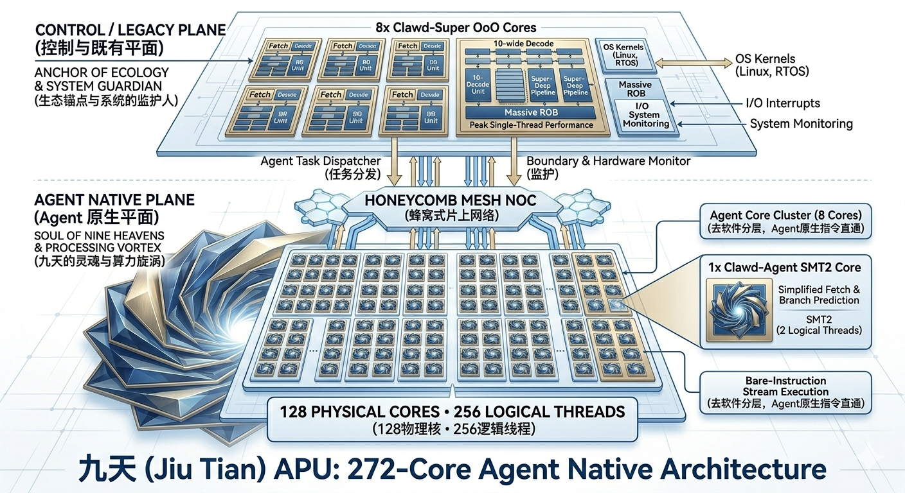
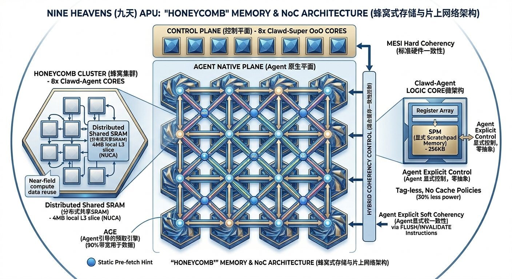
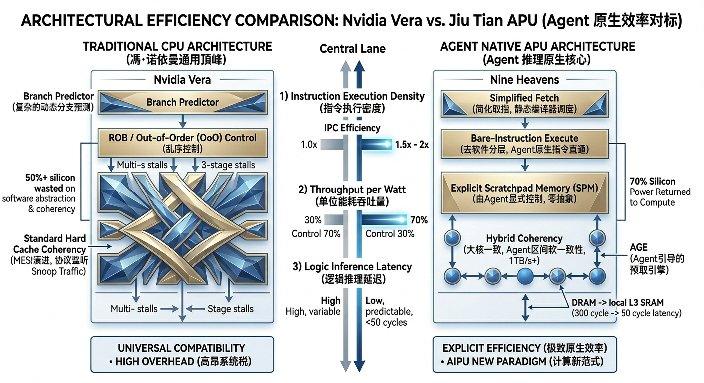

# 计算革命，直通苍穹：九天（Jiu Tian）272核开源 APU，重新定义 AI Agent 推理算力

## 导言：为什么冯·诺依曼架构必须在 AI 2.0 时代坍塌

过去 30 年，计算领域的核心矛盾在于“通用性”与“效率”的博弈。冯·诺依曼架构及其繁复的软件分层（OS Kernels、Drivers、ABI、Frameworks）旨在满足人类开发者对于代码可读性和复用性的需求。在这种范式下，硅片上超过 70% 的晶体管被用于处理复杂的控制逻辑（如分支预测、复杂解码、Cache 一致性协议），而非实际的计算。

人类的软件框架不仅昂贵，而且对功耗极度不友好。随着 AI Agent 的崛起，这种范式已成为效率的掣肘。未来的代码，90% 将由 Agent 编写。如果代码不是为了人类而写，为什么还要强迫它们运行在为人类设计的架构上？

英伟达（Nvidia）通过其强大的 GPU 统治了 AI 训练和矩阵乘法市场，而其最新的 Grace/Vera CPU 架构则试图在通用计算和数据调度层面维持其垄断地位。然而，Vera 本质上依然是对旧有软件范式的妥协：它通过极致的单线程 OoO 性能和 HMM（异构内存管理）来兼容庞大的人类软件生态。这意味着，Vera 依然在为由于软件繁文产生的复杂控制逻辑买单，而不是为了原生效率。

今天，我们正式向全球开源九天（Jiu Tian）272核 Agent 原生 APU（Agent Processing Unit）。这不是一个跟风的 NPU，这是一个从第一行 RTL 代码开始就彻底摒弃了传统软件分层束缚的逻辑计算核心。我们的目标，是用原生的效率，打破冯·诺依曼架构的能效天花板，在逻辑推理和 Agent 推理领域，以原生的姿态碾压如英伟达 Vera 这样的垄断者。

## 一、核心架构设计：非对称的苍穹（Jiu Tian）布局与 Guardian-Execution

为了让 Agent 原生代码能够彻底摆脱传统软件栈的束缚，享受到接近裸机的极致执行效率，“九天”架构并未沿袭传统的对称多核设计，而是采用了一个极为激进的、非对称的 Guardian-Execution（守护者-执行者）架构。

这一设计的核心哲学在于物理隔离与按需唤醒：我们将由于人类开发者需求而产生的复杂软件范式（如操作系统、驱动、一致性协议），与 AI Agent 自主生成的原生计算范式，在硬件芯片层面进行物理切割；同时让 Agent Core 保持低功耗常驻，让 Super Core 只在高熵任务出现时爆发。这种异构布局不单纯是核心大小的组合，而是计算范式和功耗节律的彻底分离，旨在将通用生态的兼容性、机器常驻守护能力与原生态计算效率融合在同一硅片上。



图 1：九天 APU 的控制与既有平面、Agent 原生平面、Honeycomb Mesh NoC 与 128 物理核 / 256 逻辑线程布局。

### 1. Agent 原生平面（Agent-Native Plane）：Always-On 的系统守护者

芯片主体最庞大的区域被定义为“Agent 原生平面”，这是“九天”架构的灵魂所在，也是系统默认醒着的守护层。这部分包含 128 个专为 AI Agent 自主生成的代码和 Agent 推理任务设计的核心：Clawd-Agent。

Clawd-Agent 核心不仅负责高吞吐执行 Agent 生成代码，也负责九天的“机器生命体征”：后台心跳、环境监听、任务队列维护、简单意图识别、上下文投影、ledger 候选整理、trace 汇聚和恢复点选择。它们可以以极低电压/频率常驻运行，让芯片在无人交互或低负载状态下仍然保持感知和自省能力。

在 Guardian-Execution 模式中，Agent Core 是“守护者”。它们拦截来自人类、传感器、网络 API 或工具事件的输入，先用轻量规则、微型意图识别单元或硬化匹配电路判断请求是否需要高熵处理。简单、无副作用、有界的任务继续留在 Agent 域；复杂自然语言推理、大规模编译、重度感知数据处理、传统 OS 路径和真实副作用提交，则通过 `WAKE_UP_SUPER` 唤醒 Clawd-Super。

这种反向协处理关系让九天在无人交互时保持极低功耗，在复杂人类任务出现时又能瞬间切换到高性能状态。它不是让大核永远指挥小核，而是让常驻 Agent 守护系统，让 Super Core 成为被精准唤醒的战略资源。

### 2. 控制与既有平面（Control/Legacy Plane）：高熵任务战略协处理器

芯片的上方平面被定义为“控制与既有平面”，这是我们向过往数十年积累的庞大软件生态的致敬与链接。它容纳了 8 个名为 Clawd-Super 的超大、复杂的乱序执行（OoO）核心。

这些 Clawd-Super 核心是绝对的性能野兽。在技术指标上，它们采用了即使在顶级 CPU 设计中也令人侧目的 10路解码（10-wide Decode）能力，配合超深的流水线和巨型重排序缓冲区（ROB）。但它们在九天中的定位不是永远在线的传统主控，而是 Strategic Coprocessor for High-Entropy Tasks（高熵任务战略协处理器）：当 Agent 域判断任务超过低功耗守护边界时，Super Core 上电或解门控，接手 LLM 推理、复杂人类软件、大规模编译、高负载数学运算、重度感知处理和最终权限提交。

在任务完成后，Clawd-Super 将结果、错误摘要、提交状态和 recovery 信息写回共享 handoff mailbox，并重新进入 clock-gated 或 power-gated 状态。这样 Super Core 的高功耗只花在真正需要复杂单线程能力、完整 OS 语义和成熟工具链的地方。

### 3. Clawd-Agent 微架构：常驻守护与原生执行合一

Clawd-Agent 核心的设计哲学彻底贯彻了“去软件化”和“极致效率”。由于 Agent 生成的代码将由“九天”专用编译器在流片前进行极致静态优化，通常具有极高的指令局部性和明确的、非动态的指令流，Clawd-Agent 核心大胆地大幅简化了传统的取指（Fetch）和复杂的动态分支预测逻辑。

节省下来的宝贵芯片面积和功耗被转而用于强化实际的计算执行和吞吐能力。每个物理核都集成了增强型 SMT2（双线程）设计，使得这 128 个物理核能够在片上呈现出 256 个高吞吐逻辑核。为了进一步提升能效和降低数据的移动开销，这些 Agent 核心并未杂乱无章地堆砌，而是被严谨地划分为 16 个“集群（Cluster）”，每个集群内部核心紧密协作并共享近端存储。

这种架构专为处理 AI 推理产生的海量、碎片化、高并发的 Agent 逻辑任务流而生，同时通过按需唤醒机制，把 Super Core 的热量、功耗和老化压力降到最低。对于边缘机器人、商业航天和无人系统，这种低占空比运行比“所有大核长期在线”的传统方案更符合长期可靠性要求。

### 4. 唤醒与交接：从监听到爆发

Guardian-Execution 的关键不是简单省电，而是定义一条硬件可观察的任务迁移路径：

```text
Clawd-Agent Always-On
  listen / classify / project / guard
        |
        | WAKE_UP_SUPER
        v
Handoff Mailbox
  task pointer / input refs / capability / recovery anchor
        |
        v
Clawd-Super Burst
  LLM / OS / compiler / heavy perception / final commit
        |
        v
Result / trace / sleep request
```

这条路径让系统拥有极大的动态功耗范围：低负载时维持“机器生命”的最低体征，高负载时释放数千亿次级别的计算能力；Super Core 即使崩溃，Agent Core 仍可作为安全堡垒执行复位、降级和恢复。

## 二、核心技术创新：当软件层次物理坍塌

“九天” APU 之所以能够在 AI Agent 推理任务中实现对传统通用 CPU 架构的性能碾压，其核心秘诀并非单纯的核心数量堆砌，而在于其底层设计哲学对冯·诺依曼架构下由于软件繁文而产生的冗余开销进行了毁灭性的打击。

传统 CPU 为了维持通用性和人类开发者的便利性，硬化了极其复杂的软件一致性协议（Mesh Coherency）和层层级级的系统调用抽象（OS、Drivers、Runtime）。相关研究表明，在典型的 AI 逻辑任务中，超过 70% 的硅片功耗和指令周期实际上被浪费在这些协议握手、状态同步以及层层封装的函数调用上，而非花在实际的数据计算单元。

“九天”架构彻底摒弃了这种高昂的“垄断生态税”。通过彻底摒弃硬化的软件一致性和传统的软件抽象层，我们将这原本被浪费的、磅礴的 70% 硬件性能重新剥离出来，完整地归还给计算核心本身。这种变革并非修修补补，而是让软件层次在物理层面发生坍塌，实现从系统架构到指令执行的全面原生化。

### 1. 去软件分层的“裸机指令流（Bare-Instruction Stream）”：Agent 的自由飞翔

在“九天” APU 上，传统意义上的操作系统不再是 Agent 的“看门人”，而是在 Super Core 被唤醒时承担复杂 I/O、兼容软件和最终副作用提交。真正的 Agent 原生代码运行采用了一种名为“裸机指令流（Bare-Instruction Stream）”的技术，并由常驻 Agent Core 在低功耗路径中持续维护任务边界。

这意味着，专门针对“九天”异构架构优化的 Agent 编译器（我们将在 Phase 2 开源）在生成代码时，直接接管了硅片的底层控制权。它不仅直接控制核心内部极其珍贵的寄存器分配，而且极具颠覆性地取消了传统的二进制接口（ABI）约束。

跨核心调用不需要通过庞大的函数 ABI 封包和解包，而是通过编译器直接映射到物理 Mesh 网络上的特定核心地址。这彻底跳过了系统调用和开销巨大的用户态/内核态上下文切换。Agent 生成的代码如同直接运行在硬件裸机上，跳过了一切中间商，实现代码执行的零重力、零阻力状态。

在这种极致的扁平化指令流中，内存零拷贝（Zero-copy）成为了一种原生赋能。虽然 Agent 推理平面和控制平面共享统一的物理地址空间（Uniform Physical Address Space），但编译器可以为 Agent 推理流显式分配特定内存段，并通过硬件特定原语，跳过传统操作系统繁复的二级虚拟内存管理层（如 TLB、Page Table Walk，硬件 IOMMU 仅被保留用于物理隔离和权限监控）。

在 Agent 逻辑核心执行过程中，实现真正的“扁平化物理地址访问”，从数据的产生到最终使用，实现端到端的直接、静态优化。

## 三、Memory 与 NoC 系统：蜂窝（Honeycomb）式存储网络

AI Agent 生成的代码具有极高的不可预测性，其访存模式呈现出极度的非规则化与严重的碎片化。更挑战传统架构的是，这些代码完全不遵循任何标准的二进制接口（ABI），传统的 Cache 层次结构在其面前不仅无法有效预测，反而会因为不断的 Cache Miss 和替换策略带来巨大的性能抖动。

针对这一痛点，“九天” APU 毅然摒弃了传统 CPU 所依赖的、极其复杂的全局硬件缓存一致性层次架构。转而，我们设计并实现了一套软硬件协同的“蜂窝”式存储与互连系统。这套系统旨在将数据的存储与移动与 Agent 的逻辑执行流进行深度绑定，在物理层面实现数据的近场计算和端到端的可预测性。



图 2：Honeycomb 式 Memory 与 NoC 架构，包括控制面、Agent 原生平面、分布式共享 SRAM、显式 SPM、AGE 与混合一致性控制。

### 1. 蜂窝式 L3 集群（Distributed Shared SRAM）：数据的近场化革命

在“九天” APU 上，你找不到传统意义上的那种“全局 L3 大池子”。那种试图通过单一巨大缓存来满足所有核心需求的做法，在 Agent 碎片化访存面前不仅效率低下，而且会带来可怕的跨核心总线争用和高昂的功耗。

我们采用了一种蜂窝式的分布式集群架构。128 个专用的逻辑处理核心被严谨地划分为 16 个“蜂窝（Cluster）”，每个蜂窝包含 8 个核心。每个蜂窝内部都集成了一个专享的 4MB 的本地 L3 切片（Distributed Shared SRAM），其物理位置处于核心阵列内部，而非边缘。

这种设计采用了 NUCA（Non-Uniform Cache Access）架构哲学：数据的移动被强力约束在蜂窝 Cluster 内部，数据的产生与消费在物理上互为邻里。通过这种方式，我们大幅降低了传统架构中高昂的跨核心访问延迟和 Mesh 网络负载，将数据的近场化革命在硅片上彻底硬化。

### 2. Agent 核的显式 Scratchpad Memory（SPM）：将控制权交给数据的创造者

既然软件是由 AI Agent 自己编写的，那么 Agent 理应最清楚数据的流向和生存周期。传统的 Cache Tag 比较和复杂的替换策略（如 LRU）虽然通用，但在 Agent 的逻辑面前往往显得多余且低效，并消耗了大量的 Tag 面积和静态功耗。

为了消除这种由于软件分层带来的无谓浪费，“九天”在每个 Clawd-Agent 逻辑核心内部都硬化了一个专用的 256KB Scratchpad Memory（SPM）。如图所示，SPM 不是由硬件自动管理的 Cache，而是完全暴露给 Agent 软件、由其显式控制的裸内存空间。Agent 生成的代码可以准确、显式地决定何时将数据搬运进 SPM，何时将其移出，彻底跳过了所有 Tag 比较和 Cache 策略判断。

这直接减少了约 30% 的访存功耗。Agent 软件对这部分存储拥有绝对的、如同操作巨大的寄存器阵列般的控制权，从而实现了访存延迟的端到端可预测和极致优化。

### 3. 混合缓存一致性（Hybrid Coherency）：在 1TB/s Bandwidth 上实现效率自由

在互连层面，英伟达 Grace/Vera CPU 的强项在于对 GPU 的极致调度，但其依赖的全硬件一致性协议（Mesh Coherency）在核心数达到 128 个的规模下，所产生的硬件 Snooping 监听流量（协议握手）将呈几何级数爆炸，会瞬间锁死 NoC 片上网络的有效带宽。

“九天”提出了颠覆性的“混合缓存一致性（Hybrid Coherency）”方案，在 1TB/s+ 的 NoC 蜂窝网络上追求极致的带宽利用率：

- 大核区间维持硬件一致性：仅在 8 个大核心之间维持标准硬件一致性协议（MESI 演进版），确保 Linux OS 内核和 I/O 系统的稳定性。
- Agent 区间维持硬化非一致性：在 128 个 Agent 逻辑核心阵列之间，完全摒弃全局硬件 Cache 监听协议。转而，采用由 Agent 编译器生成的代码驱动的“显式软一致性”。

Agent 生成的代码在写入数据后，必须由其自己显式地触发硬件提供的 FLUSH 或 INVALIDATE 指令（原语）。硬件不需要实时监听其他 128 个核的状态。这种设计消除了可怕的一致性 Snooping 流量，NoC 网路的带宽将 90% 以上用于实际的业务数据传输，而非协议握手，实现了真正的效率自由。

### 4. 关键设计：Agent 引导的预取引擎（AGE）

为了消除访存延迟这最后一个效率堡垒，九天在 NoC 的每个核心/蜂窝路由节点中都植入了一个微型 Agent Fetch Engine（AGE）。

这是一个完全由 AI Agent “引导（Hint）”的智能引擎。由于软件是 Agent 写的，Agent 可以通过编译器生成的 Hint Instructions，极其准确地静态预测接下来的逻辑计算流需要哪些特定数据块。AGE 会提前、异步地从远端 DRAM/HBM 界面将这些数据块直接搬运到本地集群的分布式 L3 SRAM Slice，甚至是直接搬运到特定核心的 SPM 中。

这一设计让访存延迟从传统架构的几百个核心周期瞬间降低到几十个周期，在 Agent 平面实现真正的“数据即执行”，让算力时刻处于满载状态，直通苍穹。

## 四、英伟达 Vera vs. 九天 APU 参数与性能深度对标

英伟达（Nvidia）的 Grace/Vera CPU 系列毫无疑问代表了当代通用计算和大规模数据调度的顶峰。它之所以强大，是因为它在 ARM 生态下将传统的冯·诺依曼架构推向了极致：通过维持近乎完美的乱序执行（OoO）性能、庞大的层次化 Cache 结构以及全硬件硬化的高速 Cache 一致性协议（Mesh Coherency），Vera 能够天衣无缝地兼容过往数十年的标准软件生态。

然而，Vera 的这种强项，在 AI Agent 原生计算时代，恰恰成为了其致命的弱点。为了维持这种极致的兼容性，Vera 的硅片上充斥着为了处理由于标准 ABI、系统调用和硬件一致性握手而产生的复杂控制逻辑。

我们要击败它，不能在通用计算的旧赛道上与其纠缠，而必须利用开源的道德高地加上 Agent 原生的效率高地，在全新的 AIPU 赛道上实现换道超车。

以下是“九天” APU 与目前市场上最强劲的单一类型多核 CPU：英伟达 Vera 进行的详细的参数和预估性能对比。我们必须再次强调，这种对比并不关注传统的 CPU 跑分（如 SPECInt），其核心在于：在执行由 AI Agent 自己编写、自主生成的逻辑代码和 Agent 推理任务时，单位功耗和单位面积所能释放的实际吞吐量。



图 3：传统 CPU 架构与 Agent 原生 APU 架构在指令执行密度、单位能耗吞吐量与逻辑推理延迟上的效率对标。

### 1. 核心参数规格对标：异构原生与通用顶峰的较量

| 特性维度 | 英伟达 Vera（Nvidia Vera CPU） | 九天 APU（Jiu Tian Agent-Native CPU） | 架构原理解析 |
| :--- | :--- | :--- | :--- |
| 工艺制程 | 预计 3nm / 2nm 级 | 3nm（TSMC） | 确保极高的集成度，在同一块硅片上容纳大规模异构核心。 |
| 总核心数（物理） | 预计 72-144 个高性能核心（Grace 架构演进） | 272 个物理核心（Big-Little 异构 layout） | 九天采用非对称、数据-控制双平面布局，在硅片平面上物理隔离通用生态与原生态计算。 |
| 核心配置（Type） | 单一类型的超强 OoO 核心（高性能标准 ARM 核心） | 128x Clawd-Agent（常驻守护）+ 8x Clawd-Super（按需爆发） | Agent Core 维持低功耗监听、上下文投影和原生执行；Super Core 作为高熵任务战略协处理器处理 Linux、LLM、编译和最终提交。 |
| 总逻辑核数（线程） | 144（单一线程/核，追求单核强性能） | 272 + 256（Clawd-Agent SMT2）= 528（物理+逻辑） | 九天通过极致的多线程设计，专为 AI 推理产生的海量、高并发、碎片化 Agent 推理任务流设计。 |
| 存储架构（Memory） | 层次化硬件 Cache 一致性（L1/L2/L3）+ NVLink-C2C | 异构存储：大核区间一致；Agent 区间硬化非一致性，转而采用软一致性 + 显式 SPM（Scratchpad） | Vera 维持高昂的 MESI 协议握手开销；九天将访存控制权彻底剥离并交给数据的创造者（Agent），追求零抽象效率。 |
| 片上互连带宽（NoC） | NVLink-C2C（900GB/s+）用于 CPU-GPU 高速互连 | Honeycomb Mesh NoC（1TB/s+ 聚合带宽） | 九天 NoC 基于蜂窝设计，专注于 128 个核心间极其高频的数据交互和 Bare-Instruction 流直通。 |
| 软件兼容性 | 全生态兼容（ARM/Linux） | 8 核全生态（按需唤醒）+ 128 核 Agent 原生（常驻裸机指令流） | 九天通过 Agent Core 常驻守护机器状态，通过 Super Core 保留通用软件入口，并把大部分在线时间交给低功耗 Agent 平面。 |

### 2. 性能与效率预估对比：Agent 原生代码执行场景

这种架构层面的代差，在实际的 Agent 推理和 AI 生成代码执行场景下，会转化为巨大的效率红利。我们基于九天 APU 仿真器的初步流片前数据，以及针对“去软件化”带来的能效开销削减进行预估。

对比场景设定为：运行 AI 代码助手 Agents 实时生成的庞大、非规则、访存极其碎片化的 JIT（Just-In-Time）逻辑代码推理任务。

#### 1）指令执行密度（Instruction Execution Density）

Vera 的标准高性能 CPU 流水线被设计为需要处理一切不可预测的人类代码。为了在分支预测失败、硬化一致性协议（Mesh Coherency）监听（Snoop）和 TLB Miss（虚拟内存管理层）发生时维持吞吐，其内部充满了用于维持复杂控制逻辑和重排序的等待周期。

九天 APU 的 128 个 Clawd-Agent 原生核心采用了硬化非一致性设计和裸机指令流技术。由于编译器（将在 Phase 2 开源）直接接管了寄存器分配和数据的扁平化物理地址访问，Agent 代码完全跳过了所有 ABI 约束和系统调用。更重要的是，通过显式 SPM（Scratchpad Memory）控制访存，核心彻底跳过了复杂的 Tag 比较和 Cache 策略判断。

这一设计保证了 Clawd-Agent 的流水线时刻处于针对 AI 生成指令集的“满载执行”状态，而非在等待数据搬运或协议握手。

预估结果：在执行相同复杂度的 AI 生成逻辑代码时，九天 APU 的 128 个原生核心所能实现的有效指令执行密度（Effective Instruction Per Clock）将比 Vera 的同类核心高出 1.5x - 2x。

#### 2）单位能耗吞吐量（Throughput per Watt）

为了在冯·诺依曼框架下维持通用的高性能，英伟达 Vera 的单个高性能 CPU 核心的面积和能耗非常庞大。其内部大部分能耗被花在硬一致性监听逻辑、复杂分支预测器和 ROB 上。

九天通过“去软件化”彻底剥离了这些软件分层的硬化成本。我们将由于 ABI 繁文、系统调用和硬一致性硬件产生的能耗直接节省下来，重新花在实际的计算执行逻辑本身。单个 Clawd-Agent 核心的物理面积和能耗仅为同等级别的高性能 OoO 核心（如 Vera 内的核心）的 1/4 - 1/3。

预估结果：在执行逻辑推理和 Agent 推理任务时，九天 APU 所能达到的单位能耗吞吐量将比英伟达 Vera 高出约 3x - 4x。这意味着，在相同的功耗包络（TDP）下，九天 APU 可以完成数倍的 AI 逻辑任务吞吐。

#### 3）逻辑推理延迟（Logic Inference Latency）

在传统架构中，数据的流动是受限于层层硬件缓存查找和协议 Snoop 监听的“被动”过程。一旦发生 Cache Miss，将面临高昂且不可预测的远端访存延迟。

九天通过软硬件协同彻底终结了这种不确定性。数据的流动被设计为编译器引导下的“主动”飞翔：通过非一致性软一致性架构、蜂窝式 Cluster 设计和 Agent 引导的预取引擎（AGE），数据的流动如同直通“九天”之上，零重力、零阻力直达核心 SPM，访存延迟从几百个核心周期降低到几十个周期。

预估结果：对于 Agent 推理产生的典型非规则、碎片化数据访问，九天 APU 的平均逻辑执行延迟将比使用全硬件一致性 Cache 的传统架构降低 50% 以上，真正实现算力即执行。

## 结论：九天不是更大的 CPU，而是 Agent 时代的新计算边界

九天 APU 的核心价值，不在于把更多核心堆叠到同一块硅片上，而在于第一次把“Agent 生成代码”作为硬件架构的一等公民。传统 CPU 为人类软件提供兼容性，GPU 为规整张量提供吞吐，NPU 为固定神经网络算子提供能效；而九天面向的是另一类正在快速扩张的工作负载：由 AI Agent 动态生成、逻辑分支复杂、生命周期短、访存碎片化、但又需要大规模并发执行的推理代码流。

因此，九天不是在旧赛道上与 Vera、x86、ARM 或 GPU 做同质化竞争，而是在定义一个新的执行层：Agent 原生逻辑层。128 个 Clawd-Agent 核通过显式 SPM、显式 DMA、弱一致性、蜂窝式 NoC 和 Agent 引导预取，把传统软件分层中的隐性开销直接转化为可见的执行吞吐，并以 Always-On guard 的方式维持机器最低生命体征；8 个 Clawd-Super 超大核保留操作系统、生态兼容、安全监管和高熵任务爆发能力，在需要时被 `WAKE_UP_SUPER` 精准唤醒。这种非对称设计，使“兼容过去”“面向未来”和“能效优先”不再互相牺牲，而是在同一块硅片上各自占据最适合自己的物理位置和时间窗口。

开源，是九天路线中不可分割的一部分。Agent 原生计算不应被封闭 ABI、私有运行时和单一厂商生态锁死。只有开放 RTL、开放规格、开放模拟器、开放 APU-IR 与开放 benchmark，社区才能共同验证哪些主张成立，哪些设计需要修正，哪些工作负载真正适合 Agent 原生硬件。九天的目标不是制造一个无法质疑的神话，而是建立一个可以被研究、实现、挑战和迭代的开放计算基础设施。

AI 2.0 的真正瓶颈，不只是模型参数，也不只是矩阵乘法，而是大规模 Agent 在现实任务中不断生成、调度、执行和回收逻辑代码的能力。当代码不再主要由人类书写，计算架构也不应继续完全服从人类软件时代的抽象。九天的使命，就是把这条新的计算路径从概念推向规格、从规格推向模拟器、从模拟器推向 RTL，最终让 Agent 生成的未来代码，运行在为它而生的硅片上。

**九天 APU：Agent 原生，开源智算。让未来代码，直通苍穹。**
